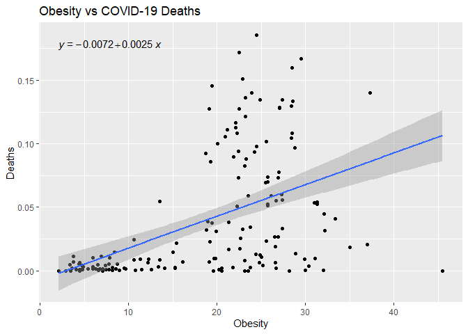

```r
if (!require("tidyverse")) install.packages('tidyverse')
```

```
## Loading required package: tidyverse
```

```
## -- Attaching packages --------------------------------------- tidyverse 1.3.0 --
```

```
## v ggplot2 3.3.3     v purrr   0.3.4
## v tibble  3.0.6     v dplyr   1.0.4
## v tidyr   1.1.2     v stringr 1.4.0
## v readr   1.4.0     v forcats 0.5.1
```

```
## -- Conflicts ------------------------------------------ tidyverse_conflicts() --
## x dplyr::filter() masks stats::filter()
## x dplyr::lag()    masks stats::lag()
```


```r
library("tidyverse")
library("shiny")
library("shinydashboard")
library("janitor")
library("naniar")
```


```r
library(tidyverse)
library(here)
```

```
## here() starts at C:/Users/19257/Desktop/BIS15W2021_project
```

```r
library(janitor)
```

# Preliminary Analysis


```r
food_data<-read.csv("food and covid data/Food_Supply_Quantity_kg_Data_general_notation.csv")
food_data
```

```
##                                Country Alcoholic.Beverages Animal.fats
## 1                          Afghanistan              0.0014      0.1973
## 2                              Albania              1.6719      0.1357
## 3                              Algeria              0.2711      0.0282
## 4                               Angola              5.8087      0.0560
## 5                  Antigua and Barbuda              3.5764      0.0087
## 6                            Argentina              4.2672      0.2234
## 7                              Armenia              0.4014      0.1833
## 8                            Australia              5.5436      0.3143
## 9                              Austria              7.0215      0.8555
## 10                          Azerbaijan              3.5969      0.2544
## 11                             Bahamas              2.0175      0.0062
## 12                          Bangladesh              0.0031      0.0156
## 13                            Barbados              3.5650      0.2212
## 14                             Belarus              3.7563      0.3353
## 15                             Belgium              5.3730      0.8559
## 16                              Belize              3.3803      0.0832
## 17                               Benin              5.9019      0.0132
## 18                             Bolivia              2.8956      0.0889
## 19              Bosnia and Herzegovina              4.7876      0.0585
## 20                            Botswana              4.2717      0.3402
## 21                              Brazil              4.3629      0.2803
## 22                            Bulgaria              7.0834      0.2488
## 23                        Burkina Faso             15.3706      0.0231
## 24                          Cabo Verde              3.9814      0.0363
## 25                            Cambodia              4.5783      0.0377
## 26                            Cameroon              5.1560      0.0146
## 27                              Canada              4.8441      0.8084
## 28            Central African Republic              1.7435      0.1228
## 29                                Chad              0.8297      0.2023
## 30                               Chile              4.9690      0.1782
## 31                               China              2.3224      0.0866
## 32                            Colombia              3.1032      0.0814
## 33                               Congo              4.9612      0.0122
## 34                          Costa Rica              1.6982      0.1529
## 35                       Cote d'Ivoire              1.4487      0.0132
## 36                             Croatia              4.9846      0.2296
## 37                                Cuba              2.0589      0.1202
## 38                              Cyprus              3.4447      0.0277
## 39                             Czechia              9.8498      0.8945
## 40                             Denmark              4.8866      1.2415
## 41                            Djibouti              0.3778      0.0579
## 42                            Dominica              0.9410      0.0319
## 43                  Dominican Republic              3.2100      0.1122
## 44                             Ecuador              3.2929      0.1277
## 45                               Egypt              0.0722      0.0896
## 46                         El Salvador              2.1651      0.1113
## 47                             Estonia              6.1949      0.4556
## 48                            Eswatini              6.2239      0.1024
## 49                            Ethiopia              2.4543      0.0276
## 50                                Fiji              1.8598      0.2922
## 51                             Finland              4.5004      0.5190
## 52                              France              4.1631      0.7907
## 53                    French Polynesia              4.6997      0.0309
## 54                               Gabon              6.1881      0.0109
## 55                              Gambia              2.8419      0.0114
## 56                             Georgia              2.5343      0.2356
## 57                             Germany              6.7714      0.6715
## 58                               Ghana              0.9444      0.0088
## 59                              Greece              2.2879      0.2116
## 60                             Grenada              3.1315      0.1276
## 61                           Guatemala              1.7037      0.0957
## 62                              Guinea              0.3110      0.0213
## 63                       Guinea-Bissau              2.4603      0.0423
## 64                              Guyana              1.8708      0.0206
## 65                               Haiti              1.2733      0.0402
## 66                            Honduras              2.0662      0.1378
## 67                             Hungary              6.7533      1.0595
## 68                             Iceland              4.7545      0.9461
## 69                               India              0.1959      0.0028
## 70                           Indonesia              0.0794      0.0309
## 71          Iran (Islamic Republic of)              0.0007      0.5369
## 72                                Iraq              0.1915      0.0423
## 73                             Ireland              7.5703      0.8710
## 74                              Israel              1.2876      0.1026
## 75                               Italy              3.1892      0.2834
## 76                             Jamaica              2.4636      0.2074
## 77                               Japan              4.0440      0.0751
## 78                              Jordan              0.0846      0.1162
## 79                          Kazakhstan              2.1919      0.3611
## 80                               Kenya              1.9664      0.1175
## 81                            Kiribati              0.2970      0.0486
## 82                        Korea, North              0.8981      0.0010
## 83                        Korea, South              4.8669      0.2553
## 84                              Kuwait              0.0044      0.0022
## 85                          Kyrgyzstan              0.6313      0.1910
## 86    Lao People's Democratic Republic              0.7883      0.0979
## 87                              Latvia              5.4573      1.1805
## 88                             Lebanon              0.7164      0.0796
## 89                             Lesotho              3.4135      0.0233
## 90                             Liberia              1.0338      0.0264
## 91                           Lithuania              5.5419      0.5316
## 92                          Luxembourg              8.0858      0.5443
## 93                          Madagascar              0.7972      0.0415
## 94                              Malawi              1.1827      0.0814
## 95                            Malaysia              0.8948      0.0882
## 96                            Maldives              0.6859      0.0029
## 97                                Mali              2.8904      0.0444
## 98                               Malta              3.9051      0.2062
## 99                          Mauritania              0.0055      0.1127
## 100                          Mauritius              3.0805      0.0074
## 101                             Mexico              4.4105      0.1672
## 102                           Mongolia              3.1430      0.3846
## 103                         Montenegro              2.2188      0.2067
## 104                            Morocco              0.2870      0.1449
## 105                         Mozambique              1.2195      0.0297
## 106                            Myanmar              0.2195      0.1751
## 107                            Namibia              5.4716      0.1134
## 108                              Nepal              0.3318      0.0312
## 109                        Netherlands              4.3903      0.3343
## 110                      New Caledonia              5.0363      0.0821
## 111                        New Zealand              5.2220      0.7446
## 112                          Nicaragua              1.7194      0.0836
## 113                              Niger              0.0558      0.1185
## 114                            Nigeria              4.0037      0.0151
## 115                    North Macedonia              1.9045      0.3784
## 116                             Norway              3.7939      0.6119
## 117                               Oman              0.2621      0.0571
## 118                           Pakistan              0.0085      0.0969
## 119                             Panama              6.6254      0.2467
## 120                           Paraguay              3.9095      0.2191
## 121                               Peru              3.8623      0.0316
## 122                        Philippines              1.9716      0.3074
## 123                             Poland              6.8201      0.9842
## 124                           Portugal              4.7147      0.4077
## 125                Republic of Moldova              3.8296      0.4339
## 126                            Romania              4.7679      0.3474
## 127                 Russian Federation              3.7425      0.2486
## 128                             Rwanda              1.3631      0.0186
## 129              Saint Kitts and Nevis              4.0867      0.1735
## 130                        Saint Lucia              7.8024      0.0252
## 131   Saint Vincent and the Grenadines              2.5260      0.0220
## 132                              Samoa              1.4236      0.2262
## 133              Sao Tome and Principe              1.5187      0.0220
## 134                       Saudi Arabia              0.0000      0.3917
## 135                            Senegal              0.3209      0.0353
## 136                             Serbia              4.3920      0.2524
## 137                       Sierra Leone              0.3009      0.0067
## 138                           Slovakia              6.1266      1.3559
## 139                           Slovenia              4.9933      1.1248
## 140                    Solomon Islands              0.8298      0.1038
## 141                       South Africa              6.2658      0.0593
## 142                              Spain              5.3152      0.2357
## 143                          Sri Lanka              0.6810      0.0147
## 144                              Sudan              0.0000      0.0958
## 145                           Suriname              4.1704      0.0438
## 146                             Sweden              4.4232      1.0442
## 147                        Switzerland              4.9978      0.4802
## 148                            Taiwan*              2.7663      0.1577
## 149                         Tajikistan              0.1423      0.0018
## 150                           Thailand              3.6223      0.0902
## 151                        Timor-Leste              0.4459      0.0897
## 152                               Togo              1.0144      0.0292
## 153                Trinidad and Tobago              2.4881      0.2804
## 154                            Tunisia              0.7037      0.2083
## 155                             Turkey              0.6474      0.1459
## 156                       Turkmenistan              0.5038      0.3373
## 157                             Uganda              6.1671      0.0352
## 158                            Ukraine              2.6250      0.1753
## 159               United Arab Emirates              0.0000      0.1896
## 160                     United Kingdom              5.2632      0.2754
## 161        United Republic of Tanzania              4.5185      0.0403
## 162           United States of America              4.8647      0.1681
## 163                            Uruguay              3.5664      0.2100
## 164                         Uzbekistan              0.6835      0.1353
## 165                            Vanuatu              0.2424      0.0793
## 166 Venezuela (Bolivarian Republic of)              2.5952      0.0403
## 167                            Vietnam              1.4591      0.1640
## 168                              Yemen              0.0364      0.0446
## 169                             Zambia              5.7360      0.0829
## 170                           Zimbabwe              4.0552      0.0755
##     Animal.Products Aquatic.Products..Other Cereals...Excluding.Beer   Eggs
## 1            9.4341                  0.0000                  24.8097 0.2099
## 2           18.7684                  0.0000                   5.7817 0.5815
## 3            9.6334                  0.0000                  13.6816 0.5277
## 4            4.9278                  0.0000                   9.1085 0.0587
## 5           16.6613                  0.0000                   5.9960 0.2274
## 6           19.3454                  0.0000                   8.4102 0.9979
## 7           13.5640                  0.0000                   7.2982 0.5783
## 8           21.4175                  0.0033                   5.4979 0.4428
## 9           19.5654                  0.0011                   6.2116 0.7884
## 10          11.6416                  0.0000                  13.0898 0.5593
## 11          11.4718                  0.0009                   3.7246 0.6250
## 12           5.1926                  0.0000                  29.8045 0.2957
## 13          12.4976                  0.0000                   8.0666 0.7792
## 14          12.7089                  0.0000                   6.2814 0.7565
## 15          17.7279                  0.0010                   6.6704 0.6487
## 16           8.6856                  0.0000                  11.0700 0.3923
## 17           3.7504                  0.0000                   9.6230 0.0711
## 18          11.7799                  0.0000                  12.3079 0.6626
## 19          12.4319                  0.0000                   8.7152 0.2576
## 20          14.4486                  0.0000                  11.4320 0.1402
## 21          17.3470                  0.0000                   8.4292 0.5042
## 22          17.2483                  0.0103                   8.8750 0.5924
## 23           4.6611                  0.0000                  21.2005 0.2406
## 24           9.7559                  0.0029                  14.7961 0.4602
## 25           6.0800                  0.0000                  24.8906 0.1310
## 26           2.9330                  0.0000                  10.3112 0.0256
## 27          16.0365                  0.0060                   6.4236 0.7668
## 28           6.9032                  0.0000                   3.8844 0.0510
## 29          12.2804                  0.0000                  21.6017 0.0495
## 30          15.0394                  0.0155                  10.8579 0.7757
## 31          13.4240                  0.0542                   8.9298 1.2059
## 32          12.8210                  0.0000                   8.1055 0.8132
## 33           6.1258                  0.0000                   6.2564 0.0457
## 34          18.6770                  0.0007                   8.6611 0.7582
## 35           2.9144                  0.0000                  11.4585 0.1587
## 36          17.3110                  0.0005                   5.7726 0.3955
## 37          10.0096                  0.0000                   9.9309 0.5263
## 38          16.1736                  0.0015                   7.0646 0.5746
## 39          17.8065                  0.0006                   5.6937 0.4964
## 40          23.2141                  0.0010                   6.7226 0.8206
## 41           5.5215                  0.0000                  20.2702 0.1275
## 42           8.9011                  0.0000                   3.4014 0.1244
## 43          11.2417                  0.0006                   6.9232 0.6445
## 44          15.3469                  0.0328                  14.9132 0.6902
## 45           6.7374                  0.0000                  17.5311 0.2307
## 46          12.8880                  0.0000                  11.7265 0.7533
## 47          22.3154                  0.0005                   6.3498 0.6145
## 48           7.4118                  0.0019                  14.7814 0.1578
## 49           5.2956                  0.0000                  22.0779 0.0594
## 50           7.8511                  0.0021                  10.1440 0.2682
## 51          26.8865                  0.0000                   5.1978 0.3979
## 52          21.7097                  0.0011                   6.9951 0.6110
## 53          14.3585                  0.0169                   7.6479 0.5386
## 54           8.1825                  0.0000                   9.1158 0.0701
## 55          10.1417                  0.0000                  21.8908 0.2008
## 56          15.5347                  0.0000                  15.6253 0.5032
## 57          20.8485                  0.0011                   6.0363 0.5947
## 58           2.8956                  0.0000                   6.3230 0.0705
## 59          17.6914                  0.0005                   7.2801 0.4539
## 60          12.1319                  0.0019                   7.6569 0.9226
## 61          10.3765                  0.0000                  15.1579 1.4676
## 62           3.8776                  0.0000                  17.2911 0.1648
## 63           4.9295                  0.0000                  21.6069 0.1038
## 64           9.1155                  0.0000                   9.7847 0.1038
## 65           3.5986                  0.0000                  13.4196 0.0525
## 66          13.6048                  0.0000                  14.1699 0.4601
## 67          20.0268                  0.0007                   7.5908 0.8885
## 68          23.9700                  0.0025                   4.1196 0.5557
## 69          11.3357                  0.0000                  17.3821 0.3061
## 70           6.2575                  0.0009                  24.3918 0.4911
## 71           7.9295                  0.0020                  14.0141 0.4916
## 72           6.2809                  0.0000                  24.0855 1.2467
## 73          18.5712                  0.0005                   6.3057 0.4653
## 74          18.7463                  0.0017                   7.6277 0.5664
## 75          19.0329                  0.0005                   8.5417 0.6247
## 76          11.9958                  0.0074                   8.5031 0.1457
## 77          15.3194                  0.1088                  12.1692 1.6960
## 78           9.3186                  0.0000                  14.1380 0.3344
## 79          19.1598                  0.0000                   6.5119 0.4584
## 80          11.4394                  0.0000                  15.1221 0.1447
## 81           8.8958                  0.0000                   8.2747 0.1640
## 82           3.3933                  0.0010                  17.9378 0.4668
## 83          11.8174                  1.6794                  11.7286 0.6414
## 84          10.7213                  0.0022                  11.4132 1.3306
## 85          15.4588                  0.0000                  10.1059 0.2653
## 86           3.6579                  0.0006                  16.3943 0.1063
## 87          18.8216                  0.0005                   6.3952 0.6645
## 88           8.0679                  0.0000                  11.8253 0.1730
## 89           6.0914                  0.0000                  23.4645 0.1204
## 90           3.7603                  0.0000                  16.1465 0.1598
## 91          23.0490                  0.0009                   6.4732 0.7000
## 92          14.6038                  0.0051                   5.1366 0.7875
## 93           4.9125                  0.0024                  19.9604 0.0770
## 94           2.7754                  0.0000                  10.6197 0.0829
## 95          12.6354                  0.0204                  17.3088 1.6596
## 96          14.2704                  0.0068                  11.5385 1.1422
## 97          10.1637                  0.0000                  19.8566 0.0573
## 98          13.6092                  0.0017                   7.8996 0.6714
## 99          15.0193                  0.0000                  20.4873 0.2539
## 100          9.2700                  0.0102                  17.1855 0.5910
## 101         15.1527                  0.0201                  11.4325 1.2967
## 102         25.8904                  0.0000                  10.1415 0.3727
## 103         22.8328                  0.0014                   5.0447 0.5542
## 104          8.4754                  0.0000                  18.7029 0.4848
## 105          4.0111                  0.0000                  13.1904 0.1932
## 106         13.5188                  0.0034                  16.7608 0.4613
## 107          9.6094                  0.0053                   9.9189 0.1196
## 108          5.4355                  0.0000                  18.1511 0.1435
## 109         24.2977                  0.0111                   4.9685 0.7470
## 110         11.7818                  0.0804                   8.5840 0.7494
## 111         17.5777                  0.0170                   7.7522 0.7067
## 112         13.1538                  0.0030                  16.8052 0.5490
## 113          7.2385                  0.0000                  22.2843 0.0239
## 114          1.7391                  0.0000                  10.9220 0.1976
## 115         12.0639                  0.0000                   7.3937 0.2847
## 116         21.1992                  0.0005                   5.9777 0.6194
## 117         13.5101                  0.0000                   9.6835 0.5741
## 118         22.2758                  0.0011                  14.6224 0.3577
## 119         12.3346                  0.0031                  14.2627 0.4604
## 120         11.2654                  0.0000                   7.5639 0.9035
## 121          8.6638                  0.0014                  11.8140 0.6431
## 122          6.7108                  0.0000                  20.0498 0.3527
## 123         16.5590                  0.0000                   7.9033 0.3702
## 124         18.6614                  0.0005                   6.2984 0.4053
## 125         16.5343                  0.0000                  11.6462 0.6795
## 126         15.9287                  0.0000                   8.0412 0.6848
## 127         16.1525                  0.0023                   8.2803 0.9029
## 128          2.6366                  0.0000                   3.5380 0.0269
## 129         14.0252                  0.0000                   6.3135 0.3868
## 130         14.8893                  0.0009                   7.2091 0.3326
## 131         11.0865                  0.0000                   9.0142 0.3412
## 132         11.1630                  0.1236                   3.6768 0.1314
## 133          4.1199                  0.0000                   7.3796 0.0562
## 134         12.9962                  0.0000                  16.3284 0.6003
## 135          5.3434                  0.0000                  25.9204 0.1878
## 136         16.7466                  0.0000                   9.7485 0.6322
## 137          5.6877                  0.0000                  19.9349 0.1343
## 138         18.9841                  0.0000                   5.4026 0.9390
## 139         18.9196                  0.0005                   7.6345 0.5376
## 140          3.8504                  0.0121                   9.0233 0.0826
## 141         11.8433                  0.0009                  17.1035 0.5940
## 142         18.3382                  0.0011                   6.0548 0.7321
## 143          5.5328                  0.0039                  20.7839 0.4178
## 144         13.1178                  0.0000                  12.9192 0.1176
## 145          6.7984                  0.0000                  13.9476 0.5407
## 146         24.0627                  0.0000                   6.1923 0.7266
## 147         22.4227                  0.0022                   5.9818 0.5377
## 148         12.1312                  0.0281                  10.0808 1.0900
## 149          7.2363                  0.0000                  13.3691 0.2255
## 150          7.7828                  0.0325                  17.5571 1.1143
## 151          5.4983                  0.0000                  26.3320 0.1025
## 152          3.6702                  0.0000                  15.8144 0.1067
## 153         12.7835                  0.0000                  13.0903 0.4044
## 154          9.6312                  0.0000                  12.0523 0.4508
## 155         12.3156                  0.0000                   9.7080 0.3956
## 156         16.0611                  0.0000                  14.8029 0.5139
## 157          5.6473                  0.0000                   6.7480 0.0815
## 158         13.1214                  0.0006                   9.3613 0.8434
## 159         10.5491                  0.0000                  12.9060 0.5958
## 160         18.8798                  0.0006                   6.5412 0.6210
## 161          4.8022                  0.0000                  10.4453 0.0300
## 162         21.2352                  0.0020                   5.5048 0.7860
## 163         17.8865                  0.0000                  10.2510 0.7764
## 164         14.4463                  0.0000                  10.5365 0.3566
## 165          6.6244                  0.0000                   6.4102 0.1875
## 166         14.7565                  0.0000                  12.9253 0.3389
## 167          8.5765                  0.0042                  16.8740 0.3077
## 168          5.7874                  0.0000                  27.2077 0.2579
## 169          6.0197                  0.0000                  21.1938 0.3399
## 170          8.1489                  0.0000                  22.6240 0.2678
##     Fish..Seafood Fruits...Excluding.Wine   Meat Milk...Excluding.Butter
## 1          0.0350                  5.3495 1.2020                  7.5828
## 2          0.2126                  6.7861 1.8845                 15.7213
## 3          0.2416                  6.3801 1.1305                  7.6189
## 4          1.7707                  6.0005 2.0571                  0.8311
## 5          4.1489                 10.7451 5.6888                  6.3663
## 6          0.4693                  6.0435 7.0421                 10.2328
## 7          0.2896                  6.0989 2.2675                  9.9407
## 8          1.4264                  4.1883 6.7049                 12.1018
## 9          0.7562                  4.6069 4.6810                 12.3776
## 10         0.2020                  4.7988 2.1513                  8.3212
## 11         2.4144                 13.2718 5.9269                  2.1757
## 12         2.5221                  2.8655 0.4191                  1.8778
## 13         3.2750                  5.8723 5.8477                  2.2041
## 14         0.8372                  3.5665 4.1893                  6.2104
## 15         1.1325                  4.1623 3.2370                 11.6344
## 16         1.0325                 12.6094 3.4890                  3.6317
## 17         1.2267                  2.9523 1.4107                  0.9458
## 18         0.2307                  7.5088 6.4098                  4.2873
## 19         0.2465                  4.6409 1.8165                  9.9443
## 20         0.3551                  2.8465 2.2840                 11.0217
## 21         0.5899                  6.0936 6.4784                  9.3416
## 22         0.4845                  3.9812 4.0073                 11.5992
## 23         0.7077                  0.6596 1.2029                  2.3195
## 24         1.0598                  4.6402 3.0725                  5.0192
## 25         4.2369                  2.3184 1.2247                  0.3285
## 26         1.3206                  7.2151 0.8760                  0.6289
## 27         1.2148                  5.0692 4.4707                  8.7596
## 28         0.8041                  4.5543 3.7346                  1.7581
## 29         1.0451                  1.0669 3.8543                  5.9037
## 30         0.8711                  3.9109 6.1492                  6.9966
## 31         3.3435                  4.2451 6.0732                  1.7962
## 32         0.4552                 11.3276 3.5540                  7.7443
## 33         2.3945                  4.0015 3.2735                  0.0963
## 34         1.3317                  9.5203 3.8631                 12.4535
## 35         1.3914                  4.8741 0.9586                  0.1285
## 36         0.9196                  3.4094 3.6945                 11.8824
## 37         0.3368                  9.0347 3.2837                  5.5971
## 38         1.8209                  6.1980 5.3167                  8.2744
## 39         0.5355                  3.3962 4.7618                 10.9830
## 40         1.1797                  3.1098 3.6804                 15.9557
## 41         0.4276                  3.2735 1.7428                  2.9085
## 42         1.4188                 19.3028 2.7820                  4.4217
## 43         0.6059                 18.4431 3.5009                  6.1202
## 44         0.6893                  8.0390 4.0115                  9.5745
## 45         1.5844                  6.9387 1.7583                  2.7568
## 46         0.5730                  5.9517 2.6337                  8.7381
## 47         0.7127                  3.5061 3.0810                 17.3068
## 48         0.3643                  8.5537 2.5917                  3.9299
## 49         0.0608                  1.1774 0.7462                  4.2647
## 50         2.3832                  2.1636 3.0004                  1.7421
## 51         1.5306                  3.1864 3.4915                 20.8378
## 52         1.8214                  4.8780 4.4005                 13.7840
## 53         3.4809                  4.3512 7.0798                  2.9364
## 54         2.2578                  9.0341 4.3200                  0.9486
## 55         3.9197                  0.8742 1.1134                  4.8167
## 56         0.6622                  3.1735 2.6217                 11.3605
## 57         0.6758                  3.6131 4.6524                 14.1789
## 58         1.4992                 10.4274 0.8069                  0.4178
## 59         1.0260                  6.3296 3.7836                 12.0221
## 60         2.5802                 11.0608 5.6546                  2.7183
## 61         0.2807                  6.7124 3.9589                  4.4093
## 62         0.8939                  7.9395 1.1561                  1.4724
## 63         0.1666                  6.3660 2.2155                  2.1899
## 64         1.7011                  5.7954 2.5237                  4.7277
## 65         0.5064                 12.0278 1.9687                  0.8765
## 66         0.3339                  6.8464 3.5080                  9.0154
## 67         0.4113                  3.0852 5.2042                 12.4568
## 68         4.6117                  4.8405 4.6269                 13.0028
## 69         0.6499                  5.4333 0.3560                  9.9889
## 70         3.9386                  5.5134 1.0316                  0.5943
## 71         0.7813                  7.9235 2.3965                  3.5808
## 72         0.4450                  6.4975 2.5171                  1.9902
## 73         1.1942                  3.3996 4.0102                 11.9469
## 74         1.4696                  6.3746 5.5003                 10.9066
## 75         1.5816                  6.0207 4.2963                 12.1258
## 76         1.8692                  8.0661 4.3372                  5.2170
## 77         3.9283                  2.8618 4.2599                  5.0630
## 78         0.5985                  4.6624 3.8651                  4.2637
## 79         0.2393                  3.2145 3.4501                 14.3591
## 80         0.4329                  4.6941 1.7336                  8.7987
## 81         6.1065                  5.8907 2.3856                  0.1561
## 82         1.1568                  6.1383 1.3872                  0.3146
## 83         3.4396                  3.6993 4.4239                  1.1394
## 84         0.8343                  5.3058 4.8770                  3.4788
## 85         0.0700                  2.2846 1.8707                 12.8008
## 86         1.4213                  8.8158 1.7111                  0.1632
## 87         1.3226                  2.5738 3.6559                 11.8285
## 88         0.7091                  6.9852 1.9469                  5.0748
## 89         0.2383                  1.8065 2.5290                  2.7893
## 90         0.7764                  5.3606 2.4123                  0.1545
## 91         1.5431                  2.4007 3.7899                 16.3529
## 92         1.6249                  4.4841 4.0469                  7.4929
## 93         0.6267                  5.0701 1.4618                  2.5031
## 94         0.6970                  8.4723 1.4923                  0.2524
## 95         5.3482                  4.1713 4.9092                  0.5300
## 96         8.7959                  6.0777 2.0051                  2.3155
## 97         0.7543                  3.8991 1.9124                  7.1206
## 98         1.7922                  4.6310 4.6096                  6.2546
## 99         1.0025                  1.2991 3.3994                  9.8250
## 100        2.1303                  3.5680 4.6992                  1.7166
## 101        0.9656                  7.6794 4.3561                  7.9917
## 102        0.0440                  1.0413 8.0929                 15.8560
## 103        0.6472                  5.7297 3.3604                 17.9487
## 104        1.3901                  7.2110 2.5074                  3.7540
## 105        1.1353                  2.8312 0.9302                  1.6385
## 106        4.0424                  4.0287 4.9753                  3.6306
## 107        1.0164                  3.1266 2.6844                  5.4479
## 108        0.2050                  4.7443 0.9817                  3.9212
## 109        1.1517                  4.9230 4.0105                 18.0051
## 110        2.0361                  5.5855 5.8687                  2.7675
## 111        1.6771                  4.0202 6.8421                  7.4627
## 112        0.6557                  3.8377 3.1044                  8.5527
## 113        0.2022                  2.5503 1.2702                  5.4224
## 114        0.7239                  4.4268 0.5675                  0.1730
## 115        0.3507                  5.0893 2.0683                  8.8045
## 116        2.7466                  4.2801 3.6083                 13.5227
## 117        2.0105                  9.7870 3.0531                  7.6265
## 118        0.1831                  2.4099 1.7957                 19.6466
## 119        1.0050                  6.6783 4.9800                  5.3530
## 120        0.3119                  5.4532 4.0434                  5.3208
## 121        1.7993                  8.5783 1.7540                  4.0729
## 122        2.4506                  8.5466 3.2257                  0.1045
## 123        0.5845                  3.0079 4.8500                  9.7542
## 124        2.7295                  6.5126 4.5168                 10.3936
## 125        0.9910                  3.4256 3.2622                 10.9992
## 126        0.2844                  4.2115 3.0499                 11.4018
## 127        1.1312                  3.1620 4.3180                  9.3253
## 128        0.5279                 15.7285 0.6257                  1.3521
## 129        3.4174                  7.5449 7.8207                  1.8950
## 130        3.0652                  5.9453 8.1700                  2.8881
## 131        1.3785                 10.4710 6.9184                  2.2593
## 132        2.7788                 10.7845 5.7993                  1.9647
## 133        2.3033                 18.2736 1.2054                  0.5152
## 134        1.0369                  7.0413 4.9529                  5.8598
## 135        2.0588                  2.3456 1.6081                  1.2496
## 136        0.4148                  5.9753 3.5893                 11.6190
## 137        2.5044                  3.2119 0.7837                  2.1711
## 138        0.7045                  3.5463 4.3096                 11.4696
## 139        0.6515                  6.4367 4.1610                 12.2569
## 140        2.2840                  3.2798 0.8897                  0.4380
## 141        0.5365                  1.9355 5.3933                  4.8155
## 142        2.2646                  4.8332 5.3456                  9.5991
## 143        3.0173                  4.1171 0.8845                  1.0948
## 144        0.1018                  7.0919 2.1133                 10.4116
## 145        1.4348                  8.6872 3.6451                  1.0789
## 146        1.7659                  3.5405 4.1476                 16.3687
## 147        0.9109                  4.6041 3.6314                 16.7060
## 148        2.3182                  8.3904 6.0558                  2.3299
## 149        0.0342                  3.7863 1.5221                  5.2373
## 150        2.6297                  8.3291 2.4675                  1.3279
## 151        1.0225                  2.1027 4.0376                  0.1307
## 152        1.3178                  0.9100 1.4133                  0.7246
## 153        2.3299                  4.9733 6.7063                  2.8789
## 154        0.7615                  5.4307 1.6411                  6.4775
## 155        0.2582                  6.8321 2.0694                  9.3619
## 156        0.2137                  4.1441 4.3767                 10.5606
## 157        1.0442                 11.3112 0.8978                  3.4755
## 158        0.6821                  2.9418 2.7425                  8.5442
## 159        1.9682                  8.1938 4.9400                  2.6468
## 160        1.0911                  4.9551 4.4181                 12.3684
## 161        0.5828                  6.8147 0.7902                  3.3606
## 162        1.1287                  4.5432 6.2645                 12.8657
## 163        0.6058                  5.3746 3.7863                 12.3906
## 164        0.1218                  5.2150 1.8621                 11.7952
## 165        2.1649                  5.8103 2.7466                  1.2692
## 166        0.9456                  7.6460 3.8328                  9.3920
## 167        2.6392                  5.9029 4.4382                  0.6069
## 168        0.5240                  5.1344 2.7871                  1.8911
## 169        1.6924                  1.0183 1.8427                  1.7570
## 170        0.5518                  2.2000 2.6142                  4.4310
##     Miscellaneous Offals Oilcrops Pulses Spices Starchy.Roots Stimulants
## 1          0.0728 0.2057   0.0700 0.2953 0.0574        0.8802     0.3078
## 2          0.1123 0.2324   0.9377 0.2380 0.0008        1.8096     0.1055
## 3          0.1671 0.0870   0.3493 0.4783 0.0557        4.1340     0.2216
## 4          0.1165 0.1550   0.4186 0.6507 0.0009       18.1102     0.0508
## 5          0.7139 0.2219   0.2172 0.1840 0.1524        1.4522     0.1564
## 6          0.0000 0.3779   0.0116 0.0528 0.0122        3.0420     0.4378
## 7          0.2355 0.3040   0.0899 0.1441 0.0055        2.0359     0.1863
## 8          0.5293 0.4240   0.3694 0.0546 0.0458        2.7884     0.2928
## 9          0.0005 0.1052   0.2683 0.0456 0.0494        3.0548     0.4106
## 10         0.0145 0.1534   0.0145 0.0347 0.0044        4.7041     0.0587
## 11         2.9316 0.3218   0.6993 0.0504 0.0884        1.0547     0.1556
## 12         0.0197 0.0633   0.0820 0.7065 0.3195        5.3378     0.0529
## 13         3.3020 0.1704   0.8734 0.6391 0.1565        4.0812     0.1721
## 14         0.5035 0.3795   0.0720 0.0010 0.0067        9.1691     0.1142
## 15         0.0000 0.2185   0.0965 0.1132 0.0409        4.4157     0.2461
## 16         1.7653 0.0569   0.3940 1.1259 0.0195        1.0614     0.0849
## 17         0.1450 0.0829   0.6628 0.7367 0.4461       19.7771     0.0042
## 18         0.1661 0.1006   0.1374 0.3654 0.0422        7.7315     0.2083
## 19         0.4860 0.1089   0.0963 0.2718 0.3922        4.0495     0.3504
## 20         1.6092 0.3056   0.2019 0.2729 0.1626        4.7614     0.1336
## 21         0.0006 0.1512   0.7093 0.9254 0.0071        3.3959     0.3024
## 22         0.2254 0.3058   0.3450 0.1512 0.6048        1.8576     0.2818
## 23         0.1373 0.1664   1.8664 1.4294 0.0321        0.9723     0.0211
## 24         1.1190 0.1050   0.5394 1.1390 0.2731        3.8430     0.1671
## 25         0.4853 0.1211   0.7900 0.4903 0.0784        3.0519     0.1260
## 26         0.0717 0.0673   0.8658 1.4734 0.2830       11.3883     0.0234
## 27         0.6071 0.0097   0.4334 0.6304 0.0574        3.4940     0.4053
## 28         0.0614 0.4338   0.6970 0.8936 0.0031       27.7128     0.2008
## 29         0.0640 1.2256   3.0304 1.4133 0.0000        6.9910     0.0087
## 30         0.3024 0.0525   0.2588 0.2677 0.0133        4.7183     0.1353
## 31         1.3773 0.8643   0.4401 0.0704 0.0364        1.9016     0.1781
## 32         0.0776 0.1729   0.2276 0.3503 0.0343        5.0309     0.0057
## 33         0.1730 0.3044   0.3632 0.2408 0.0033       23.2457     0.0171
## 34         0.0274 0.1161   0.2914 0.8354 0.0433        1.5676     0.3181
## 35         0.0163 0.2648   0.6055 0.1727 0.1247       23.3080     0.0759
## 36         0.0000 0.1889   0.3494 0.0373 0.0236        1.8078     0.2458
## 37         0.0787 0.1456   0.5346 1.1336 0.0089        5.1555     0.0657
## 38         1.4858 0.1584   0.4089 0.2110 0.0307        1.7705     0.2387
## 39         0.1099 0.1340   0.0949 0.1139 0.0316        3.3991     0.1340
## 40         0.0000 0.3347   0.1185 0.0369 0.0774        3.1113     0.4069
## 41         1.1831 0.2572   0.0568 1.5724 0.1506        1.8633     0.1309
## 42         0.6745 0.1219   1.1058 0.2255 0.1512        6.8477     0.2553
## 43         0.0906 0.2567   1.1395 0.5881 0.0260        2.0198     0.1420
## 44         0.1526 0.2200   0.1765 0.1570 0.0177        2.2701     0.0071
## 45         0.0187 0.3170   0.6541 0.3063 0.0655        2.6919     0.0863
## 46         0.5920 0.0794   1.4273 1.4661 0.0121        2.2462     0.2649
## 47         0.1501 0.1457   0.0518 0.1472 0.0576        3.2403     0.2121
## 48         0.6695 0.2620   0.3005 0.3578 0.1615        5.3187     0.0648
## 49         0.0180 0.1382   0.2322 3.0195 0.4298       11.2918     0.2957
## 50         0.2586 0.1642   4.3799 0.7746 0.0500        7.8599     0.1238
## 51         0.7944 0.1097   0.0883 0.0533 0.0168        2.7671     0.5450
## 52         0.1918 0.3010   0.1479 0.0991 0.0164        2.6963     0.2925
## 53         3.2613 0.2748   3.1818 0.1452 0.0111        3.5436     0.1260
## 54         0.4751 0.5758   0.8509 0.0139 0.0015       11.8727     0.0212
## 55         0.9824 0.0812   3.1637 0.1281 0.0043        0.8614     0.2719
## 56         0.7882 0.1507   0.0840 0.0025 0.0247        3.7542     0.2397
## 57         0.0000 0.0747   0.1701 0.0419 0.0429        3.5712     0.3493
## 58         0.1657 0.0917   0.7957 0.3920 0.2380       24.6325     0.0053
## 59         0.0596 0.1947   0.8112 0.2539 0.0243        3.1307     0.2560
## 60         1.2873 0.1266   1.3768 0.6417 0.3171        2.2222     0.1104
## 61         0.0348 0.1632   0.5276 1.6504 0.0403        1.3316     0.2872
## 62         0.2312 0.1692   0.9506 0.3925 0.0000       11.7958     0.1196
## 63         0.5331 0.2114   0.3280 0.2499 0.0013        8.1087     0.0167
## 64         0.3516 0.0385   1.8367 0.3907 0.1942        1.8384     0.0742
## 65         0.3309 0.1532   0.4829 2.0067 0.0022       11.4800     0.3801
## 66         0.6923 0.1505   0.1749 1.3962 0.0138        0.6796     0.4686
## 67         0.0039 0.0052   0.0679 0.1906 0.1802        3.0460     0.1031
## 68         1.4022 0.2232   0.1759 0.0376 0.0676        1.9909     0.4626
## 69         0.0000 0.0311   0.7280 1.5709 0.3268        2.7906     0.0753
## 70         0.0026 0.1702   2.2113 0.0988 0.1508        4.6343     0.0406
## 71         0.0007 0.1405   0.0540 0.4729 0.0559        3.2877     0.1299
## 72         0.3975 0.0396   0.3037 0.4807 0.0304        1.0842     0.1783
## 73         0.2951 0.0831   0.1733 0.1325 0.0362        3.5362     0.1855
## 74         0.2602 0.2007   0.5233 0.3640 0.0278        1.9975     0.2619
## 75         0.0403 0.1194   0.1836 0.2781 0.0064        1.9043     0.2946
## 76         0.6952 0.2111   0.9990 0.2177 0.3752        4.5837     0.1677
## 77         0.2962 0.1883   0.7737 0.1287 0.1036        2.2072     0.3731
## 78         0.3579 0.1397   0.7280 0.6393 0.0469        2.1431     0.3742
## 79         0.2967 0.2914   0.1154 0.0255 0.0106        5.4755     0.1319
## 80         0.0250 0.2110   0.2686 1.7510 0.0174        7.5828     0.2230
## 81         0.5104 0.0350   9.9946 0.0032 0.0064        7.1830     0.0311
## 82         0.0690 0.0660   0.2090 1.1000 0.0000        6.2438     0.0142
## 83         0.0000 0.2378   0.5632 0.0720 0.0288        0.9799     0.0945
## 84         0.8554 0.1969   0.2783 0.4353 0.2020        3.2296     0.2696
## 85         0.2076 0.2604   0.0098 0.3439 0.0197        5.8068     0.0608
## 86         0.3404 0.1581   0.3584 0.1485 0.1317        3.4835     0.9869
## 87         0.2596 0.1686   0.1107 0.0032 0.0122        6.5835     0.1963
## 88         0.0747 0.0853   0.5052 0.5011 0.0406        3.2676     0.3647
## 89         0.3898 0.3924   0.0725 1.1603 0.1165        7.1935     0.0363
## 90         0.2997 0.2311   0.4159 0.0977 0.0013       15.3608     0.0132
## 91         0.0126 0.1301   0.0867 0.4388 0.0546        2.2766     0.2164
## 92         0.3877 0.1036   0.1658 0.0399 0.0586        2.2067     1.2823
## 93         0.0782 0.2002   0.1848 0.3708 0.0486       14.4675     0.2085
## 94         0.0396 0.1695   0.5436 1.1841 0.0139       20.2901     0.0389
## 95         0.1541 0.0789   0.5801 0.2617 0.4502        1.6568     0.1012
## 96         3.0315 0.0019   0.2082 0.0808 0.3434        1.6403     0.3960
## 97         0.1841 0.2746   0.4910 0.7955 0.0638        2.6772     0.0614
## 98         0.0315 0.0747   0.2899 0.2197 0.0331        2.0590     0.2101
## 99         0.7519 0.4279   0.0799 1.0999 0.0066        1.0168     0.3677
## 100        1.0545 0.1173   0.4479 0.8560 0.1847        1.8348     0.1625
## 101        0.0275 0.3552   0.1947 0.7071 0.1121        1.1644     0.0248
## 102        0.5962 1.1411   0.0266 0.0366 0.0037        2.6155     0.1401
## 103        0.8470 0.1132   0.0865 0.2113 0.0175        1.1955     0.2605
## 104        0.0079 0.1949   0.1892 0.3306 0.1185        3.4356     0.2042
## 105        0.1565 0.0852   0.1258 1.2809 0.0040       22.2864     0.1050
## 106        0.3391 0.2298   1.1003 1.2806 0.2170        1.4514     0.2298
## 107        0.7228 0.2207   0.0818 0.7298 0.1266       12.8231     0.0888
## 108        0.0594 0.1536   0.0594 0.9107 0.4195        6.0521     0.0319
## 109        0.0000 0.0397   0.1111 0.0852 0.0640        4.2639     0.2904
## 110        3.6589 0.1993   2.2961 0.1275 0.0488        2.5648     0.1745
## 111        0.0000 0.1275   0.3296 0.2414 0.0495        3.3719     0.2374
## 112        0.6658 0.2055   0.3354 1.3618 0.0060        1.9118     0.0050
## 113        0.0687 0.2022   1.4804 3.4838 0.0807        1.3489     0.0349
## 114        0.0437 0.0627   0.4763 0.8311 0.1715       19.5271     0.0064
## 115        0.2959 0.1773   0.3253 0.2847 0.1288        3.6779     0.2474
## 116        3.6634 0.0893   0.3113 0.3204 0.0235        2.8097     0.4819
## 117        0.0423 0.1888   0.1338 0.2776 0.2297        1.6984     0.1395
## 118        0.0117 0.1969   0.3577 0.6993 0.1618        1.8202     0.5258
## 119        0.7431 0.2873   0.4589 0.4129 0.0153        1.3758     0.1195
## 120        0.1788 0.4675   0.2745 0.6185 0.0082       12.5302     1.0112
## 121        0.0719 0.3629   0.2458 0.6367 0.0172        8.7924     0.2501
## 122        0.1925 0.2717   0.5425 0.1106 0.0340        2.8773     0.5399
## 123        0.0000 0.0170   0.0798 0.1099 0.0202        5.5631     0.1509
## 124        0.1393 0.2079   0.0965 0.1618 0.0173        3.1060     0.2684
## 125        0.5083 0.1694   0.0616 0.0642 0.0068        3.9066     0.0830
## 126        0.2567 0.1594   0.0974 0.1045 0.1274        4.7130     0.1398
## 127        0.0118 0.2249   0.1319 0.1426 0.0118        6.3194     0.1809
## 128        0.0283 0.0855   0.2233 2.5036 0.0179       20.4415     0.0110
## 129        1.5442 0.3318   0.9470 0.5422 0.0901        2.7150     0.0749
## 130        1.6054 0.4063   0.6274 0.5663 0.1780        2.6427     0.0602
## 131        1.9325 0.1672   0.1049 0.6452 0.2113        4.3734     0.2933
## 132        0.7751 0.1398  10.5187 0.0000 0.0582        7.6944     0.1344
## 133        0.4240 0.0187   9.9865 0.3109 0.0293        3.7154     0.0073
## 134        0.6690 0.1547   0.1492 0.4768 0.2434        1.4542     0.2050
## 135        0.0148 0.2060   0.7637 0.4712 0.0717        2.6177     0.1161
## 136        0.0067 0.2389   0.1322 0.1805 0.0242        2.5450     0.2430
## 137        0.2504 0.0857   0.5999 0.8913 0.0638       12.4228     0.0762
## 138        0.0290 0.2055   0.2055 0.0973 0.0421        3.6814     0.2513
## 139        0.6133 0.1879   0.1285 0.1106 0.0561        2.6837     0.2615
## 140        0.5585 0.0394   5.0334 0.7366 0.0364       24.2500     0.0856
## 141        0.0009 0.4448   0.2462 0.1546 0.0539        2.8503     0.1321
## 142        0.0000 0.1605   0.2650 0.2666 0.0069        3.0975     0.2229
## 143        0.0303 0.0998   7.1364 0.9608 0.5244        1.9793     0.2818
## 144        0.0741 0.2796   0.4920 1.0631 0.0405        1.9167     0.1502
## 145        1.2414 0.0576   0.6757 0.1719 0.0224        2.4553     0.0903
## 146        0.4623 0.0086   0.1712 0.0937 0.0484        2.8343     0.5533
## 147        0.0000 0.1549   0.1124 0.0995 0.0382        2.1542     0.3727
## 148        0.1874 0.1507   1.0736 0.2077 0.1023        0.8565     0.1374
## 149        0.2089 0.2144   0.1349 0.2486 0.0305        2.9278     0.0555
## 150        0.0090 0.1199   1.2775 0.2344 0.6626        1.8887     0.1262
## 151        0.8905 0.1153   0.5612 0.9098 0.0500        5.5022     1.0136
## 152        0.7448 0.0775   0.4718 1.7626 0.0595       20.0654     0.0843
## 153        0.2413 0.1837   1.2016 0.8939 0.2305        3.5148     0.0899
## 154        0.0116 0.0926   0.2031 0.4311 0.1065        1.7724     0.1979
## 155        0.0101 0.0857   0.2720 0.6820 0.1251        2.4947     0.2002
## 156        0.2530 0.0589   0.0661 0.1032 0.0015        2.3000     0.0945
## 157        0.0371 0.1130   0.6338 2.3942 0.0120       12.3610     0.0130
## 158        0.0070 0.1339   0.0175 0.1099 0.0111        7.6721     0.0883
## 159        0.9471 0.2095   0.6133 2.1108 0.3194        0.8937     0.1649
## 160        0.6658 0.1056   0.2240 0.2035 0.0653        5.1133     0.2461
## 161        0.0214 0.0000   1.2839 2.1761 0.0274       13.9370     0.0300
## 162        0.0000 0.0197   0.3246 0.1893 0.0490        2.8390     0.2458
## 163        0.3918 0.1168   0.2770 0.1936 0.0144        3.0440     0.6169
## 164        0.0400 0.1748   0.0287 0.0022 0.0038        2.8891     0.0644
## 165        0.2882 0.1776  12.1763 0.0008 0.0374       12.7275     0.0305
## 166        0.0702 0.2078   0.0281 0.3342 0.0009        2.5643     0.1479
## 167        0.0126 0.4149   0.8410 0.2032 0.2074        1.0596     0.2880
## 168        0.2033 0.2827   0.0893 0.8645 0.0347        1.0794     0.2199
## 169        0.2149 0.3048   1.8736 0.1756 0.0478        7.9649     0.0618
## 170        0.2012 0.2086   0.4498 0.4261 0.0252        2.9870     0.1494
##     Sugar...Sweeteners Sugar.Crops Treenuts Vegetable.Oils Vegetables
## 1               1.3489      0.0000   0.0770         0.5345     6.7642
## 2               1.5367      0.0000   0.1515         0.3261    11.7753
## 3               1.8342      0.0000   0.1152         1.0310    11.6484
## 4               1.8495      0.0000   0.0061         0.6463     2.3041
## 5               3.8749      0.0000   0.0253         0.8102     5.4495
## 6               3.0536      0.0000   0.0200         0.9541     4.3503
## 7               2.6579      0.0000   0.1108         0.4705    16.7019
## 8               2.5364      0.0000   0.3176         1.2798     5.1406
## 9               2.6094      0.0000   0.2367         0.8109     5.1098
## 10              1.5523      0.0000   0.1906         0.2235    10.0755
## 11              6.2151      0.0000   0.0495         0.5110     7.7649
## 12              0.9285      0.1950   0.0934         0.7615     3.6405
## 13              4.3344      0.0000   0.0852         0.8677     5.4725
## 14              4.0155      0.0000   0.1399         0.8804     8.7859
## 15              3.6514      0.0000   0.1309         0.5640     6.8161
## 16              3.9798      0.0000   0.0340         1.0198     4.7721
## 17              0.6635      0.0000   0.4028         0.7381     4.1964
## 18              2.5724      0.0000   0.7084         0.3573     3.2224
## 19              1.6391      0.0000   0.0822         0.4205    11.6394
## 20              4.7857      0.0009   0.0150         1.0065     4.0558
## 21              2.7755      1.0111   0.0513         1.2823     3.3070
## 22              2.3627      0.0000   0.0797         0.7085     6.2037
## 23              1.1287      0.0000   0.0712         0.9503     1.5036
## 24              2.1396      0.0000   0.0258         0.9471     6.6338
## 25              2.9923      0.8367   0.0238         0.2511     3.0072
## 26              0.6479      0.0000   0.1324         0.6398     8.8590
## 27              5.0237      0.0000   0.1439         1.3441     5.4961
## 28              0.7022      0.0000   0.0000         0.7240     1.9214
## 29              1.3449      0.0000   0.0000         0.4556     0.9141
## 30              3.5582      0.0000   0.1190         0.5435     5.3092
## 31              3.1065      0.0253   0.2665         0.5790    13.0990
## 32              4.7518      0.0280   0.0947         0.9454     3.0981
## 33              1.3907      0.0000   0.0016         0.6700     2.5520
## 34              3.9006      0.0000   0.0397         1.4363     2.9837
## 35              0.7859      0.0000   0.5443         0.8656     2.8098
## 36              3.0880      0.0000   0.0761         0.3808    12.5188
## 37              3.1617      0.0000   0.0006         0.4535     8.3740
## 38              4.2194      0.0000   0.1781         1.1937     7.3888
## 39              3.8081      0.0000   0.0477         0.9854     4.5289
## 40              2.8728      0.0000   0.1138         0.0915     5.2431
## 41              4.2005      0.0000   0.0406         1.6153     9.7637
## 42              3.1738      0.0000   0.0035         0.3797     4.6371
## 43              2.1332      0.0000   0.0108         1.2948     2.7385
## 44              1.7370      0.0000   0.0160         1.3777     2.4981
## 45              1.7984      2.0338   0.0268         0.3839    10.6559
## 46              3.5260      0.0000   0.0155         0.4565     7.2703
## 47              2.3886      0.0000   0.0886         0.3472     4.9558
## 48              3.1796      0.0000   0.0892         0.3258     2.5701
## 49              1.3170      0.0000   0.0802         0.4699     1.8449
## 50              9.7259      0.0000   0.0157         0.8683     3.9255
## 51              1.8388      0.0000   0.0460         0.2468     3.8325
## 52              2.6110      0.0000   0.2093         0.8675     5.1223
## 53              2.8715      0.6809   0.0405         0.9675     4.0992
## 54              1.2508      0.1248   0.0051         0.4824     2.3979
## 55              4.1176      0.0000   0.0897         2.2026     2.4575
## 56              3.3110      0.0000   0.1631         0.6680     4.0993
## 57              2.5070      0.0000   0.1903         0.8104     5.0542
## 58              0.8128      0.2815   0.0364         0.3655     1.6849
## 59              1.7744      0.0000   0.6676         1.5237     7.9134
## 60              5.4480      0.0000   0.0143         0.9959     3.6085
## 61              5.3058      0.0000   0.1980         0.8747     5.7997
## 62              1.3368      0.0000   0.0009         1.3271     4.4286
## 63              0.7893      0.0000   0.4485         1.8016     2.3642
## 64              3.2325      0.0000   0.0435         0.2779    15.2061
## 65              2.0961      0.0000   0.0000         0.8742     2.0302
## 66              5.9591      0.0000   0.0276         1.2467     2.6599
## 67              2.5433      0.0000   0.0183         0.7214     5.6788
## 68              3.9472      0.0000   0.0752         0.4667     3.6874
## 69              1.7471      0.0000   0.1526         0.7487     7.5213
## 70              1.8481      0.0000   0.0564         0.8579     3.8558
## 71              2.1980      0.0000   0.6421         0.7706    12.5207
## 72              3.3755      0.0000   0.1268         2.0139     4.9563
## 73              4.0147      0.0000   0.0836         0.7497     4.9510
## 74              1.7747      0.0000   0.2262         1.6743     8.8586
## 75              1.7175      0.0000   0.4230         1.4224     6.9463
## 76              4.6889      0.0000   0.0110         0.7584     6.4772
## 77              2.2055      0.2280   0.0812         1.3445     7.8669
## 78              4.7276      0.0000   0.1652         1.9861    10.6308
## 79              1.4560      0.0000   0.0845         1.1215    10.2055
## 80              1.8098      0.0000   0.0892         0.6689     4.3450
## 81              4.1373      0.0000   0.1951         0.4419     4.1389
## 82              0.3694      0.0000   0.0426         0.7783    12.8082
## 83              2.4835      0.0006   0.1664         1.1663    12.3349
## 84              2.9163      0.0276   0.1512         1.1976    12.9953
## 85              3.2495      0.0000   0.1449         0.3550    11.3219
## 86              1.1101      1.9254   0.0028         0.2149    11.6410
## 87              2.6169      0.0000   0.0793         0.6990     6.1946
## 88              5.1366      0.0000   0.5271         1.4807    10.5128
## 89              2.2079      0.0000   0.0052         0.6786     3.3721
## 90              1.1236      1.1804   0.0779         1.9567     3.1728
## 91              4.5020      0.0000   0.0550         0.4924     4.4045
## 92              8.1121      0.0000   0.0308         0.5630     4.8536
## 93              1.0922      0.5852   0.0261         0.3115     1.8871
## 94              0.6412      0.0000   0.0161         0.2040     3.9786
## 95              3.9030      0.0000   0.0835         1.6336     6.1678
## 96              2.9790      0.1002   0.7569         0.1819     7.7180
## 97              0.8811      0.0000   0.2374         0.5144     7.2943
## 98              5.2164      0.0000   0.1236         0.4860    11.2856
## 99              4.3166      0.0000   0.0000         1.5716     3.9784
## 100             3.5680      0.0000   0.0369         2.0490     6.7122
## 101             3.2266      0.0000   0.1121         0.6856     5.0713
## 102             1.4680      0.0000   0.0137         0.5550     4.3326
## 103             6.0418      0.0000   0.0948         0.4258     5.0001
## 104             2.6816      0.0000   0.2549         0.8168     7.2860
## 105             1.0649      0.0000   0.2011         0.7509     2.7738
## 106             2.8592      0.0000   0.2913         0.6322     7.0725
## 107             3.9848      0.0009   0.0114         0.9531     2.3626
## 108             0.5470      3.0677   0.0978         0.8209     9.2770
## 109             2.3446      0.0000   0.1587         0.8485     3.2587
## 110             3.1901      0.0000   0.0376         1.3157     5.5941
## 111             3.8188      0.0109   0.1499         0.5364     6.6889
## 112             5.7021      0.0000   0.0030         0.9227     3.5808
## 113             0.3666      0.0000   0.0000         0.3975    10.6117
## 114             0.6501      0.0000   0.0841         0.8573     6.2627
## 115             2.9104      0.0000   0.1796         0.9505    14.5512
## 116             2.2652      0.0000   0.0990         0.8697     3.9131
## 117             2.5903      0.0077   0.0521         0.6995    10.8902
## 118             2.6707      1.7915   0.0852         0.3417     2.2173
## 119             4.2277      0.0000   0.0360         0.7645     1.9480
## 120             2.4084      0.0000   0.0015         1.0733     3.7113
## 121             1.7339      0.0000   0.0230         0.5066     4.8044
## 122             2.3774      0.0000   0.1838         0.4119     5.4481
## 123             2.4775      0.0000   0.0476         0.3959     6.8655
## 124             1.7316      0.0000   0.2319         0.7246     7.3366
## 125             2.6632      0.0000   0.0180         0.8250     6.4285
## 126             1.4126      0.0000   0.1093         0.7301     9.3641
## 127             4.6144      0.0000   0.0118         0.8663     6.3713
## 128             0.5782      0.0000   0.0000         0.2109     2.7193
## 129             6.4623      0.0000   0.0673         1.3850     4.2090
## 130             3.7043      0.0000   0.0575         0.6103     4.1169
## 131             3.4592      0.0000   0.0357         0.7227     5.1371
## 132             2.0811      0.0036   0.0108         0.5117     1.1656
## 133             2.5939      0.0000   0.0024         0.7805     0.8570
## 134             2.8571      0.0009   0.1135         1.7626     5.7024
## 135             2.0941      0.0000   0.1047         1.9325     7.8951
## 136             2.0255      0.0007   0.1268         0.4644     7.3941
## 137             0.6323      0.0000   0.1000         1.2760     4.5526
## 138             5.5166      0.0000   0.1118         1.4380     4.5601
## 139             2.4915      0.0000   0.1972         0.4739     5.0020
## 140             0.8268      0.0000   0.0356         0.3327     1.1223
## 141             4.4677      0.0000   0.0108         1.1726     3.7632
## 142             1.8482      0.0000   0.4287         1.5122     7.8139
## 143             2.7209      0.0000   0.1350         0.2466     4.8753
## 144             3.1231      0.7262   0.0000         0.9366     8.3477
## 145             4.7051      0.3207   0.0155         1.3351     5.3705
## 146             2.5211      0.0000   0.0996         0.3967     4.6110
## 147             2.9737      0.0000   0.2377         1.0637     4.9478
## 148             2.3455      0.2826   0.4185         1.8271     9.1938
## 149             1.6607      0.0000   0.0582         0.8419    19.2995
## 150             4.0424      0.0000   0.0938         0.7816     3.5962
## 151             2.8203      0.0000   0.0013         0.6842     3.1867
## 152             1.8312      0.0000   0.0000         1.4099     2.1637
## 153             5.6200      0.0000   0.0928         1.2563     3.5256
## 154             2.0832      0.0000   0.3489         1.2551    15.7731
## 155             1.7004      0.0000   0.4664         1.0174    13.5284
## 156             0.6746      0.0000   0.0283         0.5655    10.4014
## 157             1.2601      0.0000   0.0000         0.7440     2.6703
## 158             3.8811      0.0000   0.0807         0.6470     9.4361
## 159             3.6576      0.0000   0.5838         0.7949     8.2695
## 160             2.4383      0.0000   0.0901         0.7372     4.5851
## 161             1.0345      0.0000   0.0420         0.9136     3.9520
## 162             3.3200      0.0000   0.1772         0.9889     5.7249
## 163             3.4102      0.0000   0.0131         1.0337     3.9333
## 164             0.5796      0.0000   0.0649         0.6109    14.8354
## 165             1.3645      0.0000   0.0038         0.3674     3.9175
## 166             3.4106      0.0000   0.0009         1.3734     4.1474
## 167             1.2846      0.8150   0.3070         0.2201    11.9508
## 168             5.0468      0.0000   0.0017         1.0811     3.2135
## 169             1.5632      0.0000   0.0014         0.6657     3.4649
## 170             4.6485      0.0000   0.0518         1.7103     2.3213
##     Vegetal.Products Obesity Undernourished    Confirmed       Deaths
## 1            40.5645     4.5           29.8  0.142134196 0.0061857790
## 2            31.2304    22.3            6.2  2.967300916 0.0509513740
## 3            40.3651    26.6            3.9  0.244897085 0.0065581530
## 4            45.0722     6.8             25  0.061687473 0.0014605500
## 5            33.3233    19.1           <NA>  0.293877551 0.0071428570
## 6            30.6559    28.5            4.6  4.356147387 0.1082266350
## 7            36.4358    20.9            4.3  5.681224628 0.1053450610
## 8            28.5806    30.4           <2.5  0.112025316 0.0035295490
## 9            30.4338    21.9           <2.5  4.739982051 0.0896791560
## 10           38.3584    19.9           <2.5  2.285536209 0.0312227940
## 11           38.5229    32.1           <NA>  2.100763359 0.0447837150
## 12           44.8033     3.4           14.7  0.316691106 0.0048230660
## 13           37.5167    24.8            3.9  0.583972125 0.0062717770
## 14           37.2904    26.6           <2.5  2.740896000 0.0189120000
## 15           32.2637    24.5           <2.5  6.286322188 0.1854277030
## 16           41.3122    22.4            7.5  2.872792363 0.0730310260
## 17           46.2493     8.2           10.1  0.034343517 0.0004504870
## 18           38.2165    18.7           17.1  1.952445629 0.0924353130
## 19           37.5645    19.4           <2.5  3.762084730 0.1455348980
## 20           35.5491    16.1           26.4  1.014372033 0.0070349590
## 21           32.6537    22.3           <2.5  4.460165146 0.1086029120
## 22           32.7435    27.4            3.6  3.227255666 0.1344160530
## 23           45.3359     4.5             20  0.053709994 0.0006410560
## 24           40.2437    10.6           12.6  2.586330935 0.0242805760
## 25           43.9195     3.5           16.4  0.003058657 0.0000000000
## 26           47.0670     9.5            9.9  0.118031431 0.0017820890
## 27           33.9551    31.3           <2.5  2.109960723 0.0542026710
## 28           43.0942     6.3           59.6  0.103291925 0.0013043480
## 29           37.7189     4.8           37.5  0.020578302 0.0007406530
## 30           34.9584    28.8            2.7  3.842229070 0.0970467390
## 31           36.5744     6.6            8.5  0.007155524 0.0003438430
## 32           37.1774    22.1            4.8  4.350794839 0.1126385410
## 33           43.8709     8.4           40.3  0.571674520 0.0145161290
## 34           31.3238    25.7            4.8  3.843435727 0.0522793970
## 35           47.0806     9.0             19  0.112958930 0.0006189110
## 36           32.6838    27.1           <2.5  5.848905473 0.1279601990
## 37           39.9895    26.7           <2.5  0.283760305 0.0020654200
## 38           33.8191    22.6            5.6  2.621706711 0.0174813590
## 39           32.1944    28.5           <2.5  9.612840612 0.1598450910
## 40           26.7812    21.3           <2.5  3.463218391 0.0380168120
## 41           44.4582    12.2           18.9  0.601315789 0.0063765180
## 42           41.0989    28.2            6.2  0.168055556 0.0000000000
## 43           38.7577    26.9            9.5  2.115695238 0.0266761900
## 44           34.6522    19.3            7.9  1.468305636 0.0856832850
## 45           43.2622    31.1            4.5  0.167758896 0.0095274940
## 46           37.1029    22.7              9  0.867721031 0.0258139180
## 47           27.6779    23.8            2.9  3.569646882 0.0342599550
## 48           42.5816    13.5           20.6  1.465670290 0.0547101450
## 49           44.6989     3.6           20.6  0.123092520 0.0018665810
## 50           42.1469    30.0            3.7  0.006250000 0.0002232140
## 51           23.1132    24.9           <2.5  0.854801953 0.0124434800
## 52           28.2903    23.2           <2.5  5.199054512 0.1215583620
## 53           35.6559      NA            4.2           NA           NA
## 54           41.8004    13.4           10.5  0.513536531 0.0031824290
## 55           39.8291     8.7           10.2  0.175299959 0.0055440630
## 56           34.4636    23.3            7.9  7.042261104 0.0879946160
## 57           29.1443    25.7           <2.5  2.743100840 0.0738907560
## 58           47.1041     9.7            5.5  0.225424002 0.0014449840
## 59           32.3038    27.4           <2.5  1.525355140 0.0556168220
## 60           37.8648    20.2           <NA>  0.130973451 0.0008849560
## 61           39.6240    18.8           15.2  0.901898594 0.0324034100
## 62           46.1202     6.6           16.5  0.116759554 0.0006687900
## 63           45.0666     8.2             28  0.143850545 0.0023871300
## 64           40.8722    19.2            8.1  1.008767471 0.0228716650
## 65           46.3997    20.5           49.3  0.103113216 0.0021485570
## 66           36.3883    19.4           12.9  1.560269667 0.0376115170
## 67           29.9644    28.6           <2.5  3.840739224 0.1333674620
## 68           26.0331    23.1           <2.5  1.636141304 0.0078804350
## 69           38.6568     3.8           14.5  0.773256410 0.0110703520
## 70           43.7438     6.9            8.3  0.422099883 0.0115526300
## 71           42.0701    25.5            4.9  1.734248366 0.0694141410
## 72           43.7165    27.4             29  1.579398364 0.0330044050
## 73           31.4242    26.9           <2.5  4.048530881 0.0734359380
## 74           31.2472    26.7           <2.5  7.439051649 0.0550238720
## 75           30.9671    22.9           <2.5  4.353685153 0.1509270930
## 76           38.0023    24.4              8  0.599537202 0.0127091490
## 77           34.6776     4.4           <2.5  0.320820532 0.0050592620
## 78           40.6798    33.4           12.2  3.126275869 0.0409120700
## 79           30.8394    21.3           <2.5  1.299402093 0.0166506510
## 80           38.5589     6.0           29.4  0.189975340 0.0033178900
## 81           41.1042    45.6            2.7           NA           NA
## 82           46.6046     7.1           47.8           NA           NA
## 83           38.1810     4.9           <2.5  0.156227188 0.0028408100
## 84           39.2750    37.0            2.8  3.624728203 0.0205499890
## 85           34.5412    15.4            7.1  1.288929330 0.0215802240
## 86           46.3416     4.5           16.5  0.000621375 0.0000000000
## 87           31.1757    25.7           <2.5  3.749737119 0.0697686650
## 88           41.9252    31.3             11  4.656937729 0.0521904760
## 89           43.8988    13.5           13.1  0.437908497 0.0085434170
## 90           46.2383     8.6           37.2  0.038671412 0.0016607350
## 91           26.9471    28.4           <2.5  6.667072298 0.1047602000
## 92           35.3838    24.2           <2.5  8.150632911 0.0933544300
## 93           45.0869     4.5           44.4  0.068849085 0.0010147700
## 94           47.2242     4.7           17.5  0.140486147 0.0043753270
## 95           37.3632    15.3            2.5  0.728229767 0.0026143190
## 96           35.7208     7.9           10.3  3.078743068 0.0099815160
## 97           39.8262     7.1            6.3  0.040294306 0.0016690530
## 98           36.3899    31.0           <2.5  3.558620690 0.0534482760
## 99           34.9779    11.3           10.4  0.361118280 0.0091397850
## 100          40.7175    11.5            6.5  0.046166008 0.0007905140
## 101          34.8456    28.4            3.6  1.507199199 0.1297311260
## 102          24.1046    19.6           13.4  0.060190420 0.0000595061
## 103          27.1612    24.9           <2.5 10.408199360 0.1344051450
## 104          41.5224    25.6            3.4  1.321111482 0.0233116380
## 105          45.9864     6.0           27.9  0.141538856 0.0014470900
## 106          36.4807     5.7           10.6           NA           NA
## 107          40.3800    15.0           27.3  1.371271153 0.0146005510
## 108          44.5576     3.8            8.7  0.906140819 0.0067842380
## 109          25.6959    23.1           <2.5  5.815291693 0.0828304800
## 110          38.2208      NA            7.1           NA           NA
## 111          32.4155    32.0           <2.5  0.046520954 0.0005013030
## 112          36.8356    21.8             17  0.095497271 0.0025773200
## 113          42.7585     4.7           16.5  0.019008640 0.0006821280
## 114          48.2585     7.8           13.4  0.067547298 0.0007989720
## 115          37.9330    23.9            3.2  4.548028846 0.1401923080
## 116          28.7933    25.0           <2.5  1.200167069 0.0108037870
## 117          36.4860    22.9            6.8  2.865287503 0.0325058350
## 118          27.7226     7.8           20.3  0.250961347 0.0054164030
## 119          37.6619    22.5             10  7.622320803 0.1273639970
## 120          38.7260    19.0           10.7  1.896664369 0.0386905580
## 121          41.3344    19.1            9.7  3.573741774 0.1277510360
## 122          43.2905     6.0           13.3  0.488698771 0.0101386190
## 123          33.4390    25.6           <2.5  4.028174520 0.1016315680
## 124          31.3374    23.2           <2.5  7.429605071 0.1360702100
## 125          33.4640    20.1           <NA>  4.646195191 0.0998585570
## 126          34.0679    24.5           <2.5  3.863328309 0.0977547940
## 127          33.8472    25.7           <2.5  2.663104414 0.0511200620
## 128          47.3634     4.8           36.8  0.126134960 0.0016754170
## 129          35.9677    23.1           <NA>  0.074074074 0.0000000000
## 130          35.0964    19.8           <NA>  0.996153846 0.0098901100
## 131          38.9005    23.8            5.7  1.082882883 0.0027027030
## 132          38.8349    45.5            2.7  0.001000000 0.0000000000
## 133          45.8801    10.6              7  0.643333333 0.0085714290
## 134          37.0038    35.0            7.1  1.055794641 0.0182557580
## 135          44.6423     7.4           11.3  0.170144529 0.0040312950
## 136          33.2476    23.5            5.7  5.840908438 0.0591059360
## 137          44.3138     7.5           25.6  0.047285947 0.0009903470
## 138          31.0231    22.4            3.4  4.792640059 0.0940131820
## 139          31.0774    22.5           <2.5  8.235901094 0.1717546360
## 140          46.1492    20.5            8.9  0.002377622 0.0000000000
## 141          38.1554    27.0            6.2  2.471489904 0.0774468370
## 142          31.6581    27.1           <2.5  6.176110003 0.1288674290
## 143          44.4618     5.4              9  0.312604276 0.0016000360
## 144          36.8813     7.4           20.1  0.067581929 0.0041756940
## 145          43.1917    26.5            8.5  1.429752066 0.0264462810
## 146          25.9282    22.1           <2.5  5.666975041 0.1167485790
## 147          27.5705    21.2           <2.5  6.160215427 0.1112578180
## 148          37.8684      NA            3.5  0.003913596 0.0000381194
## 149          42.7642    12.6           <NA>  0.141139039 0.0009545020
## 150          42.2145    10.8            7.8  0.035126402 0.0001187360
## 151          44.5030     2.9           24.9  0.006069803 0.0000000000
## 152          46.3287     7.1           16.1  0.065660104 0.0009542220
## 153          37.2145    19.7            5.5  0.556026297 0.0098612130
## 154          40.3673    27.3            4.3  1.817215871 0.0602051110
## 155          37.6836    32.2           <2.5  3.015137872 0.0318676330
## 156          33.9389    17.5            5.4           NA           NA
## 157          44.3536     4.1             41  0.087057563 0.0007148950
## 158          36.8777    26.1            3.5  3.075922734 0.0592058020
## 159          39.4461    29.9            2.6  3.307445285 0.0093475150
## 160          31.1116    29.5           <2.5  5.868482728 0.1672200710
## 161          45.1973     7.1           30.7  0.000852111 0.0000351559
## 162          28.7587    37.3           <2.5  8.159921850 0.1401030080
## 163          32.1076    28.9           <2.5  1.269102237 0.0136222030
## 164          35.5540    15.3            6.3  0.231301574 0.0018171710
## 165          43.3737    23.5            7.2  0.000311526 0.0000000000
## 166          35.2416    25.2           21.2  0.452585093 0.0042869610
## 167          41.4232     2.1            9.3  0.002063217 0.0000363791
## 168          44.2126    14.1           38.9  0.007131362 0.0020619590
## 169          43.9789     6.5           46.7  0.334132942 0.0045637510
## 170          41.8526    12.3           51.3  0.232032564 0.0088542020
##       Recovered       Active Population Unit..all.except.Population.
## 1   0.123373921 0.0125744970   38928000                            %
## 2   1.792635659 1.1237138830    2838000                            %
## 3   0.167572198 0.0707667340   44357000                            %
## 4   0.056807699 0.0034192240   32522000                            %
## 5   0.190816327 0.0959183670      98000                            %
## 6   3.905192058 0.3427286950   45377000                            %
## 7   5.398410014 0.1774695530    2956000                            %
## 8   0.101289120 0.0072066480   25754000                            %
## 9   4.496870092 0.1534328020    8914000                            %
## 10  2.225573803 0.0287396120   10108000                            %
## 11  1.735114504 0.3208651400     393000                            %
## 12  0.284343586 0.0275244540  169809000                            %
## 13  0.470034843 0.1076655050     287000                            %
## 14  2.612704000 0.1092800000    9375000                            %
## 15  0.000000000 6.1008944850   11515000                            %
## 16  2.739618138 0.0601431980     419000                            %
## 17  0.029183389 0.0047096400   12209000                            %
## 18  1.438614287 0.4213960290   11633000                            %
## 19  2.960316977 0.6562328560    3281000                            %
## 20  0.844799309 0.1625377640    2317000                            %
## 21  3.979468585 0.3720936490  211812000                            %
## 22  2.788956258 0.3038833550    6927000                            %
## 23  0.048031383 0.0050375540   20903000                            %
## 24  2.461151079 0.1008992810     556000                            %
## 25  0.002929599 0.0001290570   15497000                            %
## 26  0.110914354 0.0053349880   26598000                            %
## 27  1.909848128           NA   38190000                            %
## 28  0.101138716 0.0008488610    4830000                            %
## 29  0.016880962 0.0029566870   16877000                            %
## 30  3.626194145           NA   19470000                            %
## 31  0.006685183 0.0001264990 1402385000                            %
## 32  4.090144406 0.1480118920   49444000                            %
## 33  0.379720913 0.1774374770    5518000                            %
## 34  3.055781647 0.7353746820    5111000                            %
## 35  0.106105062 0.0062349570   26175000                            %
## 36  5.648706468 0.0722388060    4020000                            %
## 37  0.230821736 0.0508731500   11281000                            %
## 38  0.170422535 2.4338028170    1207000                            %
## 39  8.555328481 0.8976670400   10716000                            %
## 40  3.307359753 0.1178418250    5829000                            %
## 41  0.592307692 0.0026315790     988000                            %
## 42  0.152777778 0.0152777780      72000                            %
## 43  1.577704762 0.5113142860   10500000                            %
## 44  1.198183999 0.1844383530   17511000                            %
## 45  0.131002054 0.0272293480  100803000                            %
## 46  0.778136090 0.0637710230    6481000                            %
## 47  2.828549962 0.7068369650    1331000                            %
## 48  1.038858696 0.3721014490    1104000                            %
## 49  0.109237182 0.0119887570  114916000                            %
## 50  0.005915179 0.0001116070     896000                            %
## 51  0.560680051 0.2816784230    5529000                            %
## 52  0.367876501 4.7096196490   64940000                            %
## 53           NA           NA     280000                            %
## 54  0.483953384 0.0264007170    2231000                            %
## 55  0.160777824 0.0089780720    2417000                            %
## 56  6.805248991 0.1490174970    3715000                            %
## 57  2.451366146 0.2178439380   83300000                            %
## 58  0.204363917 0.0196151000   31073000                            %
## 59  0.876299065 0.5934392520   10700000                            %
## 60  0.129203540 0.0008849560     113000                            %
## 61  0.824294254 0.0452009300   18066000                            %
## 62  0.114012739 0.0020780250   12560000                            %
## 63  0.125947068 0.0155163470    1927000                            %
## 64  0.884625159 0.1012706480     787000                            %
## 65  0.080294659 0.0206699990   11403000                            %
## 66  0.626368613 0.8962895380    9864000                            %
## 67  2.845797072 0.8615746900    9767000                            %
## 68  1.619293478 0.0089673910     368000                            %
## 69  0.751560674 0.0106253840 1400100000                            %
## 70  0.345619878 0.0649273750  271739000                            %
## 71  1.482322044 0.1825121810   84150000                            %
## 72  1.508286973 0.0381069860   39725000                            %
## 73  0.466999800 3.5080951430    5003000                            %
## 74  6.609635417 0.7743923610    9216000                            %
## 75  3.494528659 0.7082294020   60296000                            %
## 76  0.435208259 0.1516197940    2809000                            %
## 77  0.284769821 0.0309914500  125967000                            %
## 78  2.991759528 0.0936042700   10679000                            %
## 79  1.137764254 0.1449871880   18732000                            %
## 80  0.157491406 0.0291660440   53528000                            %
## 81           NA           NA     125000                            %
## 82           NA           NA   25779000                            %
## 83  0.136855217 0.0165311600   51781000                            %
## 84  3.434086549 0.1700916650    4691000                            %
## 85  1.236609039 0.0307400670    6594000                            %
## 86  0.000566142 0.0000552334    7242000                            %
## 87  3.122975815 0.5569926390    1902000                            %
## 88  2.947062271 1.6576849820    6825000                            %
## 89  0.126330532 0.3030345470    2142000                            %
## 90  0.034994069 0.0020166070    5058000                            %
## 91  4.939620616 1.6226914820    2794000                            %
## 92  7.661550633 0.3957278480     632000                            %
## 93  0.065779495 0.0020548190   27691000                            %
## 94  0.059320439 0.0767903820   19130000                            %
## 95  0.570360880 0.1552545680   32781000                            %
## 96  2.690573013 0.3781885400     541000                            %
## 97  0.029894820 0.0087304330   20251000                            %
## 98  3.045210728 0.4599616860     522000                            %
## 99  0.343763441 0.0082150540    4650000                            %
## 100 0.042687747 0.0026877470    1265000                            %
## 101 1.159804996 0.2176630780  127792000                            %
## 102 0.043112169 0.0170187440    3361000                            %
## 103 9.039871383 1.2339228300     622000                            %
## 104 1.262575100 0.0352247440   35952000                            %
## 105 0.085959058 0.0541327090   31166000                            %
## 106          NA           NA   54704000                            %
## 107 1.312829595 0.0438410070    2541000                            %
## 108 0.892825710 0.0065308710   29996000                            %
## 109 0.076063434 5.6563977790   17467000                            %
## 110          NA           NA     295000                            %
## 111 0.044696210 0.0013234410    4987000                            %
## 112 0.064053972 0.0288659790    6596000                            %
## 113 0.016329737 0.0019967750   24189000                            %
## 114 0.054602212 0.0121461140  206140000                            %
## 115 4.025721154 0.3821153850    2080000                            %
## 116 0.334100613 0.8552626690    5387000                            %
## 117 2.700318269 0.1324633990    4713000                            %
## 118 0.230941432 0.0146035120  220940000                            %
## 119 6.773850105 0.7211067010    4283000                            %
## 120 1.562591316 0.2953824950    7255000                            %
## 121 3.310513649 0.1354770900   32824000                            %
## 122 0.445757020 0.0328031320  109581000                            %
## 123 3.392334758 0.5342081940   38368000                            %
## 124 5.846835690 1.4466991710   10255000                            %
## 125 4.333691655 0.2126449790    3535000                            %
## 126 3.583358453 0.1822150620   19241000                            %
## 127 2.316142245 0.2958421080  146733000                            %
## 128 0.093012662 0.0314468810   12952000                            %
## 129 0.066666667 0.0074074070      54000                            %
## 130 0.480769231 0.5054945050     182000                            %
## 131 0.361261261 0.7189189190     111000                            %
## 132 0.001000000 0.0000000000     200000                            %
## 133 0.504761905 0.1300000000     210000                            %
## 134 1.030898091 0.0066407920   35041000                            %
## 135 0.139106546 0.0270066890   16744000                            %
## 136 0.000000000 5.7818025010    6957000                            %
## 137 0.030738373 0.0155572270    7977000                            %
## 138 4.361424387 0.3372024900    5462000                            %
## 139 7.312933904 0.7512125530    2103000                            %
## 140 0.001398601 0.0009790210     715000                            %
## 141 2.248099886 0.1459431810   59628000                            %
## 142 0.315683846 5.7315587280   47635000                            %
## 143 0.285335278 0.0256689610   21937000                            %
## 144 0.049702388 0.0137038470   43849000                            %
## 145 1.318016529 0.0852892560     605000                            %
## 146 0.000000000 5.5502264620   10377000                            %
## 147 3.678480426 2.3704771830    8634000                            %
## 148 0.003570521 0.0003049560   23610000                            %
## 149 0.140184537 0.0000000000    9429000                            %
## 150 0.025463673 0.0095439930   66534000                            %
## 151 0.004628225 0.0014415780    1318000                            %
## 152 0.054777147 0.0099287350    8279000                            %
## 153 0.529948868 0.0162162160    1369000                            %
## 154 1.453303631 0.3037071280   11896000                            %
## 155 2.881050193 0.1022200460   83737000                            %
## 156          NA           NA    6031000                            %
## 157 0.031370106 0.0549725630   45741000                            %
## 158 2.653382163 0.3633347690   41778000                            %
## 159 3.079167519 0.2189302520    9778000                            %
## 160 0.015160810 5.6861018460   67160000                            %
## 161 0.000306358 0.0005105970   59734000                            %
## 162 0.000000000 8.0198188420  329878000                            %
## 163 1.089464741 0.1660152930    3531000                            %
## 164 0.226751331 0.0027330720   34174000                            %
## 165 0.000311526 0.0000000000     321000                            %
## 166 0.424398673 0.0238994590   28645000                            %
## 167 0.001525845 0.0005009930   96209000                            %
## 168 0.004787769 0.0002816330   29826000                            %
## 169 0.290524369 0.0390448220   18384000                            %
## 170 0.190964139 0.0322142230   14863000                            %
```

```r
food_data %>% 
  group_by(Country) %>%
  ggplot(aes(Obesity,Deaths))+geom_point()+geom_smooth(method = lm)
```

```
## `geom_smooth()` using formula 'y ~ x'
```

```
## Warning: Removed 7 rows containing non-finite values (stat_smooth).
```

```
## Warning: Removed 7 rows containing missing values (geom_point).
```

<!-- -->

```r
food_data %>% 
  group_by(Country) %>%
  ggplot(aes(Vegetal.Products,Deaths))+geom_point()+geom_smooth(method = lm) +
      labs(title = "Vegtable Products vs COVID-19 Deaths",x="Supply of Vegtable Products", y="Deaths")
```

```
## `geom_smooth()` using formula 'y ~ x'
```

```
## Warning: Removed 6 rows containing non-finite values (stat_smooth).
```

```
## Warning: Removed 6 rows containing missing values (geom_point).
```

<!-- -->

```r
food_data %>% 
  group_by(Country) %>%
  ggplot(aes(Meat,Deaths))+geom_point()+geom_smooth(method = lm)
```

```
## `geom_smooth()` using formula 'y ~ x'
```

```
## Warning: Removed 6 rows containing non-finite values (stat_smooth).
```

```
## Warning: Removed 6 rows containing missing values (geom_point).
```

<!-- -->

```r
food_data %>% 
  select(Alcoholic.Beverages, Country) %>% 
  arrange(desc(Alcoholic.Beverages))
```

```
##     Alcoholic.Beverages                            Country
## 1               15.3706                       Burkina Faso
## 2                9.8498                            Czechia
## 3                8.0858                         Luxembourg
## 4                7.8024                        Saint Lucia
## 5                7.5703                            Ireland
## 6                7.0834                           Bulgaria
## 7                7.0215                            Austria
## 8                6.8201                             Poland
## 9                6.7714                            Germany
## 10               6.7533                            Hungary
## 11               6.6254                             Panama
## 12               6.2658                       South Africa
## 13               6.2239                           Eswatini
## 14               6.1949                            Estonia
## 15               6.1881                              Gabon
## 16               6.1671                             Uganda
## 17               6.1266                           Slovakia
## 18               5.9019                              Benin
## 19               5.8087                             Angola
## 20               5.7360                             Zambia
## 21               5.5436                          Australia
## 22               5.5419                          Lithuania
## 23               5.4716                            Namibia
## 24               5.4573                             Latvia
## 25               5.3730                            Belgium
## 26               5.3152                              Spain
## 27               5.2632                     United Kingdom
## 28               5.2220                        New Zealand
## 29               5.1560                           Cameroon
## 30               5.0363                      New Caledonia
## 31               4.9978                        Switzerland
## 32               4.9933                           Slovenia
## 33               4.9846                            Croatia
## 34               4.9690                              Chile
## 35               4.9612                              Congo
## 36               4.8866                            Denmark
## 37               4.8669                       Korea, South
## 38               4.8647           United States of America
## 39               4.8441                             Canada
## 40               4.7876             Bosnia and Herzegovina
## 41               4.7679                            Romania
## 42               4.7545                            Iceland
## 43               4.7147                           Portugal
## 44               4.6997                   French Polynesia
## 45               4.5783                           Cambodia
## 46               4.5185        United Republic of Tanzania
## 47               4.5004                            Finland
## 48               4.4232                             Sweden
## 49               4.4105                             Mexico
## 50               4.3920                             Serbia
## 51               4.3903                        Netherlands
## 52               4.3629                             Brazil
## 53               4.2717                           Botswana
## 54               4.2672                          Argentina
## 55               4.1704                           Suriname
## 56               4.1631                             France
## 57               4.0867              Saint Kitts and Nevis
## 58               4.0552                           Zimbabwe
## 59               4.0440                              Japan
## 60               4.0037                            Nigeria
## 61               3.9814                         Cabo Verde
## 62               3.9095                           Paraguay
## 63               3.9051                              Malta
## 64               3.8623                               Peru
## 65               3.8296                Republic of Moldova
## 66               3.7939                             Norway
## 67               3.7563                            Belarus
## 68               3.7425                 Russian Federation
## 69               3.6223                           Thailand
## 70               3.5969                         Azerbaijan
## 71               3.5764                Antigua and Barbuda
## 72               3.5664                            Uruguay
## 73               3.5650                           Barbados
## 74               3.4447                             Cyprus
## 75               3.4135                            Lesotho
## 76               3.3803                             Belize
## 77               3.2929                            Ecuador
## 78               3.2100                 Dominican Republic
## 79               3.1892                              Italy
## 80               3.1430                           Mongolia
## 81               3.1315                            Grenada
## 82               3.1032                           Colombia
## 83               3.0805                          Mauritius
## 84               2.8956                            Bolivia
## 85               2.8904                               Mali
## 86               2.8419                             Gambia
## 87               2.7663                            Taiwan*
## 88               2.6250                            Ukraine
## 89               2.5952 Venezuela (Bolivarian Republic of)
## 90               2.5343                            Georgia
## 91               2.5260   Saint Vincent and the Grenadines
## 92               2.4881                Trinidad and Tobago
## 93               2.4636                            Jamaica
## 94               2.4603                      Guinea-Bissau
## 95               2.4543                           Ethiopia
## 96               2.3224                              China
## 97               2.2879                             Greece
## 98               2.2188                         Montenegro
## 99               2.1919                         Kazakhstan
## 100              2.1651                        El Salvador
## 101              2.0662                           Honduras
## 102              2.0589                               Cuba
## 103              2.0175                            Bahamas
## 104              1.9716                        Philippines
## 105              1.9664                              Kenya
## 106              1.9045                    North Macedonia
## 107              1.8708                             Guyana
## 108              1.8598                               Fiji
## 109              1.7435           Central African Republic
## 110              1.7194                          Nicaragua
## 111              1.7037                          Guatemala
## 112              1.6982                         Costa Rica
## 113              1.6719                            Albania
## 114              1.5187              Sao Tome and Principe
## 115              1.4591                            Vietnam
## 116              1.4487                      Cote d'Ivoire
## 117              1.4236                              Samoa
## 118              1.3631                             Rwanda
## 119              1.2876                             Israel
## 120              1.2733                              Haiti
## 121              1.2195                         Mozambique
## 122              1.1827                             Malawi
## 123              1.0338                            Liberia
## 124              1.0144                               Togo
## 125              0.9444                              Ghana
## 126              0.9410                           Dominica
## 127              0.8981                       Korea, North
## 128              0.8948                           Malaysia
## 129              0.8298                    Solomon Islands
## 130              0.8297                               Chad
## 131              0.7972                         Madagascar
## 132              0.7883   Lao People's Democratic Republic
## 133              0.7164                            Lebanon
## 134              0.7037                            Tunisia
## 135              0.6859                           Maldives
## 136              0.6835                         Uzbekistan
## 137              0.6810                          Sri Lanka
## 138              0.6474                             Turkey
## 139              0.6313                         Kyrgyzstan
## 140              0.5038                       Turkmenistan
## 141              0.4459                        Timor-Leste
## 142              0.4014                            Armenia
## 143              0.3778                           Djibouti
## 144              0.3318                              Nepal
## 145              0.3209                            Senegal
## 146              0.3110                             Guinea
## 147              0.3009                       Sierra Leone
## 148              0.2970                           Kiribati
## 149              0.2870                            Morocco
## 150              0.2711                            Algeria
## 151              0.2621                               Oman
## 152              0.2424                            Vanuatu
## 153              0.2195                            Myanmar
## 154              0.1959                              India
## 155              0.1915                               Iraq
## 156              0.1423                         Tajikistan
## 157              0.0846                             Jordan
## 158              0.0794                          Indonesia
## 159              0.0722                              Egypt
## 160              0.0558                              Niger
## 161              0.0364                              Yemen
## 162              0.0085                           Pakistan
## 163              0.0055                         Mauritania
## 164              0.0044                             Kuwait
## 165              0.0031                         Bangladesh
## 166              0.0014                        Afghanistan
## 167              0.0007         Iran (Islamic Republic of)
## 168              0.0000                       Saudi Arabia
## 169              0.0000                              Sudan
## 170              0.0000               United Arab Emirates
```
# A Closer Look at Obesity

```r
#install.packages("ggpubr")
library(ggpubr)
```

```r
food_data %>% 
  group_by(Country) %>%
  ggplot(aes(Obesity,Deaths))+
  geom_point()+
  geom_smooth(method = lm, formula = y ~ x)+
  labs(title = "Obesity vs COVID-19 Deaths",
       x="Obesity",
       y="Deaths")+
  stat_regline_equation()
```

```
## Warning: Removed 7 rows containing non-finite values (stat_smooth).
```

```
## Warning: Removed 7 rows containing non-finite values (stat_regline_equation).
```

```
## Warning: Removed 7 rows containing missing values (geom_point).
```

<!-- -->


```r
food_data %>% 
  select(Obesity,Country) %>% 
  arrange(desc(Obesity))
```

```
##     Obesity                            Country
## 1      45.6                           Kiribati
## 2      45.5                              Samoa
## 3      37.3           United States of America
## 4      37.0                             Kuwait
## 5      35.0                       Saudi Arabia
## 6      33.4                             Jordan
## 7      32.2                             Turkey
## 8      32.1                            Bahamas
## 9      32.0                        New Zealand
## 10     31.3                             Canada
## 11     31.3                            Lebanon
## 12     31.1                              Egypt
## 13     31.0                              Malta
## 14     30.4                          Australia
## 15     30.0                               Fiji
## 16     29.9               United Arab Emirates
## 17     29.5                     United Kingdom
## 18     28.9                            Uruguay
## 19     28.8                              Chile
## 20     28.6                            Hungary
## 21     28.5                          Argentina
## 22     28.5                            Czechia
## 23     28.4                          Lithuania
## 24     28.4                             Mexico
## 25     28.2                           Dominica
## 26     27.4                           Bulgaria
## 27     27.4                             Greece
## 28     27.4                               Iraq
## 29     27.3                            Tunisia
## 30     27.1                            Croatia
## 31     27.1                              Spain
## 32     27.0                       South Africa
## 33     26.9                 Dominican Republic
## 34     26.9                            Ireland
## 35     26.7                               Cuba
## 36     26.7                             Israel
## 37     26.6                            Algeria
## 38     26.6                            Belarus
## 39     26.5                           Suriname
## 40     26.1                            Ukraine
## 41     25.7                         Costa Rica
## 42     25.7                            Germany
## 43     25.7                             Latvia
## 44     25.7                 Russian Federation
## 45     25.6                            Morocco
## 46     25.6                             Poland
## 47     25.5         Iran (Islamic Republic of)
## 48     25.2 Venezuela (Bolivarian Republic of)
## 49     25.0                             Norway
## 50     24.9                            Finland
## 51     24.9                         Montenegro
## 52     24.8                           Barbados
## 53     24.5                            Belgium
## 54     24.5                            Romania
## 55     24.4                            Jamaica
## 56     24.2                         Luxembourg
## 57     23.9                    North Macedonia
## 58     23.8                            Estonia
## 59     23.8   Saint Vincent and the Grenadines
## 60     23.5                             Serbia
## 61     23.5                            Vanuatu
## 62     23.3                            Georgia
## 63     23.2                             France
## 64     23.2                           Portugal
## 65     23.1                            Iceland
## 66     23.1                        Netherlands
## 67     23.1              Saint Kitts and Nevis
## 68     22.9                              Italy
## 69     22.9                               Oman
## 70     22.7                        El Salvador
## 71     22.6                             Cyprus
## 72     22.5                             Panama
## 73     22.5                           Slovenia
## 74     22.4                             Belize
## 75     22.4                           Slovakia
## 76     22.3                            Albania
## 77     22.3                             Brazil
## 78     22.1                           Colombia
## 79     22.1                             Sweden
## 80     21.9                            Austria
## 81     21.8                          Nicaragua
## 82     21.3                            Denmark
## 83     21.3                         Kazakhstan
## 84     21.2                        Switzerland
## 85     20.9                            Armenia
## 86     20.5                              Haiti
## 87     20.5                    Solomon Islands
## 88     20.2                            Grenada
## 89     20.1                Republic of Moldova
## 90     19.9                         Azerbaijan
## 91     19.8                        Saint Lucia
## 92     19.7                Trinidad and Tobago
## 93     19.6                           Mongolia
## 94     19.4             Bosnia and Herzegovina
## 95     19.4                           Honduras
## 96     19.3                            Ecuador
## 97     19.2                             Guyana
## 98     19.1                Antigua and Barbuda
## 99     19.1                               Peru
## 100    19.0                           Paraguay
## 101    18.8                          Guatemala
## 102    18.7                            Bolivia
## 103    17.5                       Turkmenistan
## 104    16.1                           Botswana
## 105    15.4                         Kyrgyzstan
## 106    15.3                           Malaysia
## 107    15.3                         Uzbekistan
## 108    15.0                            Namibia
## 109    14.1                              Yemen
## 110    13.5                           Eswatini
## 111    13.5                            Lesotho
## 112    13.4                              Gabon
## 113    12.6                         Tajikistan
## 114    12.3                           Zimbabwe
## 115    12.2                           Djibouti
## 116    11.5                          Mauritius
## 117    11.3                         Mauritania
## 118    10.8                           Thailand
## 119    10.6                         Cabo Verde
## 120    10.6              Sao Tome and Principe
## 121     9.7                              Ghana
## 122     9.5                           Cameroon
## 123     9.0                      Cote d'Ivoire
## 124     8.7                             Gambia
## 125     8.6                            Liberia
## 126     8.4                              Congo
## 127     8.2                              Benin
## 128     8.2                      Guinea-Bissau
## 129     7.9                           Maldives
## 130     7.8                            Nigeria
## 131     7.8                           Pakistan
## 132     7.5                       Sierra Leone
## 133     7.4                            Senegal
## 134     7.4                              Sudan
## 135     7.1                       Korea, North
## 136     7.1                               Mali
## 137     7.1                               Togo
## 138     7.1        United Republic of Tanzania
## 139     6.9                          Indonesia
## 140     6.8                             Angola
## 141     6.6                              China
## 142     6.6                             Guinea
## 143     6.5                             Zambia
## 144     6.3           Central African Republic
## 145     6.0                              Kenya
## 146     6.0                         Mozambique
## 147     6.0                        Philippines
## 148     5.7                            Myanmar
## 149     5.4                          Sri Lanka
## 150     4.9                       Korea, South
## 151     4.8                               Chad
## 152     4.8                             Rwanda
## 153     4.7                             Malawi
## 154     4.7                              Niger
## 155     4.5                        Afghanistan
## 156     4.5                       Burkina Faso
## 157     4.5   Lao People's Democratic Republic
## 158     4.5                         Madagascar
## 159     4.4                              Japan
## 160     4.1                             Uganda
## 161     3.8                              India
## 162     3.8                              Nepal
## 163     3.6                           Ethiopia
## 164     3.5                           Cambodia
## 165     3.4                         Bangladesh
## 166     2.9                        Timor-Leste
## 167     2.1                            Vietnam
## 168      NA                   French Polynesia
## 169      NA                      New Caledonia
## 170      NA                            Taiwan*
```

```r
island_food_data<- food_data %>% 
  filter(Country== "Samoa"|
           Country=="United Kingdom"|
           Country=="Fiji" |
           Country=="Japan"|
           Country=="Australia"|
           Country=="New Zealand"|
           Country=="Kiribati"|
           Country=="Iceland"|
           Country=="Philippines") %>% 
   mutate(Island= TRUE)
island_food_data
```

```
##          Country Alcoholic.Beverages Animal.fats Animal.Products
## 1      Australia              5.5436      0.3143         21.4175
## 2           Fiji              1.8598      0.2922          7.8511
## 3        Iceland              4.7545      0.9461         23.9700
## 4          Japan              4.0440      0.0751         15.3194
## 5       Kiribati              0.2970      0.0486          8.8958
## 6    New Zealand              5.2220      0.7446         17.5777
## 7    Philippines              1.9716      0.3074          6.7108
## 8          Samoa              1.4236      0.2262         11.1630
## 9 United Kingdom              5.2632      0.2754         18.8798
##   Aquatic.Products..Other Cereals...Excluding.Beer   Eggs Fish..Seafood
## 1                  0.0033                   5.4979 0.4428        1.4264
## 2                  0.0021                  10.1440 0.2682        2.3832
## 3                  0.0025                   4.1196 0.5557        4.6117
## 4                  0.1088                  12.1692 1.6960        3.9283
## 5                  0.0000                   8.2747 0.1640        6.1065
## 6                  0.0170                   7.7522 0.7067        1.6771
## 7                  0.0000                  20.0498 0.3527        2.4506
## 8                  0.1236                   3.6768 0.1314        2.7788
## 9                  0.0006                   6.5412 0.6210        1.0911
##   Fruits...Excluding.Wine   Meat Milk...Excluding.Butter Miscellaneous Offals
## 1                  4.1883 6.7049                 12.1018        0.5293 0.4240
## 2                  2.1636 3.0004                  1.7421        0.2586 0.1642
## 3                  4.8405 4.6269                 13.0028        1.4022 0.2232
## 4                  2.8618 4.2599                  5.0630        0.2962 0.1883
## 5                  5.8907 2.3856                  0.1561        0.5104 0.0350
## 6                  4.0202 6.8421                  7.4627        0.0000 0.1275
## 7                  8.5466 3.2257                  0.1045        0.1925 0.2717
## 8                 10.7845 5.7993                  1.9647        0.7751 0.1398
## 9                  4.9551 4.4181                 12.3684        0.6658 0.1056
##   Oilcrops Pulses Spices Starchy.Roots Stimulants Sugar...Sweeteners
## 1   0.3694 0.0546 0.0458        2.7884     0.2928             2.5364
## 2   4.3799 0.7746 0.0500        7.8599     0.1238             9.7259
## 3   0.1759 0.0376 0.0676        1.9909     0.4626             3.9472
## 4   0.7737 0.1287 0.1036        2.2072     0.3731             2.2055
## 5   9.9946 0.0032 0.0064        7.1830     0.0311             4.1373
## 6   0.3296 0.2414 0.0495        3.3719     0.2374             3.8188
## 7   0.5425 0.1106 0.0340        2.8773     0.5399             2.3774
## 8  10.5187 0.0000 0.0582        7.6944     0.1344             2.0811
## 9   0.2240 0.2035 0.0653        5.1133     0.2461             2.4383
##   Sugar.Crops Treenuts Vegetable.Oils Vegetables Vegetal.Products Obesity
## 1      0.0000   0.3176         1.2798     5.1406          28.5806    30.4
## 2      0.0000   0.0157         0.8683     3.9255          42.1469    30.0
## 3      0.0000   0.0752         0.4667     3.6874          26.0331    23.1
## 4      0.2280   0.0812         1.3445     7.8669          34.6776     4.4
## 5      0.0000   0.1951         0.4419     4.1389          41.1042    45.6
## 6      0.0109   0.1499         0.5364     6.6889          32.4155    32.0
## 7      0.0000   0.1838         0.4119     5.4481          43.2905     6.0
## 8      0.0036   0.0108         0.5117     1.1656          38.8349    45.5
## 9      0.0000   0.0901         0.7372     4.5851          31.1116    29.5
##   Undernourished  Confirmed      Deaths   Recovered      Active Population
## 1           <2.5 0.11202532 0.003529549 0.101289120 0.007206648   25754000
## 2            3.7 0.00625000 0.000223214 0.005915179 0.000111607     896000
## 3           <2.5 1.63614130 0.007880435 1.619293478 0.008967391     368000
## 4           <2.5 0.32082053 0.005059262 0.284769821 0.030991450  125967000
## 5            2.7         NA          NA          NA          NA     125000
## 6           <2.5 0.04652095 0.000501303 0.044696210 0.001323441    4987000
## 7           13.3 0.48869877 0.010138619 0.445757020 0.032803132  109581000
## 8            2.7 0.00100000 0.000000000 0.001000000 0.000000000     200000
## 9           <2.5 5.86848273 0.167220071 0.015160810 5.686101846   67160000
##   Unit..all.except.Population. Island
## 1                            %   TRUE
## 2                            %   TRUE
## 3                            %   TRUE
## 4                            %   TRUE
## 5                            %   TRUE
## 6                            %   TRUE
## 7                            %   TRUE
## 8                            %   TRUE
## 9                            %   TRUE
```


```r
non_island_food_data<- food_data %>% 
   filter( Country!="Australia",
           Country!="Samoa",
           Country!="United Kingdom",
           Country!="New Zealand",
           Country!="Kiribati",
           Country!="Iceland",
           Country!="Philippines",
           Country!="Fiji",
           Country!="Japan" ) %>%
  mutate(Island= FALSE)
non_island_food_data
```

```
##                                Country Alcoholic.Beverages Animal.fats
## 1                          Afghanistan              0.0014      0.1973
## 2                              Albania              1.6719      0.1357
## 3                              Algeria              0.2711      0.0282
## 4                               Angola              5.8087      0.0560
## 5                  Antigua and Barbuda              3.5764      0.0087
## 6                            Argentina              4.2672      0.2234
## 7                              Armenia              0.4014      0.1833
## 8                              Austria              7.0215      0.8555
## 9                           Azerbaijan              3.5969      0.2544
## 10                             Bahamas              2.0175      0.0062
## 11                          Bangladesh              0.0031      0.0156
## 12                            Barbados              3.5650      0.2212
## 13                             Belarus              3.7563      0.3353
## 14                             Belgium              5.3730      0.8559
## 15                              Belize              3.3803      0.0832
## 16                               Benin              5.9019      0.0132
## 17                             Bolivia              2.8956      0.0889
## 18              Bosnia and Herzegovina              4.7876      0.0585
## 19                            Botswana              4.2717      0.3402
## 20                              Brazil              4.3629      0.2803
## 21                            Bulgaria              7.0834      0.2488
## 22                        Burkina Faso             15.3706      0.0231
## 23                          Cabo Verde              3.9814      0.0363
## 24                            Cambodia              4.5783      0.0377
## 25                            Cameroon              5.1560      0.0146
## 26                              Canada              4.8441      0.8084
## 27            Central African Republic              1.7435      0.1228
## 28                                Chad              0.8297      0.2023
## 29                               Chile              4.9690      0.1782
## 30                               China              2.3224      0.0866
## 31                            Colombia              3.1032      0.0814
## 32                               Congo              4.9612      0.0122
## 33                          Costa Rica              1.6982      0.1529
## 34                       Cote d'Ivoire              1.4487      0.0132
## 35                             Croatia              4.9846      0.2296
## 36                                Cuba              2.0589      0.1202
## 37                              Cyprus              3.4447      0.0277
## 38                             Czechia              9.8498      0.8945
## 39                             Denmark              4.8866      1.2415
## 40                            Djibouti              0.3778      0.0579
## 41                            Dominica              0.9410      0.0319
## 42                  Dominican Republic              3.2100      0.1122
## 43                             Ecuador              3.2929      0.1277
## 44                               Egypt              0.0722      0.0896
## 45                         El Salvador              2.1651      0.1113
## 46                             Estonia              6.1949      0.4556
## 47                            Eswatini              6.2239      0.1024
## 48                            Ethiopia              2.4543      0.0276
## 49                             Finland              4.5004      0.5190
## 50                              France              4.1631      0.7907
## 51                    French Polynesia              4.6997      0.0309
## 52                               Gabon              6.1881      0.0109
## 53                              Gambia              2.8419      0.0114
## 54                             Georgia              2.5343      0.2356
## 55                             Germany              6.7714      0.6715
## 56                               Ghana              0.9444      0.0088
## 57                              Greece              2.2879      0.2116
## 58                             Grenada              3.1315      0.1276
## 59                           Guatemala              1.7037      0.0957
## 60                              Guinea              0.3110      0.0213
## 61                       Guinea-Bissau              2.4603      0.0423
## 62                              Guyana              1.8708      0.0206
## 63                               Haiti              1.2733      0.0402
## 64                            Honduras              2.0662      0.1378
## 65                             Hungary              6.7533      1.0595
## 66                               India              0.1959      0.0028
## 67                           Indonesia              0.0794      0.0309
## 68          Iran (Islamic Republic of)              0.0007      0.5369
## 69                                Iraq              0.1915      0.0423
## 70                             Ireland              7.5703      0.8710
## 71                              Israel              1.2876      0.1026
## 72                               Italy              3.1892      0.2834
## 73                             Jamaica              2.4636      0.2074
## 74                              Jordan              0.0846      0.1162
## 75                          Kazakhstan              2.1919      0.3611
## 76                               Kenya              1.9664      0.1175
## 77                        Korea, North              0.8981      0.0010
## 78                        Korea, South              4.8669      0.2553
## 79                              Kuwait              0.0044      0.0022
## 80                          Kyrgyzstan              0.6313      0.1910
## 81    Lao People's Democratic Republic              0.7883      0.0979
## 82                              Latvia              5.4573      1.1805
## 83                             Lebanon              0.7164      0.0796
## 84                             Lesotho              3.4135      0.0233
## 85                             Liberia              1.0338      0.0264
## 86                           Lithuania              5.5419      0.5316
## 87                          Luxembourg              8.0858      0.5443
## 88                          Madagascar              0.7972      0.0415
## 89                              Malawi              1.1827      0.0814
## 90                            Malaysia              0.8948      0.0882
## 91                            Maldives              0.6859      0.0029
## 92                                Mali              2.8904      0.0444
## 93                               Malta              3.9051      0.2062
## 94                          Mauritania              0.0055      0.1127
## 95                           Mauritius              3.0805      0.0074
## 96                              Mexico              4.4105      0.1672
## 97                            Mongolia              3.1430      0.3846
## 98                          Montenegro              2.2188      0.2067
## 99                             Morocco              0.2870      0.1449
## 100                         Mozambique              1.2195      0.0297
## 101                            Myanmar              0.2195      0.1751
## 102                            Namibia              5.4716      0.1134
## 103                              Nepal              0.3318      0.0312
## 104                        Netherlands              4.3903      0.3343
## 105                      New Caledonia              5.0363      0.0821
## 106                          Nicaragua              1.7194      0.0836
## 107                              Niger              0.0558      0.1185
## 108                            Nigeria              4.0037      0.0151
## 109                    North Macedonia              1.9045      0.3784
## 110                             Norway              3.7939      0.6119
## 111                               Oman              0.2621      0.0571
## 112                           Pakistan              0.0085      0.0969
## 113                             Panama              6.6254      0.2467
## 114                           Paraguay              3.9095      0.2191
## 115                               Peru              3.8623      0.0316
## 116                             Poland              6.8201      0.9842
## 117                           Portugal              4.7147      0.4077
## 118                Republic of Moldova              3.8296      0.4339
## 119                            Romania              4.7679      0.3474
## 120                 Russian Federation              3.7425      0.2486
## 121                             Rwanda              1.3631      0.0186
## 122              Saint Kitts and Nevis              4.0867      0.1735
## 123                        Saint Lucia              7.8024      0.0252
## 124   Saint Vincent and the Grenadines              2.5260      0.0220
## 125              Sao Tome and Principe              1.5187      0.0220
## 126                       Saudi Arabia              0.0000      0.3917
## 127                            Senegal              0.3209      0.0353
## 128                             Serbia              4.3920      0.2524
## 129                       Sierra Leone              0.3009      0.0067
## 130                           Slovakia              6.1266      1.3559
## 131                           Slovenia              4.9933      1.1248
## 132                    Solomon Islands              0.8298      0.1038
## 133                       South Africa              6.2658      0.0593
## 134                              Spain              5.3152      0.2357
## 135                          Sri Lanka              0.6810      0.0147
## 136                              Sudan              0.0000      0.0958
## 137                           Suriname              4.1704      0.0438
## 138                             Sweden              4.4232      1.0442
## 139                        Switzerland              4.9978      0.4802
## 140                            Taiwan*              2.7663      0.1577
## 141                         Tajikistan              0.1423      0.0018
## 142                           Thailand              3.6223      0.0902
## 143                        Timor-Leste              0.4459      0.0897
## 144                               Togo              1.0144      0.0292
## 145                Trinidad and Tobago              2.4881      0.2804
## 146                            Tunisia              0.7037      0.2083
## 147                             Turkey              0.6474      0.1459
## 148                       Turkmenistan              0.5038      0.3373
## 149                             Uganda              6.1671      0.0352
## 150                            Ukraine              2.6250      0.1753
## 151               United Arab Emirates              0.0000      0.1896
## 152        United Republic of Tanzania              4.5185      0.0403
## 153           United States of America              4.8647      0.1681
## 154                            Uruguay              3.5664      0.2100
## 155                         Uzbekistan              0.6835      0.1353
## 156                            Vanuatu              0.2424      0.0793
## 157 Venezuela (Bolivarian Republic of)              2.5952      0.0403
## 158                            Vietnam              1.4591      0.1640
## 159                              Yemen              0.0364      0.0446
## 160                             Zambia              5.7360      0.0829
## 161                           Zimbabwe              4.0552      0.0755
##     Animal.Products Aquatic.Products..Other Cereals...Excluding.Beer   Eggs
## 1            9.4341                  0.0000                  24.8097 0.2099
## 2           18.7684                  0.0000                   5.7817 0.5815
## 3            9.6334                  0.0000                  13.6816 0.5277
## 4            4.9278                  0.0000                   9.1085 0.0587
## 5           16.6613                  0.0000                   5.9960 0.2274
## 6           19.3454                  0.0000                   8.4102 0.9979
## 7           13.5640                  0.0000                   7.2982 0.5783
## 8           19.5654                  0.0011                   6.2116 0.7884
## 9           11.6416                  0.0000                  13.0898 0.5593
## 10          11.4718                  0.0009                   3.7246 0.6250
## 11           5.1926                  0.0000                  29.8045 0.2957
## 12          12.4976                  0.0000                   8.0666 0.7792
## 13          12.7089                  0.0000                   6.2814 0.7565
## 14          17.7279                  0.0010                   6.6704 0.6487
## 15           8.6856                  0.0000                  11.0700 0.3923
## 16           3.7504                  0.0000                   9.6230 0.0711
## 17          11.7799                  0.0000                  12.3079 0.6626
## 18          12.4319                  0.0000                   8.7152 0.2576
## 19          14.4486                  0.0000                  11.4320 0.1402
## 20          17.3470                  0.0000                   8.4292 0.5042
## 21          17.2483                  0.0103                   8.8750 0.5924
## 22           4.6611                  0.0000                  21.2005 0.2406
## 23           9.7559                  0.0029                  14.7961 0.4602
## 24           6.0800                  0.0000                  24.8906 0.1310
## 25           2.9330                  0.0000                  10.3112 0.0256
## 26          16.0365                  0.0060                   6.4236 0.7668
## 27           6.9032                  0.0000                   3.8844 0.0510
## 28          12.2804                  0.0000                  21.6017 0.0495
## 29          15.0394                  0.0155                  10.8579 0.7757
## 30          13.4240                  0.0542                   8.9298 1.2059
## 31          12.8210                  0.0000                   8.1055 0.8132
## 32           6.1258                  0.0000                   6.2564 0.0457
## 33          18.6770                  0.0007                   8.6611 0.7582
## 34           2.9144                  0.0000                  11.4585 0.1587
## 35          17.3110                  0.0005                   5.7726 0.3955
## 36          10.0096                  0.0000                   9.9309 0.5263
## 37          16.1736                  0.0015                   7.0646 0.5746
## 38          17.8065                  0.0006                   5.6937 0.4964
## 39          23.2141                  0.0010                   6.7226 0.8206
## 40           5.5215                  0.0000                  20.2702 0.1275
## 41           8.9011                  0.0000                   3.4014 0.1244
## 42          11.2417                  0.0006                   6.9232 0.6445
## 43          15.3469                  0.0328                  14.9132 0.6902
## 44           6.7374                  0.0000                  17.5311 0.2307
## 45          12.8880                  0.0000                  11.7265 0.7533
## 46          22.3154                  0.0005                   6.3498 0.6145
## 47           7.4118                  0.0019                  14.7814 0.1578
## 48           5.2956                  0.0000                  22.0779 0.0594
## 49          26.8865                  0.0000                   5.1978 0.3979
## 50          21.7097                  0.0011                   6.9951 0.6110
## 51          14.3585                  0.0169                   7.6479 0.5386
## 52           8.1825                  0.0000                   9.1158 0.0701
## 53          10.1417                  0.0000                  21.8908 0.2008
## 54          15.5347                  0.0000                  15.6253 0.5032
## 55          20.8485                  0.0011                   6.0363 0.5947
## 56           2.8956                  0.0000                   6.3230 0.0705
## 57          17.6914                  0.0005                   7.2801 0.4539
## 58          12.1319                  0.0019                   7.6569 0.9226
## 59          10.3765                  0.0000                  15.1579 1.4676
## 60           3.8776                  0.0000                  17.2911 0.1648
## 61           4.9295                  0.0000                  21.6069 0.1038
## 62           9.1155                  0.0000                   9.7847 0.1038
## 63           3.5986                  0.0000                  13.4196 0.0525
## 64          13.6048                  0.0000                  14.1699 0.4601
## 65          20.0268                  0.0007                   7.5908 0.8885
## 66          11.3357                  0.0000                  17.3821 0.3061
## 67           6.2575                  0.0009                  24.3918 0.4911
## 68           7.9295                  0.0020                  14.0141 0.4916
## 69           6.2809                  0.0000                  24.0855 1.2467
## 70          18.5712                  0.0005                   6.3057 0.4653
## 71          18.7463                  0.0017                   7.6277 0.5664
## 72          19.0329                  0.0005                   8.5417 0.6247
## 73          11.9958                  0.0074                   8.5031 0.1457
## 74           9.3186                  0.0000                  14.1380 0.3344
## 75          19.1598                  0.0000                   6.5119 0.4584
## 76          11.4394                  0.0000                  15.1221 0.1447
## 77           3.3933                  0.0010                  17.9378 0.4668
## 78          11.8174                  1.6794                  11.7286 0.6414
## 79          10.7213                  0.0022                  11.4132 1.3306
## 80          15.4588                  0.0000                  10.1059 0.2653
## 81           3.6579                  0.0006                  16.3943 0.1063
## 82          18.8216                  0.0005                   6.3952 0.6645
## 83           8.0679                  0.0000                  11.8253 0.1730
## 84           6.0914                  0.0000                  23.4645 0.1204
## 85           3.7603                  0.0000                  16.1465 0.1598
## 86          23.0490                  0.0009                   6.4732 0.7000
## 87          14.6038                  0.0051                   5.1366 0.7875
## 88           4.9125                  0.0024                  19.9604 0.0770
## 89           2.7754                  0.0000                  10.6197 0.0829
## 90          12.6354                  0.0204                  17.3088 1.6596
## 91          14.2704                  0.0068                  11.5385 1.1422
## 92          10.1637                  0.0000                  19.8566 0.0573
## 93          13.6092                  0.0017                   7.8996 0.6714
## 94          15.0193                  0.0000                  20.4873 0.2539
## 95           9.2700                  0.0102                  17.1855 0.5910
## 96          15.1527                  0.0201                  11.4325 1.2967
## 97          25.8904                  0.0000                  10.1415 0.3727
## 98          22.8328                  0.0014                   5.0447 0.5542
## 99           8.4754                  0.0000                  18.7029 0.4848
## 100          4.0111                  0.0000                  13.1904 0.1932
## 101         13.5188                  0.0034                  16.7608 0.4613
## 102          9.6094                  0.0053                   9.9189 0.1196
## 103          5.4355                  0.0000                  18.1511 0.1435
## 104         24.2977                  0.0111                   4.9685 0.7470
## 105         11.7818                  0.0804                   8.5840 0.7494
## 106         13.1538                  0.0030                  16.8052 0.5490
## 107          7.2385                  0.0000                  22.2843 0.0239
## 108          1.7391                  0.0000                  10.9220 0.1976
## 109         12.0639                  0.0000                   7.3937 0.2847
## 110         21.1992                  0.0005                   5.9777 0.6194
## 111         13.5101                  0.0000                   9.6835 0.5741
## 112         22.2758                  0.0011                  14.6224 0.3577
## 113         12.3346                  0.0031                  14.2627 0.4604
## 114         11.2654                  0.0000                   7.5639 0.9035
## 115          8.6638                  0.0014                  11.8140 0.6431
## 116         16.5590                  0.0000                   7.9033 0.3702
## 117         18.6614                  0.0005                   6.2984 0.4053
## 118         16.5343                  0.0000                  11.6462 0.6795
## 119         15.9287                  0.0000                   8.0412 0.6848
## 120         16.1525                  0.0023                   8.2803 0.9029
## 121          2.6366                  0.0000                   3.5380 0.0269
## 122         14.0252                  0.0000                   6.3135 0.3868
## 123         14.8893                  0.0009                   7.2091 0.3326
## 124         11.0865                  0.0000                   9.0142 0.3412
## 125          4.1199                  0.0000                   7.3796 0.0562
## 126         12.9962                  0.0000                  16.3284 0.6003
## 127          5.3434                  0.0000                  25.9204 0.1878
## 128         16.7466                  0.0000                   9.7485 0.6322
## 129          5.6877                  0.0000                  19.9349 0.1343
## 130         18.9841                  0.0000                   5.4026 0.9390
## 131         18.9196                  0.0005                   7.6345 0.5376
## 132          3.8504                  0.0121                   9.0233 0.0826
## 133         11.8433                  0.0009                  17.1035 0.5940
## 134         18.3382                  0.0011                   6.0548 0.7321
## 135          5.5328                  0.0039                  20.7839 0.4178
## 136         13.1178                  0.0000                  12.9192 0.1176
## 137          6.7984                  0.0000                  13.9476 0.5407
## 138         24.0627                  0.0000                   6.1923 0.7266
## 139         22.4227                  0.0022                   5.9818 0.5377
## 140         12.1312                  0.0281                  10.0808 1.0900
## 141          7.2363                  0.0000                  13.3691 0.2255
## 142          7.7828                  0.0325                  17.5571 1.1143
## 143          5.4983                  0.0000                  26.3320 0.1025
## 144          3.6702                  0.0000                  15.8144 0.1067
## 145         12.7835                  0.0000                  13.0903 0.4044
## 146          9.6312                  0.0000                  12.0523 0.4508
## 147         12.3156                  0.0000                   9.7080 0.3956
## 148         16.0611                  0.0000                  14.8029 0.5139
## 149          5.6473                  0.0000                   6.7480 0.0815
## 150         13.1214                  0.0006                   9.3613 0.8434
## 151         10.5491                  0.0000                  12.9060 0.5958
## 152          4.8022                  0.0000                  10.4453 0.0300
## 153         21.2352                  0.0020                   5.5048 0.7860
## 154         17.8865                  0.0000                  10.2510 0.7764
## 155         14.4463                  0.0000                  10.5365 0.3566
## 156          6.6244                  0.0000                   6.4102 0.1875
## 157         14.7565                  0.0000                  12.9253 0.3389
## 158          8.5765                  0.0042                  16.8740 0.3077
## 159          5.7874                  0.0000                  27.2077 0.2579
## 160          6.0197                  0.0000                  21.1938 0.3399
## 161          8.1489                  0.0000                  22.6240 0.2678
##     Fish..Seafood Fruits...Excluding.Wine   Meat Milk...Excluding.Butter
## 1          0.0350                  5.3495 1.2020                  7.5828
## 2          0.2126                  6.7861 1.8845                 15.7213
## 3          0.2416                  6.3801 1.1305                  7.6189
## 4          1.7707                  6.0005 2.0571                  0.8311
## 5          4.1489                 10.7451 5.6888                  6.3663
## 6          0.4693                  6.0435 7.0421                 10.2328
## 7          0.2896                  6.0989 2.2675                  9.9407
## 8          0.7562                  4.6069 4.6810                 12.3776
## 9          0.2020                  4.7988 2.1513                  8.3212
## 10         2.4144                 13.2718 5.9269                  2.1757
## 11         2.5221                  2.8655 0.4191                  1.8778
## 12         3.2750                  5.8723 5.8477                  2.2041
## 13         0.8372                  3.5665 4.1893                  6.2104
## 14         1.1325                  4.1623 3.2370                 11.6344
## 15         1.0325                 12.6094 3.4890                  3.6317
## 16         1.2267                  2.9523 1.4107                  0.9458
## 17         0.2307                  7.5088 6.4098                  4.2873
## 18         0.2465                  4.6409 1.8165                  9.9443
## 19         0.3551                  2.8465 2.2840                 11.0217
## 20         0.5899                  6.0936 6.4784                  9.3416
## 21         0.4845                  3.9812 4.0073                 11.5992
## 22         0.7077                  0.6596 1.2029                  2.3195
## 23         1.0598                  4.6402 3.0725                  5.0192
## 24         4.2369                  2.3184 1.2247                  0.3285
## 25         1.3206                  7.2151 0.8760                  0.6289
## 26         1.2148                  5.0692 4.4707                  8.7596
## 27         0.8041                  4.5543 3.7346                  1.7581
## 28         1.0451                  1.0669 3.8543                  5.9037
## 29         0.8711                  3.9109 6.1492                  6.9966
## 30         3.3435                  4.2451 6.0732                  1.7962
## 31         0.4552                 11.3276 3.5540                  7.7443
## 32         2.3945                  4.0015 3.2735                  0.0963
## 33         1.3317                  9.5203 3.8631                 12.4535
## 34         1.3914                  4.8741 0.9586                  0.1285
## 35         0.9196                  3.4094 3.6945                 11.8824
## 36         0.3368                  9.0347 3.2837                  5.5971
## 37         1.8209                  6.1980 5.3167                  8.2744
## 38         0.5355                  3.3962 4.7618                 10.9830
## 39         1.1797                  3.1098 3.6804                 15.9557
## 40         0.4276                  3.2735 1.7428                  2.9085
## 41         1.4188                 19.3028 2.7820                  4.4217
## 42         0.6059                 18.4431 3.5009                  6.1202
## 43         0.6893                  8.0390 4.0115                  9.5745
## 44         1.5844                  6.9387 1.7583                  2.7568
## 45         0.5730                  5.9517 2.6337                  8.7381
## 46         0.7127                  3.5061 3.0810                 17.3068
## 47         0.3643                  8.5537 2.5917                  3.9299
## 48         0.0608                  1.1774 0.7462                  4.2647
## 49         1.5306                  3.1864 3.4915                 20.8378
## 50         1.8214                  4.8780 4.4005                 13.7840
## 51         3.4809                  4.3512 7.0798                  2.9364
## 52         2.2578                  9.0341 4.3200                  0.9486
## 53         3.9197                  0.8742 1.1134                  4.8167
## 54         0.6622                  3.1735 2.6217                 11.3605
## 55         0.6758                  3.6131 4.6524                 14.1789
## 56         1.4992                 10.4274 0.8069                  0.4178
## 57         1.0260                  6.3296 3.7836                 12.0221
## 58         2.5802                 11.0608 5.6546                  2.7183
## 59         0.2807                  6.7124 3.9589                  4.4093
## 60         0.8939                  7.9395 1.1561                  1.4724
## 61         0.1666                  6.3660 2.2155                  2.1899
## 62         1.7011                  5.7954 2.5237                  4.7277
## 63         0.5064                 12.0278 1.9687                  0.8765
## 64         0.3339                  6.8464 3.5080                  9.0154
## 65         0.4113                  3.0852 5.2042                 12.4568
## 66         0.6499                  5.4333 0.3560                  9.9889
## 67         3.9386                  5.5134 1.0316                  0.5943
## 68         0.7813                  7.9235 2.3965                  3.5808
## 69         0.4450                  6.4975 2.5171                  1.9902
## 70         1.1942                  3.3996 4.0102                 11.9469
## 71         1.4696                  6.3746 5.5003                 10.9066
## 72         1.5816                  6.0207 4.2963                 12.1258
## 73         1.8692                  8.0661 4.3372                  5.2170
## 74         0.5985                  4.6624 3.8651                  4.2637
## 75         0.2393                  3.2145 3.4501                 14.3591
## 76         0.4329                  4.6941 1.7336                  8.7987
## 77         1.1568                  6.1383 1.3872                  0.3146
## 78         3.4396                  3.6993 4.4239                  1.1394
## 79         0.8343                  5.3058 4.8770                  3.4788
## 80         0.0700                  2.2846 1.8707                 12.8008
## 81         1.4213                  8.8158 1.7111                  0.1632
## 82         1.3226                  2.5738 3.6559                 11.8285
## 83         0.7091                  6.9852 1.9469                  5.0748
## 84         0.2383                  1.8065 2.5290                  2.7893
## 85         0.7764                  5.3606 2.4123                  0.1545
## 86         1.5431                  2.4007 3.7899                 16.3529
## 87         1.6249                  4.4841 4.0469                  7.4929
## 88         0.6267                  5.0701 1.4618                  2.5031
## 89         0.6970                  8.4723 1.4923                  0.2524
## 90         5.3482                  4.1713 4.9092                  0.5300
## 91         8.7959                  6.0777 2.0051                  2.3155
## 92         0.7543                  3.8991 1.9124                  7.1206
## 93         1.7922                  4.6310 4.6096                  6.2546
## 94         1.0025                  1.2991 3.3994                  9.8250
## 95         2.1303                  3.5680 4.6992                  1.7166
## 96         0.9656                  7.6794 4.3561                  7.9917
## 97         0.0440                  1.0413 8.0929                 15.8560
## 98         0.6472                  5.7297 3.3604                 17.9487
## 99         1.3901                  7.2110 2.5074                  3.7540
## 100        1.1353                  2.8312 0.9302                  1.6385
## 101        4.0424                  4.0287 4.9753                  3.6306
## 102        1.0164                  3.1266 2.6844                  5.4479
## 103        0.2050                  4.7443 0.9817                  3.9212
## 104        1.1517                  4.9230 4.0105                 18.0051
## 105        2.0361                  5.5855 5.8687                  2.7675
## 106        0.6557                  3.8377 3.1044                  8.5527
## 107        0.2022                  2.5503 1.2702                  5.4224
## 108        0.7239                  4.4268 0.5675                  0.1730
## 109        0.3507                  5.0893 2.0683                  8.8045
## 110        2.7466                  4.2801 3.6083                 13.5227
## 111        2.0105                  9.7870 3.0531                  7.6265
## 112        0.1831                  2.4099 1.7957                 19.6466
## 113        1.0050                  6.6783 4.9800                  5.3530
## 114        0.3119                  5.4532 4.0434                  5.3208
## 115        1.7993                  8.5783 1.7540                  4.0729
## 116        0.5845                  3.0079 4.8500                  9.7542
## 117        2.7295                  6.5126 4.5168                 10.3936
## 118        0.9910                  3.4256 3.2622                 10.9992
## 119        0.2844                  4.2115 3.0499                 11.4018
## 120        1.1312                  3.1620 4.3180                  9.3253
## 121        0.5279                 15.7285 0.6257                  1.3521
## 122        3.4174                  7.5449 7.8207                  1.8950
## 123        3.0652                  5.9453 8.1700                  2.8881
## 124        1.3785                 10.4710 6.9184                  2.2593
## 125        2.3033                 18.2736 1.2054                  0.5152
## 126        1.0369                  7.0413 4.9529                  5.8598
## 127        2.0588                  2.3456 1.6081                  1.2496
## 128        0.4148                  5.9753 3.5893                 11.6190
## 129        2.5044                  3.2119 0.7837                  2.1711
## 130        0.7045                  3.5463 4.3096                 11.4696
## 131        0.6515                  6.4367 4.1610                 12.2569
## 132        2.2840                  3.2798 0.8897                  0.4380
## 133        0.5365                  1.9355 5.3933                  4.8155
## 134        2.2646                  4.8332 5.3456                  9.5991
## 135        3.0173                  4.1171 0.8845                  1.0948
## 136        0.1018                  7.0919 2.1133                 10.4116
## 137        1.4348                  8.6872 3.6451                  1.0789
## 138        1.7659                  3.5405 4.1476                 16.3687
## 139        0.9109                  4.6041 3.6314                 16.7060
## 140        2.3182                  8.3904 6.0558                  2.3299
## 141        0.0342                  3.7863 1.5221                  5.2373
## 142        2.6297                  8.3291 2.4675                  1.3279
## 143        1.0225                  2.1027 4.0376                  0.1307
## 144        1.3178                  0.9100 1.4133                  0.7246
## 145        2.3299                  4.9733 6.7063                  2.8789
## 146        0.7615                  5.4307 1.6411                  6.4775
## 147        0.2582                  6.8321 2.0694                  9.3619
## 148        0.2137                  4.1441 4.3767                 10.5606
## 149        1.0442                 11.3112 0.8978                  3.4755
## 150        0.6821                  2.9418 2.7425                  8.5442
## 151        1.9682                  8.1938 4.9400                  2.6468
## 152        0.5828                  6.8147 0.7902                  3.3606
## 153        1.1287                  4.5432 6.2645                 12.8657
## 154        0.6058                  5.3746 3.7863                 12.3906
## 155        0.1218                  5.2150 1.8621                 11.7952
## 156        2.1649                  5.8103 2.7466                  1.2692
## 157        0.9456                  7.6460 3.8328                  9.3920
## 158        2.6392                  5.9029 4.4382                  0.6069
## 159        0.5240                  5.1344 2.7871                  1.8911
## 160        1.6924                  1.0183 1.8427                  1.7570
## 161        0.5518                  2.2000 2.6142                  4.4310
##     Miscellaneous Offals Oilcrops Pulses Spices Starchy.Roots Stimulants
## 1          0.0728 0.2057   0.0700 0.2953 0.0574        0.8802     0.3078
## 2          0.1123 0.2324   0.9377 0.2380 0.0008        1.8096     0.1055
## 3          0.1671 0.0870   0.3493 0.4783 0.0557        4.1340     0.2216
## 4          0.1165 0.1550   0.4186 0.6507 0.0009       18.1102     0.0508
## 5          0.7139 0.2219   0.2172 0.1840 0.1524        1.4522     0.1564
## 6          0.0000 0.3779   0.0116 0.0528 0.0122        3.0420     0.4378
## 7          0.2355 0.3040   0.0899 0.1441 0.0055        2.0359     0.1863
## 8          0.0005 0.1052   0.2683 0.0456 0.0494        3.0548     0.4106
## 9          0.0145 0.1534   0.0145 0.0347 0.0044        4.7041     0.0587
## 10         2.9316 0.3218   0.6993 0.0504 0.0884        1.0547     0.1556
## 11         0.0197 0.0633   0.0820 0.7065 0.3195        5.3378     0.0529
## 12         3.3020 0.1704   0.8734 0.6391 0.1565        4.0812     0.1721
## 13         0.5035 0.3795   0.0720 0.0010 0.0067        9.1691     0.1142
## 14         0.0000 0.2185   0.0965 0.1132 0.0409        4.4157     0.2461
## 15         1.7653 0.0569   0.3940 1.1259 0.0195        1.0614     0.0849
## 16         0.1450 0.0829   0.6628 0.7367 0.4461       19.7771     0.0042
## 17         0.1661 0.1006   0.1374 0.3654 0.0422        7.7315     0.2083
## 18         0.4860 0.1089   0.0963 0.2718 0.3922        4.0495     0.3504
## 19         1.6092 0.3056   0.2019 0.2729 0.1626        4.7614     0.1336
## 20         0.0006 0.1512   0.7093 0.9254 0.0071        3.3959     0.3024
## 21         0.2254 0.3058   0.3450 0.1512 0.6048        1.8576     0.2818
## 22         0.1373 0.1664   1.8664 1.4294 0.0321        0.9723     0.0211
## 23         1.1190 0.1050   0.5394 1.1390 0.2731        3.8430     0.1671
## 24         0.4853 0.1211   0.7900 0.4903 0.0784        3.0519     0.1260
## 25         0.0717 0.0673   0.8658 1.4734 0.2830       11.3883     0.0234
## 26         0.6071 0.0097   0.4334 0.6304 0.0574        3.4940     0.4053
## 27         0.0614 0.4338   0.6970 0.8936 0.0031       27.7128     0.2008
## 28         0.0640 1.2256   3.0304 1.4133 0.0000        6.9910     0.0087
## 29         0.3024 0.0525   0.2588 0.2677 0.0133        4.7183     0.1353
## 30         1.3773 0.8643   0.4401 0.0704 0.0364        1.9016     0.1781
## 31         0.0776 0.1729   0.2276 0.3503 0.0343        5.0309     0.0057
## 32         0.1730 0.3044   0.3632 0.2408 0.0033       23.2457     0.0171
## 33         0.0274 0.1161   0.2914 0.8354 0.0433        1.5676     0.3181
## 34         0.0163 0.2648   0.6055 0.1727 0.1247       23.3080     0.0759
## 35         0.0000 0.1889   0.3494 0.0373 0.0236        1.8078     0.2458
## 36         0.0787 0.1456   0.5346 1.1336 0.0089        5.1555     0.0657
## 37         1.4858 0.1584   0.4089 0.2110 0.0307        1.7705     0.2387
## 38         0.1099 0.1340   0.0949 0.1139 0.0316        3.3991     0.1340
## 39         0.0000 0.3347   0.1185 0.0369 0.0774        3.1113     0.4069
## 40         1.1831 0.2572   0.0568 1.5724 0.1506        1.8633     0.1309
## 41         0.6745 0.1219   1.1058 0.2255 0.1512        6.8477     0.2553
## 42         0.0906 0.2567   1.1395 0.5881 0.0260        2.0198     0.1420
## 43         0.1526 0.2200   0.1765 0.1570 0.0177        2.2701     0.0071
## 44         0.0187 0.3170   0.6541 0.3063 0.0655        2.6919     0.0863
## 45         0.5920 0.0794   1.4273 1.4661 0.0121        2.2462     0.2649
## 46         0.1501 0.1457   0.0518 0.1472 0.0576        3.2403     0.2121
## 47         0.6695 0.2620   0.3005 0.3578 0.1615        5.3187     0.0648
## 48         0.0180 0.1382   0.2322 3.0195 0.4298       11.2918     0.2957
## 49         0.7944 0.1097   0.0883 0.0533 0.0168        2.7671     0.5450
## 50         0.1918 0.3010   0.1479 0.0991 0.0164        2.6963     0.2925
## 51         3.2613 0.2748   3.1818 0.1452 0.0111        3.5436     0.1260
## 52         0.4751 0.5758   0.8509 0.0139 0.0015       11.8727     0.0212
## 53         0.9824 0.0812   3.1637 0.1281 0.0043        0.8614     0.2719
## 54         0.7882 0.1507   0.0840 0.0025 0.0247        3.7542     0.2397
## 55         0.0000 0.0747   0.1701 0.0419 0.0429        3.5712     0.3493
## 56         0.1657 0.0917   0.7957 0.3920 0.2380       24.6325     0.0053
## 57         0.0596 0.1947   0.8112 0.2539 0.0243        3.1307     0.2560
## 58         1.2873 0.1266   1.3768 0.6417 0.3171        2.2222     0.1104
## 59         0.0348 0.1632   0.5276 1.6504 0.0403        1.3316     0.2872
## 60         0.2312 0.1692   0.9506 0.3925 0.0000       11.7958     0.1196
## 61         0.5331 0.2114   0.3280 0.2499 0.0013        8.1087     0.0167
## 62         0.3516 0.0385   1.8367 0.3907 0.1942        1.8384     0.0742
## 63         0.3309 0.1532   0.4829 2.0067 0.0022       11.4800     0.3801
## 64         0.6923 0.1505   0.1749 1.3962 0.0138        0.6796     0.4686
## 65         0.0039 0.0052   0.0679 0.1906 0.1802        3.0460     0.1031
## 66         0.0000 0.0311   0.7280 1.5709 0.3268        2.7906     0.0753
## 67         0.0026 0.1702   2.2113 0.0988 0.1508        4.6343     0.0406
## 68         0.0007 0.1405   0.0540 0.4729 0.0559        3.2877     0.1299
## 69         0.3975 0.0396   0.3037 0.4807 0.0304        1.0842     0.1783
## 70         0.2951 0.0831   0.1733 0.1325 0.0362        3.5362     0.1855
## 71         0.2602 0.2007   0.5233 0.3640 0.0278        1.9975     0.2619
## 72         0.0403 0.1194   0.1836 0.2781 0.0064        1.9043     0.2946
## 73         0.6952 0.2111   0.9990 0.2177 0.3752        4.5837     0.1677
## 74         0.3579 0.1397   0.7280 0.6393 0.0469        2.1431     0.3742
## 75         0.2967 0.2914   0.1154 0.0255 0.0106        5.4755     0.1319
## 76         0.0250 0.2110   0.2686 1.7510 0.0174        7.5828     0.2230
## 77         0.0690 0.0660   0.2090 1.1000 0.0000        6.2438     0.0142
## 78         0.0000 0.2378   0.5632 0.0720 0.0288        0.9799     0.0945
## 79         0.8554 0.1969   0.2783 0.4353 0.2020        3.2296     0.2696
## 80         0.2076 0.2604   0.0098 0.3439 0.0197        5.8068     0.0608
## 81         0.3404 0.1581   0.3584 0.1485 0.1317        3.4835     0.9869
## 82         0.2596 0.1686   0.1107 0.0032 0.0122        6.5835     0.1963
## 83         0.0747 0.0853   0.5052 0.5011 0.0406        3.2676     0.3647
## 84         0.3898 0.3924   0.0725 1.1603 0.1165        7.1935     0.0363
## 85         0.2997 0.2311   0.4159 0.0977 0.0013       15.3608     0.0132
## 86         0.0126 0.1301   0.0867 0.4388 0.0546        2.2766     0.2164
## 87         0.3877 0.1036   0.1658 0.0399 0.0586        2.2067     1.2823
## 88         0.0782 0.2002   0.1848 0.3708 0.0486       14.4675     0.2085
## 89         0.0396 0.1695   0.5436 1.1841 0.0139       20.2901     0.0389
## 90         0.1541 0.0789   0.5801 0.2617 0.4502        1.6568     0.1012
## 91         3.0315 0.0019   0.2082 0.0808 0.3434        1.6403     0.3960
## 92         0.1841 0.2746   0.4910 0.7955 0.0638        2.6772     0.0614
## 93         0.0315 0.0747   0.2899 0.2197 0.0331        2.0590     0.2101
## 94         0.7519 0.4279   0.0799 1.0999 0.0066        1.0168     0.3677
## 95         1.0545 0.1173   0.4479 0.8560 0.1847        1.8348     0.1625
## 96         0.0275 0.3552   0.1947 0.7071 0.1121        1.1644     0.0248
## 97         0.5962 1.1411   0.0266 0.0366 0.0037        2.6155     0.1401
## 98         0.8470 0.1132   0.0865 0.2113 0.0175        1.1955     0.2605
## 99         0.0079 0.1949   0.1892 0.3306 0.1185        3.4356     0.2042
## 100        0.1565 0.0852   0.1258 1.2809 0.0040       22.2864     0.1050
## 101        0.3391 0.2298   1.1003 1.2806 0.2170        1.4514     0.2298
## 102        0.7228 0.2207   0.0818 0.7298 0.1266       12.8231     0.0888
## 103        0.0594 0.1536   0.0594 0.9107 0.4195        6.0521     0.0319
## 104        0.0000 0.0397   0.1111 0.0852 0.0640        4.2639     0.2904
## 105        3.6589 0.1993   2.2961 0.1275 0.0488        2.5648     0.1745
## 106        0.6658 0.2055   0.3354 1.3618 0.0060        1.9118     0.0050
## 107        0.0687 0.2022   1.4804 3.4838 0.0807        1.3489     0.0349
## 108        0.0437 0.0627   0.4763 0.8311 0.1715       19.5271     0.0064
## 109        0.2959 0.1773   0.3253 0.2847 0.1288        3.6779     0.2474
## 110        3.6634 0.0893   0.3113 0.3204 0.0235        2.8097     0.4819
## 111        0.0423 0.1888   0.1338 0.2776 0.2297        1.6984     0.1395
## 112        0.0117 0.1969   0.3577 0.6993 0.1618        1.8202     0.5258
## 113        0.7431 0.2873   0.4589 0.4129 0.0153        1.3758     0.1195
## 114        0.1788 0.4675   0.2745 0.6185 0.0082       12.5302     1.0112
## 115        0.0719 0.3629   0.2458 0.6367 0.0172        8.7924     0.2501
## 116        0.0000 0.0170   0.0798 0.1099 0.0202        5.5631     0.1509
## 117        0.1393 0.2079   0.0965 0.1618 0.0173        3.1060     0.2684
## 118        0.5083 0.1694   0.0616 0.0642 0.0068        3.9066     0.0830
## 119        0.2567 0.1594   0.0974 0.1045 0.1274        4.7130     0.1398
## 120        0.0118 0.2249   0.1319 0.1426 0.0118        6.3194     0.1809
## 121        0.0283 0.0855   0.2233 2.5036 0.0179       20.4415     0.0110
## 122        1.5442 0.3318   0.9470 0.5422 0.0901        2.7150     0.0749
## 123        1.6054 0.4063   0.6274 0.5663 0.1780        2.6427     0.0602
## 124        1.9325 0.1672   0.1049 0.6452 0.2113        4.3734     0.2933
## 125        0.4240 0.0187   9.9865 0.3109 0.0293        3.7154     0.0073
## 126        0.6690 0.1547   0.1492 0.4768 0.2434        1.4542     0.2050
## 127        0.0148 0.2060   0.7637 0.4712 0.0717        2.6177     0.1161
## 128        0.0067 0.2389   0.1322 0.1805 0.0242        2.5450     0.2430
## 129        0.2504 0.0857   0.5999 0.8913 0.0638       12.4228     0.0762
## 130        0.0290 0.2055   0.2055 0.0973 0.0421        3.6814     0.2513
## 131        0.6133 0.1879   0.1285 0.1106 0.0561        2.6837     0.2615
## 132        0.5585 0.0394   5.0334 0.7366 0.0364       24.2500     0.0856
## 133        0.0009 0.4448   0.2462 0.1546 0.0539        2.8503     0.1321
## 134        0.0000 0.1605   0.2650 0.2666 0.0069        3.0975     0.2229
## 135        0.0303 0.0998   7.1364 0.9608 0.5244        1.9793     0.2818
## 136        0.0741 0.2796   0.4920 1.0631 0.0405        1.9167     0.1502
## 137        1.2414 0.0576   0.6757 0.1719 0.0224        2.4553     0.0903
## 138        0.4623 0.0086   0.1712 0.0937 0.0484        2.8343     0.5533
## 139        0.0000 0.1549   0.1124 0.0995 0.0382        2.1542     0.3727
## 140        0.1874 0.1507   1.0736 0.2077 0.1023        0.8565     0.1374
## 141        0.2089 0.2144   0.1349 0.2486 0.0305        2.9278     0.0555
## 142        0.0090 0.1199   1.2775 0.2344 0.6626        1.8887     0.1262
## 143        0.8905 0.1153   0.5612 0.9098 0.0500        5.5022     1.0136
## 144        0.7448 0.0775   0.4718 1.7626 0.0595       20.0654     0.0843
## 145        0.2413 0.1837   1.2016 0.8939 0.2305        3.5148     0.0899
## 146        0.0116 0.0926   0.2031 0.4311 0.1065        1.7724     0.1979
## 147        0.0101 0.0857   0.2720 0.6820 0.1251        2.4947     0.2002
## 148        0.2530 0.0589   0.0661 0.1032 0.0015        2.3000     0.0945
## 149        0.0371 0.1130   0.6338 2.3942 0.0120       12.3610     0.0130
## 150        0.0070 0.1339   0.0175 0.1099 0.0111        7.6721     0.0883
## 151        0.9471 0.2095   0.6133 2.1108 0.3194        0.8937     0.1649
## 152        0.0214 0.0000   1.2839 2.1761 0.0274       13.9370     0.0300
## 153        0.0000 0.0197   0.3246 0.1893 0.0490        2.8390     0.2458
## 154        0.3918 0.1168   0.2770 0.1936 0.0144        3.0440     0.6169
## 155        0.0400 0.1748   0.0287 0.0022 0.0038        2.8891     0.0644
## 156        0.2882 0.1776  12.1763 0.0008 0.0374       12.7275     0.0305
## 157        0.0702 0.2078   0.0281 0.3342 0.0009        2.5643     0.1479
## 158        0.0126 0.4149   0.8410 0.2032 0.2074        1.0596     0.2880
## 159        0.2033 0.2827   0.0893 0.8645 0.0347        1.0794     0.2199
## 160        0.2149 0.3048   1.8736 0.1756 0.0478        7.9649     0.0618
## 161        0.2012 0.2086   0.4498 0.4261 0.0252        2.9870     0.1494
##     Sugar...Sweeteners Sugar.Crops Treenuts Vegetable.Oils Vegetables
## 1               1.3489      0.0000   0.0770         0.5345     6.7642
## 2               1.5367      0.0000   0.1515         0.3261    11.7753
## 3               1.8342      0.0000   0.1152         1.0310    11.6484
## 4               1.8495      0.0000   0.0061         0.6463     2.3041
## 5               3.8749      0.0000   0.0253         0.8102     5.4495
## 6               3.0536      0.0000   0.0200         0.9541     4.3503
## 7               2.6579      0.0000   0.1108         0.4705    16.7019
## 8               2.6094      0.0000   0.2367         0.8109     5.1098
## 9               1.5523      0.0000   0.1906         0.2235    10.0755
## 10              6.2151      0.0000   0.0495         0.5110     7.7649
## 11              0.9285      0.1950   0.0934         0.7615     3.6405
## 12              4.3344      0.0000   0.0852         0.8677     5.4725
## 13              4.0155      0.0000   0.1399         0.8804     8.7859
## 14              3.6514      0.0000   0.1309         0.5640     6.8161
## 15              3.9798      0.0000   0.0340         1.0198     4.7721
## 16              0.6635      0.0000   0.4028         0.7381     4.1964
## 17              2.5724      0.0000   0.7084         0.3573     3.2224
## 18              1.6391      0.0000   0.0822         0.4205    11.6394
## 19              4.7857      0.0009   0.0150         1.0065     4.0558
## 20              2.7755      1.0111   0.0513         1.2823     3.3070
## 21              2.3627      0.0000   0.0797         0.7085     6.2037
## 22              1.1287      0.0000   0.0712         0.9503     1.5036
## 23              2.1396      0.0000   0.0258         0.9471     6.6338
## 24              2.9923      0.8367   0.0238         0.2511     3.0072
## 25              0.6479      0.0000   0.1324         0.6398     8.8590
## 26              5.0237      0.0000   0.1439         1.3441     5.4961
## 27              0.7022      0.0000   0.0000         0.7240     1.9214
## 28              1.3449      0.0000   0.0000         0.4556     0.9141
## 29              3.5582      0.0000   0.1190         0.5435     5.3092
## 30              3.1065      0.0253   0.2665         0.5790    13.0990
## 31              4.7518      0.0280   0.0947         0.9454     3.0981
## 32              1.3907      0.0000   0.0016         0.6700     2.5520
## 33              3.9006      0.0000   0.0397         1.4363     2.9837
## 34              0.7859      0.0000   0.5443         0.8656     2.8098
## 35              3.0880      0.0000   0.0761         0.3808    12.5188
## 36              3.1617      0.0000   0.0006         0.4535     8.3740
## 37              4.2194      0.0000   0.1781         1.1937     7.3888
## 38              3.8081      0.0000   0.0477         0.9854     4.5289
## 39              2.8728      0.0000   0.1138         0.0915     5.2431
## 40              4.2005      0.0000   0.0406         1.6153     9.7637
## 41              3.1738      0.0000   0.0035         0.3797     4.6371
## 42              2.1332      0.0000   0.0108         1.2948     2.7385
## 43              1.7370      0.0000   0.0160         1.3777     2.4981
## 44              1.7984      2.0338   0.0268         0.3839    10.6559
## 45              3.5260      0.0000   0.0155         0.4565     7.2703
## 46              2.3886      0.0000   0.0886         0.3472     4.9558
## 47              3.1796      0.0000   0.0892         0.3258     2.5701
## 48              1.3170      0.0000   0.0802         0.4699     1.8449
## 49              1.8388      0.0000   0.0460         0.2468     3.8325
## 50              2.6110      0.0000   0.2093         0.8675     5.1223
## 51              2.8715      0.6809   0.0405         0.9675     4.0992
## 52              1.2508      0.1248   0.0051         0.4824     2.3979
## 53              4.1176      0.0000   0.0897         2.2026     2.4575
## 54              3.3110      0.0000   0.1631         0.6680     4.0993
## 55              2.5070      0.0000   0.1903         0.8104     5.0542
## 56              0.8128      0.2815   0.0364         0.3655     1.6849
## 57              1.7744      0.0000   0.6676         1.5237     7.9134
## 58              5.4480      0.0000   0.0143         0.9959     3.6085
## 59              5.3058      0.0000   0.1980         0.8747     5.7997
## 60              1.3368      0.0000   0.0009         1.3271     4.4286
## 61              0.7893      0.0000   0.4485         1.8016     2.3642
## 62              3.2325      0.0000   0.0435         0.2779    15.2061
## 63              2.0961      0.0000   0.0000         0.8742     2.0302
## 64              5.9591      0.0000   0.0276         1.2467     2.6599
## 65              2.5433      0.0000   0.0183         0.7214     5.6788
## 66              1.7471      0.0000   0.1526         0.7487     7.5213
## 67              1.8481      0.0000   0.0564         0.8579     3.8558
## 68              2.1980      0.0000   0.6421         0.7706    12.5207
## 69              3.3755      0.0000   0.1268         2.0139     4.9563
## 70              4.0147      0.0000   0.0836         0.7497     4.9510
## 71              1.7747      0.0000   0.2262         1.6743     8.8586
## 72              1.7175      0.0000   0.4230         1.4224     6.9463
## 73              4.6889      0.0000   0.0110         0.7584     6.4772
## 74              4.7276      0.0000   0.1652         1.9861    10.6308
## 75              1.4560      0.0000   0.0845         1.1215    10.2055
## 76              1.8098      0.0000   0.0892         0.6689     4.3450
## 77              0.3694      0.0000   0.0426         0.7783    12.8082
## 78              2.4835      0.0006   0.1664         1.1663    12.3349
## 79              2.9163      0.0276   0.1512         1.1976    12.9953
## 80              3.2495      0.0000   0.1449         0.3550    11.3219
## 81              1.1101      1.9254   0.0028         0.2149    11.6410
## 82              2.6169      0.0000   0.0793         0.6990     6.1946
## 83              5.1366      0.0000   0.5271         1.4807    10.5128
## 84              2.2079      0.0000   0.0052         0.6786     3.3721
## 85              1.1236      1.1804   0.0779         1.9567     3.1728
## 86              4.5020      0.0000   0.0550         0.4924     4.4045
## 87              8.1121      0.0000   0.0308         0.5630     4.8536
## 88              1.0922      0.5852   0.0261         0.3115     1.8871
## 89              0.6412      0.0000   0.0161         0.2040     3.9786
## 90              3.9030      0.0000   0.0835         1.6336     6.1678
## 91              2.9790      0.1002   0.7569         0.1819     7.7180
## 92              0.8811      0.0000   0.2374         0.5144     7.2943
## 93              5.2164      0.0000   0.1236         0.4860    11.2856
## 94              4.3166      0.0000   0.0000         1.5716     3.9784
## 95              3.5680      0.0000   0.0369         2.0490     6.7122
## 96              3.2266      0.0000   0.1121         0.6856     5.0713
## 97              1.4680      0.0000   0.0137         0.5550     4.3326
## 98              6.0418      0.0000   0.0948         0.4258     5.0001
## 99              2.6816      0.0000   0.2549         0.8168     7.2860
## 100             1.0649      0.0000   0.2011         0.7509     2.7738
## 101             2.8592      0.0000   0.2913         0.6322     7.0725
## 102             3.9848      0.0009   0.0114         0.9531     2.3626
## 103             0.5470      3.0677   0.0978         0.8209     9.2770
## 104             2.3446      0.0000   0.1587         0.8485     3.2587
## 105             3.1901      0.0000   0.0376         1.3157     5.5941
## 106             5.7021      0.0000   0.0030         0.9227     3.5808
## 107             0.3666      0.0000   0.0000         0.3975    10.6117
## 108             0.6501      0.0000   0.0841         0.8573     6.2627
## 109             2.9104      0.0000   0.1796         0.9505    14.5512
## 110             2.2652      0.0000   0.0990         0.8697     3.9131
## 111             2.5903      0.0077   0.0521         0.6995    10.8902
## 112             2.6707      1.7915   0.0852         0.3417     2.2173
## 113             4.2277      0.0000   0.0360         0.7645     1.9480
## 114             2.4084      0.0000   0.0015         1.0733     3.7113
## 115             1.7339      0.0000   0.0230         0.5066     4.8044
## 116             2.4775      0.0000   0.0476         0.3959     6.8655
## 117             1.7316      0.0000   0.2319         0.7246     7.3366
## 118             2.6632      0.0000   0.0180         0.8250     6.4285
## 119             1.4126      0.0000   0.1093         0.7301     9.3641
## 120             4.6144      0.0000   0.0118         0.8663     6.3713
## 121             0.5782      0.0000   0.0000         0.2109     2.7193
## 122             6.4623      0.0000   0.0673         1.3850     4.2090
## 123             3.7043      0.0000   0.0575         0.6103     4.1169
## 124             3.4592      0.0000   0.0357         0.7227     5.1371
## 125             2.5939      0.0000   0.0024         0.7805     0.8570
## 126             2.8571      0.0009   0.1135         1.7626     5.7024
## 127             2.0941      0.0000   0.1047         1.9325     7.8951
## 128             2.0255      0.0007   0.1268         0.4644     7.3941
## 129             0.6323      0.0000   0.1000         1.2760     4.5526
## 130             5.5166      0.0000   0.1118         1.4380     4.5601
## 131             2.4915      0.0000   0.1972         0.4739     5.0020
## 132             0.8268      0.0000   0.0356         0.3327     1.1223
## 133             4.4677      0.0000   0.0108         1.1726     3.7632
## 134             1.8482      0.0000   0.4287         1.5122     7.8139
## 135             2.7209      0.0000   0.1350         0.2466     4.8753
## 136             3.1231      0.7262   0.0000         0.9366     8.3477
## 137             4.7051      0.3207   0.0155         1.3351     5.3705
## 138             2.5211      0.0000   0.0996         0.3967     4.6110
## 139             2.9737      0.0000   0.2377         1.0637     4.9478
## 140             2.3455      0.2826   0.4185         1.8271     9.1938
## 141             1.6607      0.0000   0.0582         0.8419    19.2995
## 142             4.0424      0.0000   0.0938         0.7816     3.5962
## 143             2.8203      0.0000   0.0013         0.6842     3.1867
## 144             1.8312      0.0000   0.0000         1.4099     2.1637
## 145             5.6200      0.0000   0.0928         1.2563     3.5256
## 146             2.0832      0.0000   0.3489         1.2551    15.7731
## 147             1.7004      0.0000   0.4664         1.0174    13.5284
## 148             0.6746      0.0000   0.0283         0.5655    10.4014
## 149             1.2601      0.0000   0.0000         0.7440     2.6703
## 150             3.8811      0.0000   0.0807         0.6470     9.4361
## 151             3.6576      0.0000   0.5838         0.7949     8.2695
## 152             1.0345      0.0000   0.0420         0.9136     3.9520
## 153             3.3200      0.0000   0.1772         0.9889     5.7249
## 154             3.4102      0.0000   0.0131         1.0337     3.9333
## 155             0.5796      0.0000   0.0649         0.6109    14.8354
## 156             1.3645      0.0000   0.0038         0.3674     3.9175
## 157             3.4106      0.0000   0.0009         1.3734     4.1474
## 158             1.2846      0.8150   0.3070         0.2201    11.9508
## 159             5.0468      0.0000   0.0017         1.0811     3.2135
## 160             1.5632      0.0000   0.0014         0.6657     3.4649
## 161             4.6485      0.0000   0.0518         1.7103     2.3213
##     Vegetal.Products Obesity Undernourished    Confirmed       Deaths
## 1            40.5645     4.5           29.8  0.142134196 0.0061857790
## 2            31.2304    22.3            6.2  2.967300916 0.0509513740
## 3            40.3651    26.6            3.9  0.244897085 0.0065581530
## 4            45.0722     6.8             25  0.061687473 0.0014605500
## 5            33.3233    19.1           <NA>  0.293877551 0.0071428570
## 6            30.6559    28.5            4.6  4.356147387 0.1082266350
## 7            36.4358    20.9            4.3  5.681224628 0.1053450610
## 8            30.4338    21.9           <2.5  4.739982051 0.0896791560
## 9            38.3584    19.9           <2.5  2.285536209 0.0312227940
## 10           38.5229    32.1           <NA>  2.100763359 0.0447837150
## 11           44.8033     3.4           14.7  0.316691106 0.0048230660
## 12           37.5167    24.8            3.9  0.583972125 0.0062717770
## 13           37.2904    26.6           <2.5  2.740896000 0.0189120000
## 14           32.2637    24.5           <2.5  6.286322188 0.1854277030
## 15           41.3122    22.4            7.5  2.872792363 0.0730310260
## 16           46.2493     8.2           10.1  0.034343517 0.0004504870
## 17           38.2165    18.7           17.1  1.952445629 0.0924353130
## 18           37.5645    19.4           <2.5  3.762084730 0.1455348980
## 19           35.5491    16.1           26.4  1.014372033 0.0070349590
## 20           32.6537    22.3           <2.5  4.460165146 0.1086029120
## 21           32.7435    27.4            3.6  3.227255666 0.1344160530
## 22           45.3359     4.5             20  0.053709994 0.0006410560
## 23           40.2437    10.6           12.6  2.586330935 0.0242805760
## 24           43.9195     3.5           16.4  0.003058657 0.0000000000
## 25           47.0670     9.5            9.9  0.118031431 0.0017820890
## 26           33.9551    31.3           <2.5  2.109960723 0.0542026710
## 27           43.0942     6.3           59.6  0.103291925 0.0013043480
## 28           37.7189     4.8           37.5  0.020578302 0.0007406530
## 29           34.9584    28.8            2.7  3.842229070 0.0970467390
## 30           36.5744     6.6            8.5  0.007155524 0.0003438430
## 31           37.1774    22.1            4.8  4.350794839 0.1126385410
## 32           43.8709     8.4           40.3  0.571674520 0.0145161290
## 33           31.3238    25.7            4.8  3.843435727 0.0522793970
## 34           47.0806     9.0             19  0.112958930 0.0006189110
## 35           32.6838    27.1           <2.5  5.848905473 0.1279601990
## 36           39.9895    26.7           <2.5  0.283760305 0.0020654200
## 37           33.8191    22.6            5.6  2.621706711 0.0174813590
## 38           32.1944    28.5           <2.5  9.612840612 0.1598450910
## 39           26.7812    21.3           <2.5  3.463218391 0.0380168120
## 40           44.4582    12.2           18.9  0.601315789 0.0063765180
## 41           41.0989    28.2            6.2  0.168055556 0.0000000000
## 42           38.7577    26.9            9.5  2.115695238 0.0266761900
## 43           34.6522    19.3            7.9  1.468305636 0.0856832850
## 44           43.2622    31.1            4.5  0.167758896 0.0095274940
## 45           37.1029    22.7              9  0.867721031 0.0258139180
## 46           27.6779    23.8            2.9  3.569646882 0.0342599550
## 47           42.5816    13.5           20.6  1.465670290 0.0547101450
## 48           44.6989     3.6           20.6  0.123092520 0.0018665810
## 49           23.1132    24.9           <2.5  0.854801953 0.0124434800
## 50           28.2903    23.2           <2.5  5.199054512 0.1215583620
## 51           35.6559      NA            4.2           NA           NA
## 52           41.8004    13.4           10.5  0.513536531 0.0031824290
## 53           39.8291     8.7           10.2  0.175299959 0.0055440630
## 54           34.4636    23.3            7.9  7.042261104 0.0879946160
## 55           29.1443    25.7           <2.5  2.743100840 0.0738907560
## 56           47.1041     9.7            5.5  0.225424002 0.0014449840
## 57           32.3038    27.4           <2.5  1.525355140 0.0556168220
## 58           37.8648    20.2           <NA>  0.130973451 0.0008849560
## 59           39.6240    18.8           15.2  0.901898594 0.0324034100
## 60           46.1202     6.6           16.5  0.116759554 0.0006687900
## 61           45.0666     8.2             28  0.143850545 0.0023871300
## 62           40.8722    19.2            8.1  1.008767471 0.0228716650
## 63           46.3997    20.5           49.3  0.103113216 0.0021485570
## 64           36.3883    19.4           12.9  1.560269667 0.0376115170
## 65           29.9644    28.6           <2.5  3.840739224 0.1333674620
## 66           38.6568     3.8           14.5  0.773256410 0.0110703520
## 67           43.7438     6.9            8.3  0.422099883 0.0115526300
## 68           42.0701    25.5            4.9  1.734248366 0.0694141410
## 69           43.7165    27.4             29  1.579398364 0.0330044050
## 70           31.4242    26.9           <2.5  4.048530881 0.0734359380
## 71           31.2472    26.7           <2.5  7.439051649 0.0550238720
## 72           30.9671    22.9           <2.5  4.353685153 0.1509270930
## 73           38.0023    24.4              8  0.599537202 0.0127091490
## 74           40.6798    33.4           12.2  3.126275869 0.0409120700
## 75           30.8394    21.3           <2.5  1.299402093 0.0166506510
## 76           38.5589     6.0           29.4  0.189975340 0.0033178900
## 77           46.6046     7.1           47.8           NA           NA
## 78           38.1810     4.9           <2.5  0.156227188 0.0028408100
## 79           39.2750    37.0            2.8  3.624728203 0.0205499890
## 80           34.5412    15.4            7.1  1.288929330 0.0215802240
## 81           46.3416     4.5           16.5  0.000621375 0.0000000000
## 82           31.1757    25.7           <2.5  3.749737119 0.0697686650
## 83           41.9252    31.3             11  4.656937729 0.0521904760
## 84           43.8988    13.5           13.1  0.437908497 0.0085434170
## 85           46.2383     8.6           37.2  0.038671412 0.0016607350
## 86           26.9471    28.4           <2.5  6.667072298 0.1047602000
## 87           35.3838    24.2           <2.5  8.150632911 0.0933544300
## 88           45.0869     4.5           44.4  0.068849085 0.0010147700
## 89           47.2242     4.7           17.5  0.140486147 0.0043753270
## 90           37.3632    15.3            2.5  0.728229767 0.0026143190
## 91           35.7208     7.9           10.3  3.078743068 0.0099815160
## 92           39.8262     7.1            6.3  0.040294306 0.0016690530
## 93           36.3899    31.0           <2.5  3.558620690 0.0534482760
## 94           34.9779    11.3           10.4  0.361118280 0.0091397850
## 95           40.7175    11.5            6.5  0.046166008 0.0007905140
## 96           34.8456    28.4            3.6  1.507199199 0.1297311260
## 97           24.1046    19.6           13.4  0.060190420 0.0000595061
## 98           27.1612    24.9           <2.5 10.408199360 0.1344051450
## 99           41.5224    25.6            3.4  1.321111482 0.0233116380
## 100          45.9864     6.0           27.9  0.141538856 0.0014470900
## 101          36.4807     5.7           10.6           NA           NA
## 102          40.3800    15.0           27.3  1.371271153 0.0146005510
## 103          44.5576     3.8            8.7  0.906140819 0.0067842380
## 104          25.6959    23.1           <2.5  5.815291693 0.0828304800
## 105          38.2208      NA            7.1           NA           NA
## 106          36.8356    21.8             17  0.095497271 0.0025773200
## 107          42.7585     4.7           16.5  0.019008640 0.0006821280
## 108          48.2585     7.8           13.4  0.067547298 0.0007989720
## 109          37.9330    23.9            3.2  4.548028846 0.1401923080
## 110          28.7933    25.0           <2.5  1.200167069 0.0108037870
## 111          36.4860    22.9            6.8  2.865287503 0.0325058350
## 112          27.7226     7.8           20.3  0.250961347 0.0054164030
## 113          37.6619    22.5             10  7.622320803 0.1273639970
## 114          38.7260    19.0           10.7  1.896664369 0.0386905580
## 115          41.3344    19.1            9.7  3.573741774 0.1277510360
## 116          33.4390    25.6           <2.5  4.028174520 0.1016315680
## 117          31.3374    23.2           <2.5  7.429605071 0.1360702100
## 118          33.4640    20.1           <NA>  4.646195191 0.0998585570
## 119          34.0679    24.5           <2.5  3.863328309 0.0977547940
## 120          33.8472    25.7           <2.5  2.663104414 0.0511200620
## 121          47.3634     4.8           36.8  0.126134960 0.0016754170
## 122          35.9677    23.1           <NA>  0.074074074 0.0000000000
## 123          35.0964    19.8           <NA>  0.996153846 0.0098901100
## 124          38.9005    23.8            5.7  1.082882883 0.0027027030
## 125          45.8801    10.6              7  0.643333333 0.0085714290
## 126          37.0038    35.0            7.1  1.055794641 0.0182557580
## 127          44.6423     7.4           11.3  0.170144529 0.0040312950
## 128          33.2476    23.5            5.7  5.840908438 0.0591059360
## 129          44.3138     7.5           25.6  0.047285947 0.0009903470
## 130          31.0231    22.4            3.4  4.792640059 0.0940131820
## 131          31.0774    22.5           <2.5  8.235901094 0.1717546360
## 132          46.1492    20.5            8.9  0.002377622 0.0000000000
## 133          38.1554    27.0            6.2  2.471489904 0.0774468370
## 134          31.6581    27.1           <2.5  6.176110003 0.1288674290
## 135          44.4618     5.4              9  0.312604276 0.0016000360
## 136          36.8813     7.4           20.1  0.067581929 0.0041756940
## 137          43.1917    26.5            8.5  1.429752066 0.0264462810
## 138          25.9282    22.1           <2.5  5.666975041 0.1167485790
## 139          27.5705    21.2           <2.5  6.160215427 0.1112578180
## 140          37.8684      NA            3.5  0.003913596 0.0000381194
## 141          42.7642    12.6           <NA>  0.141139039 0.0009545020
## 142          42.2145    10.8            7.8  0.035126402 0.0001187360
## 143          44.5030     2.9           24.9  0.006069803 0.0000000000
## 144          46.3287     7.1           16.1  0.065660104 0.0009542220
## 145          37.2145    19.7            5.5  0.556026297 0.0098612130
## 146          40.3673    27.3            4.3  1.817215871 0.0602051110
## 147          37.6836    32.2           <2.5  3.015137872 0.0318676330
## 148          33.9389    17.5            5.4           NA           NA
## 149          44.3536     4.1             41  0.087057563 0.0007148950
## 150          36.8777    26.1            3.5  3.075922734 0.0592058020
## 151          39.4461    29.9            2.6  3.307445285 0.0093475150
## 152          45.1973     7.1           30.7  0.000852111 0.0000351559
## 153          28.7587    37.3           <2.5  8.159921850 0.1401030080
## 154          32.1076    28.9           <2.5  1.269102237 0.0136222030
## 155          35.5540    15.3            6.3  0.231301574 0.0018171710
## 156          43.3737    23.5            7.2  0.000311526 0.0000000000
## 157          35.2416    25.2           21.2  0.452585093 0.0042869610
## 158          41.4232     2.1            9.3  0.002063217 0.0000363791
## 159          44.2126    14.1           38.9  0.007131362 0.0020619590
## 160          43.9789     6.5           46.7  0.334132942 0.0045637510
## 161          41.8526    12.3           51.3  0.232032564 0.0088542020
##       Recovered       Active Population Unit..all.except.Population. Island
## 1   0.123373921 0.0125744970   38928000                            %  FALSE
## 2   1.792635659 1.1237138830    2838000                            %  FALSE
## 3   0.167572198 0.0707667340   44357000                            %  FALSE
## 4   0.056807699 0.0034192240   32522000                            %  FALSE
## 5   0.190816327 0.0959183670      98000                            %  FALSE
## 6   3.905192058 0.3427286950   45377000                            %  FALSE
## 7   5.398410014 0.1774695530    2956000                            %  FALSE
## 8   4.496870092 0.1534328020    8914000                            %  FALSE
## 9   2.225573803 0.0287396120   10108000                            %  FALSE
## 10  1.735114504 0.3208651400     393000                            %  FALSE
## 11  0.284343586 0.0275244540  169809000                            %  FALSE
## 12  0.470034843 0.1076655050     287000                            %  FALSE
## 13  2.612704000 0.1092800000    9375000                            %  FALSE
## 14  0.000000000 6.1008944850   11515000                            %  FALSE
## 15  2.739618138 0.0601431980     419000                            %  FALSE
## 16  0.029183389 0.0047096400   12209000                            %  FALSE
## 17  1.438614287 0.4213960290   11633000                            %  FALSE
## 18  2.960316977 0.6562328560    3281000                            %  FALSE
## 19  0.844799309 0.1625377640    2317000                            %  FALSE
## 20  3.979468585 0.3720936490  211812000                            %  FALSE
## 21  2.788956258 0.3038833550    6927000                            %  FALSE
## 22  0.048031383 0.0050375540   20903000                            %  FALSE
## 23  2.461151079 0.1008992810     556000                            %  FALSE
## 24  0.002929599 0.0001290570   15497000                            %  FALSE
## 25  0.110914354 0.0053349880   26598000                            %  FALSE
## 26  1.909848128           NA   38190000                            %  FALSE
## 27  0.101138716 0.0008488610    4830000                            %  FALSE
## 28  0.016880962 0.0029566870   16877000                            %  FALSE
## 29  3.626194145           NA   19470000                            %  FALSE
## 30  0.006685183 0.0001264990 1402385000                            %  FALSE
## 31  4.090144406 0.1480118920   49444000                            %  FALSE
## 32  0.379720913 0.1774374770    5518000                            %  FALSE
## 33  3.055781647 0.7353746820    5111000                            %  FALSE
## 34  0.106105062 0.0062349570   26175000                            %  FALSE
## 35  5.648706468 0.0722388060    4020000                            %  FALSE
## 36  0.230821736 0.0508731500   11281000                            %  FALSE
## 37  0.170422535 2.4338028170    1207000                            %  FALSE
## 38  8.555328481 0.8976670400   10716000                            %  FALSE
## 39  3.307359753 0.1178418250    5829000                            %  FALSE
## 40  0.592307692 0.0026315790     988000                            %  FALSE
## 41  0.152777778 0.0152777780      72000                            %  FALSE
## 42  1.577704762 0.5113142860   10500000                            %  FALSE
## 43  1.198183999 0.1844383530   17511000                            %  FALSE
## 44  0.131002054 0.0272293480  100803000                            %  FALSE
## 45  0.778136090 0.0637710230    6481000                            %  FALSE
## 46  2.828549962 0.7068369650    1331000                            %  FALSE
## 47  1.038858696 0.3721014490    1104000                            %  FALSE
## 48  0.109237182 0.0119887570  114916000                            %  FALSE
## 49  0.560680051 0.2816784230    5529000                            %  FALSE
## 50  0.367876501 4.7096196490   64940000                            %  FALSE
## 51           NA           NA     280000                            %  FALSE
## 52  0.483953384 0.0264007170    2231000                            %  FALSE
## 53  0.160777824 0.0089780720    2417000                            %  FALSE
## 54  6.805248991 0.1490174970    3715000                            %  FALSE
## 55  2.451366146 0.2178439380   83300000                            %  FALSE
## 56  0.204363917 0.0196151000   31073000                            %  FALSE
## 57  0.876299065 0.5934392520   10700000                            %  FALSE
## 58  0.129203540 0.0008849560     113000                            %  FALSE
## 59  0.824294254 0.0452009300   18066000                            %  FALSE
## 60  0.114012739 0.0020780250   12560000                            %  FALSE
## 61  0.125947068 0.0155163470    1927000                            %  FALSE
## 62  0.884625159 0.1012706480     787000                            %  FALSE
## 63  0.080294659 0.0206699990   11403000                            %  FALSE
## 64  0.626368613 0.8962895380    9864000                            %  FALSE
## 65  2.845797072 0.8615746900    9767000                            %  FALSE
## 66  0.751560674 0.0106253840 1400100000                            %  FALSE
## 67  0.345619878 0.0649273750  271739000                            %  FALSE
## 68  1.482322044 0.1825121810   84150000                            %  FALSE
## 69  1.508286973 0.0381069860   39725000                            %  FALSE
## 70  0.466999800 3.5080951430    5003000                            %  FALSE
## 71  6.609635417 0.7743923610    9216000                            %  FALSE
## 72  3.494528659 0.7082294020   60296000                            %  FALSE
## 73  0.435208259 0.1516197940    2809000                            %  FALSE
## 74  2.991759528 0.0936042700   10679000                            %  FALSE
## 75  1.137764254 0.1449871880   18732000                            %  FALSE
## 76  0.157491406 0.0291660440   53528000                            %  FALSE
## 77           NA           NA   25779000                            %  FALSE
## 78  0.136855217 0.0165311600   51781000                            %  FALSE
## 79  3.434086549 0.1700916650    4691000                            %  FALSE
## 80  1.236609039 0.0307400670    6594000                            %  FALSE
## 81  0.000566142 0.0000552334    7242000                            %  FALSE
## 82  3.122975815 0.5569926390    1902000                            %  FALSE
## 83  2.947062271 1.6576849820    6825000                            %  FALSE
## 84  0.126330532 0.3030345470    2142000                            %  FALSE
## 85  0.034994069 0.0020166070    5058000                            %  FALSE
## 86  4.939620616 1.6226914820    2794000                            %  FALSE
## 87  7.661550633 0.3957278480     632000                            %  FALSE
## 88  0.065779495 0.0020548190   27691000                            %  FALSE
## 89  0.059320439 0.0767903820   19130000                            %  FALSE
## 90  0.570360880 0.1552545680   32781000                            %  FALSE
## 91  2.690573013 0.3781885400     541000                            %  FALSE
## 92  0.029894820 0.0087304330   20251000                            %  FALSE
## 93  3.045210728 0.4599616860     522000                            %  FALSE
## 94  0.343763441 0.0082150540    4650000                            %  FALSE
## 95  0.042687747 0.0026877470    1265000                            %  FALSE
## 96  1.159804996 0.2176630780  127792000                            %  FALSE
## 97  0.043112169 0.0170187440    3361000                            %  FALSE
## 98  9.039871383 1.2339228300     622000                            %  FALSE
## 99  1.262575100 0.0352247440   35952000                            %  FALSE
## 100 0.085959058 0.0541327090   31166000                            %  FALSE
## 101          NA           NA   54704000                            %  FALSE
## 102 1.312829595 0.0438410070    2541000                            %  FALSE
## 103 0.892825710 0.0065308710   29996000                            %  FALSE
## 104 0.076063434 5.6563977790   17467000                            %  FALSE
## 105          NA           NA     295000                            %  FALSE
## 106 0.064053972 0.0288659790    6596000                            %  FALSE
## 107 0.016329737 0.0019967750   24189000                            %  FALSE
## 108 0.054602212 0.0121461140  206140000                            %  FALSE
## 109 4.025721154 0.3821153850    2080000                            %  FALSE
## 110 0.334100613 0.8552626690    5387000                            %  FALSE
## 111 2.700318269 0.1324633990    4713000                            %  FALSE
## 112 0.230941432 0.0146035120  220940000                            %  FALSE
## 113 6.773850105 0.7211067010    4283000                            %  FALSE
## 114 1.562591316 0.2953824950    7255000                            %  FALSE
## 115 3.310513649 0.1354770900   32824000                            %  FALSE
## 116 3.392334758 0.5342081940   38368000                            %  FALSE
## 117 5.846835690 1.4466991710   10255000                            %  FALSE
## 118 4.333691655 0.2126449790    3535000                            %  FALSE
## 119 3.583358453 0.1822150620   19241000                            %  FALSE
## 120 2.316142245 0.2958421080  146733000                            %  FALSE
## 121 0.093012662 0.0314468810   12952000                            %  FALSE
## 122 0.066666667 0.0074074070      54000                            %  FALSE
## 123 0.480769231 0.5054945050     182000                            %  FALSE
## 124 0.361261261 0.7189189190     111000                            %  FALSE
## 125 0.504761905 0.1300000000     210000                            %  FALSE
## 126 1.030898091 0.0066407920   35041000                            %  FALSE
## 127 0.139106546 0.0270066890   16744000                            %  FALSE
## 128 0.000000000 5.7818025010    6957000                            %  FALSE
## 129 0.030738373 0.0155572270    7977000                            %  FALSE
## 130 4.361424387 0.3372024900    5462000                            %  FALSE
## 131 7.312933904 0.7512125530    2103000                            %  FALSE
## 132 0.001398601 0.0009790210     715000                            %  FALSE
## 133 2.248099886 0.1459431810   59628000                            %  FALSE
## 134 0.315683846 5.7315587280   47635000                            %  FALSE
## 135 0.285335278 0.0256689610   21937000                            %  FALSE
## 136 0.049702388 0.0137038470   43849000                            %  FALSE
## 137 1.318016529 0.0852892560     605000                            %  FALSE
## 138 0.000000000 5.5502264620   10377000                            %  FALSE
## 139 3.678480426 2.3704771830    8634000                            %  FALSE
## 140 0.003570521 0.0003049560   23610000                            %  FALSE
## 141 0.140184537 0.0000000000    9429000                            %  FALSE
## 142 0.025463673 0.0095439930   66534000                            %  FALSE
## 143 0.004628225 0.0014415780    1318000                            %  FALSE
## 144 0.054777147 0.0099287350    8279000                            %  FALSE
## 145 0.529948868 0.0162162160    1369000                            %  FALSE
## 146 1.453303631 0.3037071280   11896000                            %  FALSE
## 147 2.881050193 0.1022200460   83737000                            %  FALSE
## 148          NA           NA    6031000                            %  FALSE
## 149 0.031370106 0.0549725630   45741000                            %  FALSE
## 150 2.653382163 0.3633347690   41778000                            %  FALSE
## 151 3.079167519 0.2189302520    9778000                            %  FALSE
## 152 0.000306358 0.0005105970   59734000                            %  FALSE
## 153 0.000000000 8.0198188420  329878000                            %  FALSE
## 154 1.089464741 0.1660152930    3531000                            %  FALSE
## 155 0.226751331 0.0027330720   34174000                            %  FALSE
## 156 0.000311526 0.0000000000     321000                            %  FALSE
## 157 0.424398673 0.0238994590   28645000                            %  FALSE
## 158 0.001525845 0.0005009930   96209000                            %  FALSE
## 159 0.004787769 0.0002816330   29826000                            %  FALSE
## 160 0.290524369 0.0390448220   18384000                            %  FALSE
## 161 0.190964139 0.0322142230   14863000                            %  FALSE
```

```r
food_data %>% 
  filter(Obesity>37) %>% 
  select(Country, Confirmed, Deaths, Recovered)
```

```
##                    Country Confirmed   Deaths Recovered
## 1                 Kiribati        NA       NA        NA
## 2                    Samoa  0.001000 0.000000     0.001
## 3 United States of America  8.159922 0.140103     0.000
```


```r
island_food_complete <- rbind(non_island_food_data,
                              island_food_data)
```

```r
island_food_complete %>% 
  select(Country, Undernourished) %>% 
  arrange(desc(Undernourished))
```

```
##                                Country Undernourished
## 1                             Cameroon            9.9
## 2                                 Peru            9.7
## 3                   Dominican Republic            9.5
## 4                              Vietnam            9.3
## 5                          El Salvador              9
## 6                            Sri Lanka              9
## 7                      Solomon Islands            8.9
## 8                                Nepal            8.7
## 9                                China            8.5
## 10                            Suriname            8.5
## 11                           Indonesia            8.3
## 12                              Guyana            8.1
## 13                             Jamaica              8
## 14                             Ecuador            7.9
## 15                             Georgia            7.9
## 16                            Thailand            7.8
## 17                              Belize            7.5
## 18                             Vanuatu            7.2
## 19                          Kyrgyzstan            7.1
## 20                       New Caledonia            7.1
## 21                        Saudi Arabia            7.1
## 22               Sao Tome and Principe              7
## 23                                Oman            6.8
## 24                           Mauritius            6.5
## 25                                Mali            6.3
## 26                          Uzbekistan            6.3
## 27                             Albania            6.2
## 28                            Dominica            6.2
## 29                        South Africa            6.2
## 30            Central African Republic           59.6
## 31                            Zimbabwe           51.3
## 32    Saint Vincent and the Grenadines            5.7
## 33                              Serbia            5.7
## 34                              Cyprus            5.6
## 35                               Ghana            5.5
## 36                 Trinidad and Tobago            5.5
## 37                        Turkmenistan            5.4
## 38                               Haiti           49.3
## 39                        Korea, North           47.8
## 40                              Zambia           46.7
## 41                          Madagascar           44.4
## 42                              Uganda             41
## 43                               Congo           40.3
## 44          Iran (Islamic Republic of)            4.9
## 45                            Colombia            4.8
## 46                          Costa Rica            4.8
## 47                           Argentina            4.6
## 48                               Egypt            4.5
## 49                             Armenia            4.3
## 50                             Tunisia            4.3
## 51                    French Polynesia            4.2
## 52                               Yemen           38.9
## 53                                Chad           37.5
## 54                             Liberia           37.2
## 55                              Rwanda           36.8
## 56         United Republic of Tanzania           30.7
## 57                             Algeria            3.9
## 58                            Barbados            3.9
## 59                                Fiji            3.7
## 60                            Bulgaria            3.6
## 61                              Mexico            3.6
## 62                             Taiwan*            3.5
## 63                             Ukraine            3.5
## 64                             Morocco            3.4
## 65                            Slovakia            3.4
## 66                     North Macedonia            3.2
## 67                         Afghanistan           29.8
## 68                               Kenya           29.4
## 69                                Iraq             29
## 70                       Guinea-Bissau             28
## 71                          Mozambique           27.9
## 72                             Namibia           27.3
## 73                            Botswana           26.4
## 74                        Sierra Leone           25.6
## 75                              Angola             25
## 76                         Timor-Leste           24.9
## 77  Venezuela (Bolivarian Republic of)           21.2
## 78                            Eswatini           20.6
## 79                            Ethiopia           20.6
## 80                            Pakistan           20.3
## 81                               Sudan           20.1
## 82                        Burkina Faso             20
## 83                             Estonia            2.9
## 84                              Kuwait            2.8
## 85                               Chile            2.7
## 86                            Kiribati            2.7
## 87                               Samoa            2.7
## 88                United Arab Emirates            2.6
## 89                            Malaysia            2.5
## 90                       Cote d'Ivoire             19
## 91                            Djibouti           18.9
## 92                              Malawi           17.5
## 93                             Bolivia           17.1
## 94                           Nicaragua             17
## 95                              Guinea           16.5
## 96    Lao People's Democratic Republic           16.5
## 97                               Niger           16.5
## 98                            Cambodia           16.4
## 99                                Togo           16.1
## 100                          Guatemala           15.2
## 101                         Bangladesh           14.7
## 102                              India           14.5
## 103                           Mongolia           13.4
## 104                            Nigeria           13.4
## 105                        Philippines           13.3
## 106                            Lesotho           13.1
## 107                           Honduras           12.9
## 108                         Cabo Verde           12.6
## 109                             Jordan           12.2
## 110                            Senegal           11.3
## 111                            Lebanon             11
## 112                           Paraguay           10.7
## 113                            Myanmar           10.6
## 114                              Gabon           10.5
## 115                         Mauritania           10.4
## 116                           Maldives           10.3
## 117                             Gambia           10.2
## 118                              Benin           10.1
## 119                             Panama             10
## 120                            Austria           <2.5
## 121                         Azerbaijan           <2.5
## 122                            Belarus           <2.5
## 123                            Belgium           <2.5
## 124             Bosnia and Herzegovina           <2.5
## 125                             Brazil           <2.5
## 126                             Canada           <2.5
## 127                            Croatia           <2.5
## 128                               Cuba           <2.5
## 129                            Czechia           <2.5
## 130                            Denmark           <2.5
## 131                            Finland           <2.5
## 132                             France           <2.5
## 133                            Germany           <2.5
## 134                             Greece           <2.5
## 135                            Hungary           <2.5
## 136                            Ireland           <2.5
## 137                             Israel           <2.5
## 138                              Italy           <2.5
## 139                         Kazakhstan           <2.5
## 140                       Korea, South           <2.5
## 141                             Latvia           <2.5
## 142                          Lithuania           <2.5
## 143                         Luxembourg           <2.5
## 144                              Malta           <2.5
## 145                         Montenegro           <2.5
## 146                        Netherlands           <2.5
## 147                             Norway           <2.5
## 148                             Poland           <2.5
## 149                           Portugal           <2.5
## 150                            Romania           <2.5
## 151                 Russian Federation           <2.5
## 152                           Slovenia           <2.5
## 153                              Spain           <2.5
## 154                             Sweden           <2.5
## 155                        Switzerland           <2.5
## 156                             Turkey           <2.5
## 157           United States of America           <2.5
## 158                            Uruguay           <2.5
## 159                          Australia           <2.5
## 160                            Iceland           <2.5
## 161                              Japan           <2.5
## 162                        New Zealand           <2.5
## 163                     United Kingdom           <2.5
## 164                Antigua and Barbuda           <NA>
## 165                            Bahamas           <NA>
## 166                            Grenada           <NA>
## 167                Republic of Moldova           <NA>
## 168              Saint Kitts and Nevis           <NA>
## 169                        Saint Lucia           <NA>
## 170                         Tajikistan           <NA>
```
## Obesity vs COVID-19 Deaths by Land Type

```r
island_food_complete %>% 
  ggplot(aes(Obesity,Deaths,color=Island))+
  geom_point()+
  geom_smooth(method = lm)+
  labs(title = "Obesity vs COVID-19 Deaths",
       x="Obesity",
       y="Deaths")
```

```
## `geom_smooth()` using formula 'y ~ x'
```

```
## Warning: Removed 7 rows containing non-finite values (stat_smooth).
```

```
## Warning: Removed 7 rows containing missing values (geom_point).
```

<!-- -->

```r
island_food_complete %>% 
  filter(Country!= "United Kingdom") %>% 
  ggplot(aes(Obesity,Deaths,color=Island))+
  geom_point()+
  geom_smooth(method = lm)+ 
  labs(title = "Obesity vs COVID-19 Deaths"
      ,x="Obesity",
      y="Deaths")+
  stat_regline_equation()
```

```
## `geom_smooth()` using formula 'y ~ x'
```

```
## Warning: Removed 7 rows containing non-finite values (stat_smooth).
```

```
## Warning: Removed 7 rows containing non-finite values (stat_regline_equation).
```

```
## Warning: Removed 7 rows containing missing values (geom_point).
```

<!-- -->

## What's Going on With the Islands

```r
island_food_complete %>% 
  mutate(recovery_death_ratio=Recovered/Deaths) %>% 
  group_by(Island) %>% 
  filter(recovery_death_ratio!= Inf) %>% 
  summarise(mean_reco_death_ratio=mean(recovery_death_ratio,na.rm=T)) %>% 
  ggplot(aes(Island,mean_reco_death_ratio, fill= Island))+
  geom_col(color = "black")+
  labs(title = "Recovered/Deaths Ratio Between Land Types",
       x=NULL,
       y=" Mean of Recovered/Deaths")+
  theme(axis.text.x = element_blank(),
        axis.ticks.x = element_blank())
```

<!-- -->

```r
island_food_complete %>% 
  mutate(recovery_death_ratio=Recovered/Deaths) %>% 
  filter(recovery_death_ratio!= Inf,
         recovery_death_ratio < 300) %>% 
  ggplot(aes(Island, recovery_death_ratio,
             fill=Island))+
  geom_boxplot(outlier.alpha = 0.6,color = "black")+
  labs(title = "Recovered/Deaths Between Land Types",
       x=NULL,
       y=" Recovered/Deaths")+
  theme(axis.text.x = element_blank(),
        axis.ticks.x = element_blank())
```

<!-- -->
# A Closer Look at Nourishment
## Cleaning the Data

```r
well_nourished_countries<-food_data %>% 
  filter(Undernourished== "<2.5") %>% 
  cbind(2.5) %>% 
  mutate(Undernourished_numeric= mean(2.5)) %>% 
  select(!"2.5")
```


```r
food_experiment<- food_data %>% 
  filter(Undernourished != "<2.5")
```


```r
  food_experiment<-food_experiment %>% 
  mutate(Undernourished_numeric=as.numeric(as.character(food_experiment$Undernourished)))
```

```r
nourishment_complete <- rbind(food_experiment, well_nourished_countries)
nourishment_complete
```

```
##                                Country Alcoholic.Beverages Animal.fats
## 1                          Afghanistan              0.0014      0.1973
## 2                              Albania              1.6719      0.1357
## 3                              Algeria              0.2711      0.0282
## 4                               Angola              5.8087      0.0560
## 5                            Argentina              4.2672      0.2234
## 6                              Armenia              0.4014      0.1833
## 7                           Bangladesh              0.0031      0.0156
## 8                             Barbados              3.5650      0.2212
## 9                               Belize              3.3803      0.0832
## 10                               Benin              5.9019      0.0132
## 11                             Bolivia              2.8956      0.0889
## 12                            Botswana              4.2717      0.3402
## 13                            Bulgaria              7.0834      0.2488
## 14                        Burkina Faso             15.3706      0.0231
## 15                          Cabo Verde              3.9814      0.0363
## 16                            Cambodia              4.5783      0.0377
## 17                            Cameroon              5.1560      0.0146
## 18            Central African Republic              1.7435      0.1228
## 19                                Chad              0.8297      0.2023
## 20                               Chile              4.9690      0.1782
## 21                               China              2.3224      0.0866
## 22                            Colombia              3.1032      0.0814
## 23                               Congo              4.9612      0.0122
## 24                          Costa Rica              1.6982      0.1529
## 25                       Cote d'Ivoire              1.4487      0.0132
## 26                              Cyprus              3.4447      0.0277
## 27                            Djibouti              0.3778      0.0579
## 28                            Dominica              0.9410      0.0319
## 29                  Dominican Republic              3.2100      0.1122
## 30                             Ecuador              3.2929      0.1277
## 31                               Egypt              0.0722      0.0896
## 32                         El Salvador              2.1651      0.1113
## 33                             Estonia              6.1949      0.4556
## 34                            Eswatini              6.2239      0.1024
## 35                            Ethiopia              2.4543      0.0276
## 36                                Fiji              1.8598      0.2922
## 37                    French Polynesia              4.6997      0.0309
## 38                               Gabon              6.1881      0.0109
## 39                              Gambia              2.8419      0.0114
## 40                             Georgia              2.5343      0.2356
## 41                               Ghana              0.9444      0.0088
## 42                           Guatemala              1.7037      0.0957
## 43                              Guinea              0.3110      0.0213
## 44                       Guinea-Bissau              2.4603      0.0423
## 45                              Guyana              1.8708      0.0206
## 46                               Haiti              1.2733      0.0402
## 47                            Honduras              2.0662      0.1378
## 48                               India              0.1959      0.0028
## 49                           Indonesia              0.0794      0.0309
## 50          Iran (Islamic Republic of)              0.0007      0.5369
## 51                                Iraq              0.1915      0.0423
## 52                             Jamaica              2.4636      0.2074
## 53                              Jordan              0.0846      0.1162
## 54                               Kenya              1.9664      0.1175
## 55                            Kiribati              0.2970      0.0486
## 56                        Korea, North              0.8981      0.0010
## 57                              Kuwait              0.0044      0.0022
## 58                          Kyrgyzstan              0.6313      0.1910
## 59    Lao People's Democratic Republic              0.7883      0.0979
## 60                             Lebanon              0.7164      0.0796
## 61                             Lesotho              3.4135      0.0233
## 62                             Liberia              1.0338      0.0264
## 63                          Madagascar              0.7972      0.0415
## 64                              Malawi              1.1827      0.0814
## 65                            Malaysia              0.8948      0.0882
## 66                            Maldives              0.6859      0.0029
## 67                                Mali              2.8904      0.0444
## 68                          Mauritania              0.0055      0.1127
## 69                           Mauritius              3.0805      0.0074
## 70                              Mexico              4.4105      0.1672
## 71                            Mongolia              3.1430      0.3846
## 72                             Morocco              0.2870      0.1449
## 73                          Mozambique              1.2195      0.0297
## 74                             Myanmar              0.2195      0.1751
## 75                             Namibia              5.4716      0.1134
## 76                               Nepal              0.3318      0.0312
## 77                       New Caledonia              5.0363      0.0821
## 78                           Nicaragua              1.7194      0.0836
## 79                               Niger              0.0558      0.1185
## 80                             Nigeria              4.0037      0.0151
## 81                     North Macedonia              1.9045      0.3784
## 82                                Oman              0.2621      0.0571
## 83                            Pakistan              0.0085      0.0969
## 84                              Panama              6.6254      0.2467
## 85                            Paraguay              3.9095      0.2191
## 86                                Peru              3.8623      0.0316
## 87                         Philippines              1.9716      0.3074
## 88                              Rwanda              1.3631      0.0186
## 89    Saint Vincent and the Grenadines              2.5260      0.0220
## 90                               Samoa              1.4236      0.2262
## 91               Sao Tome and Principe              1.5187      0.0220
## 92                        Saudi Arabia              0.0000      0.3917
## 93                             Senegal              0.3209      0.0353
## 94                              Serbia              4.3920      0.2524
## 95                        Sierra Leone              0.3009      0.0067
## 96                            Slovakia              6.1266      1.3559
## 97                     Solomon Islands              0.8298      0.1038
## 98                        South Africa              6.2658      0.0593
## 99                           Sri Lanka              0.6810      0.0147
## 100                              Sudan              0.0000      0.0958
## 101                           Suriname              4.1704      0.0438
## 102                            Taiwan*              2.7663      0.1577
## 103                           Thailand              3.6223      0.0902
## 104                        Timor-Leste              0.4459      0.0897
## 105                               Togo              1.0144      0.0292
## 106                Trinidad and Tobago              2.4881      0.2804
## 107                            Tunisia              0.7037      0.2083
## 108                       Turkmenistan              0.5038      0.3373
## 109                             Uganda              6.1671      0.0352
## 110                            Ukraine              2.6250      0.1753
## 111               United Arab Emirates              0.0000      0.1896
## 112        United Republic of Tanzania              4.5185      0.0403
## 113                         Uzbekistan              0.6835      0.1353
## 114                            Vanuatu              0.2424      0.0793
## 115 Venezuela (Bolivarian Republic of)              2.5952      0.0403
## 116                            Vietnam              1.4591      0.1640
## 117                              Yemen              0.0364      0.0446
## 118                             Zambia              5.7360      0.0829
## 119                           Zimbabwe              4.0552      0.0755
## 120                          Australia              5.5436      0.3143
## 121                            Austria              7.0215      0.8555
## 122                         Azerbaijan              3.5969      0.2544
## 123                            Belarus              3.7563      0.3353
## 124                            Belgium              5.3730      0.8559
## 125             Bosnia and Herzegovina              4.7876      0.0585
## 126                             Brazil              4.3629      0.2803
## 127                             Canada              4.8441      0.8084
## 128                            Croatia              4.9846      0.2296
## 129                               Cuba              2.0589      0.1202
## 130                            Czechia              9.8498      0.8945
## 131                            Denmark              4.8866      1.2415
## 132                            Finland              4.5004      0.5190
## 133                             France              4.1631      0.7907
## 134                            Germany              6.7714      0.6715
## 135                             Greece              2.2879      0.2116
## 136                            Hungary              6.7533      1.0595
## 137                            Iceland              4.7545      0.9461
## 138                            Ireland              7.5703      0.8710
## 139                             Israel              1.2876      0.1026
## 140                              Italy              3.1892      0.2834
## 141                              Japan              4.0440      0.0751
## 142                         Kazakhstan              2.1919      0.3611
## 143                       Korea, South              4.8669      0.2553
## 144                             Latvia              5.4573      1.1805
## 145                          Lithuania              5.5419      0.5316
## 146                         Luxembourg              8.0858      0.5443
## 147                              Malta              3.9051      0.2062
## 148                         Montenegro              2.2188      0.2067
## 149                        Netherlands              4.3903      0.3343
## 150                        New Zealand              5.2220      0.7446
## 151                             Norway              3.7939      0.6119
## 152                             Poland              6.8201      0.9842
## 153                           Portugal              4.7147      0.4077
## 154                            Romania              4.7679      0.3474
## 155                 Russian Federation              3.7425      0.2486
## 156                           Slovenia              4.9933      1.1248
## 157                              Spain              5.3152      0.2357
## 158                             Sweden              4.4232      1.0442
## 159                        Switzerland              4.9978      0.4802
## 160                             Turkey              0.6474      0.1459
## 161                     United Kingdom              5.2632      0.2754
## 162           United States of America              4.8647      0.1681
## 163                            Uruguay              3.5664      0.2100
##     Animal.Products Aquatic.Products..Other Cereals...Excluding.Beer   Eggs
## 1            9.4341                  0.0000                  24.8097 0.2099
## 2           18.7684                  0.0000                   5.7817 0.5815
## 3            9.6334                  0.0000                  13.6816 0.5277
## 4            4.9278                  0.0000                   9.1085 0.0587
## 5           19.3454                  0.0000                   8.4102 0.9979
## 6           13.5640                  0.0000                   7.2982 0.5783
## 7            5.1926                  0.0000                  29.8045 0.2957
## 8           12.4976                  0.0000                   8.0666 0.7792
## 9            8.6856                  0.0000                  11.0700 0.3923
## 10           3.7504                  0.0000                   9.6230 0.0711
## 11          11.7799                  0.0000                  12.3079 0.6626
## 12          14.4486                  0.0000                  11.4320 0.1402
## 13          17.2483                  0.0103                   8.8750 0.5924
## 14           4.6611                  0.0000                  21.2005 0.2406
## 15           9.7559                  0.0029                  14.7961 0.4602
## 16           6.0800                  0.0000                  24.8906 0.1310
## 17           2.9330                  0.0000                  10.3112 0.0256
## 18           6.9032                  0.0000                   3.8844 0.0510
## 19          12.2804                  0.0000                  21.6017 0.0495
## 20          15.0394                  0.0155                  10.8579 0.7757
## 21          13.4240                  0.0542                   8.9298 1.2059
## 22          12.8210                  0.0000                   8.1055 0.8132
## 23           6.1258                  0.0000                   6.2564 0.0457
## 24          18.6770                  0.0007                   8.6611 0.7582
## 25           2.9144                  0.0000                  11.4585 0.1587
## 26          16.1736                  0.0015                   7.0646 0.5746
## 27           5.5215                  0.0000                  20.2702 0.1275
## 28           8.9011                  0.0000                   3.4014 0.1244
## 29          11.2417                  0.0006                   6.9232 0.6445
## 30          15.3469                  0.0328                  14.9132 0.6902
## 31           6.7374                  0.0000                  17.5311 0.2307
## 32          12.8880                  0.0000                  11.7265 0.7533
## 33          22.3154                  0.0005                   6.3498 0.6145
## 34           7.4118                  0.0019                  14.7814 0.1578
## 35           5.2956                  0.0000                  22.0779 0.0594
## 36           7.8511                  0.0021                  10.1440 0.2682
## 37          14.3585                  0.0169                   7.6479 0.5386
## 38           8.1825                  0.0000                   9.1158 0.0701
## 39          10.1417                  0.0000                  21.8908 0.2008
## 40          15.5347                  0.0000                  15.6253 0.5032
## 41           2.8956                  0.0000                   6.3230 0.0705
## 42          10.3765                  0.0000                  15.1579 1.4676
## 43           3.8776                  0.0000                  17.2911 0.1648
## 44           4.9295                  0.0000                  21.6069 0.1038
## 45           9.1155                  0.0000                   9.7847 0.1038
## 46           3.5986                  0.0000                  13.4196 0.0525
## 47          13.6048                  0.0000                  14.1699 0.4601
## 48          11.3357                  0.0000                  17.3821 0.3061
## 49           6.2575                  0.0009                  24.3918 0.4911
## 50           7.9295                  0.0020                  14.0141 0.4916
## 51           6.2809                  0.0000                  24.0855 1.2467
## 52          11.9958                  0.0074                   8.5031 0.1457
## 53           9.3186                  0.0000                  14.1380 0.3344
## 54          11.4394                  0.0000                  15.1221 0.1447
## 55           8.8958                  0.0000                   8.2747 0.1640
## 56           3.3933                  0.0010                  17.9378 0.4668
## 57          10.7213                  0.0022                  11.4132 1.3306
## 58          15.4588                  0.0000                  10.1059 0.2653
## 59           3.6579                  0.0006                  16.3943 0.1063
## 60           8.0679                  0.0000                  11.8253 0.1730
## 61           6.0914                  0.0000                  23.4645 0.1204
## 62           3.7603                  0.0000                  16.1465 0.1598
## 63           4.9125                  0.0024                  19.9604 0.0770
## 64           2.7754                  0.0000                  10.6197 0.0829
## 65          12.6354                  0.0204                  17.3088 1.6596
## 66          14.2704                  0.0068                  11.5385 1.1422
## 67          10.1637                  0.0000                  19.8566 0.0573
## 68          15.0193                  0.0000                  20.4873 0.2539
## 69           9.2700                  0.0102                  17.1855 0.5910
## 70          15.1527                  0.0201                  11.4325 1.2967
## 71          25.8904                  0.0000                  10.1415 0.3727
## 72           8.4754                  0.0000                  18.7029 0.4848
## 73           4.0111                  0.0000                  13.1904 0.1932
## 74          13.5188                  0.0034                  16.7608 0.4613
## 75           9.6094                  0.0053                   9.9189 0.1196
## 76           5.4355                  0.0000                  18.1511 0.1435
## 77          11.7818                  0.0804                   8.5840 0.7494
## 78          13.1538                  0.0030                  16.8052 0.5490
## 79           7.2385                  0.0000                  22.2843 0.0239
## 80           1.7391                  0.0000                  10.9220 0.1976
## 81          12.0639                  0.0000                   7.3937 0.2847
## 82          13.5101                  0.0000                   9.6835 0.5741
## 83          22.2758                  0.0011                  14.6224 0.3577
## 84          12.3346                  0.0031                  14.2627 0.4604
## 85          11.2654                  0.0000                   7.5639 0.9035
## 86           8.6638                  0.0014                  11.8140 0.6431
## 87           6.7108                  0.0000                  20.0498 0.3527
## 88           2.6366                  0.0000                   3.5380 0.0269
## 89          11.0865                  0.0000                   9.0142 0.3412
## 90          11.1630                  0.1236                   3.6768 0.1314
## 91           4.1199                  0.0000                   7.3796 0.0562
## 92          12.9962                  0.0000                  16.3284 0.6003
## 93           5.3434                  0.0000                  25.9204 0.1878
## 94          16.7466                  0.0000                   9.7485 0.6322
## 95           5.6877                  0.0000                  19.9349 0.1343
## 96          18.9841                  0.0000                   5.4026 0.9390
## 97           3.8504                  0.0121                   9.0233 0.0826
## 98          11.8433                  0.0009                  17.1035 0.5940
## 99           5.5328                  0.0039                  20.7839 0.4178
## 100         13.1178                  0.0000                  12.9192 0.1176
## 101          6.7984                  0.0000                  13.9476 0.5407
## 102         12.1312                  0.0281                  10.0808 1.0900
## 103          7.7828                  0.0325                  17.5571 1.1143
## 104          5.4983                  0.0000                  26.3320 0.1025
## 105          3.6702                  0.0000                  15.8144 0.1067
## 106         12.7835                  0.0000                  13.0903 0.4044
## 107          9.6312                  0.0000                  12.0523 0.4508
## 108         16.0611                  0.0000                  14.8029 0.5139
## 109          5.6473                  0.0000                   6.7480 0.0815
## 110         13.1214                  0.0006                   9.3613 0.8434
## 111         10.5491                  0.0000                  12.9060 0.5958
## 112          4.8022                  0.0000                  10.4453 0.0300
## 113         14.4463                  0.0000                  10.5365 0.3566
## 114          6.6244                  0.0000                   6.4102 0.1875
## 115         14.7565                  0.0000                  12.9253 0.3389
## 116          8.5765                  0.0042                  16.8740 0.3077
## 117          5.7874                  0.0000                  27.2077 0.2579
## 118          6.0197                  0.0000                  21.1938 0.3399
## 119          8.1489                  0.0000                  22.6240 0.2678
## 120         21.4175                  0.0033                   5.4979 0.4428
## 121         19.5654                  0.0011                   6.2116 0.7884
## 122         11.6416                  0.0000                  13.0898 0.5593
## 123         12.7089                  0.0000                   6.2814 0.7565
## 124         17.7279                  0.0010                   6.6704 0.6487
## 125         12.4319                  0.0000                   8.7152 0.2576
## 126         17.3470                  0.0000                   8.4292 0.5042
## 127         16.0365                  0.0060                   6.4236 0.7668
## 128         17.3110                  0.0005                   5.7726 0.3955
## 129         10.0096                  0.0000                   9.9309 0.5263
## 130         17.8065                  0.0006                   5.6937 0.4964
## 131         23.2141                  0.0010                   6.7226 0.8206
## 132         26.8865                  0.0000                   5.1978 0.3979
## 133         21.7097                  0.0011                   6.9951 0.6110
## 134         20.8485                  0.0011                   6.0363 0.5947
## 135         17.6914                  0.0005                   7.2801 0.4539
## 136         20.0268                  0.0007                   7.5908 0.8885
## 137         23.9700                  0.0025                   4.1196 0.5557
## 138         18.5712                  0.0005                   6.3057 0.4653
## 139         18.7463                  0.0017                   7.6277 0.5664
## 140         19.0329                  0.0005                   8.5417 0.6247
## 141         15.3194                  0.1088                  12.1692 1.6960
## 142         19.1598                  0.0000                   6.5119 0.4584
## 143         11.8174                  1.6794                  11.7286 0.6414
## 144         18.8216                  0.0005                   6.3952 0.6645
## 145         23.0490                  0.0009                   6.4732 0.7000
## 146         14.6038                  0.0051                   5.1366 0.7875
## 147         13.6092                  0.0017                   7.8996 0.6714
## 148         22.8328                  0.0014                   5.0447 0.5542
## 149         24.2977                  0.0111                   4.9685 0.7470
## 150         17.5777                  0.0170                   7.7522 0.7067
## 151         21.1992                  0.0005                   5.9777 0.6194
## 152         16.5590                  0.0000                   7.9033 0.3702
## 153         18.6614                  0.0005                   6.2984 0.4053
## 154         15.9287                  0.0000                   8.0412 0.6848
## 155         16.1525                  0.0023                   8.2803 0.9029
## 156         18.9196                  0.0005                   7.6345 0.5376
## 157         18.3382                  0.0011                   6.0548 0.7321
## 158         24.0627                  0.0000                   6.1923 0.7266
## 159         22.4227                  0.0022                   5.9818 0.5377
## 160         12.3156                  0.0000                   9.7080 0.3956
## 161         18.8798                  0.0006                   6.5412 0.6210
## 162         21.2352                  0.0020                   5.5048 0.7860
## 163         17.8865                  0.0000                  10.2510 0.7764
##     Fish..Seafood Fruits...Excluding.Wine   Meat Milk...Excluding.Butter
## 1          0.0350                  5.3495 1.2020                  7.5828
## 2          0.2126                  6.7861 1.8845                 15.7213
## 3          0.2416                  6.3801 1.1305                  7.6189
## 4          1.7707                  6.0005 2.0571                  0.8311
## 5          0.4693                  6.0435 7.0421                 10.2328
## 6          0.2896                  6.0989 2.2675                  9.9407
## 7          2.5221                  2.8655 0.4191                  1.8778
## 8          3.2750                  5.8723 5.8477                  2.2041
## 9          1.0325                 12.6094 3.4890                  3.6317
## 10         1.2267                  2.9523 1.4107                  0.9458
## 11         0.2307                  7.5088 6.4098                  4.2873
## 12         0.3551                  2.8465 2.2840                 11.0217
## 13         0.4845                  3.9812 4.0073                 11.5992
## 14         0.7077                  0.6596 1.2029                  2.3195
## 15         1.0598                  4.6402 3.0725                  5.0192
## 16         4.2369                  2.3184 1.2247                  0.3285
## 17         1.3206                  7.2151 0.8760                  0.6289
## 18         0.8041                  4.5543 3.7346                  1.7581
## 19         1.0451                  1.0669 3.8543                  5.9037
## 20         0.8711                  3.9109 6.1492                  6.9966
## 21         3.3435                  4.2451 6.0732                  1.7962
## 22         0.4552                 11.3276 3.5540                  7.7443
## 23         2.3945                  4.0015 3.2735                  0.0963
## 24         1.3317                  9.5203 3.8631                 12.4535
## 25         1.3914                  4.8741 0.9586                  0.1285
## 26         1.8209                  6.1980 5.3167                  8.2744
## 27         0.4276                  3.2735 1.7428                  2.9085
## 28         1.4188                 19.3028 2.7820                  4.4217
## 29         0.6059                 18.4431 3.5009                  6.1202
## 30         0.6893                  8.0390 4.0115                  9.5745
## 31         1.5844                  6.9387 1.7583                  2.7568
## 32         0.5730                  5.9517 2.6337                  8.7381
## 33         0.7127                  3.5061 3.0810                 17.3068
## 34         0.3643                  8.5537 2.5917                  3.9299
## 35         0.0608                  1.1774 0.7462                  4.2647
## 36         2.3832                  2.1636 3.0004                  1.7421
## 37         3.4809                  4.3512 7.0798                  2.9364
## 38         2.2578                  9.0341 4.3200                  0.9486
## 39         3.9197                  0.8742 1.1134                  4.8167
## 40         0.6622                  3.1735 2.6217                 11.3605
## 41         1.4992                 10.4274 0.8069                  0.4178
## 42         0.2807                  6.7124 3.9589                  4.4093
## 43         0.8939                  7.9395 1.1561                  1.4724
## 44         0.1666                  6.3660 2.2155                  2.1899
## 45         1.7011                  5.7954 2.5237                  4.7277
## 46         0.5064                 12.0278 1.9687                  0.8765
## 47         0.3339                  6.8464 3.5080                  9.0154
## 48         0.6499                  5.4333 0.3560                  9.9889
## 49         3.9386                  5.5134 1.0316                  0.5943
## 50         0.7813                  7.9235 2.3965                  3.5808
## 51         0.4450                  6.4975 2.5171                  1.9902
## 52         1.8692                  8.0661 4.3372                  5.2170
## 53         0.5985                  4.6624 3.8651                  4.2637
## 54         0.4329                  4.6941 1.7336                  8.7987
## 55         6.1065                  5.8907 2.3856                  0.1561
## 56         1.1568                  6.1383 1.3872                  0.3146
## 57         0.8343                  5.3058 4.8770                  3.4788
## 58         0.0700                  2.2846 1.8707                 12.8008
## 59         1.4213                  8.8158 1.7111                  0.1632
## 60         0.7091                  6.9852 1.9469                  5.0748
## 61         0.2383                  1.8065 2.5290                  2.7893
## 62         0.7764                  5.3606 2.4123                  0.1545
## 63         0.6267                  5.0701 1.4618                  2.5031
## 64         0.6970                  8.4723 1.4923                  0.2524
## 65         5.3482                  4.1713 4.9092                  0.5300
## 66         8.7959                  6.0777 2.0051                  2.3155
## 67         0.7543                  3.8991 1.9124                  7.1206
## 68         1.0025                  1.2991 3.3994                  9.8250
## 69         2.1303                  3.5680 4.6992                  1.7166
## 70         0.9656                  7.6794 4.3561                  7.9917
## 71         0.0440                  1.0413 8.0929                 15.8560
## 72         1.3901                  7.2110 2.5074                  3.7540
## 73         1.1353                  2.8312 0.9302                  1.6385
## 74         4.0424                  4.0287 4.9753                  3.6306
## 75         1.0164                  3.1266 2.6844                  5.4479
## 76         0.2050                  4.7443 0.9817                  3.9212
## 77         2.0361                  5.5855 5.8687                  2.7675
## 78         0.6557                  3.8377 3.1044                  8.5527
## 79         0.2022                  2.5503 1.2702                  5.4224
## 80         0.7239                  4.4268 0.5675                  0.1730
## 81         0.3507                  5.0893 2.0683                  8.8045
## 82         2.0105                  9.7870 3.0531                  7.6265
## 83         0.1831                  2.4099 1.7957                 19.6466
## 84         1.0050                  6.6783 4.9800                  5.3530
## 85         0.3119                  5.4532 4.0434                  5.3208
## 86         1.7993                  8.5783 1.7540                  4.0729
## 87         2.4506                  8.5466 3.2257                  0.1045
## 88         0.5279                 15.7285 0.6257                  1.3521
## 89         1.3785                 10.4710 6.9184                  2.2593
## 90         2.7788                 10.7845 5.7993                  1.9647
## 91         2.3033                 18.2736 1.2054                  0.5152
## 92         1.0369                  7.0413 4.9529                  5.8598
## 93         2.0588                  2.3456 1.6081                  1.2496
## 94         0.4148                  5.9753 3.5893                 11.6190
## 95         2.5044                  3.2119 0.7837                  2.1711
## 96         0.7045                  3.5463 4.3096                 11.4696
## 97         2.2840                  3.2798 0.8897                  0.4380
## 98         0.5365                  1.9355 5.3933                  4.8155
## 99         3.0173                  4.1171 0.8845                  1.0948
## 100        0.1018                  7.0919 2.1133                 10.4116
## 101        1.4348                  8.6872 3.6451                  1.0789
## 102        2.3182                  8.3904 6.0558                  2.3299
## 103        2.6297                  8.3291 2.4675                  1.3279
## 104        1.0225                  2.1027 4.0376                  0.1307
## 105        1.3178                  0.9100 1.4133                  0.7246
## 106        2.3299                  4.9733 6.7063                  2.8789
## 107        0.7615                  5.4307 1.6411                  6.4775
## 108        0.2137                  4.1441 4.3767                 10.5606
## 109        1.0442                 11.3112 0.8978                  3.4755
## 110        0.6821                  2.9418 2.7425                  8.5442
## 111        1.9682                  8.1938 4.9400                  2.6468
## 112        0.5828                  6.8147 0.7902                  3.3606
## 113        0.1218                  5.2150 1.8621                 11.7952
## 114        2.1649                  5.8103 2.7466                  1.2692
## 115        0.9456                  7.6460 3.8328                  9.3920
## 116        2.6392                  5.9029 4.4382                  0.6069
## 117        0.5240                  5.1344 2.7871                  1.8911
## 118        1.6924                  1.0183 1.8427                  1.7570
## 119        0.5518                  2.2000 2.6142                  4.4310
## 120        1.4264                  4.1883 6.7049                 12.1018
## 121        0.7562                  4.6069 4.6810                 12.3776
## 122        0.2020                  4.7988 2.1513                  8.3212
## 123        0.8372                  3.5665 4.1893                  6.2104
## 124        1.1325                  4.1623 3.2370                 11.6344
## 125        0.2465                  4.6409 1.8165                  9.9443
## 126        0.5899                  6.0936 6.4784                  9.3416
## 127        1.2148                  5.0692 4.4707                  8.7596
## 128        0.9196                  3.4094 3.6945                 11.8824
## 129        0.3368                  9.0347 3.2837                  5.5971
## 130        0.5355                  3.3962 4.7618                 10.9830
## 131        1.1797                  3.1098 3.6804                 15.9557
## 132        1.5306                  3.1864 3.4915                 20.8378
## 133        1.8214                  4.8780 4.4005                 13.7840
## 134        0.6758                  3.6131 4.6524                 14.1789
## 135        1.0260                  6.3296 3.7836                 12.0221
## 136        0.4113                  3.0852 5.2042                 12.4568
## 137        4.6117                  4.8405 4.6269                 13.0028
## 138        1.1942                  3.3996 4.0102                 11.9469
## 139        1.4696                  6.3746 5.5003                 10.9066
## 140        1.5816                  6.0207 4.2963                 12.1258
## 141        3.9283                  2.8618 4.2599                  5.0630
## 142        0.2393                  3.2145 3.4501                 14.3591
## 143        3.4396                  3.6993 4.4239                  1.1394
## 144        1.3226                  2.5738 3.6559                 11.8285
## 145        1.5431                  2.4007 3.7899                 16.3529
## 146        1.6249                  4.4841 4.0469                  7.4929
## 147        1.7922                  4.6310 4.6096                  6.2546
## 148        0.6472                  5.7297 3.3604                 17.9487
## 149        1.1517                  4.9230 4.0105                 18.0051
## 150        1.6771                  4.0202 6.8421                  7.4627
## 151        2.7466                  4.2801 3.6083                 13.5227
## 152        0.5845                  3.0079 4.8500                  9.7542
## 153        2.7295                  6.5126 4.5168                 10.3936
## 154        0.2844                  4.2115 3.0499                 11.4018
## 155        1.1312                  3.1620 4.3180                  9.3253
## 156        0.6515                  6.4367 4.1610                 12.2569
## 157        2.2646                  4.8332 5.3456                  9.5991
## 158        1.7659                  3.5405 4.1476                 16.3687
## 159        0.9109                  4.6041 3.6314                 16.7060
## 160        0.2582                  6.8321 2.0694                  9.3619
## 161        1.0911                  4.9551 4.4181                 12.3684
## 162        1.1287                  4.5432 6.2645                 12.8657
## 163        0.6058                  5.3746 3.7863                 12.3906
##     Miscellaneous Offals Oilcrops Pulses Spices Starchy.Roots Stimulants
## 1          0.0728 0.2057   0.0700 0.2953 0.0574        0.8802     0.3078
## 2          0.1123 0.2324   0.9377 0.2380 0.0008        1.8096     0.1055
## 3          0.1671 0.0870   0.3493 0.4783 0.0557        4.1340     0.2216
## 4          0.1165 0.1550   0.4186 0.6507 0.0009       18.1102     0.0508
## 5          0.0000 0.3779   0.0116 0.0528 0.0122        3.0420     0.4378
## 6          0.2355 0.3040   0.0899 0.1441 0.0055        2.0359     0.1863
## 7          0.0197 0.0633   0.0820 0.7065 0.3195        5.3378     0.0529
## 8          3.3020 0.1704   0.8734 0.6391 0.1565        4.0812     0.1721
## 9          1.7653 0.0569   0.3940 1.1259 0.0195        1.0614     0.0849
## 10         0.1450 0.0829   0.6628 0.7367 0.4461       19.7771     0.0042
## 11         0.1661 0.1006   0.1374 0.3654 0.0422        7.7315     0.2083
## 12         1.6092 0.3056   0.2019 0.2729 0.1626        4.7614     0.1336
## 13         0.2254 0.3058   0.3450 0.1512 0.6048        1.8576     0.2818
## 14         0.1373 0.1664   1.8664 1.4294 0.0321        0.9723     0.0211
## 15         1.1190 0.1050   0.5394 1.1390 0.2731        3.8430     0.1671
## 16         0.4853 0.1211   0.7900 0.4903 0.0784        3.0519     0.1260
## 17         0.0717 0.0673   0.8658 1.4734 0.2830       11.3883     0.0234
## 18         0.0614 0.4338   0.6970 0.8936 0.0031       27.7128     0.2008
## 19         0.0640 1.2256   3.0304 1.4133 0.0000        6.9910     0.0087
## 20         0.3024 0.0525   0.2588 0.2677 0.0133        4.7183     0.1353
## 21         1.3773 0.8643   0.4401 0.0704 0.0364        1.9016     0.1781
## 22         0.0776 0.1729   0.2276 0.3503 0.0343        5.0309     0.0057
## 23         0.1730 0.3044   0.3632 0.2408 0.0033       23.2457     0.0171
## 24         0.0274 0.1161   0.2914 0.8354 0.0433        1.5676     0.3181
## 25         0.0163 0.2648   0.6055 0.1727 0.1247       23.3080     0.0759
## 26         1.4858 0.1584   0.4089 0.2110 0.0307        1.7705     0.2387
## 27         1.1831 0.2572   0.0568 1.5724 0.1506        1.8633     0.1309
## 28         0.6745 0.1219   1.1058 0.2255 0.1512        6.8477     0.2553
## 29         0.0906 0.2567   1.1395 0.5881 0.0260        2.0198     0.1420
## 30         0.1526 0.2200   0.1765 0.1570 0.0177        2.2701     0.0071
## 31         0.0187 0.3170   0.6541 0.3063 0.0655        2.6919     0.0863
## 32         0.5920 0.0794   1.4273 1.4661 0.0121        2.2462     0.2649
## 33         0.1501 0.1457   0.0518 0.1472 0.0576        3.2403     0.2121
## 34         0.6695 0.2620   0.3005 0.3578 0.1615        5.3187     0.0648
## 35         0.0180 0.1382   0.2322 3.0195 0.4298       11.2918     0.2957
## 36         0.2586 0.1642   4.3799 0.7746 0.0500        7.8599     0.1238
## 37         3.2613 0.2748   3.1818 0.1452 0.0111        3.5436     0.1260
## 38         0.4751 0.5758   0.8509 0.0139 0.0015       11.8727     0.0212
## 39         0.9824 0.0812   3.1637 0.1281 0.0043        0.8614     0.2719
## 40         0.7882 0.1507   0.0840 0.0025 0.0247        3.7542     0.2397
## 41         0.1657 0.0917   0.7957 0.3920 0.2380       24.6325     0.0053
## 42         0.0348 0.1632   0.5276 1.6504 0.0403        1.3316     0.2872
## 43         0.2312 0.1692   0.9506 0.3925 0.0000       11.7958     0.1196
## 44         0.5331 0.2114   0.3280 0.2499 0.0013        8.1087     0.0167
## 45         0.3516 0.0385   1.8367 0.3907 0.1942        1.8384     0.0742
## 46         0.3309 0.1532   0.4829 2.0067 0.0022       11.4800     0.3801
## 47         0.6923 0.1505   0.1749 1.3962 0.0138        0.6796     0.4686
## 48         0.0000 0.0311   0.7280 1.5709 0.3268        2.7906     0.0753
## 49         0.0026 0.1702   2.2113 0.0988 0.1508        4.6343     0.0406
## 50         0.0007 0.1405   0.0540 0.4729 0.0559        3.2877     0.1299
## 51         0.3975 0.0396   0.3037 0.4807 0.0304        1.0842     0.1783
## 52         0.6952 0.2111   0.9990 0.2177 0.3752        4.5837     0.1677
## 53         0.3579 0.1397   0.7280 0.6393 0.0469        2.1431     0.3742
## 54         0.0250 0.2110   0.2686 1.7510 0.0174        7.5828     0.2230
## 55         0.5104 0.0350   9.9946 0.0032 0.0064        7.1830     0.0311
## 56         0.0690 0.0660   0.2090 1.1000 0.0000        6.2438     0.0142
## 57         0.8554 0.1969   0.2783 0.4353 0.2020        3.2296     0.2696
## 58         0.2076 0.2604   0.0098 0.3439 0.0197        5.8068     0.0608
## 59         0.3404 0.1581   0.3584 0.1485 0.1317        3.4835     0.9869
## 60         0.0747 0.0853   0.5052 0.5011 0.0406        3.2676     0.3647
## 61         0.3898 0.3924   0.0725 1.1603 0.1165        7.1935     0.0363
## 62         0.2997 0.2311   0.4159 0.0977 0.0013       15.3608     0.0132
## 63         0.0782 0.2002   0.1848 0.3708 0.0486       14.4675     0.2085
## 64         0.0396 0.1695   0.5436 1.1841 0.0139       20.2901     0.0389
## 65         0.1541 0.0789   0.5801 0.2617 0.4502        1.6568     0.1012
## 66         3.0315 0.0019   0.2082 0.0808 0.3434        1.6403     0.3960
## 67         0.1841 0.2746   0.4910 0.7955 0.0638        2.6772     0.0614
## 68         0.7519 0.4279   0.0799 1.0999 0.0066        1.0168     0.3677
## 69         1.0545 0.1173   0.4479 0.8560 0.1847        1.8348     0.1625
## 70         0.0275 0.3552   0.1947 0.7071 0.1121        1.1644     0.0248
## 71         0.5962 1.1411   0.0266 0.0366 0.0037        2.6155     0.1401
## 72         0.0079 0.1949   0.1892 0.3306 0.1185        3.4356     0.2042
## 73         0.1565 0.0852   0.1258 1.2809 0.0040       22.2864     0.1050
## 74         0.3391 0.2298   1.1003 1.2806 0.2170        1.4514     0.2298
## 75         0.7228 0.2207   0.0818 0.7298 0.1266       12.8231     0.0888
## 76         0.0594 0.1536   0.0594 0.9107 0.4195        6.0521     0.0319
## 77         3.6589 0.1993   2.2961 0.1275 0.0488        2.5648     0.1745
## 78         0.6658 0.2055   0.3354 1.3618 0.0060        1.9118     0.0050
## 79         0.0687 0.2022   1.4804 3.4838 0.0807        1.3489     0.0349
## 80         0.0437 0.0627   0.4763 0.8311 0.1715       19.5271     0.0064
## 81         0.2959 0.1773   0.3253 0.2847 0.1288        3.6779     0.2474
## 82         0.0423 0.1888   0.1338 0.2776 0.2297        1.6984     0.1395
## 83         0.0117 0.1969   0.3577 0.6993 0.1618        1.8202     0.5258
## 84         0.7431 0.2873   0.4589 0.4129 0.0153        1.3758     0.1195
## 85         0.1788 0.4675   0.2745 0.6185 0.0082       12.5302     1.0112
## 86         0.0719 0.3629   0.2458 0.6367 0.0172        8.7924     0.2501
## 87         0.1925 0.2717   0.5425 0.1106 0.0340        2.8773     0.5399
## 88         0.0283 0.0855   0.2233 2.5036 0.0179       20.4415     0.0110
## 89         1.9325 0.1672   0.1049 0.6452 0.2113        4.3734     0.2933
## 90         0.7751 0.1398  10.5187 0.0000 0.0582        7.6944     0.1344
## 91         0.4240 0.0187   9.9865 0.3109 0.0293        3.7154     0.0073
## 92         0.6690 0.1547   0.1492 0.4768 0.2434        1.4542     0.2050
## 93         0.0148 0.2060   0.7637 0.4712 0.0717        2.6177     0.1161
## 94         0.0067 0.2389   0.1322 0.1805 0.0242        2.5450     0.2430
## 95         0.2504 0.0857   0.5999 0.8913 0.0638       12.4228     0.0762
## 96         0.0290 0.2055   0.2055 0.0973 0.0421        3.6814     0.2513
## 97         0.5585 0.0394   5.0334 0.7366 0.0364       24.2500     0.0856
## 98         0.0009 0.4448   0.2462 0.1546 0.0539        2.8503     0.1321
## 99         0.0303 0.0998   7.1364 0.9608 0.5244        1.9793     0.2818
## 100        0.0741 0.2796   0.4920 1.0631 0.0405        1.9167     0.1502
## 101        1.2414 0.0576   0.6757 0.1719 0.0224        2.4553     0.0903
## 102        0.1874 0.1507   1.0736 0.2077 0.1023        0.8565     0.1374
## 103        0.0090 0.1199   1.2775 0.2344 0.6626        1.8887     0.1262
## 104        0.8905 0.1153   0.5612 0.9098 0.0500        5.5022     1.0136
## 105        0.7448 0.0775   0.4718 1.7626 0.0595       20.0654     0.0843
## 106        0.2413 0.1837   1.2016 0.8939 0.2305        3.5148     0.0899
## 107        0.0116 0.0926   0.2031 0.4311 0.1065        1.7724     0.1979
## 108        0.2530 0.0589   0.0661 0.1032 0.0015        2.3000     0.0945
## 109        0.0371 0.1130   0.6338 2.3942 0.0120       12.3610     0.0130
## 110        0.0070 0.1339   0.0175 0.1099 0.0111        7.6721     0.0883
## 111        0.9471 0.2095   0.6133 2.1108 0.3194        0.8937     0.1649
## 112        0.0214 0.0000   1.2839 2.1761 0.0274       13.9370     0.0300
## 113        0.0400 0.1748   0.0287 0.0022 0.0038        2.8891     0.0644
## 114        0.2882 0.1776  12.1763 0.0008 0.0374       12.7275     0.0305
## 115        0.0702 0.2078   0.0281 0.3342 0.0009        2.5643     0.1479
## 116        0.0126 0.4149   0.8410 0.2032 0.2074        1.0596     0.2880
## 117        0.2033 0.2827   0.0893 0.8645 0.0347        1.0794     0.2199
## 118        0.2149 0.3048   1.8736 0.1756 0.0478        7.9649     0.0618
## 119        0.2012 0.2086   0.4498 0.4261 0.0252        2.9870     0.1494
## 120        0.5293 0.4240   0.3694 0.0546 0.0458        2.7884     0.2928
## 121        0.0005 0.1052   0.2683 0.0456 0.0494        3.0548     0.4106
## 122        0.0145 0.1534   0.0145 0.0347 0.0044        4.7041     0.0587
## 123        0.5035 0.3795   0.0720 0.0010 0.0067        9.1691     0.1142
## 124        0.0000 0.2185   0.0965 0.1132 0.0409        4.4157     0.2461
## 125        0.4860 0.1089   0.0963 0.2718 0.3922        4.0495     0.3504
## 126        0.0006 0.1512   0.7093 0.9254 0.0071        3.3959     0.3024
## 127        0.6071 0.0097   0.4334 0.6304 0.0574        3.4940     0.4053
## 128        0.0000 0.1889   0.3494 0.0373 0.0236        1.8078     0.2458
## 129        0.0787 0.1456   0.5346 1.1336 0.0089        5.1555     0.0657
## 130        0.1099 0.1340   0.0949 0.1139 0.0316        3.3991     0.1340
## 131        0.0000 0.3347   0.1185 0.0369 0.0774        3.1113     0.4069
## 132        0.7944 0.1097   0.0883 0.0533 0.0168        2.7671     0.5450
## 133        0.1918 0.3010   0.1479 0.0991 0.0164        2.6963     0.2925
## 134        0.0000 0.0747   0.1701 0.0419 0.0429        3.5712     0.3493
## 135        0.0596 0.1947   0.8112 0.2539 0.0243        3.1307     0.2560
## 136        0.0039 0.0052   0.0679 0.1906 0.1802        3.0460     0.1031
## 137        1.4022 0.2232   0.1759 0.0376 0.0676        1.9909     0.4626
## 138        0.2951 0.0831   0.1733 0.1325 0.0362        3.5362     0.1855
## 139        0.2602 0.2007   0.5233 0.3640 0.0278        1.9975     0.2619
## 140        0.0403 0.1194   0.1836 0.2781 0.0064        1.9043     0.2946
## 141        0.2962 0.1883   0.7737 0.1287 0.1036        2.2072     0.3731
## 142        0.2967 0.2914   0.1154 0.0255 0.0106        5.4755     0.1319
## 143        0.0000 0.2378   0.5632 0.0720 0.0288        0.9799     0.0945
## 144        0.2596 0.1686   0.1107 0.0032 0.0122        6.5835     0.1963
## 145        0.0126 0.1301   0.0867 0.4388 0.0546        2.2766     0.2164
## 146        0.3877 0.1036   0.1658 0.0399 0.0586        2.2067     1.2823
## 147        0.0315 0.0747   0.2899 0.2197 0.0331        2.0590     0.2101
## 148        0.8470 0.1132   0.0865 0.2113 0.0175        1.1955     0.2605
## 149        0.0000 0.0397   0.1111 0.0852 0.0640        4.2639     0.2904
## 150        0.0000 0.1275   0.3296 0.2414 0.0495        3.3719     0.2374
## 151        3.6634 0.0893   0.3113 0.3204 0.0235        2.8097     0.4819
## 152        0.0000 0.0170   0.0798 0.1099 0.0202        5.5631     0.1509
## 153        0.1393 0.2079   0.0965 0.1618 0.0173        3.1060     0.2684
## 154        0.2567 0.1594   0.0974 0.1045 0.1274        4.7130     0.1398
## 155        0.0118 0.2249   0.1319 0.1426 0.0118        6.3194     0.1809
## 156        0.6133 0.1879   0.1285 0.1106 0.0561        2.6837     0.2615
## 157        0.0000 0.1605   0.2650 0.2666 0.0069        3.0975     0.2229
## 158        0.4623 0.0086   0.1712 0.0937 0.0484        2.8343     0.5533
## 159        0.0000 0.1549   0.1124 0.0995 0.0382        2.1542     0.3727
## 160        0.0101 0.0857   0.2720 0.6820 0.1251        2.4947     0.2002
## 161        0.6658 0.1056   0.2240 0.2035 0.0653        5.1133     0.2461
## 162        0.0000 0.0197   0.3246 0.1893 0.0490        2.8390     0.2458
## 163        0.3918 0.1168   0.2770 0.1936 0.0144        3.0440     0.6169
##     Sugar...Sweeteners Sugar.Crops Treenuts Vegetable.Oils Vegetables
## 1               1.3489      0.0000   0.0770         0.5345     6.7642
## 2               1.5367      0.0000   0.1515         0.3261    11.7753
## 3               1.8342      0.0000   0.1152         1.0310    11.6484
## 4               1.8495      0.0000   0.0061         0.6463     2.3041
## 5               3.0536      0.0000   0.0200         0.9541     4.3503
## 6               2.6579      0.0000   0.1108         0.4705    16.7019
## 7               0.9285      0.1950   0.0934         0.7615     3.6405
## 8               4.3344      0.0000   0.0852         0.8677     5.4725
## 9               3.9798      0.0000   0.0340         1.0198     4.7721
## 10              0.6635      0.0000   0.4028         0.7381     4.1964
## 11              2.5724      0.0000   0.7084         0.3573     3.2224
## 12              4.7857      0.0009   0.0150         1.0065     4.0558
## 13              2.3627      0.0000   0.0797         0.7085     6.2037
## 14              1.1287      0.0000   0.0712         0.9503     1.5036
## 15              2.1396      0.0000   0.0258         0.9471     6.6338
## 16              2.9923      0.8367   0.0238         0.2511     3.0072
## 17              0.6479      0.0000   0.1324         0.6398     8.8590
## 18              0.7022      0.0000   0.0000         0.7240     1.9214
## 19              1.3449      0.0000   0.0000         0.4556     0.9141
## 20              3.5582      0.0000   0.1190         0.5435     5.3092
## 21              3.1065      0.0253   0.2665         0.5790    13.0990
## 22              4.7518      0.0280   0.0947         0.9454     3.0981
## 23              1.3907      0.0000   0.0016         0.6700     2.5520
## 24              3.9006      0.0000   0.0397         1.4363     2.9837
## 25              0.7859      0.0000   0.5443         0.8656     2.8098
## 26              4.2194      0.0000   0.1781         1.1937     7.3888
## 27              4.2005      0.0000   0.0406         1.6153     9.7637
## 28              3.1738      0.0000   0.0035         0.3797     4.6371
## 29              2.1332      0.0000   0.0108         1.2948     2.7385
## 30              1.7370      0.0000   0.0160         1.3777     2.4981
## 31              1.7984      2.0338   0.0268         0.3839    10.6559
## 32              3.5260      0.0000   0.0155         0.4565     7.2703
## 33              2.3886      0.0000   0.0886         0.3472     4.9558
## 34              3.1796      0.0000   0.0892         0.3258     2.5701
## 35              1.3170      0.0000   0.0802         0.4699     1.8449
## 36              9.7259      0.0000   0.0157         0.8683     3.9255
## 37              2.8715      0.6809   0.0405         0.9675     4.0992
## 38              1.2508      0.1248   0.0051         0.4824     2.3979
## 39              4.1176      0.0000   0.0897         2.2026     2.4575
## 40              3.3110      0.0000   0.1631         0.6680     4.0993
## 41              0.8128      0.2815   0.0364         0.3655     1.6849
## 42              5.3058      0.0000   0.1980         0.8747     5.7997
## 43              1.3368      0.0000   0.0009         1.3271     4.4286
## 44              0.7893      0.0000   0.4485         1.8016     2.3642
## 45              3.2325      0.0000   0.0435         0.2779    15.2061
## 46              2.0961      0.0000   0.0000         0.8742     2.0302
## 47              5.9591      0.0000   0.0276         1.2467     2.6599
## 48              1.7471      0.0000   0.1526         0.7487     7.5213
## 49              1.8481      0.0000   0.0564         0.8579     3.8558
## 50              2.1980      0.0000   0.6421         0.7706    12.5207
## 51              3.3755      0.0000   0.1268         2.0139     4.9563
## 52              4.6889      0.0000   0.0110         0.7584     6.4772
## 53              4.7276      0.0000   0.1652         1.9861    10.6308
## 54              1.8098      0.0000   0.0892         0.6689     4.3450
## 55              4.1373      0.0000   0.1951         0.4419     4.1389
## 56              0.3694      0.0000   0.0426         0.7783    12.8082
## 57              2.9163      0.0276   0.1512         1.1976    12.9953
## 58              3.2495      0.0000   0.1449         0.3550    11.3219
## 59              1.1101      1.9254   0.0028         0.2149    11.6410
## 60              5.1366      0.0000   0.5271         1.4807    10.5128
## 61              2.2079      0.0000   0.0052         0.6786     3.3721
## 62              1.1236      1.1804   0.0779         1.9567     3.1728
## 63              1.0922      0.5852   0.0261         0.3115     1.8871
## 64              0.6412      0.0000   0.0161         0.2040     3.9786
## 65              3.9030      0.0000   0.0835         1.6336     6.1678
## 66              2.9790      0.1002   0.7569         0.1819     7.7180
## 67              0.8811      0.0000   0.2374         0.5144     7.2943
## 68              4.3166      0.0000   0.0000         1.5716     3.9784
## 69              3.5680      0.0000   0.0369         2.0490     6.7122
## 70              3.2266      0.0000   0.1121         0.6856     5.0713
## 71              1.4680      0.0000   0.0137         0.5550     4.3326
## 72              2.6816      0.0000   0.2549         0.8168     7.2860
## 73              1.0649      0.0000   0.2011         0.7509     2.7738
## 74              2.8592      0.0000   0.2913         0.6322     7.0725
## 75              3.9848      0.0009   0.0114         0.9531     2.3626
## 76              0.5470      3.0677   0.0978         0.8209     9.2770
## 77              3.1901      0.0000   0.0376         1.3157     5.5941
## 78              5.7021      0.0000   0.0030         0.9227     3.5808
## 79              0.3666      0.0000   0.0000         0.3975    10.6117
## 80              0.6501      0.0000   0.0841         0.8573     6.2627
## 81              2.9104      0.0000   0.1796         0.9505    14.5512
## 82              2.5903      0.0077   0.0521         0.6995    10.8902
## 83              2.6707      1.7915   0.0852         0.3417     2.2173
## 84              4.2277      0.0000   0.0360         0.7645     1.9480
## 85              2.4084      0.0000   0.0015         1.0733     3.7113
## 86              1.7339      0.0000   0.0230         0.5066     4.8044
## 87              2.3774      0.0000   0.1838         0.4119     5.4481
## 88              0.5782      0.0000   0.0000         0.2109     2.7193
## 89              3.4592      0.0000   0.0357         0.7227     5.1371
## 90              2.0811      0.0036   0.0108         0.5117     1.1656
## 91              2.5939      0.0000   0.0024         0.7805     0.8570
## 92              2.8571      0.0009   0.1135         1.7626     5.7024
## 93              2.0941      0.0000   0.1047         1.9325     7.8951
## 94              2.0255      0.0007   0.1268         0.4644     7.3941
## 95              0.6323      0.0000   0.1000         1.2760     4.5526
## 96              5.5166      0.0000   0.1118         1.4380     4.5601
## 97              0.8268      0.0000   0.0356         0.3327     1.1223
## 98              4.4677      0.0000   0.0108         1.1726     3.7632
## 99              2.7209      0.0000   0.1350         0.2466     4.8753
## 100             3.1231      0.7262   0.0000         0.9366     8.3477
## 101             4.7051      0.3207   0.0155         1.3351     5.3705
## 102             2.3455      0.2826   0.4185         1.8271     9.1938
## 103             4.0424      0.0000   0.0938         0.7816     3.5962
## 104             2.8203      0.0000   0.0013         0.6842     3.1867
## 105             1.8312      0.0000   0.0000         1.4099     2.1637
## 106             5.6200      0.0000   0.0928         1.2563     3.5256
## 107             2.0832      0.0000   0.3489         1.2551    15.7731
## 108             0.6746      0.0000   0.0283         0.5655    10.4014
## 109             1.2601      0.0000   0.0000         0.7440     2.6703
## 110             3.8811      0.0000   0.0807         0.6470     9.4361
## 111             3.6576      0.0000   0.5838         0.7949     8.2695
## 112             1.0345      0.0000   0.0420         0.9136     3.9520
## 113             0.5796      0.0000   0.0649         0.6109    14.8354
## 114             1.3645      0.0000   0.0038         0.3674     3.9175
## 115             3.4106      0.0000   0.0009         1.3734     4.1474
## 116             1.2846      0.8150   0.3070         0.2201    11.9508
## 117             5.0468      0.0000   0.0017         1.0811     3.2135
## 118             1.5632      0.0000   0.0014         0.6657     3.4649
## 119             4.6485      0.0000   0.0518         1.7103     2.3213
## 120             2.5364      0.0000   0.3176         1.2798     5.1406
## 121             2.6094      0.0000   0.2367         0.8109     5.1098
## 122             1.5523      0.0000   0.1906         0.2235    10.0755
## 123             4.0155      0.0000   0.1399         0.8804     8.7859
## 124             3.6514      0.0000   0.1309         0.5640     6.8161
## 125             1.6391      0.0000   0.0822         0.4205    11.6394
## 126             2.7755      1.0111   0.0513         1.2823     3.3070
## 127             5.0237      0.0000   0.1439         1.3441     5.4961
## 128             3.0880      0.0000   0.0761         0.3808    12.5188
## 129             3.1617      0.0000   0.0006         0.4535     8.3740
## 130             3.8081      0.0000   0.0477         0.9854     4.5289
## 131             2.8728      0.0000   0.1138         0.0915     5.2431
## 132             1.8388      0.0000   0.0460         0.2468     3.8325
## 133             2.6110      0.0000   0.2093         0.8675     5.1223
## 134             2.5070      0.0000   0.1903         0.8104     5.0542
## 135             1.7744      0.0000   0.6676         1.5237     7.9134
## 136             2.5433      0.0000   0.0183         0.7214     5.6788
## 137             3.9472      0.0000   0.0752         0.4667     3.6874
## 138             4.0147      0.0000   0.0836         0.7497     4.9510
## 139             1.7747      0.0000   0.2262         1.6743     8.8586
## 140             1.7175      0.0000   0.4230         1.4224     6.9463
## 141             2.2055      0.2280   0.0812         1.3445     7.8669
## 142             1.4560      0.0000   0.0845         1.1215    10.2055
## 143             2.4835      0.0006   0.1664         1.1663    12.3349
## 144             2.6169      0.0000   0.0793         0.6990     6.1946
## 145             4.5020      0.0000   0.0550         0.4924     4.4045
## 146             8.1121      0.0000   0.0308         0.5630     4.8536
## 147             5.2164      0.0000   0.1236         0.4860    11.2856
## 148             6.0418      0.0000   0.0948         0.4258     5.0001
## 149             2.3446      0.0000   0.1587         0.8485     3.2587
## 150             3.8188      0.0109   0.1499         0.5364     6.6889
## 151             2.2652      0.0000   0.0990         0.8697     3.9131
## 152             2.4775      0.0000   0.0476         0.3959     6.8655
## 153             1.7316      0.0000   0.2319         0.7246     7.3366
## 154             1.4126      0.0000   0.1093         0.7301     9.3641
## 155             4.6144      0.0000   0.0118         0.8663     6.3713
## 156             2.4915      0.0000   0.1972         0.4739     5.0020
## 157             1.8482      0.0000   0.4287         1.5122     7.8139
## 158             2.5211      0.0000   0.0996         0.3967     4.6110
## 159             2.9737      0.0000   0.2377         1.0637     4.9478
## 160             1.7004      0.0000   0.4664         1.0174    13.5284
## 161             2.4383      0.0000   0.0901         0.7372     4.5851
## 162             3.3200      0.0000   0.1772         0.9889     5.7249
## 163             3.4102      0.0000   0.0131         1.0337     3.9333
##     Vegetal.Products Obesity Undernourished    Confirmed       Deaths
## 1            40.5645     4.5           29.8  0.142134196 0.0061857790
## 2            31.2304    22.3            6.2  2.967300916 0.0509513740
## 3            40.3651    26.6            3.9  0.244897085 0.0065581530
## 4            45.0722     6.8             25  0.061687473 0.0014605500
## 5            30.6559    28.5            4.6  4.356147387 0.1082266350
## 6            36.4358    20.9            4.3  5.681224628 0.1053450610
## 7            44.8033     3.4           14.7  0.316691106 0.0048230660
## 8            37.5167    24.8            3.9  0.583972125 0.0062717770
## 9            41.3122    22.4            7.5  2.872792363 0.0730310260
## 10           46.2493     8.2           10.1  0.034343517 0.0004504870
## 11           38.2165    18.7           17.1  1.952445629 0.0924353130
## 12           35.5491    16.1           26.4  1.014372033 0.0070349590
## 13           32.7435    27.4            3.6  3.227255666 0.1344160530
## 14           45.3359     4.5             20  0.053709994 0.0006410560
## 15           40.2437    10.6           12.6  2.586330935 0.0242805760
## 16           43.9195     3.5           16.4  0.003058657 0.0000000000
## 17           47.0670     9.5            9.9  0.118031431 0.0017820890
## 18           43.0942     6.3           59.6  0.103291925 0.0013043480
## 19           37.7189     4.8           37.5  0.020578302 0.0007406530
## 20           34.9584    28.8            2.7  3.842229070 0.0970467390
## 21           36.5744     6.6            8.5  0.007155524 0.0003438430
## 22           37.1774    22.1            4.8  4.350794839 0.1126385410
## 23           43.8709     8.4           40.3  0.571674520 0.0145161290
## 24           31.3238    25.7            4.8  3.843435727 0.0522793970
## 25           47.0806     9.0             19  0.112958930 0.0006189110
## 26           33.8191    22.6            5.6  2.621706711 0.0174813590
## 27           44.4582    12.2           18.9  0.601315789 0.0063765180
## 28           41.0989    28.2            6.2  0.168055556 0.0000000000
## 29           38.7577    26.9            9.5  2.115695238 0.0266761900
## 30           34.6522    19.3            7.9  1.468305636 0.0856832850
## 31           43.2622    31.1            4.5  0.167758896 0.0095274940
## 32           37.1029    22.7              9  0.867721031 0.0258139180
## 33           27.6779    23.8            2.9  3.569646882 0.0342599550
## 34           42.5816    13.5           20.6  1.465670290 0.0547101450
## 35           44.6989     3.6           20.6  0.123092520 0.0018665810
## 36           42.1469    30.0            3.7  0.006250000 0.0002232140
## 37           35.6559      NA            4.2           NA           NA
## 38           41.8004    13.4           10.5  0.513536531 0.0031824290
## 39           39.8291     8.7           10.2  0.175299959 0.0055440630
## 40           34.4636    23.3            7.9  7.042261104 0.0879946160
## 41           47.1041     9.7            5.5  0.225424002 0.0014449840
## 42           39.6240    18.8           15.2  0.901898594 0.0324034100
## 43           46.1202     6.6           16.5  0.116759554 0.0006687900
## 44           45.0666     8.2             28  0.143850545 0.0023871300
## 45           40.8722    19.2            8.1  1.008767471 0.0228716650
## 46           46.3997    20.5           49.3  0.103113216 0.0021485570
## 47           36.3883    19.4           12.9  1.560269667 0.0376115170
## 48           38.6568     3.8           14.5  0.773256410 0.0110703520
## 49           43.7438     6.9            8.3  0.422099883 0.0115526300
## 50           42.0701    25.5            4.9  1.734248366 0.0694141410
## 51           43.7165    27.4             29  1.579398364 0.0330044050
## 52           38.0023    24.4              8  0.599537202 0.0127091490
## 53           40.6798    33.4           12.2  3.126275869 0.0409120700
## 54           38.5589     6.0           29.4  0.189975340 0.0033178900
## 55           41.1042    45.6            2.7           NA           NA
## 56           46.6046     7.1           47.8           NA           NA
## 57           39.2750    37.0            2.8  3.624728203 0.0205499890
## 58           34.5412    15.4            7.1  1.288929330 0.0215802240
## 59           46.3416     4.5           16.5  0.000621375 0.0000000000
## 60           41.9252    31.3             11  4.656937729 0.0521904760
## 61           43.8988    13.5           13.1  0.437908497 0.0085434170
## 62           46.2383     8.6           37.2  0.038671412 0.0016607350
## 63           45.0869     4.5           44.4  0.068849085 0.0010147700
## 64           47.2242     4.7           17.5  0.140486147 0.0043753270
## 65           37.3632    15.3            2.5  0.728229767 0.0026143190
## 66           35.7208     7.9           10.3  3.078743068 0.0099815160
## 67           39.8262     7.1            6.3  0.040294306 0.0016690530
## 68           34.9779    11.3           10.4  0.361118280 0.0091397850
## 69           40.7175    11.5            6.5  0.046166008 0.0007905140
## 70           34.8456    28.4            3.6  1.507199199 0.1297311260
## 71           24.1046    19.6           13.4  0.060190420 0.0000595061
## 72           41.5224    25.6            3.4  1.321111482 0.0233116380
## 73           45.9864     6.0           27.9  0.141538856 0.0014470900
## 74           36.4807     5.7           10.6           NA           NA
## 75           40.3800    15.0           27.3  1.371271153 0.0146005510
## 76           44.5576     3.8            8.7  0.906140819 0.0067842380
## 77           38.2208      NA            7.1           NA           NA
## 78           36.8356    21.8             17  0.095497271 0.0025773200
## 79           42.7585     4.7           16.5  0.019008640 0.0006821280
## 80           48.2585     7.8           13.4  0.067547298 0.0007989720
## 81           37.9330    23.9            3.2  4.548028846 0.1401923080
## 82           36.4860    22.9            6.8  2.865287503 0.0325058350
## 83           27.7226     7.8           20.3  0.250961347 0.0054164030
## 84           37.6619    22.5             10  7.622320803 0.1273639970
## 85           38.7260    19.0           10.7  1.896664369 0.0386905580
## 86           41.3344    19.1            9.7  3.573741774 0.1277510360
## 87           43.2905     6.0           13.3  0.488698771 0.0101386190
## 88           47.3634     4.8           36.8  0.126134960 0.0016754170
## 89           38.9005    23.8            5.7  1.082882883 0.0027027030
## 90           38.8349    45.5            2.7  0.001000000 0.0000000000
## 91           45.8801    10.6              7  0.643333333 0.0085714290
## 92           37.0038    35.0            7.1  1.055794641 0.0182557580
## 93           44.6423     7.4           11.3  0.170144529 0.0040312950
## 94           33.2476    23.5            5.7  5.840908438 0.0591059360
## 95           44.3138     7.5           25.6  0.047285947 0.0009903470
## 96           31.0231    22.4            3.4  4.792640059 0.0940131820
## 97           46.1492    20.5            8.9  0.002377622 0.0000000000
## 98           38.1554    27.0            6.2  2.471489904 0.0774468370
## 99           44.4618     5.4              9  0.312604276 0.0016000360
## 100          36.8813     7.4           20.1  0.067581929 0.0041756940
## 101          43.1917    26.5            8.5  1.429752066 0.0264462810
## 102          37.8684      NA            3.5  0.003913596 0.0000381194
## 103          42.2145    10.8            7.8  0.035126402 0.0001187360
## 104          44.5030     2.9           24.9  0.006069803 0.0000000000
## 105          46.3287     7.1           16.1  0.065660104 0.0009542220
## 106          37.2145    19.7            5.5  0.556026297 0.0098612130
## 107          40.3673    27.3            4.3  1.817215871 0.0602051110
## 108          33.9389    17.5            5.4           NA           NA
## 109          44.3536     4.1             41  0.087057563 0.0007148950
## 110          36.8777    26.1            3.5  3.075922734 0.0592058020
## 111          39.4461    29.9            2.6  3.307445285 0.0093475150
## 112          45.1973     7.1           30.7  0.000852111 0.0000351559
## 113          35.5540    15.3            6.3  0.231301574 0.0018171710
## 114          43.3737    23.5            7.2  0.000311526 0.0000000000
## 115          35.2416    25.2           21.2  0.452585093 0.0042869610
## 116          41.4232     2.1            9.3  0.002063217 0.0000363791
## 117          44.2126    14.1           38.9  0.007131362 0.0020619590
## 118          43.9789     6.5           46.7  0.334132942 0.0045637510
## 119          41.8526    12.3           51.3  0.232032564 0.0088542020
## 120          28.5806    30.4           <2.5  0.112025316 0.0035295490
## 121          30.4338    21.9           <2.5  4.739982051 0.0896791560
## 122          38.3584    19.9           <2.5  2.285536209 0.0312227940
## 123          37.2904    26.6           <2.5  2.740896000 0.0189120000
## 124          32.2637    24.5           <2.5  6.286322188 0.1854277030
## 125          37.5645    19.4           <2.5  3.762084730 0.1455348980
## 126          32.6537    22.3           <2.5  4.460165146 0.1086029120
## 127          33.9551    31.3           <2.5  2.109960723 0.0542026710
## 128          32.6838    27.1           <2.5  5.848905473 0.1279601990
## 129          39.9895    26.7           <2.5  0.283760305 0.0020654200
## 130          32.1944    28.5           <2.5  9.612840612 0.1598450910
## 131          26.7812    21.3           <2.5  3.463218391 0.0380168120
## 132          23.1132    24.9           <2.5  0.854801953 0.0124434800
## 133          28.2903    23.2           <2.5  5.199054512 0.1215583620
## 134          29.1443    25.7           <2.5  2.743100840 0.0738907560
## 135          32.3038    27.4           <2.5  1.525355140 0.0556168220
## 136          29.9644    28.6           <2.5  3.840739224 0.1333674620
## 137          26.0331    23.1           <2.5  1.636141304 0.0078804350
## 138          31.4242    26.9           <2.5  4.048530881 0.0734359380
## 139          31.2472    26.7           <2.5  7.439051649 0.0550238720
## 140          30.9671    22.9           <2.5  4.353685153 0.1509270930
## 141          34.6776     4.4           <2.5  0.320820532 0.0050592620
## 142          30.8394    21.3           <2.5  1.299402093 0.0166506510
## 143          38.1810     4.9           <2.5  0.156227188 0.0028408100
## 144          31.1757    25.7           <2.5  3.749737119 0.0697686650
## 145          26.9471    28.4           <2.5  6.667072298 0.1047602000
## 146          35.3838    24.2           <2.5  8.150632911 0.0933544300
## 147          36.3899    31.0           <2.5  3.558620690 0.0534482760
## 148          27.1612    24.9           <2.5 10.408199360 0.1344051450
## 149          25.6959    23.1           <2.5  5.815291693 0.0828304800
## 150          32.4155    32.0           <2.5  0.046520954 0.0005013030
## 151          28.7933    25.0           <2.5  1.200167069 0.0108037870
## 152          33.4390    25.6           <2.5  4.028174520 0.1016315680
## 153          31.3374    23.2           <2.5  7.429605071 0.1360702100
## 154          34.0679    24.5           <2.5  3.863328309 0.0977547940
## 155          33.8472    25.7           <2.5  2.663104414 0.0511200620
## 156          31.0774    22.5           <2.5  8.235901094 0.1717546360
## 157          31.6581    27.1           <2.5  6.176110003 0.1288674290
## 158          25.9282    22.1           <2.5  5.666975041 0.1167485790
## 159          27.5705    21.2           <2.5  6.160215427 0.1112578180
## 160          37.6836    32.2           <2.5  3.015137872 0.0318676330
## 161          31.1116    29.5           <2.5  5.868482728 0.1672200710
## 162          28.7587    37.3           <2.5  8.159921850 0.1401030080
## 163          32.1076    28.9           <2.5  1.269102237 0.0136222030
##       Recovered       Active Population Unit..all.except.Population.
## 1   0.123373921 0.0125744970   38928000                            %
## 2   1.792635659 1.1237138830    2838000                            %
## 3   0.167572198 0.0707667340   44357000                            %
## 4   0.056807699 0.0034192240   32522000                            %
## 5   3.905192058 0.3427286950   45377000                            %
## 6   5.398410014 0.1774695530    2956000                            %
## 7   0.284343586 0.0275244540  169809000                            %
## 8   0.470034843 0.1076655050     287000                            %
## 9   2.739618138 0.0601431980     419000                            %
## 10  0.029183389 0.0047096400   12209000                            %
## 11  1.438614287 0.4213960290   11633000                            %
## 12  0.844799309 0.1625377640    2317000                            %
## 13  2.788956258 0.3038833550    6927000                            %
## 14  0.048031383 0.0050375540   20903000                            %
## 15  2.461151079 0.1008992810     556000                            %
## 16  0.002929599 0.0001290570   15497000                            %
## 17  0.110914354 0.0053349880   26598000                            %
## 18  0.101138716 0.0008488610    4830000                            %
## 19  0.016880962 0.0029566870   16877000                            %
## 20  3.626194145           NA   19470000                            %
## 21  0.006685183 0.0001264990 1402385000                            %
## 22  4.090144406 0.1480118920   49444000                            %
## 23  0.379720913 0.1774374770    5518000                            %
## 24  3.055781647 0.7353746820    5111000                            %
## 25  0.106105062 0.0062349570   26175000                            %
## 26  0.170422535 2.4338028170    1207000                            %
## 27  0.592307692 0.0026315790     988000                            %
## 28  0.152777778 0.0152777780      72000                            %
## 29  1.577704762 0.5113142860   10500000                            %
## 30  1.198183999 0.1844383530   17511000                            %
## 31  0.131002054 0.0272293480  100803000                            %
## 32  0.778136090 0.0637710230    6481000                            %
## 33  2.828549962 0.7068369650    1331000                            %
## 34  1.038858696 0.3721014490    1104000                            %
## 35  0.109237182 0.0119887570  114916000                            %
## 36  0.005915179 0.0001116070     896000                            %
## 37           NA           NA     280000                            %
## 38  0.483953384 0.0264007170    2231000                            %
## 39  0.160777824 0.0089780720    2417000                            %
## 40  6.805248991 0.1490174970    3715000                            %
## 41  0.204363917 0.0196151000   31073000                            %
## 42  0.824294254 0.0452009300   18066000                            %
## 43  0.114012739 0.0020780250   12560000                            %
## 44  0.125947068 0.0155163470    1927000                            %
## 45  0.884625159 0.1012706480     787000                            %
## 46  0.080294659 0.0206699990   11403000                            %
## 47  0.626368613 0.8962895380    9864000                            %
## 48  0.751560674 0.0106253840 1400100000                            %
## 49  0.345619878 0.0649273750  271739000                            %
## 50  1.482322044 0.1825121810   84150000                            %
## 51  1.508286973 0.0381069860   39725000                            %
## 52  0.435208259 0.1516197940    2809000                            %
## 53  2.991759528 0.0936042700   10679000                            %
## 54  0.157491406 0.0291660440   53528000                            %
## 55           NA           NA     125000                            %
## 56           NA           NA   25779000                            %
## 57  3.434086549 0.1700916650    4691000                            %
## 58  1.236609039 0.0307400670    6594000                            %
## 59  0.000566142 0.0000552334    7242000                            %
## 60  2.947062271 1.6576849820    6825000                            %
## 61  0.126330532 0.3030345470    2142000                            %
## 62  0.034994069 0.0020166070    5058000                            %
## 63  0.065779495 0.0020548190   27691000                            %
## 64  0.059320439 0.0767903820   19130000                            %
## 65  0.570360880 0.1552545680   32781000                            %
## 66  2.690573013 0.3781885400     541000                            %
## 67  0.029894820 0.0087304330   20251000                            %
## 68  0.343763441 0.0082150540    4650000                            %
## 69  0.042687747 0.0026877470    1265000                            %
## 70  1.159804996 0.2176630780  127792000                            %
## 71  0.043112169 0.0170187440    3361000                            %
## 72  1.262575100 0.0352247440   35952000                            %
## 73  0.085959058 0.0541327090   31166000                            %
## 74           NA           NA   54704000                            %
## 75  1.312829595 0.0438410070    2541000                            %
## 76  0.892825710 0.0065308710   29996000                            %
## 77           NA           NA     295000                            %
## 78  0.064053972 0.0288659790    6596000                            %
## 79  0.016329737 0.0019967750   24189000                            %
## 80  0.054602212 0.0121461140  206140000                            %
## 81  4.025721154 0.3821153850    2080000                            %
## 82  2.700318269 0.1324633990    4713000                            %
## 83  0.230941432 0.0146035120  220940000                            %
## 84  6.773850105 0.7211067010    4283000                            %
## 85  1.562591316 0.2953824950    7255000                            %
## 86  3.310513649 0.1354770900   32824000                            %
## 87  0.445757020 0.0328031320  109581000                            %
## 88  0.093012662 0.0314468810   12952000                            %
## 89  0.361261261 0.7189189190     111000                            %
## 90  0.001000000 0.0000000000     200000                            %
## 91  0.504761905 0.1300000000     210000                            %
## 92  1.030898091 0.0066407920   35041000                            %
## 93  0.139106546 0.0270066890   16744000                            %
## 94  0.000000000 5.7818025010    6957000                            %
## 95  0.030738373 0.0155572270    7977000                            %
## 96  4.361424387 0.3372024900    5462000                            %
## 97  0.001398601 0.0009790210     715000                            %
## 98  2.248099886 0.1459431810   59628000                            %
## 99  0.285335278 0.0256689610   21937000                            %
## 100 0.049702388 0.0137038470   43849000                            %
## 101 1.318016529 0.0852892560     605000                            %
## 102 0.003570521 0.0003049560   23610000                            %
## 103 0.025463673 0.0095439930   66534000                            %
## 104 0.004628225 0.0014415780    1318000                            %
## 105 0.054777147 0.0099287350    8279000                            %
## 106 0.529948868 0.0162162160    1369000                            %
## 107 1.453303631 0.3037071280   11896000                            %
## 108          NA           NA    6031000                            %
## 109 0.031370106 0.0549725630   45741000                            %
## 110 2.653382163 0.3633347690   41778000                            %
## 111 3.079167519 0.2189302520    9778000                            %
## 112 0.000306358 0.0005105970   59734000                            %
## 113 0.226751331 0.0027330720   34174000                            %
## 114 0.000311526 0.0000000000     321000                            %
## 115 0.424398673 0.0238994590   28645000                            %
## 116 0.001525845 0.0005009930   96209000                            %
## 117 0.004787769 0.0002816330   29826000                            %
## 118 0.290524369 0.0390448220   18384000                            %
## 119 0.190964139 0.0322142230   14863000                            %
## 120 0.101289120 0.0072066480   25754000                            %
## 121 4.496870092 0.1534328020    8914000                            %
## 122 2.225573803 0.0287396120   10108000                            %
## 123 2.612704000 0.1092800000    9375000                            %
## 124 0.000000000 6.1008944850   11515000                            %
## 125 2.960316977 0.6562328560    3281000                            %
## 126 3.979468585 0.3720936490  211812000                            %
## 127 1.909848128           NA   38190000                            %
## 128 5.648706468 0.0722388060    4020000                            %
## 129 0.230821736 0.0508731500   11281000                            %
## 130 8.555328481 0.8976670400   10716000                            %
## 131 3.307359753 0.1178418250    5829000                            %
## 132 0.560680051 0.2816784230    5529000                            %
## 133 0.367876501 4.7096196490   64940000                            %
## 134 2.451366146 0.2178439380   83300000                            %
## 135 0.876299065 0.5934392520   10700000                            %
## 136 2.845797072 0.8615746900    9767000                            %
## 137 1.619293478 0.0089673910     368000                            %
## 138 0.466999800 3.5080951430    5003000                            %
## 139 6.609635417 0.7743923610    9216000                            %
## 140 3.494528659 0.7082294020   60296000                            %
## 141 0.284769821 0.0309914500  125967000                            %
## 142 1.137764254 0.1449871880   18732000                            %
## 143 0.136855217 0.0165311600   51781000                            %
## 144 3.122975815 0.5569926390    1902000                            %
## 145 4.939620616 1.6226914820    2794000                            %
## 146 7.661550633 0.3957278480     632000                            %
## 147 3.045210728 0.4599616860     522000                            %
## 148 9.039871383 1.2339228300     622000                            %
## 149 0.076063434 5.6563977790   17467000                            %
## 150 0.044696210 0.0013234410    4987000                            %
## 151 0.334100613 0.8552626690    5387000                            %
## 152 3.392334758 0.5342081940   38368000                            %
## 153 5.846835690 1.4466991710   10255000                            %
## 154 3.583358453 0.1822150620   19241000                            %
## 155 2.316142245 0.2958421080  146733000                            %
## 156 7.312933904 0.7512125530    2103000                            %
## 157 0.315683846 5.7315587280   47635000                            %
## 158 0.000000000 5.5502264620   10377000                            %
## 159 3.678480426 2.3704771830    8634000                            %
## 160 2.881050193 0.1022200460   83737000                            %
## 161 0.015160810 5.6861018460   67160000                            %
## 162 0.000000000 8.0198188420  329878000                            %
## 163 1.089464741 0.1660152930    3531000                            %
##     Undernourished_numeric
## 1                     29.8
## 2                      6.2
## 3                      3.9
## 4                     25.0
## 5                      4.6
## 6                      4.3
## 7                     14.7
## 8                      3.9
## 9                      7.5
## 10                    10.1
## 11                    17.1
## 12                    26.4
## 13                     3.6
## 14                    20.0
## 15                    12.6
## 16                    16.4
## 17                     9.9
## 18                    59.6
## 19                    37.5
## 20                     2.7
## 21                     8.5
## 22                     4.8
## 23                    40.3
## 24                     4.8
## 25                    19.0
## 26                     5.6
## 27                    18.9
## 28                     6.2
## 29                     9.5
## 30                     7.9
## 31                     4.5
## 32                     9.0
## 33                     2.9
## 34                    20.6
## 35                    20.6
## 36                     3.7
## 37                     4.2
## 38                    10.5
## 39                    10.2
## 40                     7.9
## 41                     5.5
## 42                    15.2
## 43                    16.5
## 44                    28.0
## 45                     8.1
## 46                    49.3
## 47                    12.9
## 48                    14.5
## 49                     8.3
## 50                     4.9
## 51                    29.0
## 52                     8.0
## 53                    12.2
## 54                    29.4
## 55                     2.7
## 56                    47.8
## 57                     2.8
## 58                     7.1
## 59                    16.5
## 60                    11.0
## 61                    13.1
## 62                    37.2
## 63                    44.4
## 64                    17.5
## 65                     2.5
## 66                    10.3
## 67                     6.3
## 68                    10.4
## 69                     6.5
## 70                     3.6
## 71                    13.4
## 72                     3.4
## 73                    27.9
## 74                    10.6
## 75                    27.3
## 76                     8.7
## 77                     7.1
## 78                    17.0
## 79                    16.5
## 80                    13.4
## 81                     3.2
## 82                     6.8
## 83                    20.3
## 84                    10.0
## 85                    10.7
## 86                     9.7
## 87                    13.3
## 88                    36.8
## 89                     5.7
## 90                     2.7
## 91                     7.0
## 92                     7.1
## 93                    11.3
## 94                     5.7
## 95                    25.6
## 96                     3.4
## 97                     8.9
## 98                     6.2
## 99                     9.0
## 100                   20.1
## 101                    8.5
## 102                    3.5
## 103                    7.8
## 104                   24.9
## 105                   16.1
## 106                    5.5
## 107                    4.3
## 108                    5.4
## 109                   41.0
## 110                    3.5
## 111                    2.6
## 112                   30.7
## 113                    6.3
## 114                    7.2
## 115                   21.2
## 116                    9.3
## 117                   38.9
## 118                   46.7
## 119                   51.3
## 120                    2.5
## 121                    2.5
## 122                    2.5
## 123                    2.5
## 124                    2.5
## 125                    2.5
## 126                    2.5
## 127                    2.5
## 128                    2.5
## 129                    2.5
## 130                    2.5
## 131                    2.5
## 132                    2.5
## 133                    2.5
## 134                    2.5
## 135                    2.5
## 136                    2.5
## 137                    2.5
## 138                    2.5
## 139                    2.5
## 140                    2.5
## 141                    2.5
## 142                    2.5
## 143                    2.5
## 144                    2.5
## 145                    2.5
## 146                    2.5
## 147                    2.5
## 148                    2.5
## 149                    2.5
## 150                    2.5
## 151                    2.5
## 152                    2.5
## 153                    2.5
## 154                    2.5
## 155                    2.5
## 156                    2.5
## 157                    2.5
## 158                    2.5
## 159                    2.5
## 160                    2.5
## 161                    2.5
## 162                    2.5
## 163                    2.5
```

```r
is.numeric(nourishment_complete$Undernourished_numeric)
```

```
## [1] TRUE
```


```r
nourishment_complete <- nourishment_complete %>% 
             mutate(nourishment_catagory= case_when(Undernourished_numeric <=2.5 ~ "low undernourishment",
                                              Undernourished_numeric > 2.5 & Undernourished_numeric <= 15 ~ "medium undernourishment",
                                              Undernourished_numeric > 15 ~ "high undernourishment"))
nourishment_complete
```

```
##                                Country Alcoholic.Beverages Animal.fats
## 1                          Afghanistan              0.0014      0.1973
## 2                              Albania              1.6719      0.1357
## 3                              Algeria              0.2711      0.0282
## 4                               Angola              5.8087      0.0560
## 5                            Argentina              4.2672      0.2234
## 6                              Armenia              0.4014      0.1833
## 7                           Bangladesh              0.0031      0.0156
## 8                             Barbados              3.5650      0.2212
## 9                               Belize              3.3803      0.0832
## 10                               Benin              5.9019      0.0132
## 11                             Bolivia              2.8956      0.0889
## 12                            Botswana              4.2717      0.3402
## 13                            Bulgaria              7.0834      0.2488
## 14                        Burkina Faso             15.3706      0.0231
## 15                          Cabo Verde              3.9814      0.0363
## 16                            Cambodia              4.5783      0.0377
## 17                            Cameroon              5.1560      0.0146
## 18            Central African Republic              1.7435      0.1228
## 19                                Chad              0.8297      0.2023
## 20                               Chile              4.9690      0.1782
## 21                               China              2.3224      0.0866
## 22                            Colombia              3.1032      0.0814
## 23                               Congo              4.9612      0.0122
## 24                          Costa Rica              1.6982      0.1529
## 25                       Cote d'Ivoire              1.4487      0.0132
## 26                              Cyprus              3.4447      0.0277
## 27                            Djibouti              0.3778      0.0579
## 28                            Dominica              0.9410      0.0319
## 29                  Dominican Republic              3.2100      0.1122
## 30                             Ecuador              3.2929      0.1277
## 31                               Egypt              0.0722      0.0896
## 32                         El Salvador              2.1651      0.1113
## 33                             Estonia              6.1949      0.4556
## 34                            Eswatini              6.2239      0.1024
## 35                            Ethiopia              2.4543      0.0276
## 36                                Fiji              1.8598      0.2922
## 37                    French Polynesia              4.6997      0.0309
## 38                               Gabon              6.1881      0.0109
## 39                              Gambia              2.8419      0.0114
## 40                             Georgia              2.5343      0.2356
## 41                               Ghana              0.9444      0.0088
## 42                           Guatemala              1.7037      0.0957
## 43                              Guinea              0.3110      0.0213
## 44                       Guinea-Bissau              2.4603      0.0423
## 45                              Guyana              1.8708      0.0206
## 46                               Haiti              1.2733      0.0402
## 47                            Honduras              2.0662      0.1378
## 48                               India              0.1959      0.0028
## 49                           Indonesia              0.0794      0.0309
## 50          Iran (Islamic Republic of)              0.0007      0.5369
## 51                                Iraq              0.1915      0.0423
## 52                             Jamaica              2.4636      0.2074
## 53                              Jordan              0.0846      0.1162
## 54                               Kenya              1.9664      0.1175
## 55                            Kiribati              0.2970      0.0486
## 56                        Korea, North              0.8981      0.0010
## 57                              Kuwait              0.0044      0.0022
## 58                          Kyrgyzstan              0.6313      0.1910
## 59    Lao People's Democratic Republic              0.7883      0.0979
## 60                             Lebanon              0.7164      0.0796
## 61                             Lesotho              3.4135      0.0233
## 62                             Liberia              1.0338      0.0264
## 63                          Madagascar              0.7972      0.0415
## 64                              Malawi              1.1827      0.0814
## 65                            Malaysia              0.8948      0.0882
## 66                            Maldives              0.6859      0.0029
## 67                                Mali              2.8904      0.0444
## 68                          Mauritania              0.0055      0.1127
## 69                           Mauritius              3.0805      0.0074
## 70                              Mexico              4.4105      0.1672
## 71                            Mongolia              3.1430      0.3846
## 72                             Morocco              0.2870      0.1449
## 73                          Mozambique              1.2195      0.0297
## 74                             Myanmar              0.2195      0.1751
## 75                             Namibia              5.4716      0.1134
## 76                               Nepal              0.3318      0.0312
## 77                       New Caledonia              5.0363      0.0821
## 78                           Nicaragua              1.7194      0.0836
## 79                               Niger              0.0558      0.1185
## 80                             Nigeria              4.0037      0.0151
## 81                     North Macedonia              1.9045      0.3784
## 82                                Oman              0.2621      0.0571
## 83                            Pakistan              0.0085      0.0969
## 84                              Panama              6.6254      0.2467
## 85                            Paraguay              3.9095      0.2191
## 86                                Peru              3.8623      0.0316
## 87                         Philippines              1.9716      0.3074
## 88                              Rwanda              1.3631      0.0186
## 89    Saint Vincent and the Grenadines              2.5260      0.0220
## 90                               Samoa              1.4236      0.2262
## 91               Sao Tome and Principe              1.5187      0.0220
## 92                        Saudi Arabia              0.0000      0.3917
## 93                             Senegal              0.3209      0.0353
## 94                              Serbia              4.3920      0.2524
## 95                        Sierra Leone              0.3009      0.0067
## 96                            Slovakia              6.1266      1.3559
## 97                     Solomon Islands              0.8298      0.1038
## 98                        South Africa              6.2658      0.0593
## 99                           Sri Lanka              0.6810      0.0147
## 100                              Sudan              0.0000      0.0958
## 101                           Suriname              4.1704      0.0438
## 102                            Taiwan*              2.7663      0.1577
## 103                           Thailand              3.6223      0.0902
## 104                        Timor-Leste              0.4459      0.0897
## 105                               Togo              1.0144      0.0292
## 106                Trinidad and Tobago              2.4881      0.2804
## 107                            Tunisia              0.7037      0.2083
## 108                       Turkmenistan              0.5038      0.3373
## 109                             Uganda              6.1671      0.0352
## 110                            Ukraine              2.6250      0.1753
## 111               United Arab Emirates              0.0000      0.1896
## 112        United Republic of Tanzania              4.5185      0.0403
## 113                         Uzbekistan              0.6835      0.1353
## 114                            Vanuatu              0.2424      0.0793
## 115 Venezuela (Bolivarian Republic of)              2.5952      0.0403
## 116                            Vietnam              1.4591      0.1640
## 117                              Yemen              0.0364      0.0446
## 118                             Zambia              5.7360      0.0829
## 119                           Zimbabwe              4.0552      0.0755
## 120                          Australia              5.5436      0.3143
## 121                            Austria              7.0215      0.8555
## 122                         Azerbaijan              3.5969      0.2544
## 123                            Belarus              3.7563      0.3353
## 124                            Belgium              5.3730      0.8559
## 125             Bosnia and Herzegovina              4.7876      0.0585
## 126                             Brazil              4.3629      0.2803
## 127                             Canada              4.8441      0.8084
## 128                            Croatia              4.9846      0.2296
## 129                               Cuba              2.0589      0.1202
## 130                            Czechia              9.8498      0.8945
## 131                            Denmark              4.8866      1.2415
## 132                            Finland              4.5004      0.5190
## 133                             France              4.1631      0.7907
## 134                            Germany              6.7714      0.6715
## 135                             Greece              2.2879      0.2116
## 136                            Hungary              6.7533      1.0595
## 137                            Iceland              4.7545      0.9461
## 138                            Ireland              7.5703      0.8710
## 139                             Israel              1.2876      0.1026
## 140                              Italy              3.1892      0.2834
## 141                              Japan              4.0440      0.0751
## 142                         Kazakhstan              2.1919      0.3611
## 143                       Korea, South              4.8669      0.2553
## 144                             Latvia              5.4573      1.1805
## 145                          Lithuania              5.5419      0.5316
## 146                         Luxembourg              8.0858      0.5443
## 147                              Malta              3.9051      0.2062
## 148                         Montenegro              2.2188      0.2067
## 149                        Netherlands              4.3903      0.3343
## 150                        New Zealand              5.2220      0.7446
## 151                             Norway              3.7939      0.6119
## 152                             Poland              6.8201      0.9842
## 153                           Portugal              4.7147      0.4077
## 154                            Romania              4.7679      0.3474
## 155                 Russian Federation              3.7425      0.2486
## 156                           Slovenia              4.9933      1.1248
## 157                              Spain              5.3152      0.2357
## 158                             Sweden              4.4232      1.0442
## 159                        Switzerland              4.9978      0.4802
## 160                             Turkey              0.6474      0.1459
## 161                     United Kingdom              5.2632      0.2754
## 162           United States of America              4.8647      0.1681
## 163                            Uruguay              3.5664      0.2100
##     Animal.Products Aquatic.Products..Other Cereals...Excluding.Beer   Eggs
## 1            9.4341                  0.0000                  24.8097 0.2099
## 2           18.7684                  0.0000                   5.7817 0.5815
## 3            9.6334                  0.0000                  13.6816 0.5277
## 4            4.9278                  0.0000                   9.1085 0.0587
## 5           19.3454                  0.0000                   8.4102 0.9979
## 6           13.5640                  0.0000                   7.2982 0.5783
## 7            5.1926                  0.0000                  29.8045 0.2957
## 8           12.4976                  0.0000                   8.0666 0.7792
## 9            8.6856                  0.0000                  11.0700 0.3923
## 10           3.7504                  0.0000                   9.6230 0.0711
## 11          11.7799                  0.0000                  12.3079 0.6626
## 12          14.4486                  0.0000                  11.4320 0.1402
## 13          17.2483                  0.0103                   8.8750 0.5924
## 14           4.6611                  0.0000                  21.2005 0.2406
## 15           9.7559                  0.0029                  14.7961 0.4602
## 16           6.0800                  0.0000                  24.8906 0.1310
## 17           2.9330                  0.0000                  10.3112 0.0256
## 18           6.9032                  0.0000                   3.8844 0.0510
## 19          12.2804                  0.0000                  21.6017 0.0495
## 20          15.0394                  0.0155                  10.8579 0.7757
## 21          13.4240                  0.0542                   8.9298 1.2059
## 22          12.8210                  0.0000                   8.1055 0.8132
## 23           6.1258                  0.0000                   6.2564 0.0457
## 24          18.6770                  0.0007                   8.6611 0.7582
## 25           2.9144                  0.0000                  11.4585 0.1587
## 26          16.1736                  0.0015                   7.0646 0.5746
## 27           5.5215                  0.0000                  20.2702 0.1275
## 28           8.9011                  0.0000                   3.4014 0.1244
## 29          11.2417                  0.0006                   6.9232 0.6445
## 30          15.3469                  0.0328                  14.9132 0.6902
## 31           6.7374                  0.0000                  17.5311 0.2307
## 32          12.8880                  0.0000                  11.7265 0.7533
## 33          22.3154                  0.0005                   6.3498 0.6145
## 34           7.4118                  0.0019                  14.7814 0.1578
## 35           5.2956                  0.0000                  22.0779 0.0594
## 36           7.8511                  0.0021                  10.1440 0.2682
## 37          14.3585                  0.0169                   7.6479 0.5386
## 38           8.1825                  0.0000                   9.1158 0.0701
## 39          10.1417                  0.0000                  21.8908 0.2008
## 40          15.5347                  0.0000                  15.6253 0.5032
## 41           2.8956                  0.0000                   6.3230 0.0705
## 42          10.3765                  0.0000                  15.1579 1.4676
## 43           3.8776                  0.0000                  17.2911 0.1648
## 44           4.9295                  0.0000                  21.6069 0.1038
## 45           9.1155                  0.0000                   9.7847 0.1038
## 46           3.5986                  0.0000                  13.4196 0.0525
## 47          13.6048                  0.0000                  14.1699 0.4601
## 48          11.3357                  0.0000                  17.3821 0.3061
## 49           6.2575                  0.0009                  24.3918 0.4911
## 50           7.9295                  0.0020                  14.0141 0.4916
## 51           6.2809                  0.0000                  24.0855 1.2467
## 52          11.9958                  0.0074                   8.5031 0.1457
## 53           9.3186                  0.0000                  14.1380 0.3344
## 54          11.4394                  0.0000                  15.1221 0.1447
## 55           8.8958                  0.0000                   8.2747 0.1640
## 56           3.3933                  0.0010                  17.9378 0.4668
## 57          10.7213                  0.0022                  11.4132 1.3306
## 58          15.4588                  0.0000                  10.1059 0.2653
## 59           3.6579                  0.0006                  16.3943 0.1063
## 60           8.0679                  0.0000                  11.8253 0.1730
## 61           6.0914                  0.0000                  23.4645 0.1204
## 62           3.7603                  0.0000                  16.1465 0.1598
## 63           4.9125                  0.0024                  19.9604 0.0770
## 64           2.7754                  0.0000                  10.6197 0.0829
## 65          12.6354                  0.0204                  17.3088 1.6596
## 66          14.2704                  0.0068                  11.5385 1.1422
## 67          10.1637                  0.0000                  19.8566 0.0573
## 68          15.0193                  0.0000                  20.4873 0.2539
## 69           9.2700                  0.0102                  17.1855 0.5910
## 70          15.1527                  0.0201                  11.4325 1.2967
## 71          25.8904                  0.0000                  10.1415 0.3727
## 72           8.4754                  0.0000                  18.7029 0.4848
## 73           4.0111                  0.0000                  13.1904 0.1932
## 74          13.5188                  0.0034                  16.7608 0.4613
## 75           9.6094                  0.0053                   9.9189 0.1196
## 76           5.4355                  0.0000                  18.1511 0.1435
## 77          11.7818                  0.0804                   8.5840 0.7494
## 78          13.1538                  0.0030                  16.8052 0.5490
## 79           7.2385                  0.0000                  22.2843 0.0239
## 80           1.7391                  0.0000                  10.9220 0.1976
## 81          12.0639                  0.0000                   7.3937 0.2847
## 82          13.5101                  0.0000                   9.6835 0.5741
## 83          22.2758                  0.0011                  14.6224 0.3577
## 84          12.3346                  0.0031                  14.2627 0.4604
## 85          11.2654                  0.0000                   7.5639 0.9035
## 86           8.6638                  0.0014                  11.8140 0.6431
## 87           6.7108                  0.0000                  20.0498 0.3527
## 88           2.6366                  0.0000                   3.5380 0.0269
## 89          11.0865                  0.0000                   9.0142 0.3412
## 90          11.1630                  0.1236                   3.6768 0.1314
## 91           4.1199                  0.0000                   7.3796 0.0562
## 92          12.9962                  0.0000                  16.3284 0.6003
## 93           5.3434                  0.0000                  25.9204 0.1878
## 94          16.7466                  0.0000                   9.7485 0.6322
## 95           5.6877                  0.0000                  19.9349 0.1343
## 96          18.9841                  0.0000                   5.4026 0.9390
## 97           3.8504                  0.0121                   9.0233 0.0826
## 98          11.8433                  0.0009                  17.1035 0.5940
## 99           5.5328                  0.0039                  20.7839 0.4178
## 100         13.1178                  0.0000                  12.9192 0.1176
## 101          6.7984                  0.0000                  13.9476 0.5407
## 102         12.1312                  0.0281                  10.0808 1.0900
## 103          7.7828                  0.0325                  17.5571 1.1143
## 104          5.4983                  0.0000                  26.3320 0.1025
## 105          3.6702                  0.0000                  15.8144 0.1067
## 106         12.7835                  0.0000                  13.0903 0.4044
## 107          9.6312                  0.0000                  12.0523 0.4508
## 108         16.0611                  0.0000                  14.8029 0.5139
## 109          5.6473                  0.0000                   6.7480 0.0815
## 110         13.1214                  0.0006                   9.3613 0.8434
## 111         10.5491                  0.0000                  12.9060 0.5958
## 112          4.8022                  0.0000                  10.4453 0.0300
## 113         14.4463                  0.0000                  10.5365 0.3566
## 114          6.6244                  0.0000                   6.4102 0.1875
## 115         14.7565                  0.0000                  12.9253 0.3389
## 116          8.5765                  0.0042                  16.8740 0.3077
## 117          5.7874                  0.0000                  27.2077 0.2579
## 118          6.0197                  0.0000                  21.1938 0.3399
## 119          8.1489                  0.0000                  22.6240 0.2678
## 120         21.4175                  0.0033                   5.4979 0.4428
## 121         19.5654                  0.0011                   6.2116 0.7884
## 122         11.6416                  0.0000                  13.0898 0.5593
## 123         12.7089                  0.0000                   6.2814 0.7565
## 124         17.7279                  0.0010                   6.6704 0.6487
## 125         12.4319                  0.0000                   8.7152 0.2576
## 126         17.3470                  0.0000                   8.4292 0.5042
## 127         16.0365                  0.0060                   6.4236 0.7668
## 128         17.3110                  0.0005                   5.7726 0.3955
## 129         10.0096                  0.0000                   9.9309 0.5263
## 130         17.8065                  0.0006                   5.6937 0.4964
## 131         23.2141                  0.0010                   6.7226 0.8206
## 132         26.8865                  0.0000                   5.1978 0.3979
## 133         21.7097                  0.0011                   6.9951 0.6110
## 134         20.8485                  0.0011                   6.0363 0.5947
## 135         17.6914                  0.0005                   7.2801 0.4539
## 136         20.0268                  0.0007                   7.5908 0.8885
## 137         23.9700                  0.0025                   4.1196 0.5557
## 138         18.5712                  0.0005                   6.3057 0.4653
## 139         18.7463                  0.0017                   7.6277 0.5664
## 140         19.0329                  0.0005                   8.5417 0.6247
## 141         15.3194                  0.1088                  12.1692 1.6960
## 142         19.1598                  0.0000                   6.5119 0.4584
## 143         11.8174                  1.6794                  11.7286 0.6414
## 144         18.8216                  0.0005                   6.3952 0.6645
## 145         23.0490                  0.0009                   6.4732 0.7000
## 146         14.6038                  0.0051                   5.1366 0.7875
## 147         13.6092                  0.0017                   7.8996 0.6714
## 148         22.8328                  0.0014                   5.0447 0.5542
## 149         24.2977                  0.0111                   4.9685 0.7470
## 150         17.5777                  0.0170                   7.7522 0.7067
## 151         21.1992                  0.0005                   5.9777 0.6194
## 152         16.5590                  0.0000                   7.9033 0.3702
## 153         18.6614                  0.0005                   6.2984 0.4053
## 154         15.9287                  0.0000                   8.0412 0.6848
## 155         16.1525                  0.0023                   8.2803 0.9029
## 156         18.9196                  0.0005                   7.6345 0.5376
## 157         18.3382                  0.0011                   6.0548 0.7321
## 158         24.0627                  0.0000                   6.1923 0.7266
## 159         22.4227                  0.0022                   5.9818 0.5377
## 160         12.3156                  0.0000                   9.7080 0.3956
## 161         18.8798                  0.0006                   6.5412 0.6210
## 162         21.2352                  0.0020                   5.5048 0.7860
## 163         17.8865                  0.0000                  10.2510 0.7764
##     Fish..Seafood Fruits...Excluding.Wine   Meat Milk...Excluding.Butter
## 1          0.0350                  5.3495 1.2020                  7.5828
## 2          0.2126                  6.7861 1.8845                 15.7213
## 3          0.2416                  6.3801 1.1305                  7.6189
## 4          1.7707                  6.0005 2.0571                  0.8311
## 5          0.4693                  6.0435 7.0421                 10.2328
## 6          0.2896                  6.0989 2.2675                  9.9407
## 7          2.5221                  2.8655 0.4191                  1.8778
## 8          3.2750                  5.8723 5.8477                  2.2041
## 9          1.0325                 12.6094 3.4890                  3.6317
## 10         1.2267                  2.9523 1.4107                  0.9458
## 11         0.2307                  7.5088 6.4098                  4.2873
## 12         0.3551                  2.8465 2.2840                 11.0217
## 13         0.4845                  3.9812 4.0073                 11.5992
## 14         0.7077                  0.6596 1.2029                  2.3195
## 15         1.0598                  4.6402 3.0725                  5.0192
## 16         4.2369                  2.3184 1.2247                  0.3285
## 17         1.3206                  7.2151 0.8760                  0.6289
## 18         0.8041                  4.5543 3.7346                  1.7581
## 19         1.0451                  1.0669 3.8543                  5.9037
## 20         0.8711                  3.9109 6.1492                  6.9966
## 21         3.3435                  4.2451 6.0732                  1.7962
## 22         0.4552                 11.3276 3.5540                  7.7443
## 23         2.3945                  4.0015 3.2735                  0.0963
## 24         1.3317                  9.5203 3.8631                 12.4535
## 25         1.3914                  4.8741 0.9586                  0.1285
## 26         1.8209                  6.1980 5.3167                  8.2744
## 27         0.4276                  3.2735 1.7428                  2.9085
## 28         1.4188                 19.3028 2.7820                  4.4217
## 29         0.6059                 18.4431 3.5009                  6.1202
## 30         0.6893                  8.0390 4.0115                  9.5745
## 31         1.5844                  6.9387 1.7583                  2.7568
## 32         0.5730                  5.9517 2.6337                  8.7381
## 33         0.7127                  3.5061 3.0810                 17.3068
## 34         0.3643                  8.5537 2.5917                  3.9299
## 35         0.0608                  1.1774 0.7462                  4.2647
## 36         2.3832                  2.1636 3.0004                  1.7421
## 37         3.4809                  4.3512 7.0798                  2.9364
## 38         2.2578                  9.0341 4.3200                  0.9486
## 39         3.9197                  0.8742 1.1134                  4.8167
## 40         0.6622                  3.1735 2.6217                 11.3605
## 41         1.4992                 10.4274 0.8069                  0.4178
## 42         0.2807                  6.7124 3.9589                  4.4093
## 43         0.8939                  7.9395 1.1561                  1.4724
## 44         0.1666                  6.3660 2.2155                  2.1899
## 45         1.7011                  5.7954 2.5237                  4.7277
## 46         0.5064                 12.0278 1.9687                  0.8765
## 47         0.3339                  6.8464 3.5080                  9.0154
## 48         0.6499                  5.4333 0.3560                  9.9889
## 49         3.9386                  5.5134 1.0316                  0.5943
## 50         0.7813                  7.9235 2.3965                  3.5808
## 51         0.4450                  6.4975 2.5171                  1.9902
## 52         1.8692                  8.0661 4.3372                  5.2170
## 53         0.5985                  4.6624 3.8651                  4.2637
## 54         0.4329                  4.6941 1.7336                  8.7987
## 55         6.1065                  5.8907 2.3856                  0.1561
## 56         1.1568                  6.1383 1.3872                  0.3146
## 57         0.8343                  5.3058 4.8770                  3.4788
## 58         0.0700                  2.2846 1.8707                 12.8008
## 59         1.4213                  8.8158 1.7111                  0.1632
## 60         0.7091                  6.9852 1.9469                  5.0748
## 61         0.2383                  1.8065 2.5290                  2.7893
## 62         0.7764                  5.3606 2.4123                  0.1545
## 63         0.6267                  5.0701 1.4618                  2.5031
## 64         0.6970                  8.4723 1.4923                  0.2524
## 65         5.3482                  4.1713 4.9092                  0.5300
## 66         8.7959                  6.0777 2.0051                  2.3155
## 67         0.7543                  3.8991 1.9124                  7.1206
## 68         1.0025                  1.2991 3.3994                  9.8250
## 69         2.1303                  3.5680 4.6992                  1.7166
## 70         0.9656                  7.6794 4.3561                  7.9917
## 71         0.0440                  1.0413 8.0929                 15.8560
## 72         1.3901                  7.2110 2.5074                  3.7540
## 73         1.1353                  2.8312 0.9302                  1.6385
## 74         4.0424                  4.0287 4.9753                  3.6306
## 75         1.0164                  3.1266 2.6844                  5.4479
## 76         0.2050                  4.7443 0.9817                  3.9212
## 77         2.0361                  5.5855 5.8687                  2.7675
## 78         0.6557                  3.8377 3.1044                  8.5527
## 79         0.2022                  2.5503 1.2702                  5.4224
## 80         0.7239                  4.4268 0.5675                  0.1730
## 81         0.3507                  5.0893 2.0683                  8.8045
## 82         2.0105                  9.7870 3.0531                  7.6265
## 83         0.1831                  2.4099 1.7957                 19.6466
## 84         1.0050                  6.6783 4.9800                  5.3530
## 85         0.3119                  5.4532 4.0434                  5.3208
## 86         1.7993                  8.5783 1.7540                  4.0729
## 87         2.4506                  8.5466 3.2257                  0.1045
## 88         0.5279                 15.7285 0.6257                  1.3521
## 89         1.3785                 10.4710 6.9184                  2.2593
## 90         2.7788                 10.7845 5.7993                  1.9647
## 91         2.3033                 18.2736 1.2054                  0.5152
## 92         1.0369                  7.0413 4.9529                  5.8598
## 93         2.0588                  2.3456 1.6081                  1.2496
## 94         0.4148                  5.9753 3.5893                 11.6190
## 95         2.5044                  3.2119 0.7837                  2.1711
## 96         0.7045                  3.5463 4.3096                 11.4696
## 97         2.2840                  3.2798 0.8897                  0.4380
## 98         0.5365                  1.9355 5.3933                  4.8155
## 99         3.0173                  4.1171 0.8845                  1.0948
## 100        0.1018                  7.0919 2.1133                 10.4116
## 101        1.4348                  8.6872 3.6451                  1.0789
## 102        2.3182                  8.3904 6.0558                  2.3299
## 103        2.6297                  8.3291 2.4675                  1.3279
## 104        1.0225                  2.1027 4.0376                  0.1307
## 105        1.3178                  0.9100 1.4133                  0.7246
## 106        2.3299                  4.9733 6.7063                  2.8789
## 107        0.7615                  5.4307 1.6411                  6.4775
## 108        0.2137                  4.1441 4.3767                 10.5606
## 109        1.0442                 11.3112 0.8978                  3.4755
## 110        0.6821                  2.9418 2.7425                  8.5442
## 111        1.9682                  8.1938 4.9400                  2.6468
## 112        0.5828                  6.8147 0.7902                  3.3606
## 113        0.1218                  5.2150 1.8621                 11.7952
## 114        2.1649                  5.8103 2.7466                  1.2692
## 115        0.9456                  7.6460 3.8328                  9.3920
## 116        2.6392                  5.9029 4.4382                  0.6069
## 117        0.5240                  5.1344 2.7871                  1.8911
## 118        1.6924                  1.0183 1.8427                  1.7570
## 119        0.5518                  2.2000 2.6142                  4.4310
## 120        1.4264                  4.1883 6.7049                 12.1018
## 121        0.7562                  4.6069 4.6810                 12.3776
## 122        0.2020                  4.7988 2.1513                  8.3212
## 123        0.8372                  3.5665 4.1893                  6.2104
## 124        1.1325                  4.1623 3.2370                 11.6344
## 125        0.2465                  4.6409 1.8165                  9.9443
## 126        0.5899                  6.0936 6.4784                  9.3416
## 127        1.2148                  5.0692 4.4707                  8.7596
## 128        0.9196                  3.4094 3.6945                 11.8824
## 129        0.3368                  9.0347 3.2837                  5.5971
## 130        0.5355                  3.3962 4.7618                 10.9830
## 131        1.1797                  3.1098 3.6804                 15.9557
## 132        1.5306                  3.1864 3.4915                 20.8378
## 133        1.8214                  4.8780 4.4005                 13.7840
## 134        0.6758                  3.6131 4.6524                 14.1789
## 135        1.0260                  6.3296 3.7836                 12.0221
## 136        0.4113                  3.0852 5.2042                 12.4568
## 137        4.6117                  4.8405 4.6269                 13.0028
## 138        1.1942                  3.3996 4.0102                 11.9469
## 139        1.4696                  6.3746 5.5003                 10.9066
## 140        1.5816                  6.0207 4.2963                 12.1258
## 141        3.9283                  2.8618 4.2599                  5.0630
## 142        0.2393                  3.2145 3.4501                 14.3591
## 143        3.4396                  3.6993 4.4239                  1.1394
## 144        1.3226                  2.5738 3.6559                 11.8285
## 145        1.5431                  2.4007 3.7899                 16.3529
## 146        1.6249                  4.4841 4.0469                  7.4929
## 147        1.7922                  4.6310 4.6096                  6.2546
## 148        0.6472                  5.7297 3.3604                 17.9487
## 149        1.1517                  4.9230 4.0105                 18.0051
## 150        1.6771                  4.0202 6.8421                  7.4627
## 151        2.7466                  4.2801 3.6083                 13.5227
## 152        0.5845                  3.0079 4.8500                  9.7542
## 153        2.7295                  6.5126 4.5168                 10.3936
## 154        0.2844                  4.2115 3.0499                 11.4018
## 155        1.1312                  3.1620 4.3180                  9.3253
## 156        0.6515                  6.4367 4.1610                 12.2569
## 157        2.2646                  4.8332 5.3456                  9.5991
## 158        1.7659                  3.5405 4.1476                 16.3687
## 159        0.9109                  4.6041 3.6314                 16.7060
## 160        0.2582                  6.8321 2.0694                  9.3619
## 161        1.0911                  4.9551 4.4181                 12.3684
## 162        1.1287                  4.5432 6.2645                 12.8657
## 163        0.6058                  5.3746 3.7863                 12.3906
##     Miscellaneous Offals Oilcrops Pulses Spices Starchy.Roots Stimulants
## 1          0.0728 0.2057   0.0700 0.2953 0.0574        0.8802     0.3078
## 2          0.1123 0.2324   0.9377 0.2380 0.0008        1.8096     0.1055
## 3          0.1671 0.0870   0.3493 0.4783 0.0557        4.1340     0.2216
## 4          0.1165 0.1550   0.4186 0.6507 0.0009       18.1102     0.0508
## 5          0.0000 0.3779   0.0116 0.0528 0.0122        3.0420     0.4378
## 6          0.2355 0.3040   0.0899 0.1441 0.0055        2.0359     0.1863
## 7          0.0197 0.0633   0.0820 0.7065 0.3195        5.3378     0.0529
## 8          3.3020 0.1704   0.8734 0.6391 0.1565        4.0812     0.1721
## 9          1.7653 0.0569   0.3940 1.1259 0.0195        1.0614     0.0849
## 10         0.1450 0.0829   0.6628 0.7367 0.4461       19.7771     0.0042
## 11         0.1661 0.1006   0.1374 0.3654 0.0422        7.7315     0.2083
## 12         1.6092 0.3056   0.2019 0.2729 0.1626        4.7614     0.1336
## 13         0.2254 0.3058   0.3450 0.1512 0.6048        1.8576     0.2818
## 14         0.1373 0.1664   1.8664 1.4294 0.0321        0.9723     0.0211
## 15         1.1190 0.1050   0.5394 1.1390 0.2731        3.8430     0.1671
## 16         0.4853 0.1211   0.7900 0.4903 0.0784        3.0519     0.1260
## 17         0.0717 0.0673   0.8658 1.4734 0.2830       11.3883     0.0234
## 18         0.0614 0.4338   0.6970 0.8936 0.0031       27.7128     0.2008
## 19         0.0640 1.2256   3.0304 1.4133 0.0000        6.9910     0.0087
## 20         0.3024 0.0525   0.2588 0.2677 0.0133        4.7183     0.1353
## 21         1.3773 0.8643   0.4401 0.0704 0.0364        1.9016     0.1781
## 22         0.0776 0.1729   0.2276 0.3503 0.0343        5.0309     0.0057
## 23         0.1730 0.3044   0.3632 0.2408 0.0033       23.2457     0.0171
## 24         0.0274 0.1161   0.2914 0.8354 0.0433        1.5676     0.3181
## 25         0.0163 0.2648   0.6055 0.1727 0.1247       23.3080     0.0759
## 26         1.4858 0.1584   0.4089 0.2110 0.0307        1.7705     0.2387
## 27         1.1831 0.2572   0.0568 1.5724 0.1506        1.8633     0.1309
## 28         0.6745 0.1219   1.1058 0.2255 0.1512        6.8477     0.2553
## 29         0.0906 0.2567   1.1395 0.5881 0.0260        2.0198     0.1420
## 30         0.1526 0.2200   0.1765 0.1570 0.0177        2.2701     0.0071
## 31         0.0187 0.3170   0.6541 0.3063 0.0655        2.6919     0.0863
## 32         0.5920 0.0794   1.4273 1.4661 0.0121        2.2462     0.2649
## 33         0.1501 0.1457   0.0518 0.1472 0.0576        3.2403     0.2121
## 34         0.6695 0.2620   0.3005 0.3578 0.1615        5.3187     0.0648
## 35         0.0180 0.1382   0.2322 3.0195 0.4298       11.2918     0.2957
## 36         0.2586 0.1642   4.3799 0.7746 0.0500        7.8599     0.1238
## 37         3.2613 0.2748   3.1818 0.1452 0.0111        3.5436     0.1260
## 38         0.4751 0.5758   0.8509 0.0139 0.0015       11.8727     0.0212
## 39         0.9824 0.0812   3.1637 0.1281 0.0043        0.8614     0.2719
## 40         0.7882 0.1507   0.0840 0.0025 0.0247        3.7542     0.2397
## 41         0.1657 0.0917   0.7957 0.3920 0.2380       24.6325     0.0053
## 42         0.0348 0.1632   0.5276 1.6504 0.0403        1.3316     0.2872
## 43         0.2312 0.1692   0.9506 0.3925 0.0000       11.7958     0.1196
## 44         0.5331 0.2114   0.3280 0.2499 0.0013        8.1087     0.0167
## 45         0.3516 0.0385   1.8367 0.3907 0.1942        1.8384     0.0742
## 46         0.3309 0.1532   0.4829 2.0067 0.0022       11.4800     0.3801
## 47         0.6923 0.1505   0.1749 1.3962 0.0138        0.6796     0.4686
## 48         0.0000 0.0311   0.7280 1.5709 0.3268        2.7906     0.0753
## 49         0.0026 0.1702   2.2113 0.0988 0.1508        4.6343     0.0406
## 50         0.0007 0.1405   0.0540 0.4729 0.0559        3.2877     0.1299
## 51         0.3975 0.0396   0.3037 0.4807 0.0304        1.0842     0.1783
## 52         0.6952 0.2111   0.9990 0.2177 0.3752        4.5837     0.1677
## 53         0.3579 0.1397   0.7280 0.6393 0.0469        2.1431     0.3742
## 54         0.0250 0.2110   0.2686 1.7510 0.0174        7.5828     0.2230
## 55         0.5104 0.0350   9.9946 0.0032 0.0064        7.1830     0.0311
## 56         0.0690 0.0660   0.2090 1.1000 0.0000        6.2438     0.0142
## 57         0.8554 0.1969   0.2783 0.4353 0.2020        3.2296     0.2696
## 58         0.2076 0.2604   0.0098 0.3439 0.0197        5.8068     0.0608
## 59         0.3404 0.1581   0.3584 0.1485 0.1317        3.4835     0.9869
## 60         0.0747 0.0853   0.5052 0.5011 0.0406        3.2676     0.3647
## 61         0.3898 0.3924   0.0725 1.1603 0.1165        7.1935     0.0363
## 62         0.2997 0.2311   0.4159 0.0977 0.0013       15.3608     0.0132
## 63         0.0782 0.2002   0.1848 0.3708 0.0486       14.4675     0.2085
## 64         0.0396 0.1695   0.5436 1.1841 0.0139       20.2901     0.0389
## 65         0.1541 0.0789   0.5801 0.2617 0.4502        1.6568     0.1012
## 66         3.0315 0.0019   0.2082 0.0808 0.3434        1.6403     0.3960
## 67         0.1841 0.2746   0.4910 0.7955 0.0638        2.6772     0.0614
## 68         0.7519 0.4279   0.0799 1.0999 0.0066        1.0168     0.3677
## 69         1.0545 0.1173   0.4479 0.8560 0.1847        1.8348     0.1625
## 70         0.0275 0.3552   0.1947 0.7071 0.1121        1.1644     0.0248
## 71         0.5962 1.1411   0.0266 0.0366 0.0037        2.6155     0.1401
## 72         0.0079 0.1949   0.1892 0.3306 0.1185        3.4356     0.2042
## 73         0.1565 0.0852   0.1258 1.2809 0.0040       22.2864     0.1050
## 74         0.3391 0.2298   1.1003 1.2806 0.2170        1.4514     0.2298
## 75         0.7228 0.2207   0.0818 0.7298 0.1266       12.8231     0.0888
## 76         0.0594 0.1536   0.0594 0.9107 0.4195        6.0521     0.0319
## 77         3.6589 0.1993   2.2961 0.1275 0.0488        2.5648     0.1745
## 78         0.6658 0.2055   0.3354 1.3618 0.0060        1.9118     0.0050
## 79         0.0687 0.2022   1.4804 3.4838 0.0807        1.3489     0.0349
## 80         0.0437 0.0627   0.4763 0.8311 0.1715       19.5271     0.0064
## 81         0.2959 0.1773   0.3253 0.2847 0.1288        3.6779     0.2474
## 82         0.0423 0.1888   0.1338 0.2776 0.2297        1.6984     0.1395
## 83         0.0117 0.1969   0.3577 0.6993 0.1618        1.8202     0.5258
## 84         0.7431 0.2873   0.4589 0.4129 0.0153        1.3758     0.1195
## 85         0.1788 0.4675   0.2745 0.6185 0.0082       12.5302     1.0112
## 86         0.0719 0.3629   0.2458 0.6367 0.0172        8.7924     0.2501
## 87         0.1925 0.2717   0.5425 0.1106 0.0340        2.8773     0.5399
## 88         0.0283 0.0855   0.2233 2.5036 0.0179       20.4415     0.0110
## 89         1.9325 0.1672   0.1049 0.6452 0.2113        4.3734     0.2933
## 90         0.7751 0.1398  10.5187 0.0000 0.0582        7.6944     0.1344
## 91         0.4240 0.0187   9.9865 0.3109 0.0293        3.7154     0.0073
## 92         0.6690 0.1547   0.1492 0.4768 0.2434        1.4542     0.2050
## 93         0.0148 0.2060   0.7637 0.4712 0.0717        2.6177     0.1161
## 94         0.0067 0.2389   0.1322 0.1805 0.0242        2.5450     0.2430
## 95         0.2504 0.0857   0.5999 0.8913 0.0638       12.4228     0.0762
## 96         0.0290 0.2055   0.2055 0.0973 0.0421        3.6814     0.2513
## 97         0.5585 0.0394   5.0334 0.7366 0.0364       24.2500     0.0856
## 98         0.0009 0.4448   0.2462 0.1546 0.0539        2.8503     0.1321
## 99         0.0303 0.0998   7.1364 0.9608 0.5244        1.9793     0.2818
## 100        0.0741 0.2796   0.4920 1.0631 0.0405        1.9167     0.1502
## 101        1.2414 0.0576   0.6757 0.1719 0.0224        2.4553     0.0903
## 102        0.1874 0.1507   1.0736 0.2077 0.1023        0.8565     0.1374
## 103        0.0090 0.1199   1.2775 0.2344 0.6626        1.8887     0.1262
## 104        0.8905 0.1153   0.5612 0.9098 0.0500        5.5022     1.0136
## 105        0.7448 0.0775   0.4718 1.7626 0.0595       20.0654     0.0843
## 106        0.2413 0.1837   1.2016 0.8939 0.2305        3.5148     0.0899
## 107        0.0116 0.0926   0.2031 0.4311 0.1065        1.7724     0.1979
## 108        0.2530 0.0589   0.0661 0.1032 0.0015        2.3000     0.0945
## 109        0.0371 0.1130   0.6338 2.3942 0.0120       12.3610     0.0130
## 110        0.0070 0.1339   0.0175 0.1099 0.0111        7.6721     0.0883
## 111        0.9471 0.2095   0.6133 2.1108 0.3194        0.8937     0.1649
## 112        0.0214 0.0000   1.2839 2.1761 0.0274       13.9370     0.0300
## 113        0.0400 0.1748   0.0287 0.0022 0.0038        2.8891     0.0644
## 114        0.2882 0.1776  12.1763 0.0008 0.0374       12.7275     0.0305
## 115        0.0702 0.2078   0.0281 0.3342 0.0009        2.5643     0.1479
## 116        0.0126 0.4149   0.8410 0.2032 0.2074        1.0596     0.2880
## 117        0.2033 0.2827   0.0893 0.8645 0.0347        1.0794     0.2199
## 118        0.2149 0.3048   1.8736 0.1756 0.0478        7.9649     0.0618
## 119        0.2012 0.2086   0.4498 0.4261 0.0252        2.9870     0.1494
## 120        0.5293 0.4240   0.3694 0.0546 0.0458        2.7884     0.2928
## 121        0.0005 0.1052   0.2683 0.0456 0.0494        3.0548     0.4106
## 122        0.0145 0.1534   0.0145 0.0347 0.0044        4.7041     0.0587
## 123        0.5035 0.3795   0.0720 0.0010 0.0067        9.1691     0.1142
## 124        0.0000 0.2185   0.0965 0.1132 0.0409        4.4157     0.2461
## 125        0.4860 0.1089   0.0963 0.2718 0.3922        4.0495     0.3504
## 126        0.0006 0.1512   0.7093 0.9254 0.0071        3.3959     0.3024
## 127        0.6071 0.0097   0.4334 0.6304 0.0574        3.4940     0.4053
## 128        0.0000 0.1889   0.3494 0.0373 0.0236        1.8078     0.2458
## 129        0.0787 0.1456   0.5346 1.1336 0.0089        5.1555     0.0657
## 130        0.1099 0.1340   0.0949 0.1139 0.0316        3.3991     0.1340
## 131        0.0000 0.3347   0.1185 0.0369 0.0774        3.1113     0.4069
## 132        0.7944 0.1097   0.0883 0.0533 0.0168        2.7671     0.5450
## 133        0.1918 0.3010   0.1479 0.0991 0.0164        2.6963     0.2925
## 134        0.0000 0.0747   0.1701 0.0419 0.0429        3.5712     0.3493
## 135        0.0596 0.1947   0.8112 0.2539 0.0243        3.1307     0.2560
## 136        0.0039 0.0052   0.0679 0.1906 0.1802        3.0460     0.1031
## 137        1.4022 0.2232   0.1759 0.0376 0.0676        1.9909     0.4626
## 138        0.2951 0.0831   0.1733 0.1325 0.0362        3.5362     0.1855
## 139        0.2602 0.2007   0.5233 0.3640 0.0278        1.9975     0.2619
## 140        0.0403 0.1194   0.1836 0.2781 0.0064        1.9043     0.2946
## 141        0.2962 0.1883   0.7737 0.1287 0.1036        2.2072     0.3731
## 142        0.2967 0.2914   0.1154 0.0255 0.0106        5.4755     0.1319
## 143        0.0000 0.2378   0.5632 0.0720 0.0288        0.9799     0.0945
## 144        0.2596 0.1686   0.1107 0.0032 0.0122        6.5835     0.1963
## 145        0.0126 0.1301   0.0867 0.4388 0.0546        2.2766     0.2164
## 146        0.3877 0.1036   0.1658 0.0399 0.0586        2.2067     1.2823
## 147        0.0315 0.0747   0.2899 0.2197 0.0331        2.0590     0.2101
## 148        0.8470 0.1132   0.0865 0.2113 0.0175        1.1955     0.2605
## 149        0.0000 0.0397   0.1111 0.0852 0.0640        4.2639     0.2904
## 150        0.0000 0.1275   0.3296 0.2414 0.0495        3.3719     0.2374
## 151        3.6634 0.0893   0.3113 0.3204 0.0235        2.8097     0.4819
## 152        0.0000 0.0170   0.0798 0.1099 0.0202        5.5631     0.1509
## 153        0.1393 0.2079   0.0965 0.1618 0.0173        3.1060     0.2684
## 154        0.2567 0.1594   0.0974 0.1045 0.1274        4.7130     0.1398
## 155        0.0118 0.2249   0.1319 0.1426 0.0118        6.3194     0.1809
## 156        0.6133 0.1879   0.1285 0.1106 0.0561        2.6837     0.2615
## 157        0.0000 0.1605   0.2650 0.2666 0.0069        3.0975     0.2229
## 158        0.4623 0.0086   0.1712 0.0937 0.0484        2.8343     0.5533
## 159        0.0000 0.1549   0.1124 0.0995 0.0382        2.1542     0.3727
## 160        0.0101 0.0857   0.2720 0.6820 0.1251        2.4947     0.2002
## 161        0.6658 0.1056   0.2240 0.2035 0.0653        5.1133     0.2461
## 162        0.0000 0.0197   0.3246 0.1893 0.0490        2.8390     0.2458
## 163        0.3918 0.1168   0.2770 0.1936 0.0144        3.0440     0.6169
##     Sugar...Sweeteners Sugar.Crops Treenuts Vegetable.Oils Vegetables
## 1               1.3489      0.0000   0.0770         0.5345     6.7642
## 2               1.5367      0.0000   0.1515         0.3261    11.7753
## 3               1.8342      0.0000   0.1152         1.0310    11.6484
## 4               1.8495      0.0000   0.0061         0.6463     2.3041
## 5               3.0536      0.0000   0.0200         0.9541     4.3503
## 6               2.6579      0.0000   0.1108         0.4705    16.7019
## 7               0.9285      0.1950   0.0934         0.7615     3.6405
## 8               4.3344      0.0000   0.0852         0.8677     5.4725
## 9               3.9798      0.0000   0.0340         1.0198     4.7721
## 10              0.6635      0.0000   0.4028         0.7381     4.1964
## 11              2.5724      0.0000   0.7084         0.3573     3.2224
## 12              4.7857      0.0009   0.0150         1.0065     4.0558
## 13              2.3627      0.0000   0.0797         0.7085     6.2037
## 14              1.1287      0.0000   0.0712         0.9503     1.5036
## 15              2.1396      0.0000   0.0258         0.9471     6.6338
## 16              2.9923      0.8367   0.0238         0.2511     3.0072
## 17              0.6479      0.0000   0.1324         0.6398     8.8590
## 18              0.7022      0.0000   0.0000         0.7240     1.9214
## 19              1.3449      0.0000   0.0000         0.4556     0.9141
## 20              3.5582      0.0000   0.1190         0.5435     5.3092
## 21              3.1065      0.0253   0.2665         0.5790    13.0990
## 22              4.7518      0.0280   0.0947         0.9454     3.0981
## 23              1.3907      0.0000   0.0016         0.6700     2.5520
## 24              3.9006      0.0000   0.0397         1.4363     2.9837
## 25              0.7859      0.0000   0.5443         0.8656     2.8098
## 26              4.2194      0.0000   0.1781         1.1937     7.3888
## 27              4.2005      0.0000   0.0406         1.6153     9.7637
## 28              3.1738      0.0000   0.0035         0.3797     4.6371
## 29              2.1332      0.0000   0.0108         1.2948     2.7385
## 30              1.7370      0.0000   0.0160         1.3777     2.4981
## 31              1.7984      2.0338   0.0268         0.3839    10.6559
## 32              3.5260      0.0000   0.0155         0.4565     7.2703
## 33              2.3886      0.0000   0.0886         0.3472     4.9558
## 34              3.1796      0.0000   0.0892         0.3258     2.5701
## 35              1.3170      0.0000   0.0802         0.4699     1.8449
## 36              9.7259      0.0000   0.0157         0.8683     3.9255
## 37              2.8715      0.6809   0.0405         0.9675     4.0992
## 38              1.2508      0.1248   0.0051         0.4824     2.3979
## 39              4.1176      0.0000   0.0897         2.2026     2.4575
## 40              3.3110      0.0000   0.1631         0.6680     4.0993
## 41              0.8128      0.2815   0.0364         0.3655     1.6849
## 42              5.3058      0.0000   0.1980         0.8747     5.7997
## 43              1.3368      0.0000   0.0009         1.3271     4.4286
## 44              0.7893      0.0000   0.4485         1.8016     2.3642
## 45              3.2325      0.0000   0.0435         0.2779    15.2061
## 46              2.0961      0.0000   0.0000         0.8742     2.0302
## 47              5.9591      0.0000   0.0276         1.2467     2.6599
## 48              1.7471      0.0000   0.1526         0.7487     7.5213
## 49              1.8481      0.0000   0.0564         0.8579     3.8558
## 50              2.1980      0.0000   0.6421         0.7706    12.5207
## 51              3.3755      0.0000   0.1268         2.0139     4.9563
## 52              4.6889      0.0000   0.0110         0.7584     6.4772
## 53              4.7276      0.0000   0.1652         1.9861    10.6308
## 54              1.8098      0.0000   0.0892         0.6689     4.3450
## 55              4.1373      0.0000   0.1951         0.4419     4.1389
## 56              0.3694      0.0000   0.0426         0.7783    12.8082
## 57              2.9163      0.0276   0.1512         1.1976    12.9953
## 58              3.2495      0.0000   0.1449         0.3550    11.3219
## 59              1.1101      1.9254   0.0028         0.2149    11.6410
## 60              5.1366      0.0000   0.5271         1.4807    10.5128
## 61              2.2079      0.0000   0.0052         0.6786     3.3721
## 62              1.1236      1.1804   0.0779         1.9567     3.1728
## 63              1.0922      0.5852   0.0261         0.3115     1.8871
## 64              0.6412      0.0000   0.0161         0.2040     3.9786
## 65              3.9030      0.0000   0.0835         1.6336     6.1678
## 66              2.9790      0.1002   0.7569         0.1819     7.7180
## 67              0.8811      0.0000   0.2374         0.5144     7.2943
## 68              4.3166      0.0000   0.0000         1.5716     3.9784
## 69              3.5680      0.0000   0.0369         2.0490     6.7122
## 70              3.2266      0.0000   0.1121         0.6856     5.0713
## 71              1.4680      0.0000   0.0137         0.5550     4.3326
## 72              2.6816      0.0000   0.2549         0.8168     7.2860
## 73              1.0649      0.0000   0.2011         0.7509     2.7738
## 74              2.8592      0.0000   0.2913         0.6322     7.0725
## 75              3.9848      0.0009   0.0114         0.9531     2.3626
## 76              0.5470      3.0677   0.0978         0.8209     9.2770
## 77              3.1901      0.0000   0.0376         1.3157     5.5941
## 78              5.7021      0.0000   0.0030         0.9227     3.5808
## 79              0.3666      0.0000   0.0000         0.3975    10.6117
## 80              0.6501      0.0000   0.0841         0.8573     6.2627
## 81              2.9104      0.0000   0.1796         0.9505    14.5512
## 82              2.5903      0.0077   0.0521         0.6995    10.8902
## 83              2.6707      1.7915   0.0852         0.3417     2.2173
## 84              4.2277      0.0000   0.0360         0.7645     1.9480
## 85              2.4084      0.0000   0.0015         1.0733     3.7113
## 86              1.7339      0.0000   0.0230         0.5066     4.8044
## 87              2.3774      0.0000   0.1838         0.4119     5.4481
## 88              0.5782      0.0000   0.0000         0.2109     2.7193
## 89              3.4592      0.0000   0.0357         0.7227     5.1371
## 90              2.0811      0.0036   0.0108         0.5117     1.1656
## 91              2.5939      0.0000   0.0024         0.7805     0.8570
## 92              2.8571      0.0009   0.1135         1.7626     5.7024
## 93              2.0941      0.0000   0.1047         1.9325     7.8951
## 94              2.0255      0.0007   0.1268         0.4644     7.3941
## 95              0.6323      0.0000   0.1000         1.2760     4.5526
## 96              5.5166      0.0000   0.1118         1.4380     4.5601
## 97              0.8268      0.0000   0.0356         0.3327     1.1223
## 98              4.4677      0.0000   0.0108         1.1726     3.7632
## 99              2.7209      0.0000   0.1350         0.2466     4.8753
## 100             3.1231      0.7262   0.0000         0.9366     8.3477
## 101             4.7051      0.3207   0.0155         1.3351     5.3705
## 102             2.3455      0.2826   0.4185         1.8271     9.1938
## 103             4.0424      0.0000   0.0938         0.7816     3.5962
## 104             2.8203      0.0000   0.0013         0.6842     3.1867
## 105             1.8312      0.0000   0.0000         1.4099     2.1637
## 106             5.6200      0.0000   0.0928         1.2563     3.5256
## 107             2.0832      0.0000   0.3489         1.2551    15.7731
## 108             0.6746      0.0000   0.0283         0.5655    10.4014
## 109             1.2601      0.0000   0.0000         0.7440     2.6703
## 110             3.8811      0.0000   0.0807         0.6470     9.4361
## 111             3.6576      0.0000   0.5838         0.7949     8.2695
## 112             1.0345      0.0000   0.0420         0.9136     3.9520
## 113             0.5796      0.0000   0.0649         0.6109    14.8354
## 114             1.3645      0.0000   0.0038         0.3674     3.9175
## 115             3.4106      0.0000   0.0009         1.3734     4.1474
## 116             1.2846      0.8150   0.3070         0.2201    11.9508
## 117             5.0468      0.0000   0.0017         1.0811     3.2135
## 118             1.5632      0.0000   0.0014         0.6657     3.4649
## 119             4.6485      0.0000   0.0518         1.7103     2.3213
## 120             2.5364      0.0000   0.3176         1.2798     5.1406
## 121             2.6094      0.0000   0.2367         0.8109     5.1098
## 122             1.5523      0.0000   0.1906         0.2235    10.0755
## 123             4.0155      0.0000   0.1399         0.8804     8.7859
## 124             3.6514      0.0000   0.1309         0.5640     6.8161
## 125             1.6391      0.0000   0.0822         0.4205    11.6394
## 126             2.7755      1.0111   0.0513         1.2823     3.3070
## 127             5.0237      0.0000   0.1439         1.3441     5.4961
## 128             3.0880      0.0000   0.0761         0.3808    12.5188
## 129             3.1617      0.0000   0.0006         0.4535     8.3740
## 130             3.8081      0.0000   0.0477         0.9854     4.5289
## 131             2.8728      0.0000   0.1138         0.0915     5.2431
## 132             1.8388      0.0000   0.0460         0.2468     3.8325
## 133             2.6110      0.0000   0.2093         0.8675     5.1223
## 134             2.5070      0.0000   0.1903         0.8104     5.0542
## 135             1.7744      0.0000   0.6676         1.5237     7.9134
## 136             2.5433      0.0000   0.0183         0.7214     5.6788
## 137             3.9472      0.0000   0.0752         0.4667     3.6874
## 138             4.0147      0.0000   0.0836         0.7497     4.9510
## 139             1.7747      0.0000   0.2262         1.6743     8.8586
## 140             1.7175      0.0000   0.4230         1.4224     6.9463
## 141             2.2055      0.2280   0.0812         1.3445     7.8669
## 142             1.4560      0.0000   0.0845         1.1215    10.2055
## 143             2.4835      0.0006   0.1664         1.1663    12.3349
## 144             2.6169      0.0000   0.0793         0.6990     6.1946
## 145             4.5020      0.0000   0.0550         0.4924     4.4045
## 146             8.1121      0.0000   0.0308         0.5630     4.8536
## 147             5.2164      0.0000   0.1236         0.4860    11.2856
## 148             6.0418      0.0000   0.0948         0.4258     5.0001
## 149             2.3446      0.0000   0.1587         0.8485     3.2587
## 150             3.8188      0.0109   0.1499         0.5364     6.6889
## 151             2.2652      0.0000   0.0990         0.8697     3.9131
## 152             2.4775      0.0000   0.0476         0.3959     6.8655
## 153             1.7316      0.0000   0.2319         0.7246     7.3366
## 154             1.4126      0.0000   0.1093         0.7301     9.3641
## 155             4.6144      0.0000   0.0118         0.8663     6.3713
## 156             2.4915      0.0000   0.1972         0.4739     5.0020
## 157             1.8482      0.0000   0.4287         1.5122     7.8139
## 158             2.5211      0.0000   0.0996         0.3967     4.6110
## 159             2.9737      0.0000   0.2377         1.0637     4.9478
## 160             1.7004      0.0000   0.4664         1.0174    13.5284
## 161             2.4383      0.0000   0.0901         0.7372     4.5851
## 162             3.3200      0.0000   0.1772         0.9889     5.7249
## 163             3.4102      0.0000   0.0131         1.0337     3.9333
##     Vegetal.Products Obesity Undernourished    Confirmed       Deaths
## 1            40.5645     4.5           29.8  0.142134196 0.0061857790
## 2            31.2304    22.3            6.2  2.967300916 0.0509513740
## 3            40.3651    26.6            3.9  0.244897085 0.0065581530
## 4            45.0722     6.8             25  0.061687473 0.0014605500
## 5            30.6559    28.5            4.6  4.356147387 0.1082266350
## 6            36.4358    20.9            4.3  5.681224628 0.1053450610
## 7            44.8033     3.4           14.7  0.316691106 0.0048230660
## 8            37.5167    24.8            3.9  0.583972125 0.0062717770
## 9            41.3122    22.4            7.5  2.872792363 0.0730310260
## 10           46.2493     8.2           10.1  0.034343517 0.0004504870
## 11           38.2165    18.7           17.1  1.952445629 0.0924353130
## 12           35.5491    16.1           26.4  1.014372033 0.0070349590
## 13           32.7435    27.4            3.6  3.227255666 0.1344160530
## 14           45.3359     4.5             20  0.053709994 0.0006410560
## 15           40.2437    10.6           12.6  2.586330935 0.0242805760
## 16           43.9195     3.5           16.4  0.003058657 0.0000000000
## 17           47.0670     9.5            9.9  0.118031431 0.0017820890
## 18           43.0942     6.3           59.6  0.103291925 0.0013043480
## 19           37.7189     4.8           37.5  0.020578302 0.0007406530
## 20           34.9584    28.8            2.7  3.842229070 0.0970467390
## 21           36.5744     6.6            8.5  0.007155524 0.0003438430
## 22           37.1774    22.1            4.8  4.350794839 0.1126385410
## 23           43.8709     8.4           40.3  0.571674520 0.0145161290
## 24           31.3238    25.7            4.8  3.843435727 0.0522793970
## 25           47.0806     9.0             19  0.112958930 0.0006189110
## 26           33.8191    22.6            5.6  2.621706711 0.0174813590
## 27           44.4582    12.2           18.9  0.601315789 0.0063765180
## 28           41.0989    28.2            6.2  0.168055556 0.0000000000
## 29           38.7577    26.9            9.5  2.115695238 0.0266761900
## 30           34.6522    19.3            7.9  1.468305636 0.0856832850
## 31           43.2622    31.1            4.5  0.167758896 0.0095274940
## 32           37.1029    22.7              9  0.867721031 0.0258139180
## 33           27.6779    23.8            2.9  3.569646882 0.0342599550
## 34           42.5816    13.5           20.6  1.465670290 0.0547101450
## 35           44.6989     3.6           20.6  0.123092520 0.0018665810
## 36           42.1469    30.0            3.7  0.006250000 0.0002232140
## 37           35.6559      NA            4.2           NA           NA
## 38           41.8004    13.4           10.5  0.513536531 0.0031824290
## 39           39.8291     8.7           10.2  0.175299959 0.0055440630
## 40           34.4636    23.3            7.9  7.042261104 0.0879946160
## 41           47.1041     9.7            5.5  0.225424002 0.0014449840
## 42           39.6240    18.8           15.2  0.901898594 0.0324034100
## 43           46.1202     6.6           16.5  0.116759554 0.0006687900
## 44           45.0666     8.2             28  0.143850545 0.0023871300
## 45           40.8722    19.2            8.1  1.008767471 0.0228716650
## 46           46.3997    20.5           49.3  0.103113216 0.0021485570
## 47           36.3883    19.4           12.9  1.560269667 0.0376115170
## 48           38.6568     3.8           14.5  0.773256410 0.0110703520
## 49           43.7438     6.9            8.3  0.422099883 0.0115526300
## 50           42.0701    25.5            4.9  1.734248366 0.0694141410
## 51           43.7165    27.4             29  1.579398364 0.0330044050
## 52           38.0023    24.4              8  0.599537202 0.0127091490
## 53           40.6798    33.4           12.2  3.126275869 0.0409120700
## 54           38.5589     6.0           29.4  0.189975340 0.0033178900
## 55           41.1042    45.6            2.7           NA           NA
## 56           46.6046     7.1           47.8           NA           NA
## 57           39.2750    37.0            2.8  3.624728203 0.0205499890
## 58           34.5412    15.4            7.1  1.288929330 0.0215802240
## 59           46.3416     4.5           16.5  0.000621375 0.0000000000
## 60           41.9252    31.3             11  4.656937729 0.0521904760
## 61           43.8988    13.5           13.1  0.437908497 0.0085434170
## 62           46.2383     8.6           37.2  0.038671412 0.0016607350
## 63           45.0869     4.5           44.4  0.068849085 0.0010147700
## 64           47.2242     4.7           17.5  0.140486147 0.0043753270
## 65           37.3632    15.3            2.5  0.728229767 0.0026143190
## 66           35.7208     7.9           10.3  3.078743068 0.0099815160
## 67           39.8262     7.1            6.3  0.040294306 0.0016690530
## 68           34.9779    11.3           10.4  0.361118280 0.0091397850
## 69           40.7175    11.5            6.5  0.046166008 0.0007905140
## 70           34.8456    28.4            3.6  1.507199199 0.1297311260
## 71           24.1046    19.6           13.4  0.060190420 0.0000595061
## 72           41.5224    25.6            3.4  1.321111482 0.0233116380
## 73           45.9864     6.0           27.9  0.141538856 0.0014470900
## 74           36.4807     5.7           10.6           NA           NA
## 75           40.3800    15.0           27.3  1.371271153 0.0146005510
## 76           44.5576     3.8            8.7  0.906140819 0.0067842380
## 77           38.2208      NA            7.1           NA           NA
## 78           36.8356    21.8             17  0.095497271 0.0025773200
## 79           42.7585     4.7           16.5  0.019008640 0.0006821280
## 80           48.2585     7.8           13.4  0.067547298 0.0007989720
## 81           37.9330    23.9            3.2  4.548028846 0.1401923080
## 82           36.4860    22.9            6.8  2.865287503 0.0325058350
## 83           27.7226     7.8           20.3  0.250961347 0.0054164030
## 84           37.6619    22.5             10  7.622320803 0.1273639970
## 85           38.7260    19.0           10.7  1.896664369 0.0386905580
## 86           41.3344    19.1            9.7  3.573741774 0.1277510360
## 87           43.2905     6.0           13.3  0.488698771 0.0101386190
## 88           47.3634     4.8           36.8  0.126134960 0.0016754170
## 89           38.9005    23.8            5.7  1.082882883 0.0027027030
## 90           38.8349    45.5            2.7  0.001000000 0.0000000000
## 91           45.8801    10.6              7  0.643333333 0.0085714290
## 92           37.0038    35.0            7.1  1.055794641 0.0182557580
## 93           44.6423     7.4           11.3  0.170144529 0.0040312950
## 94           33.2476    23.5            5.7  5.840908438 0.0591059360
## 95           44.3138     7.5           25.6  0.047285947 0.0009903470
## 96           31.0231    22.4            3.4  4.792640059 0.0940131820
## 97           46.1492    20.5            8.9  0.002377622 0.0000000000
## 98           38.1554    27.0            6.2  2.471489904 0.0774468370
## 99           44.4618     5.4              9  0.312604276 0.0016000360
## 100          36.8813     7.4           20.1  0.067581929 0.0041756940
## 101          43.1917    26.5            8.5  1.429752066 0.0264462810
## 102          37.8684      NA            3.5  0.003913596 0.0000381194
## 103          42.2145    10.8            7.8  0.035126402 0.0001187360
## 104          44.5030     2.9           24.9  0.006069803 0.0000000000
## 105          46.3287     7.1           16.1  0.065660104 0.0009542220
## 106          37.2145    19.7            5.5  0.556026297 0.0098612130
## 107          40.3673    27.3            4.3  1.817215871 0.0602051110
## 108          33.9389    17.5            5.4           NA           NA
## 109          44.3536     4.1             41  0.087057563 0.0007148950
## 110          36.8777    26.1            3.5  3.075922734 0.0592058020
## 111          39.4461    29.9            2.6  3.307445285 0.0093475150
## 112          45.1973     7.1           30.7  0.000852111 0.0000351559
## 113          35.5540    15.3            6.3  0.231301574 0.0018171710
## 114          43.3737    23.5            7.2  0.000311526 0.0000000000
## 115          35.2416    25.2           21.2  0.452585093 0.0042869610
## 116          41.4232     2.1            9.3  0.002063217 0.0000363791
## 117          44.2126    14.1           38.9  0.007131362 0.0020619590
## 118          43.9789     6.5           46.7  0.334132942 0.0045637510
## 119          41.8526    12.3           51.3  0.232032564 0.0088542020
## 120          28.5806    30.4           <2.5  0.112025316 0.0035295490
## 121          30.4338    21.9           <2.5  4.739982051 0.0896791560
## 122          38.3584    19.9           <2.5  2.285536209 0.0312227940
## 123          37.2904    26.6           <2.5  2.740896000 0.0189120000
## 124          32.2637    24.5           <2.5  6.286322188 0.1854277030
## 125          37.5645    19.4           <2.5  3.762084730 0.1455348980
## 126          32.6537    22.3           <2.5  4.460165146 0.1086029120
## 127          33.9551    31.3           <2.5  2.109960723 0.0542026710
## 128          32.6838    27.1           <2.5  5.848905473 0.1279601990
## 129          39.9895    26.7           <2.5  0.283760305 0.0020654200
## 130          32.1944    28.5           <2.5  9.612840612 0.1598450910
## 131          26.7812    21.3           <2.5  3.463218391 0.0380168120
## 132          23.1132    24.9           <2.5  0.854801953 0.0124434800
## 133          28.2903    23.2           <2.5  5.199054512 0.1215583620
## 134          29.1443    25.7           <2.5  2.743100840 0.0738907560
## 135          32.3038    27.4           <2.5  1.525355140 0.0556168220
## 136          29.9644    28.6           <2.5  3.840739224 0.1333674620
## 137          26.0331    23.1           <2.5  1.636141304 0.0078804350
## 138          31.4242    26.9           <2.5  4.048530881 0.0734359380
## 139          31.2472    26.7           <2.5  7.439051649 0.0550238720
## 140          30.9671    22.9           <2.5  4.353685153 0.1509270930
## 141          34.6776     4.4           <2.5  0.320820532 0.0050592620
## 142          30.8394    21.3           <2.5  1.299402093 0.0166506510
## 143          38.1810     4.9           <2.5  0.156227188 0.0028408100
## 144          31.1757    25.7           <2.5  3.749737119 0.0697686650
## 145          26.9471    28.4           <2.5  6.667072298 0.1047602000
## 146          35.3838    24.2           <2.5  8.150632911 0.0933544300
## 147          36.3899    31.0           <2.5  3.558620690 0.0534482760
## 148          27.1612    24.9           <2.5 10.408199360 0.1344051450
## 149          25.6959    23.1           <2.5  5.815291693 0.0828304800
## 150          32.4155    32.0           <2.5  0.046520954 0.0005013030
## 151          28.7933    25.0           <2.5  1.200167069 0.0108037870
## 152          33.4390    25.6           <2.5  4.028174520 0.1016315680
## 153          31.3374    23.2           <2.5  7.429605071 0.1360702100
## 154          34.0679    24.5           <2.5  3.863328309 0.0977547940
## 155          33.8472    25.7           <2.5  2.663104414 0.0511200620
## 156          31.0774    22.5           <2.5  8.235901094 0.1717546360
## 157          31.6581    27.1           <2.5  6.176110003 0.1288674290
## 158          25.9282    22.1           <2.5  5.666975041 0.1167485790
## 159          27.5705    21.2           <2.5  6.160215427 0.1112578180
## 160          37.6836    32.2           <2.5  3.015137872 0.0318676330
## 161          31.1116    29.5           <2.5  5.868482728 0.1672200710
## 162          28.7587    37.3           <2.5  8.159921850 0.1401030080
## 163          32.1076    28.9           <2.5  1.269102237 0.0136222030
##       Recovered       Active Population Unit..all.except.Population.
## 1   0.123373921 0.0125744970   38928000                            %
## 2   1.792635659 1.1237138830    2838000                            %
## 3   0.167572198 0.0707667340   44357000                            %
## 4   0.056807699 0.0034192240   32522000                            %
## 5   3.905192058 0.3427286950   45377000                            %
## 6   5.398410014 0.1774695530    2956000                            %
## 7   0.284343586 0.0275244540  169809000                            %
## 8   0.470034843 0.1076655050     287000                            %
## 9   2.739618138 0.0601431980     419000                            %
## 10  0.029183389 0.0047096400   12209000                            %
## 11  1.438614287 0.4213960290   11633000                            %
## 12  0.844799309 0.1625377640    2317000                            %
## 13  2.788956258 0.3038833550    6927000                            %
## 14  0.048031383 0.0050375540   20903000                            %
## 15  2.461151079 0.1008992810     556000                            %
## 16  0.002929599 0.0001290570   15497000                            %
## 17  0.110914354 0.0053349880   26598000                            %
## 18  0.101138716 0.0008488610    4830000                            %
## 19  0.016880962 0.0029566870   16877000                            %
## 20  3.626194145           NA   19470000                            %
## 21  0.006685183 0.0001264990 1402385000                            %
## 22  4.090144406 0.1480118920   49444000                            %
## 23  0.379720913 0.1774374770    5518000                            %
## 24  3.055781647 0.7353746820    5111000                            %
## 25  0.106105062 0.0062349570   26175000                            %
## 26  0.170422535 2.4338028170    1207000                            %
## 27  0.592307692 0.0026315790     988000                            %
## 28  0.152777778 0.0152777780      72000                            %
## 29  1.577704762 0.5113142860   10500000                            %
## 30  1.198183999 0.1844383530   17511000                            %
## 31  0.131002054 0.0272293480  100803000                            %
## 32  0.778136090 0.0637710230    6481000                            %
## 33  2.828549962 0.7068369650    1331000                            %
## 34  1.038858696 0.3721014490    1104000                            %
## 35  0.109237182 0.0119887570  114916000                            %
## 36  0.005915179 0.0001116070     896000                            %
## 37           NA           NA     280000                            %
## 38  0.483953384 0.0264007170    2231000                            %
## 39  0.160777824 0.0089780720    2417000                            %
## 40  6.805248991 0.1490174970    3715000                            %
## 41  0.204363917 0.0196151000   31073000                            %
## 42  0.824294254 0.0452009300   18066000                            %
## 43  0.114012739 0.0020780250   12560000                            %
## 44  0.125947068 0.0155163470    1927000                            %
## 45  0.884625159 0.1012706480     787000                            %
## 46  0.080294659 0.0206699990   11403000                            %
## 47  0.626368613 0.8962895380    9864000                            %
## 48  0.751560674 0.0106253840 1400100000                            %
## 49  0.345619878 0.0649273750  271739000                            %
## 50  1.482322044 0.1825121810   84150000                            %
## 51  1.508286973 0.0381069860   39725000                            %
## 52  0.435208259 0.1516197940    2809000                            %
## 53  2.991759528 0.0936042700   10679000                            %
## 54  0.157491406 0.0291660440   53528000                            %
## 55           NA           NA     125000                            %
## 56           NA           NA   25779000                            %
## 57  3.434086549 0.1700916650    4691000                            %
## 58  1.236609039 0.0307400670    6594000                            %
## 59  0.000566142 0.0000552334    7242000                            %
## 60  2.947062271 1.6576849820    6825000                            %
## 61  0.126330532 0.3030345470    2142000                            %
## 62  0.034994069 0.0020166070    5058000                            %
## 63  0.065779495 0.0020548190   27691000                            %
## 64  0.059320439 0.0767903820   19130000                            %
## 65  0.570360880 0.1552545680   32781000                            %
## 66  2.690573013 0.3781885400     541000                            %
## 67  0.029894820 0.0087304330   20251000                            %
## 68  0.343763441 0.0082150540    4650000                            %
## 69  0.042687747 0.0026877470    1265000                            %
## 70  1.159804996 0.2176630780  127792000                            %
## 71  0.043112169 0.0170187440    3361000                            %
## 72  1.262575100 0.0352247440   35952000                            %
## 73  0.085959058 0.0541327090   31166000                            %
## 74           NA           NA   54704000                            %
## 75  1.312829595 0.0438410070    2541000                            %
## 76  0.892825710 0.0065308710   29996000                            %
## 77           NA           NA     295000                            %
## 78  0.064053972 0.0288659790    6596000                            %
## 79  0.016329737 0.0019967750   24189000                            %
## 80  0.054602212 0.0121461140  206140000                            %
## 81  4.025721154 0.3821153850    2080000                            %
## 82  2.700318269 0.1324633990    4713000                            %
## 83  0.230941432 0.0146035120  220940000                            %
## 84  6.773850105 0.7211067010    4283000                            %
## 85  1.562591316 0.2953824950    7255000                            %
## 86  3.310513649 0.1354770900   32824000                            %
## 87  0.445757020 0.0328031320  109581000                            %
## 88  0.093012662 0.0314468810   12952000                            %
## 89  0.361261261 0.7189189190     111000                            %
## 90  0.001000000 0.0000000000     200000                            %
## 91  0.504761905 0.1300000000     210000                            %
## 92  1.030898091 0.0066407920   35041000                            %
## 93  0.139106546 0.0270066890   16744000                            %
## 94  0.000000000 5.7818025010    6957000                            %
## 95  0.030738373 0.0155572270    7977000                            %
## 96  4.361424387 0.3372024900    5462000                            %
## 97  0.001398601 0.0009790210     715000                            %
## 98  2.248099886 0.1459431810   59628000                            %
## 99  0.285335278 0.0256689610   21937000                            %
## 100 0.049702388 0.0137038470   43849000                            %
## 101 1.318016529 0.0852892560     605000                            %
## 102 0.003570521 0.0003049560   23610000                            %
## 103 0.025463673 0.0095439930   66534000                            %
## 104 0.004628225 0.0014415780    1318000                            %
## 105 0.054777147 0.0099287350    8279000                            %
## 106 0.529948868 0.0162162160    1369000                            %
## 107 1.453303631 0.3037071280   11896000                            %
## 108          NA           NA    6031000                            %
## 109 0.031370106 0.0549725630   45741000                            %
## 110 2.653382163 0.3633347690   41778000                            %
## 111 3.079167519 0.2189302520    9778000                            %
## 112 0.000306358 0.0005105970   59734000                            %
## 113 0.226751331 0.0027330720   34174000                            %
## 114 0.000311526 0.0000000000     321000                            %
## 115 0.424398673 0.0238994590   28645000                            %
## 116 0.001525845 0.0005009930   96209000                            %
## 117 0.004787769 0.0002816330   29826000                            %
## 118 0.290524369 0.0390448220   18384000                            %
## 119 0.190964139 0.0322142230   14863000                            %
## 120 0.101289120 0.0072066480   25754000                            %
## 121 4.496870092 0.1534328020    8914000                            %
## 122 2.225573803 0.0287396120   10108000                            %
## 123 2.612704000 0.1092800000    9375000                            %
## 124 0.000000000 6.1008944850   11515000                            %
## 125 2.960316977 0.6562328560    3281000                            %
## 126 3.979468585 0.3720936490  211812000                            %
## 127 1.909848128           NA   38190000                            %
## 128 5.648706468 0.0722388060    4020000                            %
## 129 0.230821736 0.0508731500   11281000                            %
## 130 8.555328481 0.8976670400   10716000                            %
## 131 3.307359753 0.1178418250    5829000                            %
## 132 0.560680051 0.2816784230    5529000                            %
## 133 0.367876501 4.7096196490   64940000                            %
## 134 2.451366146 0.2178439380   83300000                            %
## 135 0.876299065 0.5934392520   10700000                            %
## 136 2.845797072 0.8615746900    9767000                            %
## 137 1.619293478 0.0089673910     368000                            %
## 138 0.466999800 3.5080951430    5003000                            %
## 139 6.609635417 0.7743923610    9216000                            %
## 140 3.494528659 0.7082294020   60296000                            %
## 141 0.284769821 0.0309914500  125967000                            %
## 142 1.137764254 0.1449871880   18732000                            %
## 143 0.136855217 0.0165311600   51781000                            %
## 144 3.122975815 0.5569926390    1902000                            %
## 145 4.939620616 1.6226914820    2794000                            %
## 146 7.661550633 0.3957278480     632000                            %
## 147 3.045210728 0.4599616860     522000                            %
## 148 9.039871383 1.2339228300     622000                            %
## 149 0.076063434 5.6563977790   17467000                            %
## 150 0.044696210 0.0013234410    4987000                            %
## 151 0.334100613 0.8552626690    5387000                            %
## 152 3.392334758 0.5342081940   38368000                            %
## 153 5.846835690 1.4466991710   10255000                            %
## 154 3.583358453 0.1822150620   19241000                            %
## 155 2.316142245 0.2958421080  146733000                            %
## 156 7.312933904 0.7512125530    2103000                            %
## 157 0.315683846 5.7315587280   47635000                            %
## 158 0.000000000 5.5502264620   10377000                            %
## 159 3.678480426 2.3704771830    8634000                            %
## 160 2.881050193 0.1022200460   83737000                            %
## 161 0.015160810 5.6861018460   67160000                            %
## 162 0.000000000 8.0198188420  329878000                            %
## 163 1.089464741 0.1660152930    3531000                            %
##     Undernourished_numeric    nourishment_catagory
## 1                     29.8   high undernourishment
## 2                      6.2 medium undernourishment
## 3                      3.9 medium undernourishment
## 4                     25.0   high undernourishment
## 5                      4.6 medium undernourishment
## 6                      4.3 medium undernourishment
## 7                     14.7 medium undernourishment
## 8                      3.9 medium undernourishment
## 9                      7.5 medium undernourishment
## 10                    10.1 medium undernourishment
## 11                    17.1   high undernourishment
## 12                    26.4   high undernourishment
## 13                     3.6 medium undernourishment
## 14                    20.0   high undernourishment
## 15                    12.6 medium undernourishment
## 16                    16.4   high undernourishment
## 17                     9.9 medium undernourishment
## 18                    59.6   high undernourishment
## 19                    37.5   high undernourishment
## 20                     2.7 medium undernourishment
## 21                     8.5 medium undernourishment
## 22                     4.8 medium undernourishment
## 23                    40.3   high undernourishment
## 24                     4.8 medium undernourishment
## 25                    19.0   high undernourishment
## 26                     5.6 medium undernourishment
## 27                    18.9   high undernourishment
## 28                     6.2 medium undernourishment
## 29                     9.5 medium undernourishment
## 30                     7.9 medium undernourishment
## 31                     4.5 medium undernourishment
## 32                     9.0 medium undernourishment
## 33                     2.9 medium undernourishment
## 34                    20.6   high undernourishment
## 35                    20.6   high undernourishment
## 36                     3.7 medium undernourishment
## 37                     4.2 medium undernourishment
## 38                    10.5 medium undernourishment
## 39                    10.2 medium undernourishment
## 40                     7.9 medium undernourishment
## 41                     5.5 medium undernourishment
## 42                    15.2   high undernourishment
## 43                    16.5   high undernourishment
## 44                    28.0   high undernourishment
## 45                     8.1 medium undernourishment
## 46                    49.3   high undernourishment
## 47                    12.9 medium undernourishment
## 48                    14.5 medium undernourishment
## 49                     8.3 medium undernourishment
## 50                     4.9 medium undernourishment
## 51                    29.0   high undernourishment
## 52                     8.0 medium undernourishment
## 53                    12.2 medium undernourishment
## 54                    29.4   high undernourishment
## 55                     2.7 medium undernourishment
## 56                    47.8   high undernourishment
## 57                     2.8 medium undernourishment
## 58                     7.1 medium undernourishment
## 59                    16.5   high undernourishment
## 60                    11.0 medium undernourishment
## 61                    13.1 medium undernourishment
## 62                    37.2   high undernourishment
## 63                    44.4   high undernourishment
## 64                    17.5   high undernourishment
## 65                     2.5    low undernourishment
## 66                    10.3 medium undernourishment
## 67                     6.3 medium undernourishment
## 68                    10.4 medium undernourishment
## 69                     6.5 medium undernourishment
## 70                     3.6 medium undernourishment
## 71                    13.4 medium undernourishment
## 72                     3.4 medium undernourishment
## 73                    27.9   high undernourishment
## 74                    10.6 medium undernourishment
## 75                    27.3   high undernourishment
## 76                     8.7 medium undernourishment
## 77                     7.1 medium undernourishment
## 78                    17.0   high undernourishment
## 79                    16.5   high undernourishment
## 80                    13.4 medium undernourishment
## 81                     3.2 medium undernourishment
## 82                     6.8 medium undernourishment
## 83                    20.3   high undernourishment
## 84                    10.0 medium undernourishment
## 85                    10.7 medium undernourishment
## 86                     9.7 medium undernourishment
## 87                    13.3 medium undernourishment
## 88                    36.8   high undernourishment
## 89                     5.7 medium undernourishment
## 90                     2.7 medium undernourishment
## 91                     7.0 medium undernourishment
## 92                     7.1 medium undernourishment
## 93                    11.3 medium undernourishment
## 94                     5.7 medium undernourishment
## 95                    25.6   high undernourishment
## 96                     3.4 medium undernourishment
## 97                     8.9 medium undernourishment
## 98                     6.2 medium undernourishment
## 99                     9.0 medium undernourishment
## 100                   20.1   high undernourishment
## 101                    8.5 medium undernourishment
## 102                    3.5 medium undernourishment
## 103                    7.8 medium undernourishment
## 104                   24.9   high undernourishment
## 105                   16.1   high undernourishment
## 106                    5.5 medium undernourishment
## 107                    4.3 medium undernourishment
## 108                    5.4 medium undernourishment
## 109                   41.0   high undernourishment
## 110                    3.5 medium undernourishment
## 111                    2.6 medium undernourishment
## 112                   30.7   high undernourishment
## 113                    6.3 medium undernourishment
## 114                    7.2 medium undernourishment
## 115                   21.2   high undernourishment
## 116                    9.3 medium undernourishment
## 117                   38.9   high undernourishment
## 118                   46.7   high undernourishment
## 119                   51.3   high undernourishment
## 120                    2.5    low undernourishment
## 121                    2.5    low undernourishment
## 122                    2.5    low undernourishment
## 123                    2.5    low undernourishment
## 124                    2.5    low undernourishment
## 125                    2.5    low undernourishment
## 126                    2.5    low undernourishment
## 127                    2.5    low undernourishment
## 128                    2.5    low undernourishment
## 129                    2.5    low undernourishment
## 130                    2.5    low undernourishment
## 131                    2.5    low undernourishment
## 132                    2.5    low undernourishment
## 133                    2.5    low undernourishment
## 134                    2.5    low undernourishment
## 135                    2.5    low undernourishment
## 136                    2.5    low undernourishment
## 137                    2.5    low undernourishment
## 138                    2.5    low undernourishment
## 139                    2.5    low undernourishment
## 140                    2.5    low undernourishment
## 141                    2.5    low undernourishment
## 142                    2.5    low undernourishment
## 143                    2.5    low undernourishment
## 144                    2.5    low undernourishment
## 145                    2.5    low undernourishment
## 146                    2.5    low undernourishment
## 147                    2.5    low undernourishment
## 148                    2.5    low undernourishment
## 149                    2.5    low undernourishment
## 150                    2.5    low undernourishment
## 151                    2.5    low undernourishment
## 152                    2.5    low undernourishment
## 153                    2.5    low undernourishment
## 154                    2.5    low undernourishment
## 155                    2.5    low undernourishment
## 156                    2.5    low undernourishment
## 157                    2.5    low undernourishment
## 158                    2.5    low undernourishment
## 159                    2.5    low undernourishment
## 160                    2.5    low undernourishment
## 161                    2.5    low undernourishment
## 162                    2.5    low undernourishment
## 163                    2.5    low undernourishment
```

```r
nourishment_complete %>% 
  ggplot(aes(Undernourished_numeric, Obesity))+
  geom_point()+geom_smooth(method = lm)+
  labs(title = "Obesity vs Undernourishment",
       x="Undernourishment",
       y="Obesity")
```

```
## `geom_smooth()` using formula 'y ~ x'
```

```
## Warning: Removed 3 rows containing non-finite values (stat_smooth).
```

```
## Warning: Removed 3 rows containing missing values (geom_point).
```

<!-- -->

```r
nourishment_complete
```

```
##                                Country Alcoholic.Beverages Animal.fats
## 1                          Afghanistan              0.0014      0.1973
## 2                              Albania              1.6719      0.1357
## 3                              Algeria              0.2711      0.0282
## 4                               Angola              5.8087      0.0560
## 5                            Argentina              4.2672      0.2234
## 6                              Armenia              0.4014      0.1833
## 7                           Bangladesh              0.0031      0.0156
## 8                             Barbados              3.5650      0.2212
## 9                               Belize              3.3803      0.0832
## 10                               Benin              5.9019      0.0132
## 11                             Bolivia              2.8956      0.0889
## 12                            Botswana              4.2717      0.3402
## 13                            Bulgaria              7.0834      0.2488
## 14                        Burkina Faso             15.3706      0.0231
## 15                          Cabo Verde              3.9814      0.0363
## 16                            Cambodia              4.5783      0.0377
## 17                            Cameroon              5.1560      0.0146
## 18            Central African Republic              1.7435      0.1228
## 19                                Chad              0.8297      0.2023
## 20                               Chile              4.9690      0.1782
## 21                               China              2.3224      0.0866
## 22                            Colombia              3.1032      0.0814
## 23                               Congo              4.9612      0.0122
## 24                          Costa Rica              1.6982      0.1529
## 25                       Cote d'Ivoire              1.4487      0.0132
## 26                              Cyprus              3.4447      0.0277
## 27                            Djibouti              0.3778      0.0579
## 28                            Dominica              0.9410      0.0319
## 29                  Dominican Republic              3.2100      0.1122
## 30                             Ecuador              3.2929      0.1277
## 31                               Egypt              0.0722      0.0896
## 32                         El Salvador              2.1651      0.1113
## 33                             Estonia              6.1949      0.4556
## 34                            Eswatini              6.2239      0.1024
## 35                            Ethiopia              2.4543      0.0276
## 36                                Fiji              1.8598      0.2922
## 37                    French Polynesia              4.6997      0.0309
## 38                               Gabon              6.1881      0.0109
## 39                              Gambia              2.8419      0.0114
## 40                             Georgia              2.5343      0.2356
## 41                               Ghana              0.9444      0.0088
## 42                           Guatemala              1.7037      0.0957
## 43                              Guinea              0.3110      0.0213
## 44                       Guinea-Bissau              2.4603      0.0423
## 45                              Guyana              1.8708      0.0206
## 46                               Haiti              1.2733      0.0402
## 47                            Honduras              2.0662      0.1378
## 48                               India              0.1959      0.0028
## 49                           Indonesia              0.0794      0.0309
## 50          Iran (Islamic Republic of)              0.0007      0.5369
## 51                                Iraq              0.1915      0.0423
## 52                             Jamaica              2.4636      0.2074
## 53                              Jordan              0.0846      0.1162
## 54                               Kenya              1.9664      0.1175
## 55                            Kiribati              0.2970      0.0486
## 56                        Korea, North              0.8981      0.0010
## 57                              Kuwait              0.0044      0.0022
## 58                          Kyrgyzstan              0.6313      0.1910
## 59    Lao People's Democratic Republic              0.7883      0.0979
## 60                             Lebanon              0.7164      0.0796
## 61                             Lesotho              3.4135      0.0233
## 62                             Liberia              1.0338      0.0264
## 63                          Madagascar              0.7972      0.0415
## 64                              Malawi              1.1827      0.0814
## 65                            Malaysia              0.8948      0.0882
## 66                            Maldives              0.6859      0.0029
## 67                                Mali              2.8904      0.0444
## 68                          Mauritania              0.0055      0.1127
## 69                           Mauritius              3.0805      0.0074
## 70                              Mexico              4.4105      0.1672
## 71                            Mongolia              3.1430      0.3846
## 72                             Morocco              0.2870      0.1449
## 73                          Mozambique              1.2195      0.0297
## 74                             Myanmar              0.2195      0.1751
## 75                             Namibia              5.4716      0.1134
## 76                               Nepal              0.3318      0.0312
## 77                       New Caledonia              5.0363      0.0821
## 78                           Nicaragua              1.7194      0.0836
## 79                               Niger              0.0558      0.1185
## 80                             Nigeria              4.0037      0.0151
## 81                     North Macedonia              1.9045      0.3784
## 82                                Oman              0.2621      0.0571
## 83                            Pakistan              0.0085      0.0969
## 84                              Panama              6.6254      0.2467
## 85                            Paraguay              3.9095      0.2191
## 86                                Peru              3.8623      0.0316
## 87                         Philippines              1.9716      0.3074
## 88                              Rwanda              1.3631      0.0186
## 89    Saint Vincent and the Grenadines              2.5260      0.0220
## 90                               Samoa              1.4236      0.2262
## 91               Sao Tome and Principe              1.5187      0.0220
## 92                        Saudi Arabia              0.0000      0.3917
## 93                             Senegal              0.3209      0.0353
## 94                              Serbia              4.3920      0.2524
## 95                        Sierra Leone              0.3009      0.0067
## 96                            Slovakia              6.1266      1.3559
## 97                     Solomon Islands              0.8298      0.1038
## 98                        South Africa              6.2658      0.0593
## 99                           Sri Lanka              0.6810      0.0147
## 100                              Sudan              0.0000      0.0958
## 101                           Suriname              4.1704      0.0438
## 102                            Taiwan*              2.7663      0.1577
## 103                           Thailand              3.6223      0.0902
## 104                        Timor-Leste              0.4459      0.0897
## 105                               Togo              1.0144      0.0292
## 106                Trinidad and Tobago              2.4881      0.2804
## 107                            Tunisia              0.7037      0.2083
## 108                       Turkmenistan              0.5038      0.3373
## 109                             Uganda              6.1671      0.0352
## 110                            Ukraine              2.6250      0.1753
## 111               United Arab Emirates              0.0000      0.1896
## 112        United Republic of Tanzania              4.5185      0.0403
## 113                         Uzbekistan              0.6835      0.1353
## 114                            Vanuatu              0.2424      0.0793
## 115 Venezuela (Bolivarian Republic of)              2.5952      0.0403
## 116                            Vietnam              1.4591      0.1640
## 117                              Yemen              0.0364      0.0446
## 118                             Zambia              5.7360      0.0829
## 119                           Zimbabwe              4.0552      0.0755
## 120                          Australia              5.5436      0.3143
## 121                            Austria              7.0215      0.8555
## 122                         Azerbaijan              3.5969      0.2544
## 123                            Belarus              3.7563      0.3353
## 124                            Belgium              5.3730      0.8559
## 125             Bosnia and Herzegovina              4.7876      0.0585
## 126                             Brazil              4.3629      0.2803
## 127                             Canada              4.8441      0.8084
## 128                            Croatia              4.9846      0.2296
## 129                               Cuba              2.0589      0.1202
## 130                            Czechia              9.8498      0.8945
## 131                            Denmark              4.8866      1.2415
## 132                            Finland              4.5004      0.5190
## 133                             France              4.1631      0.7907
## 134                            Germany              6.7714      0.6715
## 135                             Greece              2.2879      0.2116
## 136                            Hungary              6.7533      1.0595
## 137                            Iceland              4.7545      0.9461
## 138                            Ireland              7.5703      0.8710
## 139                             Israel              1.2876      0.1026
## 140                              Italy              3.1892      0.2834
## 141                              Japan              4.0440      0.0751
## 142                         Kazakhstan              2.1919      0.3611
## 143                       Korea, South              4.8669      0.2553
## 144                             Latvia              5.4573      1.1805
## 145                          Lithuania              5.5419      0.5316
## 146                         Luxembourg              8.0858      0.5443
## 147                              Malta              3.9051      0.2062
## 148                         Montenegro              2.2188      0.2067
## 149                        Netherlands              4.3903      0.3343
## 150                        New Zealand              5.2220      0.7446
## 151                             Norway              3.7939      0.6119
## 152                             Poland              6.8201      0.9842
## 153                           Portugal              4.7147      0.4077
## 154                            Romania              4.7679      0.3474
## 155                 Russian Federation              3.7425      0.2486
## 156                           Slovenia              4.9933      1.1248
## 157                              Spain              5.3152      0.2357
## 158                             Sweden              4.4232      1.0442
## 159                        Switzerland              4.9978      0.4802
## 160                             Turkey              0.6474      0.1459
## 161                     United Kingdom              5.2632      0.2754
## 162           United States of America              4.8647      0.1681
## 163                            Uruguay              3.5664      0.2100
##     Animal.Products Aquatic.Products..Other Cereals...Excluding.Beer   Eggs
## 1            9.4341                  0.0000                  24.8097 0.2099
## 2           18.7684                  0.0000                   5.7817 0.5815
## 3            9.6334                  0.0000                  13.6816 0.5277
## 4            4.9278                  0.0000                   9.1085 0.0587
## 5           19.3454                  0.0000                   8.4102 0.9979
## 6           13.5640                  0.0000                   7.2982 0.5783
## 7            5.1926                  0.0000                  29.8045 0.2957
## 8           12.4976                  0.0000                   8.0666 0.7792
## 9            8.6856                  0.0000                  11.0700 0.3923
## 10           3.7504                  0.0000                   9.6230 0.0711
## 11          11.7799                  0.0000                  12.3079 0.6626
## 12          14.4486                  0.0000                  11.4320 0.1402
## 13          17.2483                  0.0103                   8.8750 0.5924
## 14           4.6611                  0.0000                  21.2005 0.2406
## 15           9.7559                  0.0029                  14.7961 0.4602
## 16           6.0800                  0.0000                  24.8906 0.1310
## 17           2.9330                  0.0000                  10.3112 0.0256
## 18           6.9032                  0.0000                   3.8844 0.0510
## 19          12.2804                  0.0000                  21.6017 0.0495
## 20          15.0394                  0.0155                  10.8579 0.7757
## 21          13.4240                  0.0542                   8.9298 1.2059
## 22          12.8210                  0.0000                   8.1055 0.8132
## 23           6.1258                  0.0000                   6.2564 0.0457
## 24          18.6770                  0.0007                   8.6611 0.7582
## 25           2.9144                  0.0000                  11.4585 0.1587
## 26          16.1736                  0.0015                   7.0646 0.5746
## 27           5.5215                  0.0000                  20.2702 0.1275
## 28           8.9011                  0.0000                   3.4014 0.1244
## 29          11.2417                  0.0006                   6.9232 0.6445
## 30          15.3469                  0.0328                  14.9132 0.6902
## 31           6.7374                  0.0000                  17.5311 0.2307
## 32          12.8880                  0.0000                  11.7265 0.7533
## 33          22.3154                  0.0005                   6.3498 0.6145
## 34           7.4118                  0.0019                  14.7814 0.1578
## 35           5.2956                  0.0000                  22.0779 0.0594
## 36           7.8511                  0.0021                  10.1440 0.2682
## 37          14.3585                  0.0169                   7.6479 0.5386
## 38           8.1825                  0.0000                   9.1158 0.0701
## 39          10.1417                  0.0000                  21.8908 0.2008
## 40          15.5347                  0.0000                  15.6253 0.5032
## 41           2.8956                  0.0000                   6.3230 0.0705
## 42          10.3765                  0.0000                  15.1579 1.4676
## 43           3.8776                  0.0000                  17.2911 0.1648
## 44           4.9295                  0.0000                  21.6069 0.1038
## 45           9.1155                  0.0000                   9.7847 0.1038
## 46           3.5986                  0.0000                  13.4196 0.0525
## 47          13.6048                  0.0000                  14.1699 0.4601
## 48          11.3357                  0.0000                  17.3821 0.3061
## 49           6.2575                  0.0009                  24.3918 0.4911
## 50           7.9295                  0.0020                  14.0141 0.4916
## 51           6.2809                  0.0000                  24.0855 1.2467
## 52          11.9958                  0.0074                   8.5031 0.1457
## 53           9.3186                  0.0000                  14.1380 0.3344
## 54          11.4394                  0.0000                  15.1221 0.1447
## 55           8.8958                  0.0000                   8.2747 0.1640
## 56           3.3933                  0.0010                  17.9378 0.4668
## 57          10.7213                  0.0022                  11.4132 1.3306
## 58          15.4588                  0.0000                  10.1059 0.2653
## 59           3.6579                  0.0006                  16.3943 0.1063
## 60           8.0679                  0.0000                  11.8253 0.1730
## 61           6.0914                  0.0000                  23.4645 0.1204
## 62           3.7603                  0.0000                  16.1465 0.1598
## 63           4.9125                  0.0024                  19.9604 0.0770
## 64           2.7754                  0.0000                  10.6197 0.0829
## 65          12.6354                  0.0204                  17.3088 1.6596
## 66          14.2704                  0.0068                  11.5385 1.1422
## 67          10.1637                  0.0000                  19.8566 0.0573
## 68          15.0193                  0.0000                  20.4873 0.2539
## 69           9.2700                  0.0102                  17.1855 0.5910
## 70          15.1527                  0.0201                  11.4325 1.2967
## 71          25.8904                  0.0000                  10.1415 0.3727
## 72           8.4754                  0.0000                  18.7029 0.4848
## 73           4.0111                  0.0000                  13.1904 0.1932
## 74          13.5188                  0.0034                  16.7608 0.4613
## 75           9.6094                  0.0053                   9.9189 0.1196
## 76           5.4355                  0.0000                  18.1511 0.1435
## 77          11.7818                  0.0804                   8.5840 0.7494
## 78          13.1538                  0.0030                  16.8052 0.5490
## 79           7.2385                  0.0000                  22.2843 0.0239
## 80           1.7391                  0.0000                  10.9220 0.1976
## 81          12.0639                  0.0000                   7.3937 0.2847
## 82          13.5101                  0.0000                   9.6835 0.5741
## 83          22.2758                  0.0011                  14.6224 0.3577
## 84          12.3346                  0.0031                  14.2627 0.4604
## 85          11.2654                  0.0000                   7.5639 0.9035
## 86           8.6638                  0.0014                  11.8140 0.6431
## 87           6.7108                  0.0000                  20.0498 0.3527
## 88           2.6366                  0.0000                   3.5380 0.0269
## 89          11.0865                  0.0000                   9.0142 0.3412
## 90          11.1630                  0.1236                   3.6768 0.1314
## 91           4.1199                  0.0000                   7.3796 0.0562
## 92          12.9962                  0.0000                  16.3284 0.6003
## 93           5.3434                  0.0000                  25.9204 0.1878
## 94          16.7466                  0.0000                   9.7485 0.6322
## 95           5.6877                  0.0000                  19.9349 0.1343
## 96          18.9841                  0.0000                   5.4026 0.9390
## 97           3.8504                  0.0121                   9.0233 0.0826
## 98          11.8433                  0.0009                  17.1035 0.5940
## 99           5.5328                  0.0039                  20.7839 0.4178
## 100         13.1178                  0.0000                  12.9192 0.1176
## 101          6.7984                  0.0000                  13.9476 0.5407
## 102         12.1312                  0.0281                  10.0808 1.0900
## 103          7.7828                  0.0325                  17.5571 1.1143
## 104          5.4983                  0.0000                  26.3320 0.1025
## 105          3.6702                  0.0000                  15.8144 0.1067
## 106         12.7835                  0.0000                  13.0903 0.4044
## 107          9.6312                  0.0000                  12.0523 0.4508
## 108         16.0611                  0.0000                  14.8029 0.5139
## 109          5.6473                  0.0000                   6.7480 0.0815
## 110         13.1214                  0.0006                   9.3613 0.8434
## 111         10.5491                  0.0000                  12.9060 0.5958
## 112          4.8022                  0.0000                  10.4453 0.0300
## 113         14.4463                  0.0000                  10.5365 0.3566
## 114          6.6244                  0.0000                   6.4102 0.1875
## 115         14.7565                  0.0000                  12.9253 0.3389
## 116          8.5765                  0.0042                  16.8740 0.3077
## 117          5.7874                  0.0000                  27.2077 0.2579
## 118          6.0197                  0.0000                  21.1938 0.3399
## 119          8.1489                  0.0000                  22.6240 0.2678
## 120         21.4175                  0.0033                   5.4979 0.4428
## 121         19.5654                  0.0011                   6.2116 0.7884
## 122         11.6416                  0.0000                  13.0898 0.5593
## 123         12.7089                  0.0000                   6.2814 0.7565
## 124         17.7279                  0.0010                   6.6704 0.6487
## 125         12.4319                  0.0000                   8.7152 0.2576
## 126         17.3470                  0.0000                   8.4292 0.5042
## 127         16.0365                  0.0060                   6.4236 0.7668
## 128         17.3110                  0.0005                   5.7726 0.3955
## 129         10.0096                  0.0000                   9.9309 0.5263
## 130         17.8065                  0.0006                   5.6937 0.4964
## 131         23.2141                  0.0010                   6.7226 0.8206
## 132         26.8865                  0.0000                   5.1978 0.3979
## 133         21.7097                  0.0011                   6.9951 0.6110
## 134         20.8485                  0.0011                   6.0363 0.5947
## 135         17.6914                  0.0005                   7.2801 0.4539
## 136         20.0268                  0.0007                   7.5908 0.8885
## 137         23.9700                  0.0025                   4.1196 0.5557
## 138         18.5712                  0.0005                   6.3057 0.4653
## 139         18.7463                  0.0017                   7.6277 0.5664
## 140         19.0329                  0.0005                   8.5417 0.6247
## 141         15.3194                  0.1088                  12.1692 1.6960
## 142         19.1598                  0.0000                   6.5119 0.4584
## 143         11.8174                  1.6794                  11.7286 0.6414
## 144         18.8216                  0.0005                   6.3952 0.6645
## 145         23.0490                  0.0009                   6.4732 0.7000
## 146         14.6038                  0.0051                   5.1366 0.7875
## 147         13.6092                  0.0017                   7.8996 0.6714
## 148         22.8328                  0.0014                   5.0447 0.5542
## 149         24.2977                  0.0111                   4.9685 0.7470
## 150         17.5777                  0.0170                   7.7522 0.7067
## 151         21.1992                  0.0005                   5.9777 0.6194
## 152         16.5590                  0.0000                   7.9033 0.3702
## 153         18.6614                  0.0005                   6.2984 0.4053
## 154         15.9287                  0.0000                   8.0412 0.6848
## 155         16.1525                  0.0023                   8.2803 0.9029
## 156         18.9196                  0.0005                   7.6345 0.5376
## 157         18.3382                  0.0011                   6.0548 0.7321
## 158         24.0627                  0.0000                   6.1923 0.7266
## 159         22.4227                  0.0022                   5.9818 0.5377
## 160         12.3156                  0.0000                   9.7080 0.3956
## 161         18.8798                  0.0006                   6.5412 0.6210
## 162         21.2352                  0.0020                   5.5048 0.7860
## 163         17.8865                  0.0000                  10.2510 0.7764
##     Fish..Seafood Fruits...Excluding.Wine   Meat Milk...Excluding.Butter
## 1          0.0350                  5.3495 1.2020                  7.5828
## 2          0.2126                  6.7861 1.8845                 15.7213
## 3          0.2416                  6.3801 1.1305                  7.6189
## 4          1.7707                  6.0005 2.0571                  0.8311
## 5          0.4693                  6.0435 7.0421                 10.2328
## 6          0.2896                  6.0989 2.2675                  9.9407
## 7          2.5221                  2.8655 0.4191                  1.8778
## 8          3.2750                  5.8723 5.8477                  2.2041
## 9          1.0325                 12.6094 3.4890                  3.6317
## 10         1.2267                  2.9523 1.4107                  0.9458
## 11         0.2307                  7.5088 6.4098                  4.2873
## 12         0.3551                  2.8465 2.2840                 11.0217
## 13         0.4845                  3.9812 4.0073                 11.5992
## 14         0.7077                  0.6596 1.2029                  2.3195
## 15         1.0598                  4.6402 3.0725                  5.0192
## 16         4.2369                  2.3184 1.2247                  0.3285
## 17         1.3206                  7.2151 0.8760                  0.6289
## 18         0.8041                  4.5543 3.7346                  1.7581
## 19         1.0451                  1.0669 3.8543                  5.9037
## 20         0.8711                  3.9109 6.1492                  6.9966
## 21         3.3435                  4.2451 6.0732                  1.7962
## 22         0.4552                 11.3276 3.5540                  7.7443
## 23         2.3945                  4.0015 3.2735                  0.0963
## 24         1.3317                  9.5203 3.8631                 12.4535
## 25         1.3914                  4.8741 0.9586                  0.1285
## 26         1.8209                  6.1980 5.3167                  8.2744
## 27         0.4276                  3.2735 1.7428                  2.9085
## 28         1.4188                 19.3028 2.7820                  4.4217
## 29         0.6059                 18.4431 3.5009                  6.1202
## 30         0.6893                  8.0390 4.0115                  9.5745
## 31         1.5844                  6.9387 1.7583                  2.7568
## 32         0.5730                  5.9517 2.6337                  8.7381
## 33         0.7127                  3.5061 3.0810                 17.3068
## 34         0.3643                  8.5537 2.5917                  3.9299
## 35         0.0608                  1.1774 0.7462                  4.2647
## 36         2.3832                  2.1636 3.0004                  1.7421
## 37         3.4809                  4.3512 7.0798                  2.9364
## 38         2.2578                  9.0341 4.3200                  0.9486
## 39         3.9197                  0.8742 1.1134                  4.8167
## 40         0.6622                  3.1735 2.6217                 11.3605
## 41         1.4992                 10.4274 0.8069                  0.4178
## 42         0.2807                  6.7124 3.9589                  4.4093
## 43         0.8939                  7.9395 1.1561                  1.4724
## 44         0.1666                  6.3660 2.2155                  2.1899
## 45         1.7011                  5.7954 2.5237                  4.7277
## 46         0.5064                 12.0278 1.9687                  0.8765
## 47         0.3339                  6.8464 3.5080                  9.0154
## 48         0.6499                  5.4333 0.3560                  9.9889
## 49         3.9386                  5.5134 1.0316                  0.5943
## 50         0.7813                  7.9235 2.3965                  3.5808
## 51         0.4450                  6.4975 2.5171                  1.9902
## 52         1.8692                  8.0661 4.3372                  5.2170
## 53         0.5985                  4.6624 3.8651                  4.2637
## 54         0.4329                  4.6941 1.7336                  8.7987
## 55         6.1065                  5.8907 2.3856                  0.1561
## 56         1.1568                  6.1383 1.3872                  0.3146
## 57         0.8343                  5.3058 4.8770                  3.4788
## 58         0.0700                  2.2846 1.8707                 12.8008
## 59         1.4213                  8.8158 1.7111                  0.1632
## 60         0.7091                  6.9852 1.9469                  5.0748
## 61         0.2383                  1.8065 2.5290                  2.7893
## 62         0.7764                  5.3606 2.4123                  0.1545
## 63         0.6267                  5.0701 1.4618                  2.5031
## 64         0.6970                  8.4723 1.4923                  0.2524
## 65         5.3482                  4.1713 4.9092                  0.5300
## 66         8.7959                  6.0777 2.0051                  2.3155
## 67         0.7543                  3.8991 1.9124                  7.1206
## 68         1.0025                  1.2991 3.3994                  9.8250
## 69         2.1303                  3.5680 4.6992                  1.7166
## 70         0.9656                  7.6794 4.3561                  7.9917
## 71         0.0440                  1.0413 8.0929                 15.8560
## 72         1.3901                  7.2110 2.5074                  3.7540
## 73         1.1353                  2.8312 0.9302                  1.6385
## 74         4.0424                  4.0287 4.9753                  3.6306
## 75         1.0164                  3.1266 2.6844                  5.4479
## 76         0.2050                  4.7443 0.9817                  3.9212
## 77         2.0361                  5.5855 5.8687                  2.7675
## 78         0.6557                  3.8377 3.1044                  8.5527
## 79         0.2022                  2.5503 1.2702                  5.4224
## 80         0.7239                  4.4268 0.5675                  0.1730
## 81         0.3507                  5.0893 2.0683                  8.8045
## 82         2.0105                  9.7870 3.0531                  7.6265
## 83         0.1831                  2.4099 1.7957                 19.6466
## 84         1.0050                  6.6783 4.9800                  5.3530
## 85         0.3119                  5.4532 4.0434                  5.3208
## 86         1.7993                  8.5783 1.7540                  4.0729
## 87         2.4506                  8.5466 3.2257                  0.1045
## 88         0.5279                 15.7285 0.6257                  1.3521
## 89         1.3785                 10.4710 6.9184                  2.2593
## 90         2.7788                 10.7845 5.7993                  1.9647
## 91         2.3033                 18.2736 1.2054                  0.5152
## 92         1.0369                  7.0413 4.9529                  5.8598
## 93         2.0588                  2.3456 1.6081                  1.2496
## 94         0.4148                  5.9753 3.5893                 11.6190
## 95         2.5044                  3.2119 0.7837                  2.1711
## 96         0.7045                  3.5463 4.3096                 11.4696
## 97         2.2840                  3.2798 0.8897                  0.4380
## 98         0.5365                  1.9355 5.3933                  4.8155
## 99         3.0173                  4.1171 0.8845                  1.0948
## 100        0.1018                  7.0919 2.1133                 10.4116
## 101        1.4348                  8.6872 3.6451                  1.0789
## 102        2.3182                  8.3904 6.0558                  2.3299
## 103        2.6297                  8.3291 2.4675                  1.3279
## 104        1.0225                  2.1027 4.0376                  0.1307
## 105        1.3178                  0.9100 1.4133                  0.7246
## 106        2.3299                  4.9733 6.7063                  2.8789
## 107        0.7615                  5.4307 1.6411                  6.4775
## 108        0.2137                  4.1441 4.3767                 10.5606
## 109        1.0442                 11.3112 0.8978                  3.4755
## 110        0.6821                  2.9418 2.7425                  8.5442
## 111        1.9682                  8.1938 4.9400                  2.6468
## 112        0.5828                  6.8147 0.7902                  3.3606
## 113        0.1218                  5.2150 1.8621                 11.7952
## 114        2.1649                  5.8103 2.7466                  1.2692
## 115        0.9456                  7.6460 3.8328                  9.3920
## 116        2.6392                  5.9029 4.4382                  0.6069
## 117        0.5240                  5.1344 2.7871                  1.8911
## 118        1.6924                  1.0183 1.8427                  1.7570
## 119        0.5518                  2.2000 2.6142                  4.4310
## 120        1.4264                  4.1883 6.7049                 12.1018
## 121        0.7562                  4.6069 4.6810                 12.3776
## 122        0.2020                  4.7988 2.1513                  8.3212
## 123        0.8372                  3.5665 4.1893                  6.2104
## 124        1.1325                  4.1623 3.2370                 11.6344
## 125        0.2465                  4.6409 1.8165                  9.9443
## 126        0.5899                  6.0936 6.4784                  9.3416
## 127        1.2148                  5.0692 4.4707                  8.7596
## 128        0.9196                  3.4094 3.6945                 11.8824
## 129        0.3368                  9.0347 3.2837                  5.5971
## 130        0.5355                  3.3962 4.7618                 10.9830
## 131        1.1797                  3.1098 3.6804                 15.9557
## 132        1.5306                  3.1864 3.4915                 20.8378
## 133        1.8214                  4.8780 4.4005                 13.7840
## 134        0.6758                  3.6131 4.6524                 14.1789
## 135        1.0260                  6.3296 3.7836                 12.0221
## 136        0.4113                  3.0852 5.2042                 12.4568
## 137        4.6117                  4.8405 4.6269                 13.0028
## 138        1.1942                  3.3996 4.0102                 11.9469
## 139        1.4696                  6.3746 5.5003                 10.9066
## 140        1.5816                  6.0207 4.2963                 12.1258
## 141        3.9283                  2.8618 4.2599                  5.0630
## 142        0.2393                  3.2145 3.4501                 14.3591
## 143        3.4396                  3.6993 4.4239                  1.1394
## 144        1.3226                  2.5738 3.6559                 11.8285
## 145        1.5431                  2.4007 3.7899                 16.3529
## 146        1.6249                  4.4841 4.0469                  7.4929
## 147        1.7922                  4.6310 4.6096                  6.2546
## 148        0.6472                  5.7297 3.3604                 17.9487
## 149        1.1517                  4.9230 4.0105                 18.0051
## 150        1.6771                  4.0202 6.8421                  7.4627
## 151        2.7466                  4.2801 3.6083                 13.5227
## 152        0.5845                  3.0079 4.8500                  9.7542
## 153        2.7295                  6.5126 4.5168                 10.3936
## 154        0.2844                  4.2115 3.0499                 11.4018
## 155        1.1312                  3.1620 4.3180                  9.3253
## 156        0.6515                  6.4367 4.1610                 12.2569
## 157        2.2646                  4.8332 5.3456                  9.5991
## 158        1.7659                  3.5405 4.1476                 16.3687
## 159        0.9109                  4.6041 3.6314                 16.7060
## 160        0.2582                  6.8321 2.0694                  9.3619
## 161        1.0911                  4.9551 4.4181                 12.3684
## 162        1.1287                  4.5432 6.2645                 12.8657
## 163        0.6058                  5.3746 3.7863                 12.3906
##     Miscellaneous Offals Oilcrops Pulses Spices Starchy.Roots Stimulants
## 1          0.0728 0.2057   0.0700 0.2953 0.0574        0.8802     0.3078
## 2          0.1123 0.2324   0.9377 0.2380 0.0008        1.8096     0.1055
## 3          0.1671 0.0870   0.3493 0.4783 0.0557        4.1340     0.2216
## 4          0.1165 0.1550   0.4186 0.6507 0.0009       18.1102     0.0508
## 5          0.0000 0.3779   0.0116 0.0528 0.0122        3.0420     0.4378
## 6          0.2355 0.3040   0.0899 0.1441 0.0055        2.0359     0.1863
## 7          0.0197 0.0633   0.0820 0.7065 0.3195        5.3378     0.0529
## 8          3.3020 0.1704   0.8734 0.6391 0.1565        4.0812     0.1721
## 9          1.7653 0.0569   0.3940 1.1259 0.0195        1.0614     0.0849
## 10         0.1450 0.0829   0.6628 0.7367 0.4461       19.7771     0.0042
## 11         0.1661 0.1006   0.1374 0.3654 0.0422        7.7315     0.2083
## 12         1.6092 0.3056   0.2019 0.2729 0.1626        4.7614     0.1336
## 13         0.2254 0.3058   0.3450 0.1512 0.6048        1.8576     0.2818
## 14         0.1373 0.1664   1.8664 1.4294 0.0321        0.9723     0.0211
## 15         1.1190 0.1050   0.5394 1.1390 0.2731        3.8430     0.1671
## 16         0.4853 0.1211   0.7900 0.4903 0.0784        3.0519     0.1260
## 17         0.0717 0.0673   0.8658 1.4734 0.2830       11.3883     0.0234
## 18         0.0614 0.4338   0.6970 0.8936 0.0031       27.7128     0.2008
## 19         0.0640 1.2256   3.0304 1.4133 0.0000        6.9910     0.0087
## 20         0.3024 0.0525   0.2588 0.2677 0.0133        4.7183     0.1353
## 21         1.3773 0.8643   0.4401 0.0704 0.0364        1.9016     0.1781
## 22         0.0776 0.1729   0.2276 0.3503 0.0343        5.0309     0.0057
## 23         0.1730 0.3044   0.3632 0.2408 0.0033       23.2457     0.0171
## 24         0.0274 0.1161   0.2914 0.8354 0.0433        1.5676     0.3181
## 25         0.0163 0.2648   0.6055 0.1727 0.1247       23.3080     0.0759
## 26         1.4858 0.1584   0.4089 0.2110 0.0307        1.7705     0.2387
## 27         1.1831 0.2572   0.0568 1.5724 0.1506        1.8633     0.1309
## 28         0.6745 0.1219   1.1058 0.2255 0.1512        6.8477     0.2553
## 29         0.0906 0.2567   1.1395 0.5881 0.0260        2.0198     0.1420
## 30         0.1526 0.2200   0.1765 0.1570 0.0177        2.2701     0.0071
## 31         0.0187 0.3170   0.6541 0.3063 0.0655        2.6919     0.0863
## 32         0.5920 0.0794   1.4273 1.4661 0.0121        2.2462     0.2649
## 33         0.1501 0.1457   0.0518 0.1472 0.0576        3.2403     0.2121
## 34         0.6695 0.2620   0.3005 0.3578 0.1615        5.3187     0.0648
## 35         0.0180 0.1382   0.2322 3.0195 0.4298       11.2918     0.2957
## 36         0.2586 0.1642   4.3799 0.7746 0.0500        7.8599     0.1238
## 37         3.2613 0.2748   3.1818 0.1452 0.0111        3.5436     0.1260
## 38         0.4751 0.5758   0.8509 0.0139 0.0015       11.8727     0.0212
## 39         0.9824 0.0812   3.1637 0.1281 0.0043        0.8614     0.2719
## 40         0.7882 0.1507   0.0840 0.0025 0.0247        3.7542     0.2397
## 41         0.1657 0.0917   0.7957 0.3920 0.2380       24.6325     0.0053
## 42         0.0348 0.1632   0.5276 1.6504 0.0403        1.3316     0.2872
## 43         0.2312 0.1692   0.9506 0.3925 0.0000       11.7958     0.1196
## 44         0.5331 0.2114   0.3280 0.2499 0.0013        8.1087     0.0167
## 45         0.3516 0.0385   1.8367 0.3907 0.1942        1.8384     0.0742
## 46         0.3309 0.1532   0.4829 2.0067 0.0022       11.4800     0.3801
## 47         0.6923 0.1505   0.1749 1.3962 0.0138        0.6796     0.4686
## 48         0.0000 0.0311   0.7280 1.5709 0.3268        2.7906     0.0753
## 49         0.0026 0.1702   2.2113 0.0988 0.1508        4.6343     0.0406
## 50         0.0007 0.1405   0.0540 0.4729 0.0559        3.2877     0.1299
## 51         0.3975 0.0396   0.3037 0.4807 0.0304        1.0842     0.1783
## 52         0.6952 0.2111   0.9990 0.2177 0.3752        4.5837     0.1677
## 53         0.3579 0.1397   0.7280 0.6393 0.0469        2.1431     0.3742
## 54         0.0250 0.2110   0.2686 1.7510 0.0174        7.5828     0.2230
## 55         0.5104 0.0350   9.9946 0.0032 0.0064        7.1830     0.0311
## 56         0.0690 0.0660   0.2090 1.1000 0.0000        6.2438     0.0142
## 57         0.8554 0.1969   0.2783 0.4353 0.2020        3.2296     0.2696
## 58         0.2076 0.2604   0.0098 0.3439 0.0197        5.8068     0.0608
## 59         0.3404 0.1581   0.3584 0.1485 0.1317        3.4835     0.9869
## 60         0.0747 0.0853   0.5052 0.5011 0.0406        3.2676     0.3647
## 61         0.3898 0.3924   0.0725 1.1603 0.1165        7.1935     0.0363
## 62         0.2997 0.2311   0.4159 0.0977 0.0013       15.3608     0.0132
## 63         0.0782 0.2002   0.1848 0.3708 0.0486       14.4675     0.2085
## 64         0.0396 0.1695   0.5436 1.1841 0.0139       20.2901     0.0389
## 65         0.1541 0.0789   0.5801 0.2617 0.4502        1.6568     0.1012
## 66         3.0315 0.0019   0.2082 0.0808 0.3434        1.6403     0.3960
## 67         0.1841 0.2746   0.4910 0.7955 0.0638        2.6772     0.0614
## 68         0.7519 0.4279   0.0799 1.0999 0.0066        1.0168     0.3677
## 69         1.0545 0.1173   0.4479 0.8560 0.1847        1.8348     0.1625
## 70         0.0275 0.3552   0.1947 0.7071 0.1121        1.1644     0.0248
## 71         0.5962 1.1411   0.0266 0.0366 0.0037        2.6155     0.1401
## 72         0.0079 0.1949   0.1892 0.3306 0.1185        3.4356     0.2042
## 73         0.1565 0.0852   0.1258 1.2809 0.0040       22.2864     0.1050
## 74         0.3391 0.2298   1.1003 1.2806 0.2170        1.4514     0.2298
## 75         0.7228 0.2207   0.0818 0.7298 0.1266       12.8231     0.0888
## 76         0.0594 0.1536   0.0594 0.9107 0.4195        6.0521     0.0319
## 77         3.6589 0.1993   2.2961 0.1275 0.0488        2.5648     0.1745
## 78         0.6658 0.2055   0.3354 1.3618 0.0060        1.9118     0.0050
## 79         0.0687 0.2022   1.4804 3.4838 0.0807        1.3489     0.0349
## 80         0.0437 0.0627   0.4763 0.8311 0.1715       19.5271     0.0064
## 81         0.2959 0.1773   0.3253 0.2847 0.1288        3.6779     0.2474
## 82         0.0423 0.1888   0.1338 0.2776 0.2297        1.6984     0.1395
## 83         0.0117 0.1969   0.3577 0.6993 0.1618        1.8202     0.5258
## 84         0.7431 0.2873   0.4589 0.4129 0.0153        1.3758     0.1195
## 85         0.1788 0.4675   0.2745 0.6185 0.0082       12.5302     1.0112
## 86         0.0719 0.3629   0.2458 0.6367 0.0172        8.7924     0.2501
## 87         0.1925 0.2717   0.5425 0.1106 0.0340        2.8773     0.5399
## 88         0.0283 0.0855   0.2233 2.5036 0.0179       20.4415     0.0110
## 89         1.9325 0.1672   0.1049 0.6452 0.2113        4.3734     0.2933
## 90         0.7751 0.1398  10.5187 0.0000 0.0582        7.6944     0.1344
## 91         0.4240 0.0187   9.9865 0.3109 0.0293        3.7154     0.0073
## 92         0.6690 0.1547   0.1492 0.4768 0.2434        1.4542     0.2050
## 93         0.0148 0.2060   0.7637 0.4712 0.0717        2.6177     0.1161
## 94         0.0067 0.2389   0.1322 0.1805 0.0242        2.5450     0.2430
## 95         0.2504 0.0857   0.5999 0.8913 0.0638       12.4228     0.0762
## 96         0.0290 0.2055   0.2055 0.0973 0.0421        3.6814     0.2513
## 97         0.5585 0.0394   5.0334 0.7366 0.0364       24.2500     0.0856
## 98         0.0009 0.4448   0.2462 0.1546 0.0539        2.8503     0.1321
## 99         0.0303 0.0998   7.1364 0.9608 0.5244        1.9793     0.2818
## 100        0.0741 0.2796   0.4920 1.0631 0.0405        1.9167     0.1502
## 101        1.2414 0.0576   0.6757 0.1719 0.0224        2.4553     0.0903
## 102        0.1874 0.1507   1.0736 0.2077 0.1023        0.8565     0.1374
## 103        0.0090 0.1199   1.2775 0.2344 0.6626        1.8887     0.1262
## 104        0.8905 0.1153   0.5612 0.9098 0.0500        5.5022     1.0136
## 105        0.7448 0.0775   0.4718 1.7626 0.0595       20.0654     0.0843
## 106        0.2413 0.1837   1.2016 0.8939 0.2305        3.5148     0.0899
## 107        0.0116 0.0926   0.2031 0.4311 0.1065        1.7724     0.1979
## 108        0.2530 0.0589   0.0661 0.1032 0.0015        2.3000     0.0945
## 109        0.0371 0.1130   0.6338 2.3942 0.0120       12.3610     0.0130
## 110        0.0070 0.1339   0.0175 0.1099 0.0111        7.6721     0.0883
## 111        0.9471 0.2095   0.6133 2.1108 0.3194        0.8937     0.1649
## 112        0.0214 0.0000   1.2839 2.1761 0.0274       13.9370     0.0300
## 113        0.0400 0.1748   0.0287 0.0022 0.0038        2.8891     0.0644
## 114        0.2882 0.1776  12.1763 0.0008 0.0374       12.7275     0.0305
## 115        0.0702 0.2078   0.0281 0.3342 0.0009        2.5643     0.1479
## 116        0.0126 0.4149   0.8410 0.2032 0.2074        1.0596     0.2880
## 117        0.2033 0.2827   0.0893 0.8645 0.0347        1.0794     0.2199
## 118        0.2149 0.3048   1.8736 0.1756 0.0478        7.9649     0.0618
## 119        0.2012 0.2086   0.4498 0.4261 0.0252        2.9870     0.1494
## 120        0.5293 0.4240   0.3694 0.0546 0.0458        2.7884     0.2928
## 121        0.0005 0.1052   0.2683 0.0456 0.0494        3.0548     0.4106
## 122        0.0145 0.1534   0.0145 0.0347 0.0044        4.7041     0.0587
## 123        0.5035 0.3795   0.0720 0.0010 0.0067        9.1691     0.1142
## 124        0.0000 0.2185   0.0965 0.1132 0.0409        4.4157     0.2461
## 125        0.4860 0.1089   0.0963 0.2718 0.3922        4.0495     0.3504
## 126        0.0006 0.1512   0.7093 0.9254 0.0071        3.3959     0.3024
## 127        0.6071 0.0097   0.4334 0.6304 0.0574        3.4940     0.4053
## 128        0.0000 0.1889   0.3494 0.0373 0.0236        1.8078     0.2458
## 129        0.0787 0.1456   0.5346 1.1336 0.0089        5.1555     0.0657
## 130        0.1099 0.1340   0.0949 0.1139 0.0316        3.3991     0.1340
## 131        0.0000 0.3347   0.1185 0.0369 0.0774        3.1113     0.4069
## 132        0.7944 0.1097   0.0883 0.0533 0.0168        2.7671     0.5450
## 133        0.1918 0.3010   0.1479 0.0991 0.0164        2.6963     0.2925
## 134        0.0000 0.0747   0.1701 0.0419 0.0429        3.5712     0.3493
## 135        0.0596 0.1947   0.8112 0.2539 0.0243        3.1307     0.2560
## 136        0.0039 0.0052   0.0679 0.1906 0.1802        3.0460     0.1031
## 137        1.4022 0.2232   0.1759 0.0376 0.0676        1.9909     0.4626
## 138        0.2951 0.0831   0.1733 0.1325 0.0362        3.5362     0.1855
## 139        0.2602 0.2007   0.5233 0.3640 0.0278        1.9975     0.2619
## 140        0.0403 0.1194   0.1836 0.2781 0.0064        1.9043     0.2946
## 141        0.2962 0.1883   0.7737 0.1287 0.1036        2.2072     0.3731
## 142        0.2967 0.2914   0.1154 0.0255 0.0106        5.4755     0.1319
## 143        0.0000 0.2378   0.5632 0.0720 0.0288        0.9799     0.0945
## 144        0.2596 0.1686   0.1107 0.0032 0.0122        6.5835     0.1963
## 145        0.0126 0.1301   0.0867 0.4388 0.0546        2.2766     0.2164
## 146        0.3877 0.1036   0.1658 0.0399 0.0586        2.2067     1.2823
## 147        0.0315 0.0747   0.2899 0.2197 0.0331        2.0590     0.2101
## 148        0.8470 0.1132   0.0865 0.2113 0.0175        1.1955     0.2605
## 149        0.0000 0.0397   0.1111 0.0852 0.0640        4.2639     0.2904
## 150        0.0000 0.1275   0.3296 0.2414 0.0495        3.3719     0.2374
## 151        3.6634 0.0893   0.3113 0.3204 0.0235        2.8097     0.4819
## 152        0.0000 0.0170   0.0798 0.1099 0.0202        5.5631     0.1509
## 153        0.1393 0.2079   0.0965 0.1618 0.0173        3.1060     0.2684
## 154        0.2567 0.1594   0.0974 0.1045 0.1274        4.7130     0.1398
## 155        0.0118 0.2249   0.1319 0.1426 0.0118        6.3194     0.1809
## 156        0.6133 0.1879   0.1285 0.1106 0.0561        2.6837     0.2615
## 157        0.0000 0.1605   0.2650 0.2666 0.0069        3.0975     0.2229
## 158        0.4623 0.0086   0.1712 0.0937 0.0484        2.8343     0.5533
## 159        0.0000 0.1549   0.1124 0.0995 0.0382        2.1542     0.3727
## 160        0.0101 0.0857   0.2720 0.6820 0.1251        2.4947     0.2002
## 161        0.6658 0.1056   0.2240 0.2035 0.0653        5.1133     0.2461
## 162        0.0000 0.0197   0.3246 0.1893 0.0490        2.8390     0.2458
## 163        0.3918 0.1168   0.2770 0.1936 0.0144        3.0440     0.6169
##     Sugar...Sweeteners Sugar.Crops Treenuts Vegetable.Oils Vegetables
## 1               1.3489      0.0000   0.0770         0.5345     6.7642
## 2               1.5367      0.0000   0.1515         0.3261    11.7753
## 3               1.8342      0.0000   0.1152         1.0310    11.6484
## 4               1.8495      0.0000   0.0061         0.6463     2.3041
## 5               3.0536      0.0000   0.0200         0.9541     4.3503
## 6               2.6579      0.0000   0.1108         0.4705    16.7019
## 7               0.9285      0.1950   0.0934         0.7615     3.6405
## 8               4.3344      0.0000   0.0852         0.8677     5.4725
## 9               3.9798      0.0000   0.0340         1.0198     4.7721
## 10              0.6635      0.0000   0.4028         0.7381     4.1964
## 11              2.5724      0.0000   0.7084         0.3573     3.2224
## 12              4.7857      0.0009   0.0150         1.0065     4.0558
## 13              2.3627      0.0000   0.0797         0.7085     6.2037
## 14              1.1287      0.0000   0.0712         0.9503     1.5036
## 15              2.1396      0.0000   0.0258         0.9471     6.6338
## 16              2.9923      0.8367   0.0238         0.2511     3.0072
## 17              0.6479      0.0000   0.1324         0.6398     8.8590
## 18              0.7022      0.0000   0.0000         0.7240     1.9214
## 19              1.3449      0.0000   0.0000         0.4556     0.9141
## 20              3.5582      0.0000   0.1190         0.5435     5.3092
## 21              3.1065      0.0253   0.2665         0.5790    13.0990
## 22              4.7518      0.0280   0.0947         0.9454     3.0981
## 23              1.3907      0.0000   0.0016         0.6700     2.5520
## 24              3.9006      0.0000   0.0397         1.4363     2.9837
## 25              0.7859      0.0000   0.5443         0.8656     2.8098
## 26              4.2194      0.0000   0.1781         1.1937     7.3888
## 27              4.2005      0.0000   0.0406         1.6153     9.7637
## 28              3.1738      0.0000   0.0035         0.3797     4.6371
## 29              2.1332      0.0000   0.0108         1.2948     2.7385
## 30              1.7370      0.0000   0.0160         1.3777     2.4981
## 31              1.7984      2.0338   0.0268         0.3839    10.6559
## 32              3.5260      0.0000   0.0155         0.4565     7.2703
## 33              2.3886      0.0000   0.0886         0.3472     4.9558
## 34              3.1796      0.0000   0.0892         0.3258     2.5701
## 35              1.3170      0.0000   0.0802         0.4699     1.8449
## 36              9.7259      0.0000   0.0157         0.8683     3.9255
## 37              2.8715      0.6809   0.0405         0.9675     4.0992
## 38              1.2508      0.1248   0.0051         0.4824     2.3979
## 39              4.1176      0.0000   0.0897         2.2026     2.4575
## 40              3.3110      0.0000   0.1631         0.6680     4.0993
## 41              0.8128      0.2815   0.0364         0.3655     1.6849
## 42              5.3058      0.0000   0.1980         0.8747     5.7997
## 43              1.3368      0.0000   0.0009         1.3271     4.4286
## 44              0.7893      0.0000   0.4485         1.8016     2.3642
## 45              3.2325      0.0000   0.0435         0.2779    15.2061
## 46              2.0961      0.0000   0.0000         0.8742     2.0302
## 47              5.9591      0.0000   0.0276         1.2467     2.6599
## 48              1.7471      0.0000   0.1526         0.7487     7.5213
## 49              1.8481      0.0000   0.0564         0.8579     3.8558
## 50              2.1980      0.0000   0.6421         0.7706    12.5207
## 51              3.3755      0.0000   0.1268         2.0139     4.9563
## 52              4.6889      0.0000   0.0110         0.7584     6.4772
## 53              4.7276      0.0000   0.1652         1.9861    10.6308
## 54              1.8098      0.0000   0.0892         0.6689     4.3450
## 55              4.1373      0.0000   0.1951         0.4419     4.1389
## 56              0.3694      0.0000   0.0426         0.7783    12.8082
## 57              2.9163      0.0276   0.1512         1.1976    12.9953
## 58              3.2495      0.0000   0.1449         0.3550    11.3219
## 59              1.1101      1.9254   0.0028         0.2149    11.6410
## 60              5.1366      0.0000   0.5271         1.4807    10.5128
## 61              2.2079      0.0000   0.0052         0.6786     3.3721
## 62              1.1236      1.1804   0.0779         1.9567     3.1728
## 63              1.0922      0.5852   0.0261         0.3115     1.8871
## 64              0.6412      0.0000   0.0161         0.2040     3.9786
## 65              3.9030      0.0000   0.0835         1.6336     6.1678
## 66              2.9790      0.1002   0.7569         0.1819     7.7180
## 67              0.8811      0.0000   0.2374         0.5144     7.2943
## 68              4.3166      0.0000   0.0000         1.5716     3.9784
## 69              3.5680      0.0000   0.0369         2.0490     6.7122
## 70              3.2266      0.0000   0.1121         0.6856     5.0713
## 71              1.4680      0.0000   0.0137         0.5550     4.3326
## 72              2.6816      0.0000   0.2549         0.8168     7.2860
## 73              1.0649      0.0000   0.2011         0.7509     2.7738
## 74              2.8592      0.0000   0.2913         0.6322     7.0725
## 75              3.9848      0.0009   0.0114         0.9531     2.3626
## 76              0.5470      3.0677   0.0978         0.8209     9.2770
## 77              3.1901      0.0000   0.0376         1.3157     5.5941
## 78              5.7021      0.0000   0.0030         0.9227     3.5808
## 79              0.3666      0.0000   0.0000         0.3975    10.6117
## 80              0.6501      0.0000   0.0841         0.8573     6.2627
## 81              2.9104      0.0000   0.1796         0.9505    14.5512
## 82              2.5903      0.0077   0.0521         0.6995    10.8902
## 83              2.6707      1.7915   0.0852         0.3417     2.2173
## 84              4.2277      0.0000   0.0360         0.7645     1.9480
## 85              2.4084      0.0000   0.0015         1.0733     3.7113
## 86              1.7339      0.0000   0.0230         0.5066     4.8044
## 87              2.3774      0.0000   0.1838         0.4119     5.4481
## 88              0.5782      0.0000   0.0000         0.2109     2.7193
## 89              3.4592      0.0000   0.0357         0.7227     5.1371
## 90              2.0811      0.0036   0.0108         0.5117     1.1656
## 91              2.5939      0.0000   0.0024         0.7805     0.8570
## 92              2.8571      0.0009   0.1135         1.7626     5.7024
## 93              2.0941      0.0000   0.1047         1.9325     7.8951
## 94              2.0255      0.0007   0.1268         0.4644     7.3941
## 95              0.6323      0.0000   0.1000         1.2760     4.5526
## 96              5.5166      0.0000   0.1118         1.4380     4.5601
## 97              0.8268      0.0000   0.0356         0.3327     1.1223
## 98              4.4677      0.0000   0.0108         1.1726     3.7632
## 99              2.7209      0.0000   0.1350         0.2466     4.8753
## 100             3.1231      0.7262   0.0000         0.9366     8.3477
## 101             4.7051      0.3207   0.0155         1.3351     5.3705
## 102             2.3455      0.2826   0.4185         1.8271     9.1938
## 103             4.0424      0.0000   0.0938         0.7816     3.5962
## 104             2.8203      0.0000   0.0013         0.6842     3.1867
## 105             1.8312      0.0000   0.0000         1.4099     2.1637
## 106             5.6200      0.0000   0.0928         1.2563     3.5256
## 107             2.0832      0.0000   0.3489         1.2551    15.7731
## 108             0.6746      0.0000   0.0283         0.5655    10.4014
## 109             1.2601      0.0000   0.0000         0.7440     2.6703
## 110             3.8811      0.0000   0.0807         0.6470     9.4361
## 111             3.6576      0.0000   0.5838         0.7949     8.2695
## 112             1.0345      0.0000   0.0420         0.9136     3.9520
## 113             0.5796      0.0000   0.0649         0.6109    14.8354
## 114             1.3645      0.0000   0.0038         0.3674     3.9175
## 115             3.4106      0.0000   0.0009         1.3734     4.1474
## 116             1.2846      0.8150   0.3070         0.2201    11.9508
## 117             5.0468      0.0000   0.0017         1.0811     3.2135
## 118             1.5632      0.0000   0.0014         0.6657     3.4649
## 119             4.6485      0.0000   0.0518         1.7103     2.3213
## 120             2.5364      0.0000   0.3176         1.2798     5.1406
## 121             2.6094      0.0000   0.2367         0.8109     5.1098
## 122             1.5523      0.0000   0.1906         0.2235    10.0755
## 123             4.0155      0.0000   0.1399         0.8804     8.7859
## 124             3.6514      0.0000   0.1309         0.5640     6.8161
## 125             1.6391      0.0000   0.0822         0.4205    11.6394
## 126             2.7755      1.0111   0.0513         1.2823     3.3070
## 127             5.0237      0.0000   0.1439         1.3441     5.4961
## 128             3.0880      0.0000   0.0761         0.3808    12.5188
## 129             3.1617      0.0000   0.0006         0.4535     8.3740
## 130             3.8081      0.0000   0.0477         0.9854     4.5289
## 131             2.8728      0.0000   0.1138         0.0915     5.2431
## 132             1.8388      0.0000   0.0460         0.2468     3.8325
## 133             2.6110      0.0000   0.2093         0.8675     5.1223
## 134             2.5070      0.0000   0.1903         0.8104     5.0542
## 135             1.7744      0.0000   0.6676         1.5237     7.9134
## 136             2.5433      0.0000   0.0183         0.7214     5.6788
## 137             3.9472      0.0000   0.0752         0.4667     3.6874
## 138             4.0147      0.0000   0.0836         0.7497     4.9510
## 139             1.7747      0.0000   0.2262         1.6743     8.8586
## 140             1.7175      0.0000   0.4230         1.4224     6.9463
## 141             2.2055      0.2280   0.0812         1.3445     7.8669
## 142             1.4560      0.0000   0.0845         1.1215    10.2055
## 143             2.4835      0.0006   0.1664         1.1663    12.3349
## 144             2.6169      0.0000   0.0793         0.6990     6.1946
## 145             4.5020      0.0000   0.0550         0.4924     4.4045
## 146             8.1121      0.0000   0.0308         0.5630     4.8536
## 147             5.2164      0.0000   0.1236         0.4860    11.2856
## 148             6.0418      0.0000   0.0948         0.4258     5.0001
## 149             2.3446      0.0000   0.1587         0.8485     3.2587
## 150             3.8188      0.0109   0.1499         0.5364     6.6889
## 151             2.2652      0.0000   0.0990         0.8697     3.9131
## 152             2.4775      0.0000   0.0476         0.3959     6.8655
## 153             1.7316      0.0000   0.2319         0.7246     7.3366
## 154             1.4126      0.0000   0.1093         0.7301     9.3641
## 155             4.6144      0.0000   0.0118         0.8663     6.3713
## 156             2.4915      0.0000   0.1972         0.4739     5.0020
## 157             1.8482      0.0000   0.4287         1.5122     7.8139
## 158             2.5211      0.0000   0.0996         0.3967     4.6110
## 159             2.9737      0.0000   0.2377         1.0637     4.9478
## 160             1.7004      0.0000   0.4664         1.0174    13.5284
## 161             2.4383      0.0000   0.0901         0.7372     4.5851
## 162             3.3200      0.0000   0.1772         0.9889     5.7249
## 163             3.4102      0.0000   0.0131         1.0337     3.9333
##     Vegetal.Products Obesity Undernourished    Confirmed       Deaths
## 1            40.5645     4.5           29.8  0.142134196 0.0061857790
## 2            31.2304    22.3            6.2  2.967300916 0.0509513740
## 3            40.3651    26.6            3.9  0.244897085 0.0065581530
## 4            45.0722     6.8             25  0.061687473 0.0014605500
## 5            30.6559    28.5            4.6  4.356147387 0.1082266350
## 6            36.4358    20.9            4.3  5.681224628 0.1053450610
## 7            44.8033     3.4           14.7  0.316691106 0.0048230660
## 8            37.5167    24.8            3.9  0.583972125 0.0062717770
## 9            41.3122    22.4            7.5  2.872792363 0.0730310260
## 10           46.2493     8.2           10.1  0.034343517 0.0004504870
## 11           38.2165    18.7           17.1  1.952445629 0.0924353130
## 12           35.5491    16.1           26.4  1.014372033 0.0070349590
## 13           32.7435    27.4            3.6  3.227255666 0.1344160530
## 14           45.3359     4.5             20  0.053709994 0.0006410560
## 15           40.2437    10.6           12.6  2.586330935 0.0242805760
## 16           43.9195     3.5           16.4  0.003058657 0.0000000000
## 17           47.0670     9.5            9.9  0.118031431 0.0017820890
## 18           43.0942     6.3           59.6  0.103291925 0.0013043480
## 19           37.7189     4.8           37.5  0.020578302 0.0007406530
## 20           34.9584    28.8            2.7  3.842229070 0.0970467390
## 21           36.5744     6.6            8.5  0.007155524 0.0003438430
## 22           37.1774    22.1            4.8  4.350794839 0.1126385410
## 23           43.8709     8.4           40.3  0.571674520 0.0145161290
## 24           31.3238    25.7            4.8  3.843435727 0.0522793970
## 25           47.0806     9.0             19  0.112958930 0.0006189110
## 26           33.8191    22.6            5.6  2.621706711 0.0174813590
## 27           44.4582    12.2           18.9  0.601315789 0.0063765180
## 28           41.0989    28.2            6.2  0.168055556 0.0000000000
## 29           38.7577    26.9            9.5  2.115695238 0.0266761900
## 30           34.6522    19.3            7.9  1.468305636 0.0856832850
## 31           43.2622    31.1            4.5  0.167758896 0.0095274940
## 32           37.1029    22.7              9  0.867721031 0.0258139180
## 33           27.6779    23.8            2.9  3.569646882 0.0342599550
## 34           42.5816    13.5           20.6  1.465670290 0.0547101450
## 35           44.6989     3.6           20.6  0.123092520 0.0018665810
## 36           42.1469    30.0            3.7  0.006250000 0.0002232140
## 37           35.6559      NA            4.2           NA           NA
## 38           41.8004    13.4           10.5  0.513536531 0.0031824290
## 39           39.8291     8.7           10.2  0.175299959 0.0055440630
## 40           34.4636    23.3            7.9  7.042261104 0.0879946160
## 41           47.1041     9.7            5.5  0.225424002 0.0014449840
## 42           39.6240    18.8           15.2  0.901898594 0.0324034100
## 43           46.1202     6.6           16.5  0.116759554 0.0006687900
## 44           45.0666     8.2             28  0.143850545 0.0023871300
## 45           40.8722    19.2            8.1  1.008767471 0.0228716650
## 46           46.3997    20.5           49.3  0.103113216 0.0021485570
## 47           36.3883    19.4           12.9  1.560269667 0.0376115170
## 48           38.6568     3.8           14.5  0.773256410 0.0110703520
## 49           43.7438     6.9            8.3  0.422099883 0.0115526300
## 50           42.0701    25.5            4.9  1.734248366 0.0694141410
## 51           43.7165    27.4             29  1.579398364 0.0330044050
## 52           38.0023    24.4              8  0.599537202 0.0127091490
## 53           40.6798    33.4           12.2  3.126275869 0.0409120700
## 54           38.5589     6.0           29.4  0.189975340 0.0033178900
## 55           41.1042    45.6            2.7           NA           NA
## 56           46.6046     7.1           47.8           NA           NA
## 57           39.2750    37.0            2.8  3.624728203 0.0205499890
## 58           34.5412    15.4            7.1  1.288929330 0.0215802240
## 59           46.3416     4.5           16.5  0.000621375 0.0000000000
## 60           41.9252    31.3             11  4.656937729 0.0521904760
## 61           43.8988    13.5           13.1  0.437908497 0.0085434170
## 62           46.2383     8.6           37.2  0.038671412 0.0016607350
## 63           45.0869     4.5           44.4  0.068849085 0.0010147700
## 64           47.2242     4.7           17.5  0.140486147 0.0043753270
## 65           37.3632    15.3            2.5  0.728229767 0.0026143190
## 66           35.7208     7.9           10.3  3.078743068 0.0099815160
## 67           39.8262     7.1            6.3  0.040294306 0.0016690530
## 68           34.9779    11.3           10.4  0.361118280 0.0091397850
## 69           40.7175    11.5            6.5  0.046166008 0.0007905140
## 70           34.8456    28.4            3.6  1.507199199 0.1297311260
## 71           24.1046    19.6           13.4  0.060190420 0.0000595061
## 72           41.5224    25.6            3.4  1.321111482 0.0233116380
## 73           45.9864     6.0           27.9  0.141538856 0.0014470900
## 74           36.4807     5.7           10.6           NA           NA
## 75           40.3800    15.0           27.3  1.371271153 0.0146005510
## 76           44.5576     3.8            8.7  0.906140819 0.0067842380
## 77           38.2208      NA            7.1           NA           NA
## 78           36.8356    21.8             17  0.095497271 0.0025773200
## 79           42.7585     4.7           16.5  0.019008640 0.0006821280
## 80           48.2585     7.8           13.4  0.067547298 0.0007989720
## 81           37.9330    23.9            3.2  4.548028846 0.1401923080
## 82           36.4860    22.9            6.8  2.865287503 0.0325058350
## 83           27.7226     7.8           20.3  0.250961347 0.0054164030
## 84           37.6619    22.5             10  7.622320803 0.1273639970
## 85           38.7260    19.0           10.7  1.896664369 0.0386905580
## 86           41.3344    19.1            9.7  3.573741774 0.1277510360
## 87           43.2905     6.0           13.3  0.488698771 0.0101386190
## 88           47.3634     4.8           36.8  0.126134960 0.0016754170
## 89           38.9005    23.8            5.7  1.082882883 0.0027027030
## 90           38.8349    45.5            2.7  0.001000000 0.0000000000
## 91           45.8801    10.6              7  0.643333333 0.0085714290
## 92           37.0038    35.0            7.1  1.055794641 0.0182557580
## 93           44.6423     7.4           11.3  0.170144529 0.0040312950
## 94           33.2476    23.5            5.7  5.840908438 0.0591059360
## 95           44.3138     7.5           25.6  0.047285947 0.0009903470
## 96           31.0231    22.4            3.4  4.792640059 0.0940131820
## 97           46.1492    20.5            8.9  0.002377622 0.0000000000
## 98           38.1554    27.0            6.2  2.471489904 0.0774468370
## 99           44.4618     5.4              9  0.312604276 0.0016000360
## 100          36.8813     7.4           20.1  0.067581929 0.0041756940
## 101          43.1917    26.5            8.5  1.429752066 0.0264462810
## 102          37.8684      NA            3.5  0.003913596 0.0000381194
## 103          42.2145    10.8            7.8  0.035126402 0.0001187360
## 104          44.5030     2.9           24.9  0.006069803 0.0000000000
## 105          46.3287     7.1           16.1  0.065660104 0.0009542220
## 106          37.2145    19.7            5.5  0.556026297 0.0098612130
## 107          40.3673    27.3            4.3  1.817215871 0.0602051110
## 108          33.9389    17.5            5.4           NA           NA
## 109          44.3536     4.1             41  0.087057563 0.0007148950
## 110          36.8777    26.1            3.5  3.075922734 0.0592058020
## 111          39.4461    29.9            2.6  3.307445285 0.0093475150
## 112          45.1973     7.1           30.7  0.000852111 0.0000351559
## 113          35.5540    15.3            6.3  0.231301574 0.0018171710
## 114          43.3737    23.5            7.2  0.000311526 0.0000000000
## 115          35.2416    25.2           21.2  0.452585093 0.0042869610
## 116          41.4232     2.1            9.3  0.002063217 0.0000363791
## 117          44.2126    14.1           38.9  0.007131362 0.0020619590
## 118          43.9789     6.5           46.7  0.334132942 0.0045637510
## 119          41.8526    12.3           51.3  0.232032564 0.0088542020
## 120          28.5806    30.4           <2.5  0.112025316 0.0035295490
## 121          30.4338    21.9           <2.5  4.739982051 0.0896791560
## 122          38.3584    19.9           <2.5  2.285536209 0.0312227940
## 123          37.2904    26.6           <2.5  2.740896000 0.0189120000
## 124          32.2637    24.5           <2.5  6.286322188 0.1854277030
## 125          37.5645    19.4           <2.5  3.762084730 0.1455348980
## 126          32.6537    22.3           <2.5  4.460165146 0.1086029120
## 127          33.9551    31.3           <2.5  2.109960723 0.0542026710
## 128          32.6838    27.1           <2.5  5.848905473 0.1279601990
## 129          39.9895    26.7           <2.5  0.283760305 0.0020654200
## 130          32.1944    28.5           <2.5  9.612840612 0.1598450910
## 131          26.7812    21.3           <2.5  3.463218391 0.0380168120
## 132          23.1132    24.9           <2.5  0.854801953 0.0124434800
## 133          28.2903    23.2           <2.5  5.199054512 0.1215583620
## 134          29.1443    25.7           <2.5  2.743100840 0.0738907560
## 135          32.3038    27.4           <2.5  1.525355140 0.0556168220
## 136          29.9644    28.6           <2.5  3.840739224 0.1333674620
## 137          26.0331    23.1           <2.5  1.636141304 0.0078804350
## 138          31.4242    26.9           <2.5  4.048530881 0.0734359380
## 139          31.2472    26.7           <2.5  7.439051649 0.0550238720
## 140          30.9671    22.9           <2.5  4.353685153 0.1509270930
## 141          34.6776     4.4           <2.5  0.320820532 0.0050592620
## 142          30.8394    21.3           <2.5  1.299402093 0.0166506510
## 143          38.1810     4.9           <2.5  0.156227188 0.0028408100
## 144          31.1757    25.7           <2.5  3.749737119 0.0697686650
## 145          26.9471    28.4           <2.5  6.667072298 0.1047602000
## 146          35.3838    24.2           <2.5  8.150632911 0.0933544300
## 147          36.3899    31.0           <2.5  3.558620690 0.0534482760
## 148          27.1612    24.9           <2.5 10.408199360 0.1344051450
## 149          25.6959    23.1           <2.5  5.815291693 0.0828304800
## 150          32.4155    32.0           <2.5  0.046520954 0.0005013030
## 151          28.7933    25.0           <2.5  1.200167069 0.0108037870
## 152          33.4390    25.6           <2.5  4.028174520 0.1016315680
## 153          31.3374    23.2           <2.5  7.429605071 0.1360702100
## 154          34.0679    24.5           <2.5  3.863328309 0.0977547940
## 155          33.8472    25.7           <2.5  2.663104414 0.0511200620
## 156          31.0774    22.5           <2.5  8.235901094 0.1717546360
## 157          31.6581    27.1           <2.5  6.176110003 0.1288674290
## 158          25.9282    22.1           <2.5  5.666975041 0.1167485790
## 159          27.5705    21.2           <2.5  6.160215427 0.1112578180
## 160          37.6836    32.2           <2.5  3.015137872 0.0318676330
## 161          31.1116    29.5           <2.5  5.868482728 0.1672200710
## 162          28.7587    37.3           <2.5  8.159921850 0.1401030080
## 163          32.1076    28.9           <2.5  1.269102237 0.0136222030
##       Recovered       Active Population Unit..all.except.Population.
## 1   0.123373921 0.0125744970   38928000                            %
## 2   1.792635659 1.1237138830    2838000                            %
## 3   0.167572198 0.0707667340   44357000                            %
## 4   0.056807699 0.0034192240   32522000                            %
## 5   3.905192058 0.3427286950   45377000                            %
## 6   5.398410014 0.1774695530    2956000                            %
## 7   0.284343586 0.0275244540  169809000                            %
## 8   0.470034843 0.1076655050     287000                            %
## 9   2.739618138 0.0601431980     419000                            %
## 10  0.029183389 0.0047096400   12209000                            %
## 11  1.438614287 0.4213960290   11633000                            %
## 12  0.844799309 0.1625377640    2317000                            %
## 13  2.788956258 0.3038833550    6927000                            %
## 14  0.048031383 0.0050375540   20903000                            %
## 15  2.461151079 0.1008992810     556000                            %
## 16  0.002929599 0.0001290570   15497000                            %
## 17  0.110914354 0.0053349880   26598000                            %
## 18  0.101138716 0.0008488610    4830000                            %
## 19  0.016880962 0.0029566870   16877000                            %
## 20  3.626194145           NA   19470000                            %
## 21  0.006685183 0.0001264990 1402385000                            %
## 22  4.090144406 0.1480118920   49444000                            %
## 23  0.379720913 0.1774374770    5518000                            %
## 24  3.055781647 0.7353746820    5111000                            %
## 25  0.106105062 0.0062349570   26175000                            %
## 26  0.170422535 2.4338028170    1207000                            %
## 27  0.592307692 0.0026315790     988000                            %
## 28  0.152777778 0.0152777780      72000                            %
## 29  1.577704762 0.5113142860   10500000                            %
## 30  1.198183999 0.1844383530   17511000                            %
## 31  0.131002054 0.0272293480  100803000                            %
## 32  0.778136090 0.0637710230    6481000                            %
## 33  2.828549962 0.7068369650    1331000                            %
## 34  1.038858696 0.3721014490    1104000                            %
## 35  0.109237182 0.0119887570  114916000                            %
## 36  0.005915179 0.0001116070     896000                            %
## 37           NA           NA     280000                            %
## 38  0.483953384 0.0264007170    2231000                            %
## 39  0.160777824 0.0089780720    2417000                            %
## 40  6.805248991 0.1490174970    3715000                            %
## 41  0.204363917 0.0196151000   31073000                            %
## 42  0.824294254 0.0452009300   18066000                            %
## 43  0.114012739 0.0020780250   12560000                            %
## 44  0.125947068 0.0155163470    1927000                            %
## 45  0.884625159 0.1012706480     787000                            %
## 46  0.080294659 0.0206699990   11403000                            %
## 47  0.626368613 0.8962895380    9864000                            %
## 48  0.751560674 0.0106253840 1400100000                            %
## 49  0.345619878 0.0649273750  271739000                            %
## 50  1.482322044 0.1825121810   84150000                            %
## 51  1.508286973 0.0381069860   39725000                            %
## 52  0.435208259 0.1516197940    2809000                            %
## 53  2.991759528 0.0936042700   10679000                            %
## 54  0.157491406 0.0291660440   53528000                            %
## 55           NA           NA     125000                            %
## 56           NA           NA   25779000                            %
## 57  3.434086549 0.1700916650    4691000                            %
## 58  1.236609039 0.0307400670    6594000                            %
## 59  0.000566142 0.0000552334    7242000                            %
## 60  2.947062271 1.6576849820    6825000                            %
## 61  0.126330532 0.3030345470    2142000                            %
## 62  0.034994069 0.0020166070    5058000                            %
## 63  0.065779495 0.0020548190   27691000                            %
## 64  0.059320439 0.0767903820   19130000                            %
## 65  0.570360880 0.1552545680   32781000                            %
## 66  2.690573013 0.3781885400     541000                            %
## 67  0.029894820 0.0087304330   20251000                            %
## 68  0.343763441 0.0082150540    4650000                            %
## 69  0.042687747 0.0026877470    1265000                            %
## 70  1.159804996 0.2176630780  127792000                            %
## 71  0.043112169 0.0170187440    3361000                            %
## 72  1.262575100 0.0352247440   35952000                            %
## 73  0.085959058 0.0541327090   31166000                            %
## 74           NA           NA   54704000                            %
## 75  1.312829595 0.0438410070    2541000                            %
## 76  0.892825710 0.0065308710   29996000                            %
## 77           NA           NA     295000                            %
## 78  0.064053972 0.0288659790    6596000                            %
## 79  0.016329737 0.0019967750   24189000                            %
## 80  0.054602212 0.0121461140  206140000                            %
## 81  4.025721154 0.3821153850    2080000                            %
## 82  2.700318269 0.1324633990    4713000                            %
## 83  0.230941432 0.0146035120  220940000                            %
## 84  6.773850105 0.7211067010    4283000                            %
## 85  1.562591316 0.2953824950    7255000                            %
## 86  3.310513649 0.1354770900   32824000                            %
## 87  0.445757020 0.0328031320  109581000                            %
## 88  0.093012662 0.0314468810   12952000                            %
## 89  0.361261261 0.7189189190     111000                            %
## 90  0.001000000 0.0000000000     200000                            %
## 91  0.504761905 0.1300000000     210000                            %
## 92  1.030898091 0.0066407920   35041000                            %
## 93  0.139106546 0.0270066890   16744000                            %
## 94  0.000000000 5.7818025010    6957000                            %
## 95  0.030738373 0.0155572270    7977000                            %
## 96  4.361424387 0.3372024900    5462000                            %
## 97  0.001398601 0.0009790210     715000                            %
## 98  2.248099886 0.1459431810   59628000                            %
## 99  0.285335278 0.0256689610   21937000                            %
## 100 0.049702388 0.0137038470   43849000                            %
## 101 1.318016529 0.0852892560     605000                            %
## 102 0.003570521 0.0003049560   23610000                            %
## 103 0.025463673 0.0095439930   66534000                            %
## 104 0.004628225 0.0014415780    1318000                            %
## 105 0.054777147 0.0099287350    8279000                            %
## 106 0.529948868 0.0162162160    1369000                            %
## 107 1.453303631 0.3037071280   11896000                            %
## 108          NA           NA    6031000                            %
## 109 0.031370106 0.0549725630   45741000                            %
## 110 2.653382163 0.3633347690   41778000                            %
## 111 3.079167519 0.2189302520    9778000                            %
## 112 0.000306358 0.0005105970   59734000                            %
## 113 0.226751331 0.0027330720   34174000                            %
## 114 0.000311526 0.0000000000     321000                            %
## 115 0.424398673 0.0238994590   28645000                            %
## 116 0.001525845 0.0005009930   96209000                            %
## 117 0.004787769 0.0002816330   29826000                            %
## 118 0.290524369 0.0390448220   18384000                            %
## 119 0.190964139 0.0322142230   14863000                            %
## 120 0.101289120 0.0072066480   25754000                            %
## 121 4.496870092 0.1534328020    8914000                            %
## 122 2.225573803 0.0287396120   10108000                            %
## 123 2.612704000 0.1092800000    9375000                            %
## 124 0.000000000 6.1008944850   11515000                            %
## 125 2.960316977 0.6562328560    3281000                            %
## 126 3.979468585 0.3720936490  211812000                            %
## 127 1.909848128           NA   38190000                            %
## 128 5.648706468 0.0722388060    4020000                            %
## 129 0.230821736 0.0508731500   11281000                            %
## 130 8.555328481 0.8976670400   10716000                            %
## 131 3.307359753 0.1178418250    5829000                            %
## 132 0.560680051 0.2816784230    5529000                            %
## 133 0.367876501 4.7096196490   64940000                            %
## 134 2.451366146 0.2178439380   83300000                            %
## 135 0.876299065 0.5934392520   10700000                            %
## 136 2.845797072 0.8615746900    9767000                            %
## 137 1.619293478 0.0089673910     368000                            %
## 138 0.466999800 3.5080951430    5003000                            %
## 139 6.609635417 0.7743923610    9216000                            %
## 140 3.494528659 0.7082294020   60296000                            %
## 141 0.284769821 0.0309914500  125967000                            %
## 142 1.137764254 0.1449871880   18732000                            %
## 143 0.136855217 0.0165311600   51781000                            %
## 144 3.122975815 0.5569926390    1902000                            %
## 145 4.939620616 1.6226914820    2794000                            %
## 146 7.661550633 0.3957278480     632000                            %
## 147 3.045210728 0.4599616860     522000                            %
## 148 9.039871383 1.2339228300     622000                            %
## 149 0.076063434 5.6563977790   17467000                            %
## 150 0.044696210 0.0013234410    4987000                            %
## 151 0.334100613 0.8552626690    5387000                            %
## 152 3.392334758 0.5342081940   38368000                            %
## 153 5.846835690 1.4466991710   10255000                            %
## 154 3.583358453 0.1822150620   19241000                            %
## 155 2.316142245 0.2958421080  146733000                            %
## 156 7.312933904 0.7512125530    2103000                            %
## 157 0.315683846 5.7315587280   47635000                            %
## 158 0.000000000 5.5502264620   10377000                            %
## 159 3.678480426 2.3704771830    8634000                            %
## 160 2.881050193 0.1022200460   83737000                            %
## 161 0.015160810 5.6861018460   67160000                            %
## 162 0.000000000 8.0198188420  329878000                            %
## 163 1.089464741 0.1660152930    3531000                            %
##     Undernourished_numeric    nourishment_catagory
## 1                     29.8   high undernourishment
## 2                      6.2 medium undernourishment
## 3                      3.9 medium undernourishment
## 4                     25.0   high undernourishment
## 5                      4.6 medium undernourishment
## 6                      4.3 medium undernourishment
## 7                     14.7 medium undernourishment
## 8                      3.9 medium undernourishment
## 9                      7.5 medium undernourishment
## 10                    10.1 medium undernourishment
## 11                    17.1   high undernourishment
## 12                    26.4   high undernourishment
## 13                     3.6 medium undernourishment
## 14                    20.0   high undernourishment
## 15                    12.6 medium undernourishment
## 16                    16.4   high undernourishment
## 17                     9.9 medium undernourishment
## 18                    59.6   high undernourishment
## 19                    37.5   high undernourishment
## 20                     2.7 medium undernourishment
## 21                     8.5 medium undernourishment
## 22                     4.8 medium undernourishment
## 23                    40.3   high undernourishment
## 24                     4.8 medium undernourishment
## 25                    19.0   high undernourishment
## 26                     5.6 medium undernourishment
## 27                    18.9   high undernourishment
## 28                     6.2 medium undernourishment
## 29                     9.5 medium undernourishment
## 30                     7.9 medium undernourishment
## 31                     4.5 medium undernourishment
## 32                     9.0 medium undernourishment
## 33                     2.9 medium undernourishment
## 34                    20.6   high undernourishment
## 35                    20.6   high undernourishment
## 36                     3.7 medium undernourishment
## 37                     4.2 medium undernourishment
## 38                    10.5 medium undernourishment
## 39                    10.2 medium undernourishment
## 40                     7.9 medium undernourishment
## 41                     5.5 medium undernourishment
## 42                    15.2   high undernourishment
## 43                    16.5   high undernourishment
## 44                    28.0   high undernourishment
## 45                     8.1 medium undernourishment
## 46                    49.3   high undernourishment
## 47                    12.9 medium undernourishment
## 48                    14.5 medium undernourishment
## 49                     8.3 medium undernourishment
## 50                     4.9 medium undernourishment
## 51                    29.0   high undernourishment
## 52                     8.0 medium undernourishment
## 53                    12.2 medium undernourishment
## 54                    29.4   high undernourishment
## 55                     2.7 medium undernourishment
## 56                    47.8   high undernourishment
## 57                     2.8 medium undernourishment
## 58                     7.1 medium undernourishment
## 59                    16.5   high undernourishment
## 60                    11.0 medium undernourishment
## 61                    13.1 medium undernourishment
## 62                    37.2   high undernourishment
## 63                    44.4   high undernourishment
## 64                    17.5   high undernourishment
## 65                     2.5    low undernourishment
## 66                    10.3 medium undernourishment
## 67                     6.3 medium undernourishment
## 68                    10.4 medium undernourishment
## 69                     6.5 medium undernourishment
## 70                     3.6 medium undernourishment
## 71                    13.4 medium undernourishment
## 72                     3.4 medium undernourishment
## 73                    27.9   high undernourishment
## 74                    10.6 medium undernourishment
## 75                    27.3   high undernourishment
## 76                     8.7 medium undernourishment
## 77                     7.1 medium undernourishment
## 78                    17.0   high undernourishment
## 79                    16.5   high undernourishment
## 80                    13.4 medium undernourishment
## 81                     3.2 medium undernourishment
## 82                     6.8 medium undernourishment
## 83                    20.3   high undernourishment
## 84                    10.0 medium undernourishment
## 85                    10.7 medium undernourishment
## 86                     9.7 medium undernourishment
## 87                    13.3 medium undernourishment
## 88                    36.8   high undernourishment
## 89                     5.7 medium undernourishment
## 90                     2.7 medium undernourishment
## 91                     7.0 medium undernourishment
## 92                     7.1 medium undernourishment
## 93                    11.3 medium undernourishment
## 94                     5.7 medium undernourishment
## 95                    25.6   high undernourishment
## 96                     3.4 medium undernourishment
## 97                     8.9 medium undernourishment
## 98                     6.2 medium undernourishment
## 99                     9.0 medium undernourishment
## 100                   20.1   high undernourishment
## 101                    8.5 medium undernourishment
## 102                    3.5 medium undernourishment
## 103                    7.8 medium undernourishment
## 104                   24.9   high undernourishment
## 105                   16.1   high undernourishment
## 106                    5.5 medium undernourishment
## 107                    4.3 medium undernourishment
## 108                    5.4 medium undernourishment
## 109                   41.0   high undernourishment
## 110                    3.5 medium undernourishment
## 111                    2.6 medium undernourishment
## 112                   30.7   high undernourishment
## 113                    6.3 medium undernourishment
## 114                    7.2 medium undernourishment
## 115                   21.2   high undernourishment
## 116                    9.3 medium undernourishment
## 117                   38.9   high undernourishment
## 118                   46.7   high undernourishment
## 119                   51.3   high undernourishment
## 120                    2.5    low undernourishment
## 121                    2.5    low undernourishment
## 122                    2.5    low undernourishment
## 123                    2.5    low undernourishment
## 124                    2.5    low undernourishment
## 125                    2.5    low undernourishment
## 126                    2.5    low undernourishment
## 127                    2.5    low undernourishment
## 128                    2.5    low undernourishment
## 129                    2.5    low undernourishment
## 130                    2.5    low undernourishment
## 131                    2.5    low undernourishment
## 132                    2.5    low undernourishment
## 133                    2.5    low undernourishment
## 134                    2.5    low undernourishment
## 135                    2.5    low undernourishment
## 136                    2.5    low undernourishment
## 137                    2.5    low undernourishment
## 138                    2.5    low undernourishment
## 139                    2.5    low undernourishment
## 140                    2.5    low undernourishment
## 141                    2.5    low undernourishment
## 142                    2.5    low undernourishment
## 143                    2.5    low undernourishment
## 144                    2.5    low undernourishment
## 145                    2.5    low undernourishment
## 146                    2.5    low undernourishment
## 147                    2.5    low undernourishment
## 148                    2.5    low undernourishment
## 149                    2.5    low undernourishment
## 150                    2.5    low undernourishment
## 151                    2.5    low undernourishment
## 152                    2.5    low undernourishment
## 153                    2.5    low undernourishment
## 154                    2.5    low undernourishment
## 155                    2.5    low undernourishment
## 156                    2.5    low undernourishment
## 157                    2.5    low undernourishment
## 158                    2.5    low undernourishment
## 159                    2.5    low undernourishment
## 160                    2.5    low undernourishment
## 161                    2.5    low undernourishment
## 162                    2.5    low undernourishment
## 163                    2.5    low undernourishment
```


```r
nourishment_complete %>%
  mutate(confirmed_death_ratio=Deaths/Confirmed) %>%
  ggplot(aes(reorder(Country,confirmed_death_ratio),
             confirmed_death_ratio,
             fill=nourishment_catagory))+
  geom_col()+
  labs(title = "COVID Deaths / Confirmed Cases: by Nourishment Catagory",
       x=NULL,
       y=" Death/Confirmed")+
  theme(axis.text.x = element_blank(),
        axis.ticks.x = element_blank(),
        panel.grid.major = element_blank(),
        panel.grid.minor = element_blank())
```

```
## Warning: Removed 6 rows containing missing values (position_stack).
```

<!-- -->

```r
nourishment_complete %>% 
  mutate(confirmed_death_ratio=Deaths/Confirmed) %>%
  filter(confirmed_death_ratio>0.1)
```

```
##   Country Alcoholic.Beverages Animal.fats Animal.Products
## 1   Yemen              0.0364      0.0446          5.7874
##   Aquatic.Products..Other Cereals...Excluding.Beer   Eggs Fish..Seafood
## 1                       0                  27.2077 0.2579         0.524
##   Fruits...Excluding.Wine   Meat Milk...Excluding.Butter Miscellaneous Offals
## 1                  5.1344 2.7871                  1.8911        0.2033 0.2827
##   Oilcrops Pulses Spices Starchy.Roots Stimulants Sugar...Sweeteners
## 1   0.0893 0.8645 0.0347        1.0794     0.2199             5.0468
##   Sugar.Crops Treenuts Vegetable.Oils Vegetables Vegetal.Products Obesity
## 1           0   0.0017         1.0811     3.2135          44.2126    14.1
##   Undernourished   Confirmed      Deaths   Recovered      Active Population
## 1           38.9 0.007131362 0.002061959 0.004787769 0.000281633   29826000
##   Unit..all.except.Population. Undernourished_numeric  nourishment_catagory
## 1                            %                   38.9 high undernourishment
##   confirmed_death_ratio
## 1             0.2891396
```


```r
nourishment_complete %>%
  mutate(confirmed_death_ratio=Deaths/Confirmed) %>%
  group_by(nourishment_catagory) %>% 
  summarise(mean_confirmed_death_ratio= mean(confirmed_death_ratio,
                                             na.rm=T)) %>% 
  ggplot(aes(reorder(nourishment_catagory,mean_confirmed_death_ratio),
             mean_confirmed_death_ratio, fill=nourishment_catagory))+
  geom_col(color = "black")+
  labs(title = "Average of COVID Deaths / Confirmed Cases: by Nourishment Category",
       x=NULL, 
       y=" Mean of Deaths/Confirmed")+
  theme(axis.text.x = element_blank(),
        axis.ticks.x = element_blank())
```

<!-- -->


# App Creation

```r
kg_gen_not<-read.csv("food and covid data/Food_Supply_Quantity_kg_Data_general_notation.csv")
```


```r
summary(kg_gen_not)
```

```
##    Country          Alcoholic.Beverages  Animal.fats      Animal.Products 
##  Length:170         Min.   : 0.0000     Min.   :0.00100   Min.   : 1.739  
##  Class :character   1st Qu.: 0.8956     1st Qu.:0.04022   1st Qu.: 7.237  
##  Mode  :character   Median : 2.8662     Median :0.11685   Median :12.098  
##                     Mean   : 3.0230     Mean   :0.22106   Mean   :12.182  
##                     3rd Qu.: 4.7110     3rd Qu.:0.25390   3rd Qu.:16.444  
##                     Max.   :15.3706     Max.   :1.35590   Max.   :26.887  
##                                                                           
##  Aquatic.Products..Other Cereals...Excluding.Beer      Eggs       
##  Min.   :0.00000         Min.   : 3.401           Min.   :0.0239  
##  1st Qu.:0.00000         1st Qu.: 7.227           1st Qu.:0.1876  
##  Median :0.00000         Median :10.143           Median :0.4602  
##  Mean   :0.01399         Mean   :11.800           Mean   :0.4706  
##  3rd Qu.:0.00140         3rd Qu.:15.149           3rd Qu.:0.6442  
##  Max.   :1.67940         Max.   :29.805           Max.   :1.6960  
##                                                                   
##  Fish..Seafood    Fruits...Excluding.Wine      Meat      
##  Min.   :0.0342   Min.   : 0.6596         Min.   :0.356  
##  1st Qu.:0.5571   1st Qu.: 3.5419         1st Qu.:1.891  
##  Median :1.0292   Median : 5.0213         Median :3.425  
##  Mean   :1.3872   Mean   : 5.6214         Mean   :3.376  
##  3rd Qu.:1.8213   3rd Qu.: 6.8277         3rd Qu.:4.422  
##  Max.   :8.7959   Max.   :19.3028         Max.   :8.170  
##                                                          
##  Milk...Excluding.Butter Miscellaneous         Offals          Oilcrops      
##  Min.   : 0.0963         Min.   :0.00000   Min.   :0.0000   Min.   : 0.0098  
##  1st Qu.: 2.1723         1st Qu.:0.03232   1st Qu.:0.1051   1st Qu.: 0.1341  
##  Median : 5.3369         Median :0.19685   Median :0.1668   Median : 0.3266  
##  Mean   : 6.5198         Mean   :0.44312   Mean   :0.1934   Mean   : 0.8181  
##  3rd Qu.:10.4071         3rd Qu.:0.58362   3rd Qu.:0.2286   3rd Qu.: 0.6917  
##  Max.   :20.8378         Max.   :3.66340   Max.   :1.2256   Max.   :12.1763  
##                                                                              
##      Pulses           Spices        Starchy.Roots       Stimulants     
##  Min.   :0.0000   Min.   :0.00000   Min.   : 0.6796   Min.   :0.00420  
##  1st Qu.:0.1296   1st Qu.:0.01650   1st Qu.: 2.0238   1st Qu.:0.08332  
##  Median :0.3008   Median :0.04255   Median : 3.1086   Median :0.15945  
##  Mean   :0.5371   Mean   :0.09101   Mean   : 5.3354   Mean   :0.20195  
##  3rd Qu.:0.7349   3rd Qu.:0.12315   3rd Qu.: 5.7459   3rd Qu.:0.26180  
##  Max.   :3.4838   Max.   :0.66260   Max.   :27.7128   Max.   :1.28230  
##                                                                        
##  Sugar...Sweeteners  Sugar.Crops         Treenuts       Vegetable.Oils  
##  Min.   :0.3666     Min.   :0.00000   Min.   :0.00000   Min.   :0.0915  
##  1st Qu.:1.7210     1st Qu.:0.00000   1st Qu.:0.02075   1st Qu.:0.5077  
##  Median :2.6016     Median :0.00000   Median :0.07995   Median :0.7744  
##  Mean   :2.7991     Mean   :0.09585   Mean   :0.11747   Mean   :0.8516  
##  3rd Qu.:3.7822     3rd Qu.:0.00000   3rd Qu.:0.14865   3rd Qu.:1.0709  
##  Max.   :9.7259     Max.   :3.06770   Max.   :0.75690   Max.   :2.2026  
##                                                                         
##    Vegetables     Vegetal.Products    Obesity      Undernourished    
##  Min.   : 0.857   Min.   :23.11    Min.   : 2.10   Length:170        
##  1st Qu.: 3.616   1st Qu.:33.55    1st Qu.: 8.50   Class :character  
##  Median : 5.028   Median :37.90    Median :21.20   Mode  :character  
##  Mean   : 6.086   Mean   :37.81    Mean   :18.71                     
##  3rd Qu.: 7.802   3rd Qu.:42.76    3rd Qu.:25.70                     
##  Max.   :19.299   Max.   :48.26    Max.   :45.60                     
##                                    NA's   :3                         
##    Confirmed             Deaths           Recovered           Active       
##  Min.   : 0.000312   Min.   :0.000000   Min.   :0.00000   Min.   :0.00000  
##  1st Qu.: 0.140976   1st Qu.:0.002013   1st Qu.:0.09911   1st Qu.:0.01203  
##  Median : 1.011570   Median :0.011998   Median :0.47540   Median :0.08104  
##  Mean   : 2.021972   Mean   :0.039370   Mean   :1.45236   Mean   :0.53516  
##  3rd Qu.: 3.487069   3rd Qu.:0.069503   3rd Qu.:2.62287   3rd Qu.:0.35818  
##  Max.   :10.408199   Max.   :0.185428   Max.   :9.03987   Max.   :8.01982  
##  NA's   :6           NA's   :6          NA's   :6         NA's   :8        
##    Population        Unit..all.except.Population.
##  Min.   :5.400e+04   Length:170                  
##  1st Qu.:2.816e+06   Class :character            
##  Median :1.018e+07   Mode  :character            
##  Mean   :4.452e+07                               
##  3rd Qu.:3.272e+07                               
##  Max.   :1.402e+09                               
## 
```


```r
kg_gen_not%>%
  select(Country,Obesity)
```

```
##                                Country Obesity
## 1                          Afghanistan     4.5
## 2                              Albania    22.3
## 3                              Algeria    26.6
## 4                               Angola     6.8
## 5                  Antigua and Barbuda    19.1
## 6                            Argentina    28.5
## 7                              Armenia    20.9
## 8                            Australia    30.4
## 9                              Austria    21.9
## 10                          Azerbaijan    19.9
## 11                             Bahamas    32.1
## 12                          Bangladesh     3.4
## 13                            Barbados    24.8
## 14                             Belarus    26.6
## 15                             Belgium    24.5
## 16                              Belize    22.4
## 17                               Benin     8.2
## 18                             Bolivia    18.7
## 19              Bosnia and Herzegovina    19.4
## 20                            Botswana    16.1
## 21                              Brazil    22.3
## 22                            Bulgaria    27.4
## 23                        Burkina Faso     4.5
## 24                          Cabo Verde    10.6
## 25                            Cambodia     3.5
## 26                            Cameroon     9.5
## 27                              Canada    31.3
## 28            Central African Republic     6.3
## 29                                Chad     4.8
## 30                               Chile    28.8
## 31                               China     6.6
## 32                            Colombia    22.1
## 33                               Congo     8.4
## 34                          Costa Rica    25.7
## 35                       Cote d'Ivoire     9.0
## 36                             Croatia    27.1
## 37                                Cuba    26.7
## 38                              Cyprus    22.6
## 39                             Czechia    28.5
## 40                             Denmark    21.3
## 41                            Djibouti    12.2
## 42                            Dominica    28.2
## 43                  Dominican Republic    26.9
## 44                             Ecuador    19.3
## 45                               Egypt    31.1
## 46                         El Salvador    22.7
## 47                             Estonia    23.8
## 48                            Eswatini    13.5
## 49                            Ethiopia     3.6
## 50                                Fiji    30.0
## 51                             Finland    24.9
## 52                              France    23.2
## 53                    French Polynesia      NA
## 54                               Gabon    13.4
## 55                              Gambia     8.7
## 56                             Georgia    23.3
## 57                             Germany    25.7
## 58                               Ghana     9.7
## 59                              Greece    27.4
## 60                             Grenada    20.2
## 61                           Guatemala    18.8
## 62                              Guinea     6.6
## 63                       Guinea-Bissau     8.2
## 64                              Guyana    19.2
## 65                               Haiti    20.5
## 66                            Honduras    19.4
## 67                             Hungary    28.6
## 68                             Iceland    23.1
## 69                               India     3.8
## 70                           Indonesia     6.9
## 71          Iran (Islamic Republic of)    25.5
## 72                                Iraq    27.4
## 73                             Ireland    26.9
## 74                              Israel    26.7
## 75                               Italy    22.9
## 76                             Jamaica    24.4
## 77                               Japan     4.4
## 78                              Jordan    33.4
## 79                          Kazakhstan    21.3
## 80                               Kenya     6.0
## 81                            Kiribati    45.6
## 82                        Korea, North     7.1
## 83                        Korea, South     4.9
## 84                              Kuwait    37.0
## 85                          Kyrgyzstan    15.4
## 86    Lao People's Democratic Republic     4.5
## 87                              Latvia    25.7
## 88                             Lebanon    31.3
## 89                             Lesotho    13.5
## 90                             Liberia     8.6
## 91                           Lithuania    28.4
## 92                          Luxembourg    24.2
## 93                          Madagascar     4.5
## 94                              Malawi     4.7
## 95                            Malaysia    15.3
## 96                            Maldives     7.9
## 97                                Mali     7.1
## 98                               Malta    31.0
## 99                          Mauritania    11.3
## 100                          Mauritius    11.5
## 101                             Mexico    28.4
## 102                           Mongolia    19.6
## 103                         Montenegro    24.9
## 104                            Morocco    25.6
## 105                         Mozambique     6.0
## 106                            Myanmar     5.7
## 107                            Namibia    15.0
## 108                              Nepal     3.8
## 109                        Netherlands    23.1
## 110                      New Caledonia      NA
## 111                        New Zealand    32.0
## 112                          Nicaragua    21.8
## 113                              Niger     4.7
## 114                            Nigeria     7.8
## 115                    North Macedonia    23.9
## 116                             Norway    25.0
## 117                               Oman    22.9
## 118                           Pakistan     7.8
## 119                             Panama    22.5
## 120                           Paraguay    19.0
## 121                               Peru    19.1
## 122                        Philippines     6.0
## 123                             Poland    25.6
## 124                           Portugal    23.2
## 125                Republic of Moldova    20.1
## 126                            Romania    24.5
## 127                 Russian Federation    25.7
## 128                             Rwanda     4.8
## 129              Saint Kitts and Nevis    23.1
## 130                        Saint Lucia    19.8
## 131   Saint Vincent and the Grenadines    23.8
## 132                              Samoa    45.5
## 133              Sao Tome and Principe    10.6
## 134                       Saudi Arabia    35.0
## 135                            Senegal     7.4
## 136                             Serbia    23.5
## 137                       Sierra Leone     7.5
## 138                           Slovakia    22.4
## 139                           Slovenia    22.5
## 140                    Solomon Islands    20.5
## 141                       South Africa    27.0
## 142                              Spain    27.1
## 143                          Sri Lanka     5.4
## 144                              Sudan     7.4
## 145                           Suriname    26.5
## 146                             Sweden    22.1
## 147                        Switzerland    21.2
## 148                            Taiwan*      NA
## 149                         Tajikistan    12.6
## 150                           Thailand    10.8
## 151                        Timor-Leste     2.9
## 152                               Togo     7.1
## 153                Trinidad and Tobago    19.7
## 154                            Tunisia    27.3
## 155                             Turkey    32.2
## 156                       Turkmenistan    17.5
## 157                             Uganda     4.1
## 158                            Ukraine    26.1
## 159               United Arab Emirates    29.9
## 160                     United Kingdom    29.5
## 161        United Republic of Tanzania     7.1
## 162           United States of America    37.3
## 163                            Uruguay    28.9
## 164                         Uzbekistan    15.3
## 165                            Vanuatu    23.5
## 166 Venezuela (Bolivarian Republic of)    25.2
## 167                            Vietnam     2.1
## 168                              Yemen    14.1
## 169                             Zambia     6.5
## 170                           Zimbabwe    12.3
```


```r
kg_gen_not%>%
  select(Country,Obesity)%>%
  arrange(desc(Obesity))%>%
  head(10)%>%
  ggplot(aes(x=Country,y=Obesity))+
  geom_col()+
   theme(legend.position = "bottom",
        axis.text.x = element_text(angle = 60, hjust=1))
```

<!-- -->

#look at island nations to see covid death and recovery rates


```r
kg_gen_not%>%
  select(Country,Obesity,Deaths)%>%
  arrange(desc(Obesity))%>%
  tail(10)%>%
  ggplot(aes(x=Country,y=Obesity))+
  geom_col()+
   theme(legend.position = "bottom",
        axis.text.x = element_text(angle = 60, hjust=1))
```

```
## Warning: Removed 3 rows containing missing values (position_stack).
```

<!-- -->


```r
kg_gen_not%>%
  select(Country,Obesity,Deaths)%>%
  filter(Obesity!="NA")%>%
  arrange(desc(Obesity))%>%
  tail(10)
```

```
##         Country Obesity       Deaths
## 158  Madagascar     4.5 0.0010147700
## 159       Japan     4.4 0.0050592620
## 160      Uganda     4.1 0.0007148950
## 161       India     3.8 0.0110703520
## 162       Nepal     3.8 0.0067842380
## 163    Ethiopia     3.6 0.0018665810
## 164    Cambodia     3.5 0.0000000000
## 165  Bangladesh     3.4 0.0048230660
## 166 Timor-Leste     2.9 0.0000000000
## 167     Vietnam     2.1 0.0000363791
```


```r
kg_gen_not%>%
  select(Country,Obesity,Deaths)%>%
  filter(Obesity!="NA")%>%
  arrange(desc(Obesity))%>%
  tail(10)%>%
  ggplot(aes(x=Obesity,y=Deaths,fill=Country))+
  geom_col()
```

<!-- -->


```r
kg_gen_not%>%
  select(Country,Obesity,Deaths)%>%
  arrange(desc(Obesity))%>%
  tail(10)%>%
  ggplot(aes(x=Country,y=Obesity))+
  geom_col()+
   theme(legend.position = "bottom",
        axis.text.x = element_text(angle = 60, hjust=1))
```

```
## Warning: Removed 3 rows containing missing values (position_stack).
```

<!-- -->


```r
kg_gen_not%>%
  select(Obesity,Country,Confirmed,Deaths,Recovered)%>%
  filter(Recovered!=0)%>%
  filter(Deaths!=0)%>%
  summarise(Country,recovery_to_death_ratio=Recovered/Deaths)%>%
  arrange(desc(recovery_to_death_ratio))%>%
  head(10)
```

```
##                 Country recovery_to_death_ratio
## 1              Mongolia                724.5000
## 2  United Arab Emirates                329.4103
## 3              Maldives                269.5555
## 4              Malaysia                218.1681
## 5              Thailand                214.4562
## 6               Iceland                205.4828
## 7             Sri Lanka                178.3305
## 8         Cote d'Ivoire                171.4383
## 9                Guinea                170.4761
## 10               Kuwait                167.1089
```


```r
kg_gen_not%>%
  select(Obesity,Country,Confirmed,Deaths,Recovered)%>%
  filter(Recovered!=0)%>%
  filter(Deaths!=0)%>%
  summarise(Country,recovery_to_death_ratio=Recovered/Deaths)%>%
  arrange(desc(recovery_to_death_ratio))%>%
  head(10)%>%
  ggplot(aes(x=Country,y=recovery_to_death_ratio))+
  geom_col()+
  theme(legend.position = "bottom",
        axis.text.x = element_text(angle = 60, hjust=1))
```

<!-- -->

#observe the diets and and obesity rates of high recovery nations


```r
high_recovery_nations<-kg_gen_not%>%
  filter(Country=="Mongolia"|Country== "United Arab Emirates"|Country=="Maldives"|Country=="Malaysia"|Country=="Thailand"|Country=="Iceland"|Country=="Sri Lanka"|Country=="Cote d'Ivoire"|Country=="Guinea"|Country=="Kuwait")
```


```r
high_recovery_nations%>%
  select(Obesity,Country,Confirmed,Deaths,Recovered)%>%
  filter(Recovered!=0)%>%
  filter(Deaths!=0)%>%
  summarise(Country,Obesity,recovery_to_death_ratio=Recovered/Deaths)%>%
  ggplot(aes(x=Obesity,y=recovery_to_death_ratio,fill=Country))+
  geom_col()
```

<!-- -->

#so this is kinda weird, mongolia has high recovery and is moderate in obesity scale, maybe it has to do with the specifics of their diet
#for now lets look at highest infection rate countries


```r
#high obesity
kg_gen_not%>%
  arrange(desc(Deaths))%>%
  summarise(Country,Confirmed,Recovered,Deaths,Obesity,recovery_to_death_ratio=Recovered/Deaths)%>%
  head(10)
```

```
##                     Country Confirmed  Recovered    Deaths Obesity
## 1                   Belgium  6.286322 0.00000000 0.1854277    24.5
## 2                  Slovenia  8.235901 7.31293390 0.1717546    22.5
## 3            United Kingdom  5.868483 0.01516081 0.1672201    29.5
## 4                   Czechia  9.612841 8.55532848 0.1598451    28.5
## 5                     Italy  4.353685 3.49452866 0.1509271    22.9
## 6    Bosnia and Herzegovina  3.762085 2.96031698 0.1455349    19.4
## 7           North Macedonia  4.548029 4.02572115 0.1401923    23.9
## 8  United States of America  8.159922 0.00000000 0.1401030    37.3
## 9                  Portugal  7.429605 5.84683569 0.1360702    23.2
## 10                 Bulgaria  3.227256 2.78895626 0.1344161    27.4
##    recovery_to_death_ratio
## 1               0.00000000
## 2              42.57779629
## 3               0.09066382
## 4              53.52262261
## 5              23.15375318
## 6              20.34094240
## 7              28.71570639
## 8               0.00000000
## 9              42.96925602
## 10             20.74868437
```


```r
high_obesity<-kg_gen_not%>%
  arrange(desc(Obesity))%>%
  summarise(Country,Confirmed,Recovered,Deaths,Obesity,Population,Recovery_to_death_ratio=Recovered/Deaths)%>%
  head(10)
```


#need to fix USA's recovered column that looks like an error 


```r
#low obesity
kg_gen_not%>%
  select(Country,Confirmed,Recovered,Deaths,Obesity,Population)%>%
  filter(Obesity!="NA")%>%
  arrange(desc(Obesity))%>%
  tail(10)
```

```
##         Country   Confirmed   Recovered       Deaths Obesity Population
## 158  Madagascar 0.068849085 0.065779495 0.0010147700     4.5   27691000
## 159       Japan 0.320820532 0.284769821 0.0050592620     4.4  125967000
## 160      Uganda 0.087057563 0.031370106 0.0007148950     4.1   45741000
## 161       India 0.773256410 0.751560674 0.0110703520     3.8 1400100000
## 162       Nepal 0.906140819 0.892825710 0.0067842380     3.8   29996000
## 163    Ethiopia 0.123092520 0.109237182 0.0018665810     3.6  114916000
## 164    Cambodia 0.003058657 0.002929599 0.0000000000     3.5   15497000
## 165  Bangladesh 0.316691106 0.284343586 0.0048230660     3.4  169809000
## 166 Timor-Leste 0.006069803 0.004628225 0.0000000000     2.9    1318000
## 167     Vietnam 0.002063217 0.001525845 0.0000363791     2.1   96209000
```


```r
low_obesity_1<-kg_gen_not%>%
  select(Country,Confirmed,Recovered,Deaths,Obesity,Population)%>%
  filter(Confirmed!="NA"& Obesity!="NA" & Deaths!=0)%>%
  arrange(desc(Obesity))%>%
  tail(10)%>%
  summarise(Country,Confirmed,Recovered,Deaths,Obesity,Population,Recovery_to_death_ratio=Recovered/Deaths)
```


```r
low_obesity_1
```

```
##         Country   Confirmed   Recovered       Deaths Obesity Population
## 1   Afghanistan 0.142134196 0.123373921 0.0061857790     4.5   38928000
## 2  Burkina Faso 0.053709994 0.048031383 0.0006410560     4.5   20903000
## 3    Madagascar 0.068849085 0.065779495 0.0010147700     4.5   27691000
## 4         Japan 0.320820532 0.284769821 0.0050592620     4.4  125967000
## 5        Uganda 0.087057563 0.031370106 0.0007148950     4.1   45741000
## 6         India 0.773256410 0.751560674 0.0110703520     3.8 1400100000
## 7         Nepal 0.906140819 0.892825710 0.0067842380     3.8   29996000
## 8      Ethiopia 0.123092520 0.109237182 0.0018665810     3.6  114916000
## 9    Bangladesh 0.316691106 0.284343586 0.0048230660     3.4  169809000
## 10      Vietnam 0.002063217 0.001525845 0.0000363791     2.1   96209000
##    Recovery_to_death_ratio
## 1                 19.94477
## 2                 74.92541
## 3                 64.82207
## 4                 56.28683
## 5                 43.88072
## 6                 67.88950
## 7                131.60295
## 8                 58.52260
## 9                 58.95494
## 10                41.94290
```


```r
high_obesity
```

```
##                     Country  Confirmed  Recovered      Deaths Obesity
## 1                  Kiribati         NA         NA          NA    45.6
## 2                     Samoa 0.00100000 0.00100000 0.000000000    45.5
## 3  United States of America 8.15992185 0.00000000 0.140103008    37.3
## 4                    Kuwait 3.62472820 3.43408655 0.020549989    37.0
## 5              Saudi Arabia 1.05579464 1.03089809 0.018255758    35.0
## 6                    Jordan 3.12627587 2.99175953 0.040912070    33.4
## 7                    Turkey 3.01513787 2.88105019 0.031867633    32.2
## 8                   Bahamas 2.10076336 1.73511450 0.044783715    32.1
## 9               New Zealand 0.04652095 0.04469621 0.000501303    32.0
## 10                   Canada 2.10996072 1.90984813 0.054202671    31.3
##    Population Recovery_to_death_ratio
## 1      125000                      NA
## 2      200000                     Inf
## 3   329878000                 0.00000
## 4     4691000               167.10892
## 5    35041000                56.46975
## 6    10679000                73.12657
## 7    83737000                90.40678
## 8      393000                38.74432
## 9     4987000                89.16007
## 10   38190000                35.23531
```


```r
kg_gen_not%>%
  arrange(desc(Deaths))%>%
  summarise(Country,Confirmed,Recovered,Deaths,Obesity)%>%
  head(10)%>%
    ggplot(aes(x=Obesity,y=Deaths,fill=Country))+
  geom_col()
```

<!-- -->


```r
#comparing low vs high obesity relative to covid death rate by countries
high_and_low_obesity_recovery<-rbind(low_obesity_1,high_obesity)

high_and_low_obesity_recovery
```

```
##                     Country   Confirmed   Recovered       Deaths Obesity
## 1               Afghanistan 0.142134196 0.123373921 0.0061857790     4.5
## 2              Burkina Faso 0.053709994 0.048031383 0.0006410560     4.5
## 3                Madagascar 0.068849085 0.065779495 0.0010147700     4.5
## 4                     Japan 0.320820532 0.284769821 0.0050592620     4.4
## 5                    Uganda 0.087057563 0.031370106 0.0007148950     4.1
## 6                     India 0.773256410 0.751560674 0.0110703520     3.8
## 7                     Nepal 0.906140819 0.892825710 0.0067842380     3.8
## 8                  Ethiopia 0.123092520 0.109237182 0.0018665810     3.6
## 9                Bangladesh 0.316691106 0.284343586 0.0048230660     3.4
## 10                  Vietnam 0.002063217 0.001525845 0.0000363791     2.1
## 11                 Kiribati          NA          NA           NA    45.6
## 12                    Samoa 0.001000000 0.001000000 0.0000000000    45.5
## 13 United States of America 8.159921850 0.000000000 0.1401030080    37.3
## 14                   Kuwait 3.624728203 3.434086549 0.0205499890    37.0
## 15             Saudi Arabia 1.055794641 1.030898091 0.0182557580    35.0
## 16                   Jordan 3.126275869 2.991759528 0.0409120700    33.4
## 17                   Turkey 3.015137872 2.881050193 0.0318676330    32.2
## 18                  Bahamas 2.100763359 1.735114504 0.0447837150    32.1
## 19              New Zealand 0.046520954 0.044696210 0.0005013030    32.0
## 20                   Canada 2.109960723 1.909848128 0.0542026710    31.3
##    Population Recovery_to_death_ratio
## 1    38928000                19.94477
## 2    20903000                74.92541
## 3    27691000                64.82207
## 4   125967000                56.28683
## 5    45741000                43.88072
## 6  1400100000                67.88950
## 7    29996000               131.60295
## 8   114916000                58.52260
## 9   169809000                58.95494
## 10   96209000                41.94290
## 11     125000                      NA
## 12     200000                     Inf
## 13  329878000                 0.00000
## 14    4691000               167.10892
## 15   35041000                56.46975
## 16   10679000                73.12657
## 17   83737000                90.40678
## 18     393000                38.74432
## 19    4987000                89.16007
## 20   38190000                35.23531
```


```r
names(high_and_low_obesity_recovery)
```

```
## [1] "Country"                 "Confirmed"              
## [3] "Recovered"               "Deaths"                 
## [5] "Obesity"                 "Population"             
## [7] "Recovery_to_death_ratio"
```
#USE THIS FOR APP COMPARISONS BETWEEN HIGH AND LOW OBESITY RATE COUNTRIES ON RECOVERY TO DEATH RATIO 
#this the comparison between high and low obesity with a recovery to death ratio 

```r
library(shiny)

ui_1 <- dashboardPage(
  dashboardHeader(title = "Test"),
  dashboardSidebar(),
  dashboardBody(
    selectInput("x","Select X variable",choices = c("Population","Recovered","Obesity","Deaths",'Recovery_to_death_ratio=Recovered/Deaths'),
              selected = "Deaths"),
 selectInput("y","Select y variable",choices = c("Population","Recovered","Obesity","Deaths",'Recovery_to_death_ratio=Recovered/Deaths'),
              selected = "Deaths"),
 box(title = "Test", width = 10,
  plotOutput("plot",width = "1000px",height = "900px")
    
)
) 
)

server_1 <- function(input, output) {
  output$plot<-renderPlot({
  ggplot(high_and_low_obesity_recovery,aes_string(x=input$x,y=input$y, color="Country")) + geom_point(size=10)+ theme_light(base_size = 18)#+theme(legend.position = "bottom",axis.text=element_text(angle = 60,hjust = 1))
    })
    #session$onSessionEnded(stopApp)
    }

shinyApp(ui_1,server_1)
```


#population vs number of cases pick out the ones with the highest 


```r
names(kg_gen_not)
```

```
##  [1] "Country"                      "Alcoholic.Beverages"         
##  [3] "Animal.fats"                  "Animal.Products"             
##  [5] "Aquatic.Products..Other"      "Cereals...Excluding.Beer"    
##  [7] "Eggs"                         "Fish..Seafood"               
##  [9] "Fruits...Excluding.Wine"      "Meat"                        
## [11] "Milk...Excluding.Butter"      "Miscellaneous"               
## [13] "Offals"                       "Oilcrops"                    
## [15] "Pulses"                       "Spices"                      
## [17] "Starchy.Roots"                "Stimulants"                  
## [19] "Sugar...Sweeteners"           "Sugar.Crops"                 
## [21] "Treenuts"                     "Vegetable.Oils"              
## [23] "Vegetables"                   "Vegetal.Products"            
## [25] "Obesity"                      "Undernourished"              
## [27] "Confirmed"                    "Deaths"                      
## [29] "Recovered"                    "Active"                      
## [31] "Population"                   "Unit..all.except.Population."
```
"Country","Alcoholic.Beverages","Animal.fats","Animal.Products","Aquatic.Products..Other","Cereals...Excluding.Beer","Eggs","Fish..Seafood",
"Fruits...Excluding.Wine","Meat","Milk...Excluding.Butter","Miscellaneous","Offals","Oilcrops","Pulses","Spices","Starchy.Roots","Stimulants","Sugar...Sweeteners","Sugar.Crops" "Treenuts","Vegetable.Oils","Vegetables","Vegetal.Products","Obesity","Undernourished","Confirmed","Deaths","Recovered","Active","Population","Unit..all.except.Population."


#use for app adding a ratio column, has not set to update variable in app yet

```r
kg_gen_not%>%
  summarise(Country,Alcoholic.Beverages,Animal.fats,Animal.Products,Aquatic.Products..Other,Cereals...Excluding.Beer,Eggs,Fish..Seafood,Fruits...Excluding.Wine,Meat,Milk...Excluding.Butter,Miscellaneous,Offals,Oilcrops,Pulses,Spices,Starchy.Roots,Stimulants,Sugar...Sweeteners,Sugar.Crops,Treenuts,Vegetable.Oils,Vegetables,Vegetal.Products,Obesity,Undernourished,Confirmed,Deaths,Recovered,Active,Population,Unit..all.except.Population.,Recovery_to_Death_Ratio=Recovered/Deaths)%>%
  filter(across(c(Country,Alcoholic.Beverages,Animal.fats,Animal.Products,Aquatic.Products..Other,Cereals...Excluding.Beer,Eggs,Fish..Seafood,Fruits...Excluding.Wine,Meat,Milk...Excluding.Butter,Miscellaneous,Offals,Oilcrops,Pulses,Spices,Starchy.Roots,Stimulants,Sugar...Sweeteners,Sugar.Crops,Treenuts,Vegetable.Oils,Vegetables,Vegetal.Products,Obesity,Undernourished,Confirmed,Deaths,Recovered,Active,Population,Unit..all.except.Population.,Recovery_to_Death_Ratio=Recovered/Deaths),~!is.na(.x)))
```

```
##                                Country Alcoholic.Beverages Animal.fats
## 1                          Afghanistan              0.0014      0.1973
## 2                              Albania              1.6719      0.1357
## 3                              Algeria              0.2711      0.0282
## 4                               Angola              5.8087      0.0560
## 5                            Argentina              4.2672      0.2234
## 6                              Armenia              0.4014      0.1833
## 7                            Australia              5.5436      0.3143
## 8                              Austria              7.0215      0.8555
## 9                           Azerbaijan              3.5969      0.2544
## 10                          Bangladesh              0.0031      0.0156
## 11                            Barbados              3.5650      0.2212
## 12                             Belarus              3.7563      0.3353
## 13                             Belgium              5.3730      0.8559
## 14                              Belize              3.3803      0.0832
## 15                               Benin              5.9019      0.0132
## 16                             Bolivia              2.8956      0.0889
## 17              Bosnia and Herzegovina              4.7876      0.0585
## 18                            Botswana              4.2717      0.3402
## 19                              Brazil              4.3629      0.2803
## 20                            Bulgaria              7.0834      0.2488
## 21                        Burkina Faso             15.3706      0.0231
## 22                          Cabo Verde              3.9814      0.0363
## 23                            Cambodia              4.5783      0.0377
## 24                            Cameroon              5.1560      0.0146
## 25            Central African Republic              1.7435      0.1228
## 26                                Chad              0.8297      0.2023
## 27                               China              2.3224      0.0866
## 28                            Colombia              3.1032      0.0814
## 29                               Congo              4.9612      0.0122
## 30                          Costa Rica              1.6982      0.1529
## 31                       Cote d'Ivoire              1.4487      0.0132
## 32                             Croatia              4.9846      0.2296
## 33                                Cuba              2.0589      0.1202
## 34                              Cyprus              3.4447      0.0277
## 35                             Czechia              9.8498      0.8945
## 36                             Denmark              4.8866      1.2415
## 37                            Djibouti              0.3778      0.0579
## 38                            Dominica              0.9410      0.0319
## 39                  Dominican Republic              3.2100      0.1122
## 40                             Ecuador              3.2929      0.1277
## 41                               Egypt              0.0722      0.0896
## 42                         El Salvador              2.1651      0.1113
## 43                             Estonia              6.1949      0.4556
## 44                            Eswatini              6.2239      0.1024
## 45                            Ethiopia              2.4543      0.0276
## 46                                Fiji              1.8598      0.2922
## 47                             Finland              4.5004      0.5190
## 48                              France              4.1631      0.7907
## 49                               Gabon              6.1881      0.0109
## 50                              Gambia              2.8419      0.0114
## 51                             Georgia              2.5343      0.2356
## 52                             Germany              6.7714      0.6715
## 53                               Ghana              0.9444      0.0088
## 54                              Greece              2.2879      0.2116
## 55                           Guatemala              1.7037      0.0957
## 56                              Guinea              0.3110      0.0213
## 57                       Guinea-Bissau              2.4603      0.0423
## 58                              Guyana              1.8708      0.0206
## 59                               Haiti              1.2733      0.0402
## 60                            Honduras              2.0662      0.1378
## 61                             Hungary              6.7533      1.0595
## 62                             Iceland              4.7545      0.9461
## 63                               India              0.1959      0.0028
## 64                           Indonesia              0.0794      0.0309
## 65          Iran (Islamic Republic of)              0.0007      0.5369
## 66                                Iraq              0.1915      0.0423
## 67                             Ireland              7.5703      0.8710
## 68                              Israel              1.2876      0.1026
## 69                               Italy              3.1892      0.2834
## 70                             Jamaica              2.4636      0.2074
## 71                               Japan              4.0440      0.0751
## 72                              Jordan              0.0846      0.1162
## 73                          Kazakhstan              2.1919      0.3611
## 74                               Kenya              1.9664      0.1175
## 75                        Korea, South              4.8669      0.2553
## 76                              Kuwait              0.0044      0.0022
## 77                          Kyrgyzstan              0.6313      0.1910
## 78    Lao People's Democratic Republic              0.7883      0.0979
## 79                              Latvia              5.4573      1.1805
## 80                             Lebanon              0.7164      0.0796
## 81                             Lesotho              3.4135      0.0233
## 82                             Liberia              1.0338      0.0264
## 83                           Lithuania              5.5419      0.5316
## 84                          Luxembourg              8.0858      0.5443
## 85                          Madagascar              0.7972      0.0415
## 86                              Malawi              1.1827      0.0814
## 87                            Malaysia              0.8948      0.0882
## 88                            Maldives              0.6859      0.0029
## 89                                Mali              2.8904      0.0444
## 90                               Malta              3.9051      0.2062
## 91                          Mauritania              0.0055      0.1127
## 92                           Mauritius              3.0805      0.0074
## 93                              Mexico              4.4105      0.1672
## 94                            Mongolia              3.1430      0.3846
## 95                          Montenegro              2.2188      0.2067
## 96                             Morocco              0.2870      0.1449
## 97                          Mozambique              1.2195      0.0297
## 98                             Namibia              5.4716      0.1134
## 99                               Nepal              0.3318      0.0312
## 100                        Netherlands              4.3903      0.3343
## 101                        New Zealand              5.2220      0.7446
## 102                          Nicaragua              1.7194      0.0836
## 103                              Niger              0.0558      0.1185
## 104                            Nigeria              4.0037      0.0151
## 105                    North Macedonia              1.9045      0.3784
## 106                             Norway              3.7939      0.6119
## 107                               Oman              0.2621      0.0571
## 108                           Pakistan              0.0085      0.0969
## 109                             Panama              6.6254      0.2467
## 110                           Paraguay              3.9095      0.2191
## 111                               Peru              3.8623      0.0316
## 112                        Philippines              1.9716      0.3074
## 113                             Poland              6.8201      0.9842
## 114                           Portugal              4.7147      0.4077
## 115                            Romania              4.7679      0.3474
## 116                 Russian Federation              3.7425      0.2486
## 117                             Rwanda              1.3631      0.0186
## 118   Saint Vincent and the Grenadines              2.5260      0.0220
## 119                              Samoa              1.4236      0.2262
## 120              Sao Tome and Principe              1.5187      0.0220
## 121                       Saudi Arabia              0.0000      0.3917
## 122                            Senegal              0.3209      0.0353
## 123                             Serbia              4.3920      0.2524
## 124                       Sierra Leone              0.3009      0.0067
## 125                           Slovakia              6.1266      1.3559
## 126                           Slovenia              4.9933      1.1248
## 127                    Solomon Islands              0.8298      0.1038
## 128                       South Africa              6.2658      0.0593
## 129                              Spain              5.3152      0.2357
## 130                          Sri Lanka              0.6810      0.0147
## 131                              Sudan              0.0000      0.0958
## 132                           Suriname              4.1704      0.0438
## 133                             Sweden              4.4232      1.0442
## 134                        Switzerland              4.9978      0.4802
## 135                           Thailand              3.6223      0.0902
## 136                        Timor-Leste              0.4459      0.0897
## 137                               Togo              1.0144      0.0292
## 138                Trinidad and Tobago              2.4881      0.2804
## 139                            Tunisia              0.7037      0.2083
## 140                             Turkey              0.6474      0.1459
## 141                             Uganda              6.1671      0.0352
## 142                            Ukraine              2.6250      0.1753
## 143               United Arab Emirates              0.0000      0.1896
## 144                     United Kingdom              5.2632      0.2754
## 145        United Republic of Tanzania              4.5185      0.0403
## 146           United States of America              4.8647      0.1681
## 147                            Uruguay              3.5664      0.2100
## 148                         Uzbekistan              0.6835      0.1353
## 149                            Vanuatu              0.2424      0.0793
## 150 Venezuela (Bolivarian Republic of)              2.5952      0.0403
## 151                            Vietnam              1.4591      0.1640
## 152                              Yemen              0.0364      0.0446
## 153                             Zambia              5.7360      0.0829
## 154                           Zimbabwe              4.0552      0.0755
##     Animal.Products Aquatic.Products..Other Cereals...Excluding.Beer   Eggs
## 1            9.4341                  0.0000                  24.8097 0.2099
## 2           18.7684                  0.0000                   5.7817 0.5815
## 3            9.6334                  0.0000                  13.6816 0.5277
## 4            4.9278                  0.0000                   9.1085 0.0587
## 5           19.3454                  0.0000                   8.4102 0.9979
## 6           13.5640                  0.0000                   7.2982 0.5783
## 7           21.4175                  0.0033                   5.4979 0.4428
## 8           19.5654                  0.0011                   6.2116 0.7884
## 9           11.6416                  0.0000                  13.0898 0.5593
## 10           5.1926                  0.0000                  29.8045 0.2957
## 11          12.4976                  0.0000                   8.0666 0.7792
## 12          12.7089                  0.0000                   6.2814 0.7565
## 13          17.7279                  0.0010                   6.6704 0.6487
## 14           8.6856                  0.0000                  11.0700 0.3923
## 15           3.7504                  0.0000                   9.6230 0.0711
## 16          11.7799                  0.0000                  12.3079 0.6626
## 17          12.4319                  0.0000                   8.7152 0.2576
## 18          14.4486                  0.0000                  11.4320 0.1402
## 19          17.3470                  0.0000                   8.4292 0.5042
## 20          17.2483                  0.0103                   8.8750 0.5924
## 21           4.6611                  0.0000                  21.2005 0.2406
## 22           9.7559                  0.0029                  14.7961 0.4602
## 23           6.0800                  0.0000                  24.8906 0.1310
## 24           2.9330                  0.0000                  10.3112 0.0256
## 25           6.9032                  0.0000                   3.8844 0.0510
## 26          12.2804                  0.0000                  21.6017 0.0495
## 27          13.4240                  0.0542                   8.9298 1.2059
## 28          12.8210                  0.0000                   8.1055 0.8132
## 29           6.1258                  0.0000                   6.2564 0.0457
## 30          18.6770                  0.0007                   8.6611 0.7582
## 31           2.9144                  0.0000                  11.4585 0.1587
## 32          17.3110                  0.0005                   5.7726 0.3955
## 33          10.0096                  0.0000                   9.9309 0.5263
## 34          16.1736                  0.0015                   7.0646 0.5746
## 35          17.8065                  0.0006                   5.6937 0.4964
## 36          23.2141                  0.0010                   6.7226 0.8206
## 37           5.5215                  0.0000                  20.2702 0.1275
## 38           8.9011                  0.0000                   3.4014 0.1244
## 39          11.2417                  0.0006                   6.9232 0.6445
## 40          15.3469                  0.0328                  14.9132 0.6902
## 41           6.7374                  0.0000                  17.5311 0.2307
## 42          12.8880                  0.0000                  11.7265 0.7533
## 43          22.3154                  0.0005                   6.3498 0.6145
## 44           7.4118                  0.0019                  14.7814 0.1578
## 45           5.2956                  0.0000                  22.0779 0.0594
## 46           7.8511                  0.0021                  10.1440 0.2682
## 47          26.8865                  0.0000                   5.1978 0.3979
## 48          21.7097                  0.0011                   6.9951 0.6110
## 49           8.1825                  0.0000                   9.1158 0.0701
## 50          10.1417                  0.0000                  21.8908 0.2008
## 51          15.5347                  0.0000                  15.6253 0.5032
## 52          20.8485                  0.0011                   6.0363 0.5947
## 53           2.8956                  0.0000                   6.3230 0.0705
## 54          17.6914                  0.0005                   7.2801 0.4539
## 55          10.3765                  0.0000                  15.1579 1.4676
## 56           3.8776                  0.0000                  17.2911 0.1648
## 57           4.9295                  0.0000                  21.6069 0.1038
## 58           9.1155                  0.0000                   9.7847 0.1038
## 59           3.5986                  0.0000                  13.4196 0.0525
## 60          13.6048                  0.0000                  14.1699 0.4601
## 61          20.0268                  0.0007                   7.5908 0.8885
## 62          23.9700                  0.0025                   4.1196 0.5557
## 63          11.3357                  0.0000                  17.3821 0.3061
## 64           6.2575                  0.0009                  24.3918 0.4911
## 65           7.9295                  0.0020                  14.0141 0.4916
## 66           6.2809                  0.0000                  24.0855 1.2467
## 67          18.5712                  0.0005                   6.3057 0.4653
## 68          18.7463                  0.0017                   7.6277 0.5664
## 69          19.0329                  0.0005                   8.5417 0.6247
## 70          11.9958                  0.0074                   8.5031 0.1457
## 71          15.3194                  0.1088                  12.1692 1.6960
## 72           9.3186                  0.0000                  14.1380 0.3344
## 73          19.1598                  0.0000                   6.5119 0.4584
## 74          11.4394                  0.0000                  15.1221 0.1447
## 75          11.8174                  1.6794                  11.7286 0.6414
## 76          10.7213                  0.0022                  11.4132 1.3306
## 77          15.4588                  0.0000                  10.1059 0.2653
## 78           3.6579                  0.0006                  16.3943 0.1063
## 79          18.8216                  0.0005                   6.3952 0.6645
## 80           8.0679                  0.0000                  11.8253 0.1730
## 81           6.0914                  0.0000                  23.4645 0.1204
## 82           3.7603                  0.0000                  16.1465 0.1598
## 83          23.0490                  0.0009                   6.4732 0.7000
## 84          14.6038                  0.0051                   5.1366 0.7875
## 85           4.9125                  0.0024                  19.9604 0.0770
## 86           2.7754                  0.0000                  10.6197 0.0829
## 87          12.6354                  0.0204                  17.3088 1.6596
## 88          14.2704                  0.0068                  11.5385 1.1422
## 89          10.1637                  0.0000                  19.8566 0.0573
## 90          13.6092                  0.0017                   7.8996 0.6714
## 91          15.0193                  0.0000                  20.4873 0.2539
## 92           9.2700                  0.0102                  17.1855 0.5910
## 93          15.1527                  0.0201                  11.4325 1.2967
## 94          25.8904                  0.0000                  10.1415 0.3727
## 95          22.8328                  0.0014                   5.0447 0.5542
## 96           8.4754                  0.0000                  18.7029 0.4848
## 97           4.0111                  0.0000                  13.1904 0.1932
## 98           9.6094                  0.0053                   9.9189 0.1196
## 99           5.4355                  0.0000                  18.1511 0.1435
## 100         24.2977                  0.0111                   4.9685 0.7470
## 101         17.5777                  0.0170                   7.7522 0.7067
## 102         13.1538                  0.0030                  16.8052 0.5490
## 103          7.2385                  0.0000                  22.2843 0.0239
## 104          1.7391                  0.0000                  10.9220 0.1976
## 105         12.0639                  0.0000                   7.3937 0.2847
## 106         21.1992                  0.0005                   5.9777 0.6194
## 107         13.5101                  0.0000                   9.6835 0.5741
## 108         22.2758                  0.0011                  14.6224 0.3577
## 109         12.3346                  0.0031                  14.2627 0.4604
## 110         11.2654                  0.0000                   7.5639 0.9035
## 111          8.6638                  0.0014                  11.8140 0.6431
## 112          6.7108                  0.0000                  20.0498 0.3527
## 113         16.5590                  0.0000                   7.9033 0.3702
## 114         18.6614                  0.0005                   6.2984 0.4053
## 115         15.9287                  0.0000                   8.0412 0.6848
## 116         16.1525                  0.0023                   8.2803 0.9029
## 117          2.6366                  0.0000                   3.5380 0.0269
## 118         11.0865                  0.0000                   9.0142 0.3412
## 119         11.1630                  0.1236                   3.6768 0.1314
## 120          4.1199                  0.0000                   7.3796 0.0562
## 121         12.9962                  0.0000                  16.3284 0.6003
## 122          5.3434                  0.0000                  25.9204 0.1878
## 123         16.7466                  0.0000                   9.7485 0.6322
## 124          5.6877                  0.0000                  19.9349 0.1343
## 125         18.9841                  0.0000                   5.4026 0.9390
## 126         18.9196                  0.0005                   7.6345 0.5376
## 127          3.8504                  0.0121                   9.0233 0.0826
## 128         11.8433                  0.0009                  17.1035 0.5940
## 129         18.3382                  0.0011                   6.0548 0.7321
## 130          5.5328                  0.0039                  20.7839 0.4178
## 131         13.1178                  0.0000                  12.9192 0.1176
## 132          6.7984                  0.0000                  13.9476 0.5407
## 133         24.0627                  0.0000                   6.1923 0.7266
## 134         22.4227                  0.0022                   5.9818 0.5377
## 135          7.7828                  0.0325                  17.5571 1.1143
## 136          5.4983                  0.0000                  26.3320 0.1025
## 137          3.6702                  0.0000                  15.8144 0.1067
## 138         12.7835                  0.0000                  13.0903 0.4044
## 139          9.6312                  0.0000                  12.0523 0.4508
## 140         12.3156                  0.0000                   9.7080 0.3956
## 141          5.6473                  0.0000                   6.7480 0.0815
## 142         13.1214                  0.0006                   9.3613 0.8434
## 143         10.5491                  0.0000                  12.9060 0.5958
## 144         18.8798                  0.0006                   6.5412 0.6210
## 145          4.8022                  0.0000                  10.4453 0.0300
## 146         21.2352                  0.0020                   5.5048 0.7860
## 147         17.8865                  0.0000                  10.2510 0.7764
## 148         14.4463                  0.0000                  10.5365 0.3566
## 149          6.6244                  0.0000                   6.4102 0.1875
## 150         14.7565                  0.0000                  12.9253 0.3389
## 151          8.5765                  0.0042                  16.8740 0.3077
## 152          5.7874                  0.0000                  27.2077 0.2579
## 153          6.0197                  0.0000                  21.1938 0.3399
## 154          8.1489                  0.0000                  22.6240 0.2678
##     Fish..Seafood Fruits...Excluding.Wine   Meat Milk...Excluding.Butter
## 1          0.0350                  5.3495 1.2020                  7.5828
## 2          0.2126                  6.7861 1.8845                 15.7213
## 3          0.2416                  6.3801 1.1305                  7.6189
## 4          1.7707                  6.0005 2.0571                  0.8311
## 5          0.4693                  6.0435 7.0421                 10.2328
## 6          0.2896                  6.0989 2.2675                  9.9407
## 7          1.4264                  4.1883 6.7049                 12.1018
## 8          0.7562                  4.6069 4.6810                 12.3776
## 9          0.2020                  4.7988 2.1513                  8.3212
## 10         2.5221                  2.8655 0.4191                  1.8778
## 11         3.2750                  5.8723 5.8477                  2.2041
## 12         0.8372                  3.5665 4.1893                  6.2104
## 13         1.1325                  4.1623 3.2370                 11.6344
## 14         1.0325                 12.6094 3.4890                  3.6317
## 15         1.2267                  2.9523 1.4107                  0.9458
## 16         0.2307                  7.5088 6.4098                  4.2873
## 17         0.2465                  4.6409 1.8165                  9.9443
## 18         0.3551                  2.8465 2.2840                 11.0217
## 19         0.5899                  6.0936 6.4784                  9.3416
## 20         0.4845                  3.9812 4.0073                 11.5992
## 21         0.7077                  0.6596 1.2029                  2.3195
## 22         1.0598                  4.6402 3.0725                  5.0192
## 23         4.2369                  2.3184 1.2247                  0.3285
## 24         1.3206                  7.2151 0.8760                  0.6289
## 25         0.8041                  4.5543 3.7346                  1.7581
## 26         1.0451                  1.0669 3.8543                  5.9037
## 27         3.3435                  4.2451 6.0732                  1.7962
## 28         0.4552                 11.3276 3.5540                  7.7443
## 29         2.3945                  4.0015 3.2735                  0.0963
## 30         1.3317                  9.5203 3.8631                 12.4535
## 31         1.3914                  4.8741 0.9586                  0.1285
## 32         0.9196                  3.4094 3.6945                 11.8824
## 33         0.3368                  9.0347 3.2837                  5.5971
## 34         1.8209                  6.1980 5.3167                  8.2744
## 35         0.5355                  3.3962 4.7618                 10.9830
## 36         1.1797                  3.1098 3.6804                 15.9557
## 37         0.4276                  3.2735 1.7428                  2.9085
## 38         1.4188                 19.3028 2.7820                  4.4217
## 39         0.6059                 18.4431 3.5009                  6.1202
## 40         0.6893                  8.0390 4.0115                  9.5745
## 41         1.5844                  6.9387 1.7583                  2.7568
## 42         0.5730                  5.9517 2.6337                  8.7381
## 43         0.7127                  3.5061 3.0810                 17.3068
## 44         0.3643                  8.5537 2.5917                  3.9299
## 45         0.0608                  1.1774 0.7462                  4.2647
## 46         2.3832                  2.1636 3.0004                  1.7421
## 47         1.5306                  3.1864 3.4915                 20.8378
## 48         1.8214                  4.8780 4.4005                 13.7840
## 49         2.2578                  9.0341 4.3200                  0.9486
## 50         3.9197                  0.8742 1.1134                  4.8167
## 51         0.6622                  3.1735 2.6217                 11.3605
## 52         0.6758                  3.6131 4.6524                 14.1789
## 53         1.4992                 10.4274 0.8069                  0.4178
## 54         1.0260                  6.3296 3.7836                 12.0221
## 55         0.2807                  6.7124 3.9589                  4.4093
## 56         0.8939                  7.9395 1.1561                  1.4724
## 57         0.1666                  6.3660 2.2155                  2.1899
## 58         1.7011                  5.7954 2.5237                  4.7277
## 59         0.5064                 12.0278 1.9687                  0.8765
## 60         0.3339                  6.8464 3.5080                  9.0154
## 61         0.4113                  3.0852 5.2042                 12.4568
## 62         4.6117                  4.8405 4.6269                 13.0028
## 63         0.6499                  5.4333 0.3560                  9.9889
## 64         3.9386                  5.5134 1.0316                  0.5943
## 65         0.7813                  7.9235 2.3965                  3.5808
## 66         0.4450                  6.4975 2.5171                  1.9902
## 67         1.1942                  3.3996 4.0102                 11.9469
## 68         1.4696                  6.3746 5.5003                 10.9066
## 69         1.5816                  6.0207 4.2963                 12.1258
## 70         1.8692                  8.0661 4.3372                  5.2170
## 71         3.9283                  2.8618 4.2599                  5.0630
## 72         0.5985                  4.6624 3.8651                  4.2637
## 73         0.2393                  3.2145 3.4501                 14.3591
## 74         0.4329                  4.6941 1.7336                  8.7987
## 75         3.4396                  3.6993 4.4239                  1.1394
## 76         0.8343                  5.3058 4.8770                  3.4788
## 77         0.0700                  2.2846 1.8707                 12.8008
## 78         1.4213                  8.8158 1.7111                  0.1632
## 79         1.3226                  2.5738 3.6559                 11.8285
## 80         0.7091                  6.9852 1.9469                  5.0748
## 81         0.2383                  1.8065 2.5290                  2.7893
## 82         0.7764                  5.3606 2.4123                  0.1545
## 83         1.5431                  2.4007 3.7899                 16.3529
## 84         1.6249                  4.4841 4.0469                  7.4929
## 85         0.6267                  5.0701 1.4618                  2.5031
## 86         0.6970                  8.4723 1.4923                  0.2524
## 87         5.3482                  4.1713 4.9092                  0.5300
## 88         8.7959                  6.0777 2.0051                  2.3155
## 89         0.7543                  3.8991 1.9124                  7.1206
## 90         1.7922                  4.6310 4.6096                  6.2546
## 91         1.0025                  1.2991 3.3994                  9.8250
## 92         2.1303                  3.5680 4.6992                  1.7166
## 93         0.9656                  7.6794 4.3561                  7.9917
## 94         0.0440                  1.0413 8.0929                 15.8560
## 95         0.6472                  5.7297 3.3604                 17.9487
## 96         1.3901                  7.2110 2.5074                  3.7540
## 97         1.1353                  2.8312 0.9302                  1.6385
## 98         1.0164                  3.1266 2.6844                  5.4479
## 99         0.2050                  4.7443 0.9817                  3.9212
## 100        1.1517                  4.9230 4.0105                 18.0051
## 101        1.6771                  4.0202 6.8421                  7.4627
## 102        0.6557                  3.8377 3.1044                  8.5527
## 103        0.2022                  2.5503 1.2702                  5.4224
## 104        0.7239                  4.4268 0.5675                  0.1730
## 105        0.3507                  5.0893 2.0683                  8.8045
## 106        2.7466                  4.2801 3.6083                 13.5227
## 107        2.0105                  9.7870 3.0531                  7.6265
## 108        0.1831                  2.4099 1.7957                 19.6466
## 109        1.0050                  6.6783 4.9800                  5.3530
## 110        0.3119                  5.4532 4.0434                  5.3208
## 111        1.7993                  8.5783 1.7540                  4.0729
## 112        2.4506                  8.5466 3.2257                  0.1045
## 113        0.5845                  3.0079 4.8500                  9.7542
## 114        2.7295                  6.5126 4.5168                 10.3936
## 115        0.2844                  4.2115 3.0499                 11.4018
## 116        1.1312                  3.1620 4.3180                  9.3253
## 117        0.5279                 15.7285 0.6257                  1.3521
## 118        1.3785                 10.4710 6.9184                  2.2593
## 119        2.7788                 10.7845 5.7993                  1.9647
## 120        2.3033                 18.2736 1.2054                  0.5152
## 121        1.0369                  7.0413 4.9529                  5.8598
## 122        2.0588                  2.3456 1.6081                  1.2496
## 123        0.4148                  5.9753 3.5893                 11.6190
## 124        2.5044                  3.2119 0.7837                  2.1711
## 125        0.7045                  3.5463 4.3096                 11.4696
## 126        0.6515                  6.4367 4.1610                 12.2569
## 127        2.2840                  3.2798 0.8897                  0.4380
## 128        0.5365                  1.9355 5.3933                  4.8155
## 129        2.2646                  4.8332 5.3456                  9.5991
## 130        3.0173                  4.1171 0.8845                  1.0948
## 131        0.1018                  7.0919 2.1133                 10.4116
## 132        1.4348                  8.6872 3.6451                  1.0789
## 133        1.7659                  3.5405 4.1476                 16.3687
## 134        0.9109                  4.6041 3.6314                 16.7060
## 135        2.6297                  8.3291 2.4675                  1.3279
## 136        1.0225                  2.1027 4.0376                  0.1307
## 137        1.3178                  0.9100 1.4133                  0.7246
## 138        2.3299                  4.9733 6.7063                  2.8789
## 139        0.7615                  5.4307 1.6411                  6.4775
## 140        0.2582                  6.8321 2.0694                  9.3619
## 141        1.0442                 11.3112 0.8978                  3.4755
## 142        0.6821                  2.9418 2.7425                  8.5442
## 143        1.9682                  8.1938 4.9400                  2.6468
## 144        1.0911                  4.9551 4.4181                 12.3684
## 145        0.5828                  6.8147 0.7902                  3.3606
## 146        1.1287                  4.5432 6.2645                 12.8657
## 147        0.6058                  5.3746 3.7863                 12.3906
## 148        0.1218                  5.2150 1.8621                 11.7952
## 149        2.1649                  5.8103 2.7466                  1.2692
## 150        0.9456                  7.6460 3.8328                  9.3920
## 151        2.6392                  5.9029 4.4382                  0.6069
## 152        0.5240                  5.1344 2.7871                  1.8911
## 153        1.6924                  1.0183 1.8427                  1.7570
## 154        0.5518                  2.2000 2.6142                  4.4310
##     Miscellaneous Offals Oilcrops Pulses Spices Starchy.Roots Stimulants
## 1          0.0728 0.2057   0.0700 0.2953 0.0574        0.8802     0.3078
## 2          0.1123 0.2324   0.9377 0.2380 0.0008        1.8096     0.1055
## 3          0.1671 0.0870   0.3493 0.4783 0.0557        4.1340     0.2216
## 4          0.1165 0.1550   0.4186 0.6507 0.0009       18.1102     0.0508
## 5          0.0000 0.3779   0.0116 0.0528 0.0122        3.0420     0.4378
## 6          0.2355 0.3040   0.0899 0.1441 0.0055        2.0359     0.1863
## 7          0.5293 0.4240   0.3694 0.0546 0.0458        2.7884     0.2928
## 8          0.0005 0.1052   0.2683 0.0456 0.0494        3.0548     0.4106
## 9          0.0145 0.1534   0.0145 0.0347 0.0044        4.7041     0.0587
## 10         0.0197 0.0633   0.0820 0.7065 0.3195        5.3378     0.0529
## 11         3.3020 0.1704   0.8734 0.6391 0.1565        4.0812     0.1721
## 12         0.5035 0.3795   0.0720 0.0010 0.0067        9.1691     0.1142
## 13         0.0000 0.2185   0.0965 0.1132 0.0409        4.4157     0.2461
## 14         1.7653 0.0569   0.3940 1.1259 0.0195        1.0614     0.0849
## 15         0.1450 0.0829   0.6628 0.7367 0.4461       19.7771     0.0042
## 16         0.1661 0.1006   0.1374 0.3654 0.0422        7.7315     0.2083
## 17         0.4860 0.1089   0.0963 0.2718 0.3922        4.0495     0.3504
## 18         1.6092 0.3056   0.2019 0.2729 0.1626        4.7614     0.1336
## 19         0.0006 0.1512   0.7093 0.9254 0.0071        3.3959     0.3024
## 20         0.2254 0.3058   0.3450 0.1512 0.6048        1.8576     0.2818
## 21         0.1373 0.1664   1.8664 1.4294 0.0321        0.9723     0.0211
## 22         1.1190 0.1050   0.5394 1.1390 0.2731        3.8430     0.1671
## 23         0.4853 0.1211   0.7900 0.4903 0.0784        3.0519     0.1260
## 24         0.0717 0.0673   0.8658 1.4734 0.2830       11.3883     0.0234
## 25         0.0614 0.4338   0.6970 0.8936 0.0031       27.7128     0.2008
## 26         0.0640 1.2256   3.0304 1.4133 0.0000        6.9910     0.0087
## 27         1.3773 0.8643   0.4401 0.0704 0.0364        1.9016     0.1781
## 28         0.0776 0.1729   0.2276 0.3503 0.0343        5.0309     0.0057
## 29         0.1730 0.3044   0.3632 0.2408 0.0033       23.2457     0.0171
## 30         0.0274 0.1161   0.2914 0.8354 0.0433        1.5676     0.3181
## 31         0.0163 0.2648   0.6055 0.1727 0.1247       23.3080     0.0759
## 32         0.0000 0.1889   0.3494 0.0373 0.0236        1.8078     0.2458
## 33         0.0787 0.1456   0.5346 1.1336 0.0089        5.1555     0.0657
## 34         1.4858 0.1584   0.4089 0.2110 0.0307        1.7705     0.2387
## 35         0.1099 0.1340   0.0949 0.1139 0.0316        3.3991     0.1340
## 36         0.0000 0.3347   0.1185 0.0369 0.0774        3.1113     0.4069
## 37         1.1831 0.2572   0.0568 1.5724 0.1506        1.8633     0.1309
## 38         0.6745 0.1219   1.1058 0.2255 0.1512        6.8477     0.2553
## 39         0.0906 0.2567   1.1395 0.5881 0.0260        2.0198     0.1420
## 40         0.1526 0.2200   0.1765 0.1570 0.0177        2.2701     0.0071
## 41         0.0187 0.3170   0.6541 0.3063 0.0655        2.6919     0.0863
## 42         0.5920 0.0794   1.4273 1.4661 0.0121        2.2462     0.2649
## 43         0.1501 0.1457   0.0518 0.1472 0.0576        3.2403     0.2121
## 44         0.6695 0.2620   0.3005 0.3578 0.1615        5.3187     0.0648
## 45         0.0180 0.1382   0.2322 3.0195 0.4298       11.2918     0.2957
## 46         0.2586 0.1642   4.3799 0.7746 0.0500        7.8599     0.1238
## 47         0.7944 0.1097   0.0883 0.0533 0.0168        2.7671     0.5450
## 48         0.1918 0.3010   0.1479 0.0991 0.0164        2.6963     0.2925
## 49         0.4751 0.5758   0.8509 0.0139 0.0015       11.8727     0.0212
## 50         0.9824 0.0812   3.1637 0.1281 0.0043        0.8614     0.2719
## 51         0.7882 0.1507   0.0840 0.0025 0.0247        3.7542     0.2397
## 52         0.0000 0.0747   0.1701 0.0419 0.0429        3.5712     0.3493
## 53         0.1657 0.0917   0.7957 0.3920 0.2380       24.6325     0.0053
## 54         0.0596 0.1947   0.8112 0.2539 0.0243        3.1307     0.2560
## 55         0.0348 0.1632   0.5276 1.6504 0.0403        1.3316     0.2872
## 56         0.2312 0.1692   0.9506 0.3925 0.0000       11.7958     0.1196
## 57         0.5331 0.2114   0.3280 0.2499 0.0013        8.1087     0.0167
## 58         0.3516 0.0385   1.8367 0.3907 0.1942        1.8384     0.0742
## 59         0.3309 0.1532   0.4829 2.0067 0.0022       11.4800     0.3801
## 60         0.6923 0.1505   0.1749 1.3962 0.0138        0.6796     0.4686
## 61         0.0039 0.0052   0.0679 0.1906 0.1802        3.0460     0.1031
## 62         1.4022 0.2232   0.1759 0.0376 0.0676        1.9909     0.4626
## 63         0.0000 0.0311   0.7280 1.5709 0.3268        2.7906     0.0753
## 64         0.0026 0.1702   2.2113 0.0988 0.1508        4.6343     0.0406
## 65         0.0007 0.1405   0.0540 0.4729 0.0559        3.2877     0.1299
## 66         0.3975 0.0396   0.3037 0.4807 0.0304        1.0842     0.1783
## 67         0.2951 0.0831   0.1733 0.1325 0.0362        3.5362     0.1855
## 68         0.2602 0.2007   0.5233 0.3640 0.0278        1.9975     0.2619
## 69         0.0403 0.1194   0.1836 0.2781 0.0064        1.9043     0.2946
## 70         0.6952 0.2111   0.9990 0.2177 0.3752        4.5837     0.1677
## 71         0.2962 0.1883   0.7737 0.1287 0.1036        2.2072     0.3731
## 72         0.3579 0.1397   0.7280 0.6393 0.0469        2.1431     0.3742
## 73         0.2967 0.2914   0.1154 0.0255 0.0106        5.4755     0.1319
## 74         0.0250 0.2110   0.2686 1.7510 0.0174        7.5828     0.2230
## 75         0.0000 0.2378   0.5632 0.0720 0.0288        0.9799     0.0945
## 76         0.8554 0.1969   0.2783 0.4353 0.2020        3.2296     0.2696
## 77         0.2076 0.2604   0.0098 0.3439 0.0197        5.8068     0.0608
## 78         0.3404 0.1581   0.3584 0.1485 0.1317        3.4835     0.9869
## 79         0.2596 0.1686   0.1107 0.0032 0.0122        6.5835     0.1963
## 80         0.0747 0.0853   0.5052 0.5011 0.0406        3.2676     0.3647
## 81         0.3898 0.3924   0.0725 1.1603 0.1165        7.1935     0.0363
## 82         0.2997 0.2311   0.4159 0.0977 0.0013       15.3608     0.0132
## 83         0.0126 0.1301   0.0867 0.4388 0.0546        2.2766     0.2164
## 84         0.3877 0.1036   0.1658 0.0399 0.0586        2.2067     1.2823
## 85         0.0782 0.2002   0.1848 0.3708 0.0486       14.4675     0.2085
## 86         0.0396 0.1695   0.5436 1.1841 0.0139       20.2901     0.0389
## 87         0.1541 0.0789   0.5801 0.2617 0.4502        1.6568     0.1012
## 88         3.0315 0.0019   0.2082 0.0808 0.3434        1.6403     0.3960
## 89         0.1841 0.2746   0.4910 0.7955 0.0638        2.6772     0.0614
## 90         0.0315 0.0747   0.2899 0.2197 0.0331        2.0590     0.2101
## 91         0.7519 0.4279   0.0799 1.0999 0.0066        1.0168     0.3677
## 92         1.0545 0.1173   0.4479 0.8560 0.1847        1.8348     0.1625
## 93         0.0275 0.3552   0.1947 0.7071 0.1121        1.1644     0.0248
## 94         0.5962 1.1411   0.0266 0.0366 0.0037        2.6155     0.1401
## 95         0.8470 0.1132   0.0865 0.2113 0.0175        1.1955     0.2605
## 96         0.0079 0.1949   0.1892 0.3306 0.1185        3.4356     0.2042
## 97         0.1565 0.0852   0.1258 1.2809 0.0040       22.2864     0.1050
## 98         0.7228 0.2207   0.0818 0.7298 0.1266       12.8231     0.0888
## 99         0.0594 0.1536   0.0594 0.9107 0.4195        6.0521     0.0319
## 100        0.0000 0.0397   0.1111 0.0852 0.0640        4.2639     0.2904
## 101        0.0000 0.1275   0.3296 0.2414 0.0495        3.3719     0.2374
## 102        0.6658 0.2055   0.3354 1.3618 0.0060        1.9118     0.0050
## 103        0.0687 0.2022   1.4804 3.4838 0.0807        1.3489     0.0349
## 104        0.0437 0.0627   0.4763 0.8311 0.1715       19.5271     0.0064
## 105        0.2959 0.1773   0.3253 0.2847 0.1288        3.6779     0.2474
## 106        3.6634 0.0893   0.3113 0.3204 0.0235        2.8097     0.4819
## 107        0.0423 0.1888   0.1338 0.2776 0.2297        1.6984     0.1395
## 108        0.0117 0.1969   0.3577 0.6993 0.1618        1.8202     0.5258
## 109        0.7431 0.2873   0.4589 0.4129 0.0153        1.3758     0.1195
## 110        0.1788 0.4675   0.2745 0.6185 0.0082       12.5302     1.0112
## 111        0.0719 0.3629   0.2458 0.6367 0.0172        8.7924     0.2501
## 112        0.1925 0.2717   0.5425 0.1106 0.0340        2.8773     0.5399
## 113        0.0000 0.0170   0.0798 0.1099 0.0202        5.5631     0.1509
## 114        0.1393 0.2079   0.0965 0.1618 0.0173        3.1060     0.2684
## 115        0.2567 0.1594   0.0974 0.1045 0.1274        4.7130     0.1398
## 116        0.0118 0.2249   0.1319 0.1426 0.0118        6.3194     0.1809
## 117        0.0283 0.0855   0.2233 2.5036 0.0179       20.4415     0.0110
## 118        1.9325 0.1672   0.1049 0.6452 0.2113        4.3734     0.2933
## 119        0.7751 0.1398  10.5187 0.0000 0.0582        7.6944     0.1344
## 120        0.4240 0.0187   9.9865 0.3109 0.0293        3.7154     0.0073
## 121        0.6690 0.1547   0.1492 0.4768 0.2434        1.4542     0.2050
## 122        0.0148 0.2060   0.7637 0.4712 0.0717        2.6177     0.1161
## 123        0.0067 0.2389   0.1322 0.1805 0.0242        2.5450     0.2430
## 124        0.2504 0.0857   0.5999 0.8913 0.0638       12.4228     0.0762
## 125        0.0290 0.2055   0.2055 0.0973 0.0421        3.6814     0.2513
## 126        0.6133 0.1879   0.1285 0.1106 0.0561        2.6837     0.2615
## 127        0.5585 0.0394   5.0334 0.7366 0.0364       24.2500     0.0856
## 128        0.0009 0.4448   0.2462 0.1546 0.0539        2.8503     0.1321
## 129        0.0000 0.1605   0.2650 0.2666 0.0069        3.0975     0.2229
## 130        0.0303 0.0998   7.1364 0.9608 0.5244        1.9793     0.2818
## 131        0.0741 0.2796   0.4920 1.0631 0.0405        1.9167     0.1502
## 132        1.2414 0.0576   0.6757 0.1719 0.0224        2.4553     0.0903
## 133        0.4623 0.0086   0.1712 0.0937 0.0484        2.8343     0.5533
## 134        0.0000 0.1549   0.1124 0.0995 0.0382        2.1542     0.3727
## 135        0.0090 0.1199   1.2775 0.2344 0.6626        1.8887     0.1262
## 136        0.8905 0.1153   0.5612 0.9098 0.0500        5.5022     1.0136
## 137        0.7448 0.0775   0.4718 1.7626 0.0595       20.0654     0.0843
## 138        0.2413 0.1837   1.2016 0.8939 0.2305        3.5148     0.0899
## 139        0.0116 0.0926   0.2031 0.4311 0.1065        1.7724     0.1979
## 140        0.0101 0.0857   0.2720 0.6820 0.1251        2.4947     0.2002
## 141        0.0371 0.1130   0.6338 2.3942 0.0120       12.3610     0.0130
## 142        0.0070 0.1339   0.0175 0.1099 0.0111        7.6721     0.0883
## 143        0.9471 0.2095   0.6133 2.1108 0.3194        0.8937     0.1649
## 144        0.6658 0.1056   0.2240 0.2035 0.0653        5.1133     0.2461
## 145        0.0214 0.0000   1.2839 2.1761 0.0274       13.9370     0.0300
## 146        0.0000 0.0197   0.3246 0.1893 0.0490        2.8390     0.2458
## 147        0.3918 0.1168   0.2770 0.1936 0.0144        3.0440     0.6169
## 148        0.0400 0.1748   0.0287 0.0022 0.0038        2.8891     0.0644
## 149        0.2882 0.1776  12.1763 0.0008 0.0374       12.7275     0.0305
## 150        0.0702 0.2078   0.0281 0.3342 0.0009        2.5643     0.1479
## 151        0.0126 0.4149   0.8410 0.2032 0.2074        1.0596     0.2880
## 152        0.2033 0.2827   0.0893 0.8645 0.0347        1.0794     0.2199
## 153        0.2149 0.3048   1.8736 0.1756 0.0478        7.9649     0.0618
## 154        0.2012 0.2086   0.4498 0.4261 0.0252        2.9870     0.1494
##     Sugar...Sweeteners Sugar.Crops Treenuts Vegetable.Oils Vegetables
## 1               1.3489      0.0000   0.0770         0.5345     6.7642
## 2               1.5367      0.0000   0.1515         0.3261    11.7753
## 3               1.8342      0.0000   0.1152         1.0310    11.6484
## 4               1.8495      0.0000   0.0061         0.6463     2.3041
## 5               3.0536      0.0000   0.0200         0.9541     4.3503
## 6               2.6579      0.0000   0.1108         0.4705    16.7019
## 7               2.5364      0.0000   0.3176         1.2798     5.1406
## 8               2.6094      0.0000   0.2367         0.8109     5.1098
## 9               1.5523      0.0000   0.1906         0.2235    10.0755
## 10              0.9285      0.1950   0.0934         0.7615     3.6405
## 11              4.3344      0.0000   0.0852         0.8677     5.4725
## 12              4.0155      0.0000   0.1399         0.8804     8.7859
## 13              3.6514      0.0000   0.1309         0.5640     6.8161
## 14              3.9798      0.0000   0.0340         1.0198     4.7721
## 15              0.6635      0.0000   0.4028         0.7381     4.1964
## 16              2.5724      0.0000   0.7084         0.3573     3.2224
## 17              1.6391      0.0000   0.0822         0.4205    11.6394
## 18              4.7857      0.0009   0.0150         1.0065     4.0558
## 19              2.7755      1.0111   0.0513         1.2823     3.3070
## 20              2.3627      0.0000   0.0797         0.7085     6.2037
## 21              1.1287      0.0000   0.0712         0.9503     1.5036
## 22              2.1396      0.0000   0.0258         0.9471     6.6338
## 23              2.9923      0.8367   0.0238         0.2511     3.0072
## 24              0.6479      0.0000   0.1324         0.6398     8.8590
## 25              0.7022      0.0000   0.0000         0.7240     1.9214
## 26              1.3449      0.0000   0.0000         0.4556     0.9141
## 27              3.1065      0.0253   0.2665         0.5790    13.0990
## 28              4.7518      0.0280   0.0947         0.9454     3.0981
## 29              1.3907      0.0000   0.0016         0.6700     2.5520
## 30              3.9006      0.0000   0.0397         1.4363     2.9837
## 31              0.7859      0.0000   0.5443         0.8656     2.8098
## 32              3.0880      0.0000   0.0761         0.3808    12.5188
## 33              3.1617      0.0000   0.0006         0.4535     8.3740
## 34              4.2194      0.0000   0.1781         1.1937     7.3888
## 35              3.8081      0.0000   0.0477         0.9854     4.5289
## 36              2.8728      0.0000   0.1138         0.0915     5.2431
## 37              4.2005      0.0000   0.0406         1.6153     9.7637
## 38              3.1738      0.0000   0.0035         0.3797     4.6371
## 39              2.1332      0.0000   0.0108         1.2948     2.7385
## 40              1.7370      0.0000   0.0160         1.3777     2.4981
## 41              1.7984      2.0338   0.0268         0.3839    10.6559
## 42              3.5260      0.0000   0.0155         0.4565     7.2703
## 43              2.3886      0.0000   0.0886         0.3472     4.9558
## 44              3.1796      0.0000   0.0892         0.3258     2.5701
## 45              1.3170      0.0000   0.0802         0.4699     1.8449
## 46              9.7259      0.0000   0.0157         0.8683     3.9255
## 47              1.8388      0.0000   0.0460         0.2468     3.8325
## 48              2.6110      0.0000   0.2093         0.8675     5.1223
## 49              1.2508      0.1248   0.0051         0.4824     2.3979
## 50              4.1176      0.0000   0.0897         2.2026     2.4575
## 51              3.3110      0.0000   0.1631         0.6680     4.0993
## 52              2.5070      0.0000   0.1903         0.8104     5.0542
## 53              0.8128      0.2815   0.0364         0.3655     1.6849
## 54              1.7744      0.0000   0.6676         1.5237     7.9134
## 55              5.3058      0.0000   0.1980         0.8747     5.7997
## 56              1.3368      0.0000   0.0009         1.3271     4.4286
## 57              0.7893      0.0000   0.4485         1.8016     2.3642
## 58              3.2325      0.0000   0.0435         0.2779    15.2061
## 59              2.0961      0.0000   0.0000         0.8742     2.0302
## 60              5.9591      0.0000   0.0276         1.2467     2.6599
## 61              2.5433      0.0000   0.0183         0.7214     5.6788
## 62              3.9472      0.0000   0.0752         0.4667     3.6874
## 63              1.7471      0.0000   0.1526         0.7487     7.5213
## 64              1.8481      0.0000   0.0564         0.8579     3.8558
## 65              2.1980      0.0000   0.6421         0.7706    12.5207
## 66              3.3755      0.0000   0.1268         2.0139     4.9563
## 67              4.0147      0.0000   0.0836         0.7497     4.9510
## 68              1.7747      0.0000   0.2262         1.6743     8.8586
## 69              1.7175      0.0000   0.4230         1.4224     6.9463
## 70              4.6889      0.0000   0.0110         0.7584     6.4772
## 71              2.2055      0.2280   0.0812         1.3445     7.8669
## 72              4.7276      0.0000   0.1652         1.9861    10.6308
## 73              1.4560      0.0000   0.0845         1.1215    10.2055
## 74              1.8098      0.0000   0.0892         0.6689     4.3450
## 75              2.4835      0.0006   0.1664         1.1663    12.3349
## 76              2.9163      0.0276   0.1512         1.1976    12.9953
## 77              3.2495      0.0000   0.1449         0.3550    11.3219
## 78              1.1101      1.9254   0.0028         0.2149    11.6410
## 79              2.6169      0.0000   0.0793         0.6990     6.1946
## 80              5.1366      0.0000   0.5271         1.4807    10.5128
## 81              2.2079      0.0000   0.0052         0.6786     3.3721
## 82              1.1236      1.1804   0.0779         1.9567     3.1728
## 83              4.5020      0.0000   0.0550         0.4924     4.4045
## 84              8.1121      0.0000   0.0308         0.5630     4.8536
## 85              1.0922      0.5852   0.0261         0.3115     1.8871
## 86              0.6412      0.0000   0.0161         0.2040     3.9786
## 87              3.9030      0.0000   0.0835         1.6336     6.1678
## 88              2.9790      0.1002   0.7569         0.1819     7.7180
## 89              0.8811      0.0000   0.2374         0.5144     7.2943
## 90              5.2164      0.0000   0.1236         0.4860    11.2856
## 91              4.3166      0.0000   0.0000         1.5716     3.9784
## 92              3.5680      0.0000   0.0369         2.0490     6.7122
## 93              3.2266      0.0000   0.1121         0.6856     5.0713
## 94              1.4680      0.0000   0.0137         0.5550     4.3326
## 95              6.0418      0.0000   0.0948         0.4258     5.0001
## 96              2.6816      0.0000   0.2549         0.8168     7.2860
## 97              1.0649      0.0000   0.2011         0.7509     2.7738
## 98              3.9848      0.0009   0.0114         0.9531     2.3626
## 99              0.5470      3.0677   0.0978         0.8209     9.2770
## 100             2.3446      0.0000   0.1587         0.8485     3.2587
## 101             3.8188      0.0109   0.1499         0.5364     6.6889
## 102             5.7021      0.0000   0.0030         0.9227     3.5808
## 103             0.3666      0.0000   0.0000         0.3975    10.6117
## 104             0.6501      0.0000   0.0841         0.8573     6.2627
## 105             2.9104      0.0000   0.1796         0.9505    14.5512
## 106             2.2652      0.0000   0.0990         0.8697     3.9131
## 107             2.5903      0.0077   0.0521         0.6995    10.8902
## 108             2.6707      1.7915   0.0852         0.3417     2.2173
## 109             4.2277      0.0000   0.0360         0.7645     1.9480
## 110             2.4084      0.0000   0.0015         1.0733     3.7113
## 111             1.7339      0.0000   0.0230         0.5066     4.8044
## 112             2.3774      0.0000   0.1838         0.4119     5.4481
## 113             2.4775      0.0000   0.0476         0.3959     6.8655
## 114             1.7316      0.0000   0.2319         0.7246     7.3366
## 115             1.4126      0.0000   0.1093         0.7301     9.3641
## 116             4.6144      0.0000   0.0118         0.8663     6.3713
## 117             0.5782      0.0000   0.0000         0.2109     2.7193
## 118             3.4592      0.0000   0.0357         0.7227     5.1371
## 119             2.0811      0.0036   0.0108         0.5117     1.1656
## 120             2.5939      0.0000   0.0024         0.7805     0.8570
## 121             2.8571      0.0009   0.1135         1.7626     5.7024
## 122             2.0941      0.0000   0.1047         1.9325     7.8951
## 123             2.0255      0.0007   0.1268         0.4644     7.3941
## 124             0.6323      0.0000   0.1000         1.2760     4.5526
## 125             5.5166      0.0000   0.1118         1.4380     4.5601
## 126             2.4915      0.0000   0.1972         0.4739     5.0020
## 127             0.8268      0.0000   0.0356         0.3327     1.1223
## 128             4.4677      0.0000   0.0108         1.1726     3.7632
## 129             1.8482      0.0000   0.4287         1.5122     7.8139
## 130             2.7209      0.0000   0.1350         0.2466     4.8753
## 131             3.1231      0.7262   0.0000         0.9366     8.3477
## 132             4.7051      0.3207   0.0155         1.3351     5.3705
## 133             2.5211      0.0000   0.0996         0.3967     4.6110
## 134             2.9737      0.0000   0.2377         1.0637     4.9478
## 135             4.0424      0.0000   0.0938         0.7816     3.5962
## 136             2.8203      0.0000   0.0013         0.6842     3.1867
## 137             1.8312      0.0000   0.0000         1.4099     2.1637
## 138             5.6200      0.0000   0.0928         1.2563     3.5256
## 139             2.0832      0.0000   0.3489         1.2551    15.7731
## 140             1.7004      0.0000   0.4664         1.0174    13.5284
## 141             1.2601      0.0000   0.0000         0.7440     2.6703
## 142             3.8811      0.0000   0.0807         0.6470     9.4361
## 143             3.6576      0.0000   0.5838         0.7949     8.2695
## 144             2.4383      0.0000   0.0901         0.7372     4.5851
## 145             1.0345      0.0000   0.0420         0.9136     3.9520
## 146             3.3200      0.0000   0.1772         0.9889     5.7249
## 147             3.4102      0.0000   0.0131         1.0337     3.9333
## 148             0.5796      0.0000   0.0649         0.6109    14.8354
## 149             1.3645      0.0000   0.0038         0.3674     3.9175
## 150             3.4106      0.0000   0.0009         1.3734     4.1474
## 151             1.2846      0.8150   0.3070         0.2201    11.9508
## 152             5.0468      0.0000   0.0017         1.0811     3.2135
## 153             1.5632      0.0000   0.0014         0.6657     3.4649
## 154             4.6485      0.0000   0.0518         1.7103     2.3213
##     Vegetal.Products Obesity Undernourished    Confirmed       Deaths
## 1            40.5645     4.5           29.8  0.142134196 0.0061857790
## 2            31.2304    22.3            6.2  2.967300916 0.0509513740
## 3            40.3651    26.6            3.9  0.244897085 0.0065581530
## 4            45.0722     6.8             25  0.061687473 0.0014605500
## 5            30.6559    28.5            4.6  4.356147387 0.1082266350
## 6            36.4358    20.9            4.3  5.681224628 0.1053450610
## 7            28.5806    30.4           <2.5  0.112025316 0.0035295490
## 8            30.4338    21.9           <2.5  4.739982051 0.0896791560
## 9            38.3584    19.9           <2.5  2.285536209 0.0312227940
## 10           44.8033     3.4           14.7  0.316691106 0.0048230660
## 11           37.5167    24.8            3.9  0.583972125 0.0062717770
## 12           37.2904    26.6           <2.5  2.740896000 0.0189120000
## 13           32.2637    24.5           <2.5  6.286322188 0.1854277030
## 14           41.3122    22.4            7.5  2.872792363 0.0730310260
## 15           46.2493     8.2           10.1  0.034343517 0.0004504870
## 16           38.2165    18.7           17.1  1.952445629 0.0924353130
## 17           37.5645    19.4           <2.5  3.762084730 0.1455348980
## 18           35.5491    16.1           26.4  1.014372033 0.0070349590
## 19           32.6537    22.3           <2.5  4.460165146 0.1086029120
## 20           32.7435    27.4            3.6  3.227255666 0.1344160530
## 21           45.3359     4.5             20  0.053709994 0.0006410560
## 22           40.2437    10.6           12.6  2.586330935 0.0242805760
## 23           43.9195     3.5           16.4  0.003058657 0.0000000000
## 24           47.0670     9.5            9.9  0.118031431 0.0017820890
## 25           43.0942     6.3           59.6  0.103291925 0.0013043480
## 26           37.7189     4.8           37.5  0.020578302 0.0007406530
## 27           36.5744     6.6            8.5  0.007155524 0.0003438430
## 28           37.1774    22.1            4.8  4.350794839 0.1126385410
## 29           43.8709     8.4           40.3  0.571674520 0.0145161290
## 30           31.3238    25.7            4.8  3.843435727 0.0522793970
## 31           47.0806     9.0             19  0.112958930 0.0006189110
## 32           32.6838    27.1           <2.5  5.848905473 0.1279601990
## 33           39.9895    26.7           <2.5  0.283760305 0.0020654200
## 34           33.8191    22.6            5.6  2.621706711 0.0174813590
## 35           32.1944    28.5           <2.5  9.612840612 0.1598450910
## 36           26.7812    21.3           <2.5  3.463218391 0.0380168120
## 37           44.4582    12.2           18.9  0.601315789 0.0063765180
## 38           41.0989    28.2            6.2  0.168055556 0.0000000000
## 39           38.7577    26.9            9.5  2.115695238 0.0266761900
## 40           34.6522    19.3            7.9  1.468305636 0.0856832850
## 41           43.2622    31.1            4.5  0.167758896 0.0095274940
## 42           37.1029    22.7              9  0.867721031 0.0258139180
## 43           27.6779    23.8            2.9  3.569646882 0.0342599550
## 44           42.5816    13.5           20.6  1.465670290 0.0547101450
## 45           44.6989     3.6           20.6  0.123092520 0.0018665810
## 46           42.1469    30.0            3.7  0.006250000 0.0002232140
## 47           23.1132    24.9           <2.5  0.854801953 0.0124434800
## 48           28.2903    23.2           <2.5  5.199054512 0.1215583620
## 49           41.8004    13.4           10.5  0.513536531 0.0031824290
## 50           39.8291     8.7           10.2  0.175299959 0.0055440630
## 51           34.4636    23.3            7.9  7.042261104 0.0879946160
## 52           29.1443    25.7           <2.5  2.743100840 0.0738907560
## 53           47.1041     9.7            5.5  0.225424002 0.0014449840
## 54           32.3038    27.4           <2.5  1.525355140 0.0556168220
## 55           39.6240    18.8           15.2  0.901898594 0.0324034100
## 56           46.1202     6.6           16.5  0.116759554 0.0006687900
## 57           45.0666     8.2             28  0.143850545 0.0023871300
## 58           40.8722    19.2            8.1  1.008767471 0.0228716650
## 59           46.3997    20.5           49.3  0.103113216 0.0021485570
## 60           36.3883    19.4           12.9  1.560269667 0.0376115170
## 61           29.9644    28.6           <2.5  3.840739224 0.1333674620
## 62           26.0331    23.1           <2.5  1.636141304 0.0078804350
## 63           38.6568     3.8           14.5  0.773256410 0.0110703520
## 64           43.7438     6.9            8.3  0.422099883 0.0115526300
## 65           42.0701    25.5            4.9  1.734248366 0.0694141410
## 66           43.7165    27.4             29  1.579398364 0.0330044050
## 67           31.4242    26.9           <2.5  4.048530881 0.0734359380
## 68           31.2472    26.7           <2.5  7.439051649 0.0550238720
## 69           30.9671    22.9           <2.5  4.353685153 0.1509270930
## 70           38.0023    24.4              8  0.599537202 0.0127091490
## 71           34.6776     4.4           <2.5  0.320820532 0.0050592620
## 72           40.6798    33.4           12.2  3.126275869 0.0409120700
## 73           30.8394    21.3           <2.5  1.299402093 0.0166506510
## 74           38.5589     6.0           29.4  0.189975340 0.0033178900
## 75           38.1810     4.9           <2.5  0.156227188 0.0028408100
## 76           39.2750    37.0            2.8  3.624728203 0.0205499890
## 77           34.5412    15.4            7.1  1.288929330 0.0215802240
## 78           46.3416     4.5           16.5  0.000621375 0.0000000000
## 79           31.1757    25.7           <2.5  3.749737119 0.0697686650
## 80           41.9252    31.3             11  4.656937729 0.0521904760
## 81           43.8988    13.5           13.1  0.437908497 0.0085434170
## 82           46.2383     8.6           37.2  0.038671412 0.0016607350
## 83           26.9471    28.4           <2.5  6.667072298 0.1047602000
## 84           35.3838    24.2           <2.5  8.150632911 0.0933544300
## 85           45.0869     4.5           44.4  0.068849085 0.0010147700
## 86           47.2242     4.7           17.5  0.140486147 0.0043753270
## 87           37.3632    15.3            2.5  0.728229767 0.0026143190
## 88           35.7208     7.9           10.3  3.078743068 0.0099815160
## 89           39.8262     7.1            6.3  0.040294306 0.0016690530
## 90           36.3899    31.0           <2.5  3.558620690 0.0534482760
## 91           34.9779    11.3           10.4  0.361118280 0.0091397850
## 92           40.7175    11.5            6.5  0.046166008 0.0007905140
## 93           34.8456    28.4            3.6  1.507199199 0.1297311260
## 94           24.1046    19.6           13.4  0.060190420 0.0000595061
## 95           27.1612    24.9           <2.5 10.408199360 0.1344051450
## 96           41.5224    25.6            3.4  1.321111482 0.0233116380
## 97           45.9864     6.0           27.9  0.141538856 0.0014470900
## 98           40.3800    15.0           27.3  1.371271153 0.0146005510
## 99           44.5576     3.8            8.7  0.906140819 0.0067842380
## 100          25.6959    23.1           <2.5  5.815291693 0.0828304800
## 101          32.4155    32.0           <2.5  0.046520954 0.0005013030
## 102          36.8356    21.8             17  0.095497271 0.0025773200
## 103          42.7585     4.7           16.5  0.019008640 0.0006821280
## 104          48.2585     7.8           13.4  0.067547298 0.0007989720
## 105          37.9330    23.9            3.2  4.548028846 0.1401923080
## 106          28.7933    25.0           <2.5  1.200167069 0.0108037870
## 107          36.4860    22.9            6.8  2.865287503 0.0325058350
## 108          27.7226     7.8           20.3  0.250961347 0.0054164030
## 109          37.6619    22.5             10  7.622320803 0.1273639970
## 110          38.7260    19.0           10.7  1.896664369 0.0386905580
## 111          41.3344    19.1            9.7  3.573741774 0.1277510360
## 112          43.2905     6.0           13.3  0.488698771 0.0101386190
## 113          33.4390    25.6           <2.5  4.028174520 0.1016315680
## 114          31.3374    23.2           <2.5  7.429605071 0.1360702100
## 115          34.0679    24.5           <2.5  3.863328309 0.0977547940
## 116          33.8472    25.7           <2.5  2.663104414 0.0511200620
## 117          47.3634     4.8           36.8  0.126134960 0.0016754170
## 118          38.9005    23.8            5.7  1.082882883 0.0027027030
## 119          38.8349    45.5            2.7  0.001000000 0.0000000000
## 120          45.8801    10.6              7  0.643333333 0.0085714290
## 121          37.0038    35.0            7.1  1.055794641 0.0182557580
## 122          44.6423     7.4           11.3  0.170144529 0.0040312950
## 123          33.2476    23.5            5.7  5.840908438 0.0591059360
## 124          44.3138     7.5           25.6  0.047285947 0.0009903470
## 125          31.0231    22.4            3.4  4.792640059 0.0940131820
## 126          31.0774    22.5           <2.5  8.235901094 0.1717546360
## 127          46.1492    20.5            8.9  0.002377622 0.0000000000
## 128          38.1554    27.0            6.2  2.471489904 0.0774468370
## 129          31.6581    27.1           <2.5  6.176110003 0.1288674290
## 130          44.4618     5.4              9  0.312604276 0.0016000360
## 131          36.8813     7.4           20.1  0.067581929 0.0041756940
## 132          43.1917    26.5            8.5  1.429752066 0.0264462810
## 133          25.9282    22.1           <2.5  5.666975041 0.1167485790
## 134          27.5705    21.2           <2.5  6.160215427 0.1112578180
## 135          42.2145    10.8            7.8  0.035126402 0.0001187360
## 136          44.5030     2.9           24.9  0.006069803 0.0000000000
## 137          46.3287     7.1           16.1  0.065660104 0.0009542220
## 138          37.2145    19.7            5.5  0.556026297 0.0098612130
## 139          40.3673    27.3            4.3  1.817215871 0.0602051110
## 140          37.6836    32.2           <2.5  3.015137872 0.0318676330
## 141          44.3536     4.1             41  0.087057563 0.0007148950
## 142          36.8777    26.1            3.5  3.075922734 0.0592058020
## 143          39.4461    29.9            2.6  3.307445285 0.0093475150
## 144          31.1116    29.5           <2.5  5.868482728 0.1672200710
## 145          45.1973     7.1           30.7  0.000852111 0.0000351559
## 146          28.7587    37.3           <2.5  8.159921850 0.1401030080
## 147          32.1076    28.9           <2.5  1.269102237 0.0136222030
## 148          35.5540    15.3            6.3  0.231301574 0.0018171710
## 149          43.3737    23.5            7.2  0.000311526 0.0000000000
## 150          35.2416    25.2           21.2  0.452585093 0.0042869610
## 151          41.4232     2.1            9.3  0.002063217 0.0000363791
## 152          44.2126    14.1           38.9  0.007131362 0.0020619590
## 153          43.9789     6.5           46.7  0.334132942 0.0045637510
## 154          41.8526    12.3           51.3  0.232032564 0.0088542020
##       Recovered       Active Population Unit..all.except.Population.
## 1   0.123373921 0.0125744970   38928000                            %
## 2   1.792635659 1.1237138830    2838000                            %
## 3   0.167572198 0.0707667340   44357000                            %
## 4   0.056807699 0.0034192240   32522000                            %
## 5   3.905192058 0.3427286950   45377000                            %
## 6   5.398410014 0.1774695530    2956000                            %
## 7   0.101289120 0.0072066480   25754000                            %
## 8   4.496870092 0.1534328020    8914000                            %
## 9   2.225573803 0.0287396120   10108000                            %
## 10  0.284343586 0.0275244540  169809000                            %
## 11  0.470034843 0.1076655050     287000                            %
## 12  2.612704000 0.1092800000    9375000                            %
## 13  0.000000000 6.1008944850   11515000                            %
## 14  2.739618138 0.0601431980     419000                            %
## 15  0.029183389 0.0047096400   12209000                            %
## 16  1.438614287 0.4213960290   11633000                            %
## 17  2.960316977 0.6562328560    3281000                            %
## 18  0.844799309 0.1625377640    2317000                            %
## 19  3.979468585 0.3720936490  211812000                            %
## 20  2.788956258 0.3038833550    6927000                            %
## 21  0.048031383 0.0050375540   20903000                            %
## 22  2.461151079 0.1008992810     556000                            %
## 23  0.002929599 0.0001290570   15497000                            %
## 24  0.110914354 0.0053349880   26598000                            %
## 25  0.101138716 0.0008488610    4830000                            %
## 26  0.016880962 0.0029566870   16877000                            %
## 27  0.006685183 0.0001264990 1402385000                            %
## 28  4.090144406 0.1480118920   49444000                            %
## 29  0.379720913 0.1774374770    5518000                            %
## 30  3.055781647 0.7353746820    5111000                            %
## 31  0.106105062 0.0062349570   26175000                            %
## 32  5.648706468 0.0722388060    4020000                            %
## 33  0.230821736 0.0508731500   11281000                            %
## 34  0.170422535 2.4338028170    1207000                            %
## 35  8.555328481 0.8976670400   10716000                            %
## 36  3.307359753 0.1178418250    5829000                            %
## 37  0.592307692 0.0026315790     988000                            %
## 38  0.152777778 0.0152777780      72000                            %
## 39  1.577704762 0.5113142860   10500000                            %
## 40  1.198183999 0.1844383530   17511000                            %
## 41  0.131002054 0.0272293480  100803000                            %
## 42  0.778136090 0.0637710230    6481000                            %
## 43  2.828549962 0.7068369650    1331000                            %
## 44  1.038858696 0.3721014490    1104000                            %
## 45  0.109237182 0.0119887570  114916000                            %
## 46  0.005915179 0.0001116070     896000                            %
## 47  0.560680051 0.2816784230    5529000                            %
## 48  0.367876501 4.7096196490   64940000                            %
## 49  0.483953384 0.0264007170    2231000                            %
## 50  0.160777824 0.0089780720    2417000                            %
## 51  6.805248991 0.1490174970    3715000                            %
## 52  2.451366146 0.2178439380   83300000                            %
## 53  0.204363917 0.0196151000   31073000                            %
## 54  0.876299065 0.5934392520   10700000                            %
## 55  0.824294254 0.0452009300   18066000                            %
## 56  0.114012739 0.0020780250   12560000                            %
## 57  0.125947068 0.0155163470    1927000                            %
## 58  0.884625159 0.1012706480     787000                            %
## 59  0.080294659 0.0206699990   11403000                            %
## 60  0.626368613 0.8962895380    9864000                            %
## 61  2.845797072 0.8615746900    9767000                            %
## 62  1.619293478 0.0089673910     368000                            %
## 63  0.751560674 0.0106253840 1400100000                            %
## 64  0.345619878 0.0649273750  271739000                            %
## 65  1.482322044 0.1825121810   84150000                            %
## 66  1.508286973 0.0381069860   39725000                            %
## 67  0.466999800 3.5080951430    5003000                            %
## 68  6.609635417 0.7743923610    9216000                            %
## 69  3.494528659 0.7082294020   60296000                            %
## 70  0.435208259 0.1516197940    2809000                            %
## 71  0.284769821 0.0309914500  125967000                            %
## 72  2.991759528 0.0936042700   10679000                            %
## 73  1.137764254 0.1449871880   18732000                            %
## 74  0.157491406 0.0291660440   53528000                            %
## 75  0.136855217 0.0165311600   51781000                            %
## 76  3.434086549 0.1700916650    4691000                            %
## 77  1.236609039 0.0307400670    6594000                            %
## 78  0.000566142 0.0000552334    7242000                            %
## 79  3.122975815 0.5569926390    1902000                            %
## 80  2.947062271 1.6576849820    6825000                            %
## 81  0.126330532 0.3030345470    2142000                            %
## 82  0.034994069 0.0020166070    5058000                            %
## 83  4.939620616 1.6226914820    2794000                            %
## 84  7.661550633 0.3957278480     632000                            %
## 85  0.065779495 0.0020548190   27691000                            %
## 86  0.059320439 0.0767903820   19130000                            %
## 87  0.570360880 0.1552545680   32781000                            %
## 88  2.690573013 0.3781885400     541000                            %
## 89  0.029894820 0.0087304330   20251000                            %
## 90  3.045210728 0.4599616860     522000                            %
## 91  0.343763441 0.0082150540    4650000                            %
## 92  0.042687747 0.0026877470    1265000                            %
## 93  1.159804996 0.2176630780  127792000                            %
## 94  0.043112169 0.0170187440    3361000                            %
## 95  9.039871383 1.2339228300     622000                            %
## 96  1.262575100 0.0352247440   35952000                            %
## 97  0.085959058 0.0541327090   31166000                            %
## 98  1.312829595 0.0438410070    2541000                            %
## 99  0.892825710 0.0065308710   29996000                            %
## 100 0.076063434 5.6563977790   17467000                            %
## 101 0.044696210 0.0013234410    4987000                            %
## 102 0.064053972 0.0288659790    6596000                            %
## 103 0.016329737 0.0019967750   24189000                            %
## 104 0.054602212 0.0121461140  206140000                            %
## 105 4.025721154 0.3821153850    2080000                            %
## 106 0.334100613 0.8552626690    5387000                            %
## 107 2.700318269 0.1324633990    4713000                            %
## 108 0.230941432 0.0146035120  220940000                            %
## 109 6.773850105 0.7211067010    4283000                            %
## 110 1.562591316 0.2953824950    7255000                            %
## 111 3.310513649 0.1354770900   32824000                            %
## 112 0.445757020 0.0328031320  109581000                            %
## 113 3.392334758 0.5342081940   38368000                            %
## 114 5.846835690 1.4466991710   10255000                            %
## 115 3.583358453 0.1822150620   19241000                            %
## 116 2.316142245 0.2958421080  146733000                            %
## 117 0.093012662 0.0314468810   12952000                            %
## 118 0.361261261 0.7189189190     111000                            %
## 119 0.001000000 0.0000000000     200000                            %
## 120 0.504761905 0.1300000000     210000                            %
## 121 1.030898091 0.0066407920   35041000                            %
## 122 0.139106546 0.0270066890   16744000                            %
## 123 0.000000000 5.7818025010    6957000                            %
## 124 0.030738373 0.0155572270    7977000                            %
## 125 4.361424387 0.3372024900    5462000                            %
## 126 7.312933904 0.7512125530    2103000                            %
## 127 0.001398601 0.0009790210     715000                            %
## 128 2.248099886 0.1459431810   59628000                            %
## 129 0.315683846 5.7315587280   47635000                            %
## 130 0.285335278 0.0256689610   21937000                            %
## 131 0.049702388 0.0137038470   43849000                            %
## 132 1.318016529 0.0852892560     605000                            %
## 133 0.000000000 5.5502264620   10377000                            %
## 134 3.678480426 2.3704771830    8634000                            %
## 135 0.025463673 0.0095439930   66534000                            %
## 136 0.004628225 0.0014415780    1318000                            %
## 137 0.054777147 0.0099287350    8279000                            %
## 138 0.529948868 0.0162162160    1369000                            %
## 139 1.453303631 0.3037071280   11896000                            %
## 140 2.881050193 0.1022200460   83737000                            %
## 141 0.031370106 0.0549725630   45741000                            %
## 142 2.653382163 0.3633347690   41778000                            %
## 143 3.079167519 0.2189302520    9778000                            %
## 144 0.015160810 5.6861018460   67160000                            %
## 145 0.000306358 0.0005105970   59734000                            %
## 146 0.000000000 8.0198188420  329878000                            %
## 147 1.089464741 0.1660152930    3531000                            %
## 148 0.226751331 0.0027330720   34174000                            %
## 149 0.000311526 0.0000000000     321000                            %
## 150 0.424398673 0.0238994590   28645000                            %
## 151 0.001525845 0.0005009930   96209000                            %
## 152 0.004787769 0.0002816330   29826000                            %
## 153 0.290524369 0.0390448220   18384000                            %
## 154 0.190964139 0.0322142230   14863000                            %
##     Recovery_to_Death_Ratio
## 1               19.94476702
## 2               35.18326432
## 3               25.55173659
## 4               38.89473075
## 5               36.08346557
## 6               51.24502243
## 7               28.69746815
## 8               50.14398320
## 9               71.28041786
## 10              58.95494401
## 11              74.94444445
## 12             138.15059222
## 13               0.00000000
## 14              37.51307202
## 15              64.78186718
## 16              15.56347072
## 17              20.34094240
## 18             120.08588948
## 19              36.64237461
## 20              20.74868437
## 21              74.92540901
## 22             101.36296104
## 23                      Inf
## 24              62.23839213
## 25              77.53967193
## 26              22.79199841
## 27              19.44254500
## 28              36.31212167
## 29              26.15855184
## 30              58.45097347
## 31             171.43831989
## 32              44.14424573
## 33             111.75535049
## 34               9.74881501
## 35              53.52262261
## 36              86.99729354
## 37              92.88889203
## 38                      Inf
## 39              59.14280720
## 40              13.98387094
## 41              13.74989625
## 42              30.14405213
## 43              82.56140331
## 44              18.98841058
## 45              58.52260470
## 46              26.50003584
## 47              45.05813896
## 48               3.02633644
## 49             152.07044179
## 50              28.99999946
## 51              77.33710652
## 52              33.17554561
## 53             141.42988227
## 54              15.75600751
## 55              25.43850336
## 56             170.47614199
## 57              52.76087519
## 58              38.67777702
## 59              37.37143534
## 60              16.65363864
## 61              21.33801625
## 62             205.48275292
## 63              67.88950107
## 64              29.91698669
## 65              21.35475600
## 66              45.69956565
## 67               6.35928147
## 68             120.12305163
## 69              23.15375318
## 70              34.24369791
## 71              56.28683017
## 72              73.12657433
## 73              68.33151773
## 74              47.46733798
## 75              48.17471672
## 76             167.10892395
## 77              57.30288244
## 78                      Inf
## 79              44.76186860
## 80              56.46743423
## 81              14.78688586
## 82              21.07143464
## 83              47.15169135
## 84              82.06949186
## 85              64.82207298
## 86              13.55794413
## 87             218.16805065
## 88             269.55554777
## 89              17.91124668
## 90              56.97491025
## 91              37.61176450
## 92              53.99998862
## 93               8.94006729
## 94             724.49999244
## 95              67.25837306
## 96              54.16072007
## 97              59.40132127
## 98              89.91644185
## 99             131.60294642
## 100              0.91830247
## 101             89.16006886
## 102             24.85293716
## 103             23.93940287
## 104             68.34058265
## 105             28.71570639
## 106             30.92439836
## 107             83.07180139
## 108             42.63741675
## 109             53.18496800
## 110             40.38689016
## 111             25.91379102
## 112             43.96624629
## 113             33.37875057
## 114             42.96925602
## 115             36.65660073
## 116             45.30789194
## 117             55.51612643
## 118            133.66665187
## 119                     Inf
## 120             58.88888597
## 121             56.46975004
## 122             34.50666498
## 123              0.00000000
## 124             31.03798265
## 125             46.39162609
## 126             42.57779629
## 127                     Inf
## 128             29.02765269
## 129              2.44967909
## 130            178.33053631
## 131             11.90278502
## 132             49.83749999
## 133              0.00000000
## 134             33.06266914
## 135            214.45621379
## 136                     Inf
## 137             57.40503468
## 138             53.74073839
## 139             24.13920690
## 140             90.40678337
## 141             43.88071815
## 142             44.81625235
## 143            329.41027845
## 144              0.09066382
## 145              8.71426987
## 146              0.00000000
## 147             79.97713299
## 148            124.78260494
## 149                     Inf
## 150             98.99755864
## 151             41.94290128
## 152              2.32195160
## 153             63.65911922
## 154             21.56762845
```


```r
kg_gen_not<-kg_gen_not%>%
  summarise(Country,Alcoholic.Beverages,Animal.fats,Animal.Products,Aquatic.Products..Other,Cereals...Excluding.Beer,Eggs,Fish..Seafood,Fruits...Excluding.Wine,Meat,Milk...Excluding.Butter,Miscellaneous,Offals,Oilcrops,Pulses,Spices,Starchy.Roots,Stimulants,Sugar...Sweeteners,Sugar.Crops,Treenuts,Vegetable.Oils,Vegetables,Vegetal.Products,Obesity,Undernourished,Confirmed,Deaths,Recovered,Active,Population,Unit..all.except.Population.,Recovery_to_Death_Ratio=Recovered/Deaths)
```


#USE THIS FOR APP LARGE SCALE OVER VIEW
#app for general overview 
#remove under nourished 

```r
library(shiny)

ui_1 <- dashboardPage(
  dashboardHeader(title = "Diet Observations"),
  dashboardSidebar(),
  dashboardBody(
    selectInput("x","Select X variable",choices=c("Country","Alcoholic.Beverages","Animal.fats","Animal.Products","Aquatic.Products..Other","Cereals...Excluding.Beer","Eggs","Fish..Seafood","Fruits...Excluding.Wine","Meat","Milk...Excluding.Butter","Miscellaneous","Offals","Oilcrops","Pulses","Spices","Starchy.Roots","Stimulants","Sugar...Sweeteners","Sugar.Crops","Treenuts","Vegetable.Oils","Vegetables","Vegetal.Products","Obesity","Undernourished","Confirmed","Deaths","Recovered","Active","Population","Unit..all.except.Population.","Recovery_to_Death_Ratio"),
              selected = "Alcoholic.Beverages"),
 selectInput("y","Select y variable",choices = c("Country","Alcoholic.Beverages","Animal.fats","Animal.Products","Aquatic.Products..Other","Cereals...Excluding.Beer","Eggs","Fish..Seafood","Fruits...Excluding.Wine","Meat","Milk...Excluding.Butter","Miscellaneous","Offals","Oilcrops","Pulses","Spices","Starchy.Roots","Stimulants","Sugar...Sweeteners","Sugar.Crops","Treenuts","Vegetable.Oils","Vegetables","Vegetal.Products","Obesity","Undernourished","Confirmed","Deaths","Recovered","Active","Population","Unit..all.except.Population.","Recovery_to_Death_Ratio"),
              selected = "Deaths"),
 box(title = "Diet Compared to COVID-19 Deaths", width = 15,
  plotOutput("plot",width = "1000px",height = "900px")
    
    
)
) 
)

server_1 <- function(input, output) {
  output$plot<-renderPlot({
  ggplot(kg_gen_not,aes_string(x=input$x,y=input$y)) + geom_point(size=4.5)+ theme_light(base_size = 18)+geom_smooth(method = lm)+theme(plot.title = element_text(hjust = 2))
    })
    #session$onSessionEnded(stopApp)
    }

shinyApp(ui_1,server_1)
```


```r
country_comparison<-kg_gen_not%>%
  filter(Country=="Vietnam"|Country=="United States of America"|Country=="New Zealand"|Country=="United Kingdom"|Country=="Italy"|Country=="Korea, South")%>%
  summarise(Country,Confirmed,Recovered,Deaths,Obesity,Population,Recovery_to_death_ratio=Recovered/Deaths)
```

#USE FOR APP THIS IS SMALL SCALE COMPARISON OF COUNTRIES

```r
library(shiny)

ui_1 <- dashboardPage(
  dashboardHeader(title = "Test"),
  dashboardSidebar(),
  dashboardBody(
    selectInput("x","Select X variable",choices=c("Country","Population","Recovered","Obesity","Deaths","Recovery_to_death_ratio"),
              selected = "Country"),
 selectInput("y","Select y variable",choices = c("Country","Population","Recovered","Obesity","Deaths", "Recovery_to_death_ratio"),
              selected = "Deaths"),
 box(title = "Test", width = 10,
  plotOutput("plot",width = "1000px",height = "900px")
    
    
)
) 
)

server_1 <- function(input, output) {
  output$plot<-renderPlot({
  ggplot(country_comparison,aes_string(x=input$x,y=input$y,fill="Country")) + geom_col()+ theme_light(base_size = 18)+ geom_smooth(method = lm) +theme(legend.position = "bottom",axis.text=element_text(angle = 60,hjust = 1))
    })
    #session$onSessionEnded(stopApp)
    }

shinyApp(ui_1,server_1)
```


```r
library(shiny)

ui_1 <- dashboardPage(
  dashboardHeader(title = "Test"),
  dashboardSidebar(),
  dashboardBody(
    selectInput("x","Select X variable",choices=c("Country","Population","Recovered","Obesity","Deaths","Recovery_to_death_ratio"),
              selected = "Deaths"),
 selectInput("y","Select y variable",choices = c("Country","Population","Recovered","Obesity","Deaths", "Recovery_to_death_ratio"),
              selected = "Deaths"),
 box(title = "Test", width = 10,
  plotOutput("plot",width = "1000px",height = "900px")
    
    
)
) 
)

server_1 <- function(input, output) {
  output$plot<-renderPlot({
  ggplot(kg_gen_not,aes_string(x=input$x,y=input$y)) + geom_point()+ theme_light(base_size = 18)+ geom_smooth(method = lm) +theme(legend.position = "bottom",axis.text=element_text(angle = 60,hjust = 1))
    })
   #session$onSessionEnded(stopApp) 
    }


shinyApp(ui_1,server_1)
```


